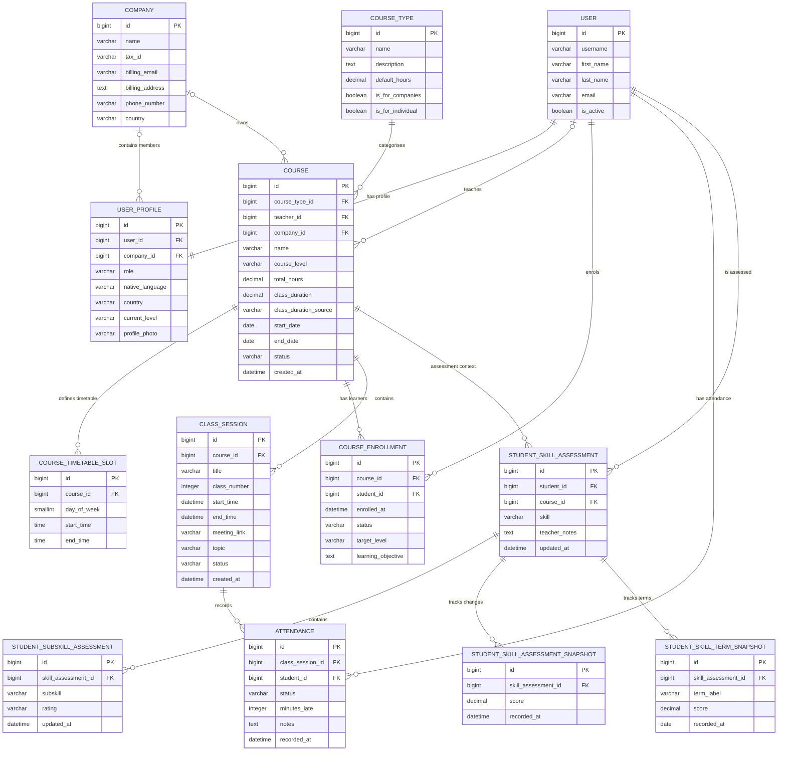

# English Grows

English Grows is a Django-based English language training platform designed for adult learners, teachers and corporate training environments.

The application combines course management, automated lesson scheduling, attendance tracking, learner assessment, progress monitoring and role-specific interfaces within a single relational data architecture.

---

## 📑 Table of Contents

- [Site Structure](#site-structure)
  - [User Roles](#user-roles)
  - [Home App](#home-app)
  - [Profiles App](#profiles-app)
    - [User Profile & Role Management](#user-profile--role-management)
    - [Learner / Employee Area](#learner--employee-area)
    - [Teacher Area](#teacher-area)
    - [Company Admin Area](#company-admin-area)
    - [Role-Based Access Control](#role-based-access-control)
  - [Courses App](#courses-app)
    - [Course Types](#course-types)
    - [Course Management](#course-management)
    - [Course Enrolment](#course-enrolment)
    - [Course Enrolment Lifecycle](#course-enrolment-lifecycle)
    - [Course Timetable](#course-timetable)
    - [Bank Holidays & Course Scheduling](#bank-holidays--course-scheduling)
    - [Class Session Generation](#class-session-generation)
    - [Safe Future Schedule Synchronisation](#safe-future-schedule-synchronisation)
    - [Class Session Lifecycle](#class-session-lifecycle)
    - [Automatic Class Session Status Synchronisation](#automatic-class-session-status-synchronisation)
    - [Rescheduling a Class Lesson](#rescheduling-a-class-lesson)
    - [Course Pause](#course-pause)
    - [Course Cancellation](#course-cancellation)
    - [Attendance](#attendance)
    - [Attendance Reporting](#attendance-reporting)
  - [Learning Assessment & Progress](#learning-assessment--progress)
    - [Language Skills Assessed](#language-skills-assessed)
    - [Student Skill Assessment](#student-skill-assessment)
    - [Student Subskill Assessment](#student-subskill-assessment)
    - [Detailed Assessment Snapshots](#detailed-assessment-snapshots)
    - [Term Assessment Snapshots](#term-assessment-snapshots)
  - [Calendar](#calendar)
  - [Django Admin](#django-admin)

- [Database Structure — Models](#database-structure--models)
  - [ERD — Entity Relationship Diagram](#erd--entity-relationship-diagram)
  - [Key Data-Integrity Rules](#key-data-integrity-rules)

- [Application Data Flow](#application-data-flow)

- [Architectural Design Choices](#architectural-design-choices)
  - [Separation of Responsibilities](#separation-of-responsibilities)
  - [Authentication vs. Application Profile](#authentication-vs-application-profile)
  - [Course Configuration vs. Lesson Delivery](#course-configuration-vs-lesson-delivery)
  - [Enrolment vs. User Identity](#enrolment-vs-user-identity)
  - [Current Assessment vs. Assessment History](#current-assessment-vs-assessment-history)
  - [Shared Data, Role-Specific Presentation](#shared-data-role-specific-presentation)

- [Design Choices](#design-choices)
  - [Colour System](#colour-system)
    - [Colour Architecture](#colour-architecture)
    - [Core Brand / Interface Palette](#core-brand--interface-palette)
    - [Supporting Neutrals](#supporting-neutrals)
    - [CEFR Level Colours](#cefr-level-colours)
    - [Language Skills Colours](#language-skills-colours)
    - [Semantic / Status Colours](#semantic--status-colours)
    - [Colour Usage Principles](#colour-usage-principles)
  - [Responsive Design](#responsive-design)
  - [Data Visualisation](#data-visualisation)

---

# SITE STRUCTURE

---

EnglishGrows has been developed using **Django 6.0.5** with **Python 3.12**.

The application follows Django's Model-Template-View architecture and is currently organised into three principal custom Django apps:

- **Home**
- **Profiles**
- **Courses**

Each app contains the relevant combination of ***models***, ***views***, ***URLs***, ***templates***, ***forms***, static assets, and supporting logic required for its area of responsibility.

## USER ROLES

User authentication is handled using Django's authentication system together with **django-allauth**. Application-specific user information and role-based behaviour are managed through the `UserProfile` model.

The platform supports four principal user roles:

- **Teacher**
- **Individual learner**
- **Employee learner**
- **Company administrator**

Access to platform functionality and data is controlled according to the authenticated user's role and, where applicable, their associated company.

---

## HOME App

---

The `home` app is responsible primarily for the public-facing area of EnglishGrows and serves as the entry point to the platform.

### Main responsibilities

- Provides the public **landing page**
- Presents EnglishGrows' training services and platform
- Provides navigation into the authenticated learning platform
- Contains public-facing informational and marketing content
- Directs users towards the relevant learning or company-training journey
- Integrates the public website with the authenticated Django platform

The Home app is intentionally kept separate from the teaching-management functionality so that public marketing content and authenticated platform features remain logically independent.

---

## PROFILES App

---

The `profiles` app contains most of the user-facing platform experience.

It extends Django authentication with application-specific profile information and provides dedicated interfaces according to each user's role.

The app includes functionality for:

- **Learners**
- **Teachers**
- **Company administrators**

The same underlying course, attendance, and assessment data is presented differently depending on the authenticated user's permissions and responsibilities.

---

### USER PROFILE & ROLE MANAGEMENT

The platform uses Django's authenticated `User` as the primary user identity and associates it with a dedicated `UserProfile`.

The profile stores additional application information such as:

- User role
- Associated company *(where applicable)*
- Native language
- Country
- Current CEFR level
- Profile photograph
- User-specific platform information

This avoids maintaining separate authentication models for teachers, employees, individual learners, and company administrators.

Instead, role-based access is determined through the user's profile.

---

### LEARNER / EMPLOYEE AREA

---

Learners have access to a dedicated learning area containing information specific to their own current and historical course enrolments.

Principal functionality includes:

- **Learner dashboard**
- **My Course**
- **My Attendance**
- **My Calendar**
- **My Learning Progress**
- **Skill overview**
- **Detailed skill progress graphs**
- **Teacher assessment feedback**
- **My Course selector when more than one lifetime course enrolment exists**
- **Upcoming-class information**
- **Attendance and absence history**
- **Course completion information**
- **Account settings**

The **My Course** page remains accessible across the learner's own course history rather than being limited to active training only.

Its course selector is built from **all `CourseEnrollment` records belonging to the authenticated learner**, regardless of either:

- the `CourseEnrollment.status`; or
- the parent `Course.status`.

The selector therefore supports active, paused, completed and cancelled historical enrolments, as well as courses in their corresponding lifecycle states.

The selector is displayed only when the learner has **more than one lifetime enrolment**. If the learner has only one enrolment in total, the selector is omitted because there is no alternative course context to select.

The selected course is passed through the `?course=<id>` query parameter and is resolved from the authenticated learner's own enrolment queryset. A learner therefore cannot use the query parameter to access a course in which they have never been enrolled.

Operational information remains context-sensitive. A historical Course can still be reviewed through **My Course**, while next/current-class information is exposed only when the selected enrolment is active and the Course is active or confirmed.

The next/current-class query uses the lesson's `end_time`, not only its `start_time`. A lesson that has started but has not yet ended therefore remains available as the learner's current class.

Only `scheduled` and `rescheduled` ClassSessions are valid next/current teaching slots. `pending_reschedule`, held, complete and cancelled lessons are not presented as a future class.

The learner calendar applies a related but slightly different rule: current `scheduled`/`rescheduled` teaching is limited to active enrolment + active Course context, while historical `held_attendance_pending` and `complete_attendance_submitted` lessons remain visible across the learner's own Course history.

---

### TEACHER AREA

---

Teachers have a dedicated operational dashboard for managing the courses and learners assigned to them.

Principal functionality includes:

- **Teacher dashboard**
- **Assigned courses**
- **Course details**
- **Class/session management**
- **Attendance management**
- **Individual attendance submission**
- **Group attendance submission**
- **Attendance history**
- **Student details**
- **Student skill assessment**
- **Subskill assessment**
- **Assessment notes**
- **Learner progress graphs**
- **Class rescheduling**
- **Calendar**
- **Course and learner progress reporting**

Teacher access is restricted to courses assigned to the authenticated teacher.

Course-detail and course-learner views preserve access to the teacher's **historical course records regardless of course status**. Courses assigned to the teacher therefore remain accessible when they are:

```text
Active
Confirmed
Paused
Completed
Cancelled
```

Where a teacher-facing course selector is used, courses are ordered by lifecycle priority:

```text
Active
    ↓
Confirmed
    ↓
Paused
    ↓
Completed
    ↓
Cancelled
```

Within the same status, courses are ordered alphabetically by course name.

Historical `CourseEnrollment` records are likewise preserved on course learner-list/detail pages rather than being restricted to active enrolments only.

Teacher course learner lists support sorting by:

- **Name A-Z**
- **CEFR level**

For alphabetical sorting, the displayed learner identity is used. The learner's full name is preferred when available; when first/last name information is absent, the learner's **username is used as the sorting fallback**. This prevents users without completed name fields from being incorrectly grouped under an empty value.

The teacher dashboard provides operational summaries for current teaching activity, including active courses, students, upcoming/held sessions, and attendance information.

---

### COMPANY ADMIN AREA

---

Company administrators have a dedicated B2B management area allowing them to monitor the training delivered to employees belonging to their organisation.

Principal functionality includes:

- **Company dashboard**
- **Employee list**
- **Employee profile and learning progress**
- **Company course list**
- **Course details**
- **Course learner list**
- **Company class/session list**
- **Company-wide attendance reporting**
- **Employee attendance records**
- **Employee skill development**
- **Employee assessment information**
- **Employee progress graphs**
- **Company class calendar**

Company administrators can only access information associated with their own `Company`.

Within that company boundary, course-detail and course-learner views preserve **historical course and enrolment records regardless of status**. Company administrators can therefore continue to review courses after they become paused, completed, or cancelled rather than losing access once a course is no longer active.

Where a company-admin course selector is used, company courses are ordered by lifecycle priority:

```text
Active
    ↓
Confirmed
    ↓
Paused
    ↓
Completed
    ↓
Cancelled
```

Within the same status, courses are ordered alphabetically by course name.

Historical `CourseEnrollment` records also remain available on the relevant course learner/detail pages so that completed, paused, or cancelled participation remains visible for reporting and review.

This prevents cross-company data exposure while allowing an authorised company representative to monitor employee participation, attendance, course progression, learning outcomes, and historical training records.

---

### ROLE-BASED ACCESS CONTROL

---

Role-based views validate the authenticated user's `UserProfile` before exposing protected information.

The application therefore applies restrictions such as:

```text
Teacher
    ↓
Only courses assigned to that teacher
(current + historical where the page supports history)

Company Administrator
    ↓
Only courses and employees belonging to that company
(current + historical where the page supports history)

Learner / Employee
    ↓
Only that learner's own enrolments,
attendance and assessment data
```

Historical visibility does not weaken role boundaries: status determines whether a record is current or historical, while teacher assignment, company ownership, and learner ownership continue to determine whether the authenticated user is authorised to access it.

---

## COURSES App

---

The `courses` app contains the core **course-delivery, scheduling, enrolment, and attendance architecture** of the EnglishGrows platform.

It manages the relationships between:

- **Course types**
- **Courses**
- **Teachers**
- **Learners**
- **Companies**
- **Course enrolments**
- **Recurring timetables**
- **Individual class sessions**
- **Attendance records**
- **Bank holidays**

The app also contains the business logic responsible for automatically generating lessons and attendance records and for maintaining the lifecycle of courses, enrolments, and class sessions.

The principal models managed by this area of the application include:

- `CourseType`
- `Course`
- `CourseTimetableSlot`
- `CourseEnrollment`
- `ClassSession`
- `Attendance`
- `BankHoliday`

---

### Course Types

---

`CourseType` defines the reusable categories of training that can be offered through the platform.

Rather than storing the same general course information repeatedly for every individual course, a `CourseType` acts as a reusable definition from which specific `Course` instances can be created.

A course type can contain information such as:

- **Name**
- **Description**
- **Default training hours**
- **Availability for individual learners**
- **Availability for company training**

A single `CourseType` can therefore be associated with multiple `Course` instances.

```text
CourseType
    │
    │ 1 : N
    ▼
  Course
```

This separates the **type of training being offered** from the **actual delivery of that training**.

---

### Course Management

---

`Course` represents a concrete training programme delivered to one or more learners.

Each course can be associated with:

- A `CourseType`
- An assigned teacher
- A company, when the course is corporate
- One or more learners through `CourseEnrollment`
- One or more recurring `CourseTimetableSlot` records
- Multiple generated `ClassSession` records

A course stores delivery-specific information including:

- **Course name**
- **Course type**
- **CEFR level**
- **Teacher**
- **Company**, where applicable
- **Total training hours**
- **Class duration**
- **Class-duration source**
- **Number of classes**, calculated from total hours and class duration
- **Start date**
- **End date**
- **Course status**
- **Creation date**

Course statuses currently support:

```text
Confirmed
Active
Paused
Completed
Cancelled
```

The `Course` model owns the principal course-level lifecycle rules. The Django Admin, views and background tasks do not maintain separate interpretations of what pausing, cancelling or completing a course means.

Conceptually:

```text
Course.save()
    │
    ├── genuine transition → paused
    │       └── pause applicable future teaching slots
    │
    ├── genuine transition → cancelled
    │       └── cancel applicable unresolved lessons
    │
    ├── new Course
    │       └── safe initial ClassSession generation attempt
    │
    └── existing confirmed/active Course
            └── synchronize future scheduled lessons ONLY
                when a schedule-defining Course field actually changed
```

Schedule-defining Course fields currently include:

```text
start_date
total_hours
class_duration
```

An unchanged Course save must **not** reschedule existing lessons. This is important because generated `ClassSession` records become historical operational data as teaching progresses.

Course duration and class-generation logic are linked. The application uses the total number of training hours and lesson duration to determine the required number of lessons.

A course is not considered completed simply because its scheduled end date has passed.

Instead, course completion depends on the lifecycle state of its actual lessons:

```text
Course
   │
   ▼
ClassSessions
   │
   ▼
All sessions complete_attendance_submitted?
   │
   ├── No  → Course remains open
   │
   └── Yes → Course becomes completed
```

A `ClassSession` reaches `complete_attendance_submitted` only after the lesson has ended and its learner-specific attendance obligations have been finalized.

Attendance may be submitted before `end_time`, but early submission does not make the still-running lesson itself complete.

When every `ClassSession` belonging to a course has reached `complete_attendance_submitted`:

```text
Course.status
→ completed

active CourseEnrollment records
→ completed
```

This ensures that course status reflects **actual teaching delivery and finalized attendance rather than dates alone**.

Once `ClassSession` records exist, the actual final session is also the operational source of truth for `Course.end_date`. The course end date is synchronized from the final stored lesson rather than being treated as a permanently fixed theoretical date.

---

### Course Enrolment

---

Learners are connected to courses through the `CourseEnrollment` model.

This is an association model between `User` and `Course`:

```text
User
  │
  │ 1 : N
  ▼
CourseEnrollment
  ▲
  │ N : 1
  │
Course
```

Using a dedicated enrolment model rather than a simple many-to-many relationship allows English Grows to store information that belongs specifically to the learner's participation in a particular course.

Each enrolment can contain:

- **Student**
- **Course**
- **Enrolment date**
- **Enrolment status**
- **Target CEFR level**
- **Learning objective**

Enrolment statuses include:

```text
Active
Paused
Completed
Cancelled
```

The database prevents the same learner from being enrolled more than once in the same course.

`CourseEnrollment` is also the authority for learner-specific assignment to course lessons.

When a learner becomes actively enrolled in a course that already contains generated lessons, the application automatically creates missing `Attendance` records only for lessons that can still legitimately belong to that learner's teaching future.

The eligibility rules are:

```text
scheduled / rescheduled
→ included only when start_time is still in the future

pending_reschedule
→ always eligible because the lesson has not yet taken place,
  even if its old stored time is already in the past

held_attendance_pending
→ excluded

complete_attendance_submitted
→ excluded

cancelled
→ excluded
```

Using `start_time` rather than `end_time` for new assignment prevents a learner who becomes active after a lesson has already started from being attached halfway through that lesson.

The learner's actually assigned sessions are subsequently determined from their `Attendance` records rather than reconstructed from dates. This means that once an Attendance relationship exists for a learner/session, that lesson remains part of that learner's enrolment history even if the `ClassSession.start_time` is later changed by rescheduling.

Conceptually:

```text
CourseEnrollment
        │
        └── learner membership in one Course
                │
                ▼
Attendance
        │
        └── learner-specific relationship with one ClassSession
```

This distinction is fundamental:

```text
CourseEnrollment = one learner's membership in one course
ClassSession     = one lesson lifecycle
Attendance       = one learner's state/outcome for that lesson
```

Deleting an enrolment does **not** delete the course's `ClassSession` records because those lessons belong to the shared course schedule and may also belong to other learners.

Permanent enrolment deletion is reserved for correcting genuinely erroneous enrolments. Legitimate lifecycle changes should use the enrolment statuses instead.

Normal deletion is blocked when genuine attendance history already exists. A deliberate superuser correction can use the force-delete path to remove:

```text
erroneous CourseEnrollment
+
all Attendance records for that learner/course
```

while preserving:

```text
Course
+
Course ClassSessions
+
other learners' Attendance
```

This gives the database two distinct behaviours:

```text
Legitimate enrolment lifecycle
→ preserve history
→ active / paused / completed / cancelled

Enrolment created by mistake
→ superuser administrative correction
→ permanent enrolment + learner/course Attendance removal
```

---

### Course Enrolment Lifecycle

---

`CourseEnrollment.save()` detects genuine status transitions and synchronizes only the learner-specific Attendance records affected by that transition.

#### Pausing an enrolment

When an active enrolment becomes `paused`:

```text
future scheduled/rescheduled Attendance(status=pending)
→ enrollment_paused

pending_reschedule Attendance(status=pending)
→ enrollment_paused
```

For `scheduled` and `rescheduled` lessons, only lessons that have **not yet started** are changed.

For `pending_reschedule`, the old stored lesson time may already be past, but the lesson has not actually taken place; therefore the learner's pending Attendance can still become `enrollment_paused`.

The following are preserved:

- lessons that have already started;
- `held_attendance_pending` lessons;
- `complete_attendance_submitted` lessons;
- cancelled lessons;
- genuine `attended`, `missed`, or `excused` outcomes.

Pausing a learner's enrolment does **not** pause the parent `Course` and does not change other learners.

#### Reactivating an enrolment

When a paused enrolment becomes `active` again:

```text
eligible enrollment_paused Attendance
→ pending
```

The application also creates any missing Attendance records for lessons that still represent future teaching.

Historical `enrollment_paused` records are not rewritten retroactively.

#### Cancelling an enrolment

When an enrolment becomes `cancelled`, remaining operational Attendance placeholders are removed:

```text
pending
enrollment_paused
```

for:

```text
future scheduled/rescheduled lessons
+
all pending_reschedule lessons
```

Genuine historical attendance outcomes remain untouched:

```text
attended
missed
excused
```

Cancelling one learner's `CourseEnrollment` does **not** cancel the shared `ClassSession` because the lesson belongs to the Course, not to an individual learner.

#### Paused learners and lesson delivery

`enrollment_paused` means that **this learner does not require an attendance outcome for that lesson**.

A mixed group remains a valid held lesson when, for example:

```text
Student A → attended
Student B → enrollment_paused
Student C → missed
```

However, if every assigned learner is `enrollment_paused` when a scheduled/rescheduled lesson reaches its `end_time`, the lesson must not be interpreted as physically held merely because time passed.

The model therefore distinguishes:

```text
attendance_records_submitted
→ Does every Attendance row require no further teacher action?

all_attendance_enrollment_paused
→ Is there nobody expected to attend this lesson?
```

When **all** assigned learners are paused:

```text
scheduled / rescheduled
+
end_time passed
+
all Attendance = enrollment_paused
→ pending_reschedule
```

This keeps the lesson in the teaching obligation rather than falsely recording an undelivered lesson as held.

---

### Course Timetable

---

Recurring weekly scheduling is managed through `CourseTimetableSlot`.

A timetable slot defines the normal weekly teaching pattern of a course.

For example:

| Day | Time |
| :--- | :--- |
| Monday | 09:00 – 10:30 |
| Wednesday | 09:00 – 10:30 |

Each timetable slot stores:

- **Course**
- **Day of the week**
- **Start time**
- **End time**

The timetable represents a **scheduling rule**, not an individual lesson.

```text
CourseTimetableSlot
        │
        │ defines recurring schedule
        ▼
   ClassSession
        │
        │ represents
        ▼
   Actual lesson
```

The database prevents duplicate timetable slots with the same:

```text
course
+ day_of_week
+ start_time
```

The end time is deliberately **not** part of the uniqueness identity because it is an editable property of the slot.

Validation also ensures:

- `end_time` occurs after `start_time`;
- when Course class duration is manually controlled, the slot duration must match that class duration.

A genuine timetable-slot change is allowed to synchronize applicable future scheduled lessons, but routine saves must not rewrite historical teaching data.

`CourseTimetableSlot.save()` therefore detects whether the slot was actually added or changed before delegating schedule synchronization.

`CourseTimetableSlot.delete()` can likewise synchronize the remaining future scheduled sequence when the Course is operational and other timetable slots remain.

For automatic-duration Courses, timetable changes also update the calculated `class_duration`.

Historical delivery is protected throughout this process:

```text
Held / complete lesson
→ never moved by recurring timetable synchronization

pending_reschedule
→ never moved automatically

rescheduled
→ never moved automatically

lesson already started
→ never moved automatically

future scheduled
→ may be rebuilt from the current timetable
```

This preserves the distinction between:

```text
Recurring timetable
→ current scheduling rule

ClassSession
→ actual operational/historical lesson record
```

---

### Bank Holidays & Course Scheduling

---

Course scheduling takes configured active `BankHoliday` records into account when calculating the expected delivery calendar.

Rather than treating the course end date as a simple arithmetic calculation from the start date, the scheduling logic builds valid teaching dates from the recurring timetable and skips applicable bank-holiday dates.

```text
Course start date
        +
Recurring timetable
        +
Required number of classes
        +
Active BankHoliday ranges
        │
        ▼
Generate teaching dates
        │
        ├── Normal teaching day → Include
        │
        └── Bank holiday        → Skip
        │
        ▼
Final valid teaching date
        │
        ▼
Course end date
```

Initial generation and later safe future-schedule synchronization both respect active bank-holiday ranges.

Once actual `ClassSession` records exist, however, the final stored ClassSession becomes the operational source of truth for the Course end date because individual lessons may later be rescheduled or otherwise diverge from the original theoretical schedule.

---

### Class Session Generation

---

`ClassSession` represents an **actual lesson instance** belonging to a course.

Once the required course configuration exists, English Grows automatically generates the lessons required to deliver the complete course.

Generation is permitted only when the Course:

- has already been saved;
- is `confirmed` or `active`;
- has no existing `ClassSession` records;
- has a `start_date`;
- has a calculable `number_of_classes`;
- has at least one timetable slot;
- has at least one active `CourseEnrollment`.

The generation process uses:

- **Course start date**
- **Number of classes**
- **Class duration**
- **Recurring timetable slots**
- **Configured active bank holidays**
- **Active learner enrolments**

Conceptually:

```text
Course configuration
        │
        ├── Start date
        ├── Number of classes
        ├── Class duration
        └── Timetable
                │
                ▼
        calculate_course_schedule()
                │
                ▼
        ClassSession 1
        ClassSession 2
        ClassSession 3
              ...
                │
                ▼
        Final ClassSession
```

Initial generation is guarded so that an existing course schedule is never regenerated merely because the helper is called again.

Each generated session receives a sequential `class_number`.

```text
Course
├── Lesson 1
├── Lesson 2
├── Lesson 3
├── Lesson 4
└── Lesson 5
```

The combination:

```text
course + class_number
```

is unique and acts as the stable lesson identity within the Course.

`start_time` is deliberately not part of this identity because a lesson may later be rescheduled while remaining the same lesson.

Existing ClassSession records are never overwritten by initial generation. Their dates, status and identity are preserved.

Attendance records are generated for learners who are actively enrolled when the initial ClassSession structure is created:

```text
ClassSession
    │
    ├── Attendance → Student A
    ├── Attendance → Student B
    └── Attendance → Student C
```

Each initial Attendance record starts as:

```text
pending
```

Later learners are handled by the `CourseEnrollment` lifecycle rather than by regenerating the Course.

Class sessions also contain the meeting link used by calendar and lesson interfaces. When a ClassSession meeting link is changed, the model propagates that non-empty link across the other ClassSessions belonging to the same Course so the course's lesson series remains operationally consistent.

After generation, the Course end date is synchronized from the actual final ClassSession.

---

### Safe Future Schedule Synchronisation

---

Initial course generation and synchronization of an **existing** course are deliberately separate operations.

Initial generation can safely construct the whole sequence from Lesson 1 because there is no teaching history yet.

Once teaching has started, recalculating the whole theoretical schedule from Lesson 1 and selectively applying those dates to only some existing ClassSessions is unsafe. It can mix historical dates from an old timetable with future dates from a new timetable and produce duplicate or chronologically corrupted lesson sequences.

English Grows therefore uses a protected future-only synchronization strategy.

#### When synchronization is triggered

For an existing `confirmed` or `active` Course, future schedule synchronization is triggered only when a genuine schedule-defining change occurs.

Course-level schedule-defining changes include:

```text
start_date
total_hours
class_duration
```

Timetable-level triggers include:

```text
CourseTimetableSlot added
CourseTimetableSlot day changed
CourseTimetableSlot start_time changed
CourseTimetableSlot end_time changed
CourseTimetableSlot deleted
```

An unchanged Course save — including simply opening a Course in Django Admin and pressing **Save** — must **not** synchronize the schedule.

#### Which ClassSessions can move

Only ClassSessions satisfying both conditions are mutable:

```text
status == scheduled
AND
start_time > now
```

The following are protected:

```text
held_attendance_pending
complete_attendance_submitted
pending_reschedule
rescheduled
cancelled
already-started / past lessons
```

Existing ClassSession IDs and class numbers remain unchanged, and Attendance rows stay attached to the same lesson records.

#### How the replacement future sequence is built

The model rebuilds only the remaining future `scheduled` teaching sequence from the Course's **current timetable**.

```text
Current Course timetable
        │
        ├── skip active BankHoliday dates
        ├── skip slots already occupied by protected future lessons
        ├── ignore past/currently-started slots
        ▼
Next safe future slot
        │
        ▼
Next mutable scheduled ClassSession
```

For a Course already in progress, scanning begins from the current local date rather than restarting the operational history from Lesson 1.

A protected future `rescheduled` lesson remains fixed and blocks an overlapping automatically generated slot.

`pending_reschedule` and `cancelled` records do not block a timetable slot because their stored times no longer represent a valid teaching appointment.

The final short lesson, where applicable, preserves its calculated reduced duration.

#### Corruption guard

The synchronization process also contains an explicit integrity guard.

Once a higher-numbered lesson has genuinely been held, an earlier-numbered lesson must not still exist as an ordinary future `scheduled` lesson.

For example:

```text
Lesson 16 → complete_attendance_submitted
Lesson 5  → scheduled in the future
```

is not a valid teaching sequence.

If such pre-existing inconsistency is detected, automatic synchronization raises a `ValidationError` rather than attempting another partial rewrite.

```text
Inconsistent historical/future class numbering
        │
        ▼
Automatic synchronization BLOCKED
        │
        ▼
Deliberate data repair required
```

The synchronization runs inside a database transaction. If a complete safe future sequence cannot be produced, the operation fails rather than leaving a partially rewritten schedule.

After a successful synchronization, the Course end date is synchronized again from the actual final ClassSession.

---

### Class Session Lifecycle

---

A `ClassSession` has its own lifecycle independently of the parent Course and independently of each learner's `Attendance`.

The canonical statuses are:

| Status | Meaning |
| :--- | :--- |
| `scheduled` | The lesson is scheduled normally and has not yet completed its current teaching slot |
| `pending_reschedule` | The lesson has not taken place and is waiting for a valid new date/time |
| `rescheduled` | The same existing lesson has been moved to a new valid date/time and is waiting for that occurrence |
| `held_attendance_pending` | The lesson has ended and was held, but one or more Attendance records still require teacher action |
| `complete_attendance_submitted` | The lesson has ended and every learner-specific Attendance obligation has been finalized |
| `cancelled` | The lesson will not take place |

The legacy `completed` ClassSession status is no longer part of the canonical lifecycle. Course completion remains a separate `Course.status="completed"` state.

Two concepts are intentionally kept separate:

```text
TEMPORAL STATE
→ determined from end_time

LIFECYCLE STATE
→ determined from ClassSession.status
```

The temporal helper is:

```text
is_past
→ end_time <= current time
```

while the lifecycle helper `is_held` is true only for:

```text
held_attendance_pending
complete_attendance_submitted
```

A lesson can therefore have an old/past stored time without necessarily being considered held, for example when it is `pending_reschedule`.

#### Normal lesson flow

```text
scheduled
    │
    │ end_time passes
    ▼
Are learner Attendance obligations finalized?
    │
    ├── No  → held_attendance_pending
    │              │
    │              │ teacher finalizes remaining Attendance
    │              ▼
    │       complete_attendance_submitted
    │
    └── Yes → complete_attendance_submitted
```

Attendance submission and lesson completion are deliberately separate concepts.

A teacher may submit learner Attendance **after `start_time` but before `end_time`**.

```text
ClassSession
19:00 – 20:00

19:15
Teacher submits attendance
        │
        ├── Attendance → attended / missed / excused
        └── ClassSession remains scheduled/rescheduled

20:00+
Lesson has ended
        │
        └── Attendance already finalized
                │
                ▼
        complete_attendance_submitted
```

If the lesson reaches `end_time` while one or more Attendance rows remain `pending`:

```text
scheduled / rescheduled
        │
        │ end_time passes
        ▼
held_attendance_pending
        │
        │ teacher later finalizes Attendance
        ▼
complete_attendance_submitted
```

#### All learners paused

`enrollment_paused` is not a learner attendance outcome. It records that no attendance outcome is required for that learner because their CourseEnrollment is paused for that lesson.

This creates an important edge case.

If every assigned learner is `enrollment_paused`, the session must not become a held lesson merely because `end_time` passed.

```text
scheduled / rescheduled
        +
end_time passed
        +
ALL Attendance rows = enrollment_paused
        │
        ▼
pending_reschedule
```

This keeps the lesson outstanding for future delivery.

The order of lifecycle checks is therefore important:

```text
1. all assigned learners enrollment_paused?
   → pending_reschedule

2. otherwise, all Attendance obligations finalized?
   → complete_attendance_submitted

3. otherwise
   → held_attendance_pending
```

A mixed group behaves differently:

```text
Student A → attended
Student B → enrollment_paused
Student C → missed
```

In that case the lesson was genuinely delivered, all learner-specific obligations are accounted for, and after `end_time` the ClassSession can become:

```text
complete_attendance_submitted
```

#### Rescheduling flow

```text
scheduled
    ↓
pending_reschedule
    ↓
rescheduled
    ↓
end_time passes
    ├── attendance finalized → complete_attendance_submitted
    └── attendance pending   → held_attendance_pending
```

A rescheduled lesson always remains the **same ClassSession database object**.

#### Cancellation flow

```text
scheduled / pending_reschedule / rescheduled
    ↓
cancelled
```

Cancellation means the lesson will not take place.

These lifecycle distinctions ensure that:

- attendance can be entered during a live lesson without prematurely marking it as held;
- delivery metrics count a lesson as held only when its lifecycle explicitly records that fact;
- attendance-reporting metrics use finalized learner outcomes only after the parent session reaches `complete_attendance_submitted`;
- all-paused lessons do not become false held lessons;
- a session with outstanding attendance remains visibly actionable through `held_attendance_pending`;
- `pending_reschedule` remains part of the teaching obligation;
- course completion cannot occur until every ClassSession has reached `complete_attendance_submitted`.

---

### Automatic Class Session Status Synchronisation

---

Passing `end_time` does not itself execute Django code. English Grows therefore combines **model-owned lifecycle rules** with a scheduled production task so that finished lessons transition automatically.

The `ClassSession` model owns two complementary synchronization operations:

```text
synchronize_status_after_end()
        │
        └── synchronizes one specific ClassSession

transition_past_sessions()
        │
        └── finds all eligible past scheduled/rescheduled sessions
            and synchronizes each one
```

`transition_past_sessions()` considers only sessions where:

```text
end_time <= current time

AND

status is scheduled OR rescheduled
```

For each eligible lesson, `synchronize_status_after_end()` applies the following logic:

```text
Finished scheduled/rescheduled ClassSession
                │
                ▼
Are ALL assigned learners enrollment_paused?
                │
        ┌───────┴────────┐
        │                │
       Yes               No
        │                │
        ▼                ▼
pending_reschedule   Are all Attendance obligations finalized?
                          │
                    ┌─────┴─────┐
                    │           │
                   Yes          No
                    │           │
                    ▼           ▼
          complete_attendance_  held_attendance_pending
              submitted
```

A session already in `held_attendance_pending` can later move to `complete_attendance_submitted` when its remaining Attendance obligations are finalized.

The following states are deliberately untouched by this end-time synchronizer:

```text
pending_reschedule
complete_attendance_submitted
cancelled
```

The synchronization process changes the parent `ClassSession` lifecycle state only. It does **not** fabricate or rewrite learner Attendance outcomes.

`Attendance.save()` calls the same parent synchronization helper after storing a learner-specific change. This means that when a teacher finalizes the last outstanding Attendance record for an already-ended lesson, the parent ClassSession can transition immediately without waiting for the next background run.

In production, a dedicated **Render Cron Job** runs every **5 minutes** and invokes:

```bash
python manage.py transition_past_sessions
```

The management command calls:

```python
ClassSession.transition_past_sessions()
```

This provides automatic background synchronization even when no user is interacting with the application.

The combined behaviour is therefore:

```text
Lesson ends
    │
    ├── Teacher interacts with attendance
    │       │
    │       └── Attendance.save()
    │               ↓
    │          synchronize_status_after_end()
    │               → immediate targeted synchronization
    │
    └── No user action
            │
            └── Render Cron Job
                    → every 5 minutes
                    → transition_past_sessions()
                    → same model-owned lifecycle rules
```

The model remains the single authority for these transitions. Views, Django Admin, the management command and the Cron Job do not maintain separate status logic.

---

### Rescheduling a Class Lesson

When a lesson needs to be rescheduled, either the **learner/employee or the teacher** can mark the session as requiring rescheduling:

```text
                         ┌─────────────────────┐
                         │      scheduled      │
                         └──────────┬──────────┘
                                   │
                     Reschedule requested by
                         either party
                         ┌──────────┴──────────┐
                         │                     │
                         ▼                     ▼
                Learner / Employee          Teacher
                         │                     │
                         └──────────┬──────────┘
                                   ▼
                         pending_reschedule
                                   │
                          New date/time agreed
                                   │
                                   ▼
                       Teacher reschedules class
                                   │
                                   ▼
                              rescheduled
                                   │
                           Lesson reaches end_time
                                   │
                         ┌──────────┴──────────┐
                         │                     │
                         ▼                     ▼
              Attendance submitted     Attendance pending
                         │                     │
                         ▼                     ▼
          complete_attendance_submitted   held_attendance_pending
                                              │
                                              │ attendance submitted
                                              ▼
                                complete_attendance_submitted
```

The `pending_reschedule` status therefore represents a **rescheduling request or an unresolved scheduling change**, rather than a cancelled lesson.

Both parties involved in the training can initiate this workflow:

- **Learners / employees** can flag a scheduled class when they need it to be rescheduled.
- **Teachers** can also mark a scheduled class as requiring rescheduling.
- Once a new date and time have been agreed, the **teacher updates the existing session schedule** and the class moves to `rescheduled`.
- After the rescheduled lesson reaches its updated `end_time`, it moves to `complete_attendance_submitted` when attendance has already been submitted, or to `held_attendance_pending` when attendance is still outstanding.

A fundamental design decision is that a rescheduled lesson remains the **same `ClassSession` database record** throughout this process.

For example:

```text
Lesson 8
12 Oct · 10:00
scheduled
       │
       │ Reschedule requested
       ▼
Lesson 8
pending_reschedule
       │
       │ New date/time agreed
       ▼
Lesson 8
15 Oct · 16:00
rescheduled
       │
       │ Lesson reaches end_time
       ▼
held_attendance_pending
       │
       │ Attendance submitted
       ▼
complete_attendance_submitted
```

If attendance was already submitted during the rescheduled lesson, the post-`end_time` transition can instead move directly from `rescheduled` to `complete_attendance_submitted`.

The application does **not** delete the original lesson and create a replacement.

Instead, the existing `ClassSession` is updated with the newly agreed date and time while retaining its original identity.

This preserves:

- **Lesson identity**
- **Class number**
- **Course relationship**
- **Learner attendance relationships**
- **Course progression**
- **Historical consistency**
- **References from other areas of the application**

This architecture also ensures that rescheduling a lesson does not accidentally increase the number of classes belonging to the course.

The distinction between the statuses is therefore:

| Status | Meaning |
| :--- | :--- |
| `scheduled` | The lesson is scheduled normally |
| `pending_reschedule` | A learner/employee or teacher has indicated that the lesson needs to be rescheduled and a new date/time is still to be agreed |
| `rescheduled` | The teacher has updated the existing session with the newly agreed date/time |
| `held_attendance_pending` | The lesson has reached its `end_time` but attendance has not yet been fully submitted |
| `complete_attendance_submitted` | The lesson has reached its `end_time` and attendance has been fully submitted |
| `cancelled` | The lesson will not take place because the Course cancellation lifecycle cancelled that unresolved lesson |

This workflow allows rescheduling to be initiated by either side while keeping responsibility for modifying the official course schedule with the teacher.

---

### Course Pause

---

Pausing a Course is a **course-level teaching interruption** and is deliberately different from pausing an individual learner's `CourseEnrollment`.

When a `Course` genuinely transitions to:

```text
paused
```

the Course model invalidates future normal teaching slots:

```text
future scheduled   → pending_reschedule
future rescheduled → pending_reschedule
```

The following are not rewritten:

```text
existing pending_reschedule
lesson already started
held_attendance_pending
complete_attendance_submitted
cancelled
```

Course-level pause does **not** change learner Attendance outcomes and does **not** automatically change `CourseEnrollment.status`.

In particular:

```text
Course paused
≠
Attendance enrollment_paused
```

`Attendance.STATUS_ENROLLMENT_PAUSED` belongs only to an individual learner's enrolment lifecycle.

The use of `pending_reschedule` for future Course-level paused lessons means:

> the lesson remains part of the Course obligation, but its currently stored slot is no longer considered a valid teaching appointment.

Reactivating the Course does **not** automatically convert these `pending_reschedule` lessons back to `scheduled`. A valid date/time still needs to be established through the normal rescheduling workflow.

This prevents a Course pause from silently restoring old teaching appointments that may no longer be valid.

---

### Course Cancellation

---

Course cancellation is an **administrative course-level lifecycle transition** and is deliberately separate from lesson rescheduling and learner-enrolment cancellation.

The cancellation rule belongs to `Course.save()`.

Whenever a Course genuinely transitions to:

```text
cancelled
```

the model invokes its cancellation helper regardless of whether that transition originated from Django Admin or another legitimate model save path.

The applicable ClassSession rules are:

```text
scheduled / rescheduled
→ cancelled only when the lesson has not yet started

pending_reschedule
→ always cancelled because the lesson has not taken place,
  even if its old stored time is already in the past
```

Held, complete and already-started lesson history is preserved.

Conceptually:

```text
Course → cancelled
        │
        ▼
Unresolved ClassSessions that will no longer take place
        │
        ├── future scheduled
        ├── future rescheduled
        └── pending_reschedule
        │
        ▼
cancelled
```

The cancellation operation updates the existing ClassSession records rather than deleting them or creating replacements.

Their:

- database identity;
- class number;
- Course relationship;
- historical references

remain intact.

Attendance has no separate `cancelled` learner outcome because cancellation describes whether the **lesson** will take place, not how a learner attended it.

For ClassSessions being cancelled, operational Attendance placeholders are removed:

```text
pending
enrollment_paused
```

Genuine historical learner outcomes are preserved:

```text
attended
missed
excused
```

The Course cancellation helper therefore separates:

```text
lesson lifecycle
→ ClassSession.status = cancelled

learner historical outcome
→ preserve genuine Attendance

future learner obligation
→ remove pending / enrollment_paused placeholders
```

Course cancellation does **not** automatically rewrite individual `CourseEnrollment.status` values. Course lifecycle and learner membership lifecycle remain separate dimensions.

Django Admin is one interface through which a Course can be cancelled, but Admin does not own the business rule. The rule belongs to the Course model so all valid save paths use the same lifecycle semantics.

---

### Attendance

---

The `Attendance` model records the state or outcome of **one individual learner for one individual `ClassSession`**.

The relationship can be represented as:

```text
ClassSession
     │
     │ 1 : N
     ▼
 Attendance
     ▲
     │ N : 1
     │
    User
```

In a group lesson there is still only one `ClassSession`, but there may be many learner-specific Attendance rows.

Each Attendance record can store:

- **Class session**
- **Student**
- **Attendance status**
- **Minutes late**
- **Teacher notes**
- **Recorded timestamp**

The canonical Attendance statuses are:

```text
pending
attended
missed
excused
enrollment_paused
```

Their meanings are deliberately learner-specific:

| Status | Meaning |
| :--- | :--- |
| `pending` | Pre-created operational placeholder; the learner's outcome still requires teacher action |
| `attended` | The learner attended the lesson |
| `missed` | The learner missed the lesson |
| `excused` | The learner's absence was excused |
| `enrollment_paused` | No learner outcome is currently required for this lesson because that learner's CourseEnrollment is paused |

`enrollment_paused` is therefore **not** a positive, negative or excused attendance outcome. It is an operational non-obligation state.

The database enforces:

```text
class_session + student = unique
```

A learner cannot have two contradictory Attendance records for the same lesson.

```text
Lesson 4
├── Student A → attended
└── Student A → missed   ✗
```

Instead, the existing Attendance row changes status.

Attendance rows initially act as `pending` placeholders and are subsequently updated when the teacher records the genuine learner outcome.

Teachers are allowed to submit attendance **after `ClassSession.start_time` and before `ClassSession.end_time`**.

```text
DURING THE LESSON

ClassSession
→ scheduled / rescheduled

Attendance
→ may already be attended / missed / excused


AFTER end_time

all learner obligations finalized
→ ClassSession complete_attendance_submitted

one or more Attendance rows still pending
→ ClassSession held_attendance_pending

all assigned learners enrollment_paused
→ ClassSession pending_reschedule
```

`ClassSession.attendance_records_submitted` answers:

> Does every Attendance row now represent a state requiring no further teacher attendance action?

The accepted states are:

```text
attended
missed
excused
enrollment_paused
```

This property may therefore be `True` before the lesson ends.

It is deliberately different from:

```text
ClassSession.attendance_is_submitted
```

which is true only when the **parent lesson lifecycle** has reached:

```text
complete_attendance_submitted
```

A second ClassSession property:

```text
all_attendance_enrollment_paused
```

answers a different question:

> Is nobody currently expected to attend this lesson?

That distinction prevents an all-paused lesson from being falsely recorded as held.

Every `Attendance.save()` stores the learner-specific state first and then allows the parent ClassSession to run `synchronize_status_after_end()`.

This provides immediate lifecycle synchronization when the last outstanding Attendance is finalized after a lesson has ended.

Attendance also participates in CourseEnrollment lifecycle changes:

```text
CourseEnrollment → paused
future applicable pending Attendance
→ enrollment_paused

CourseEnrollment → active
eligible enrollment_paused Attendance
→ pending

CourseEnrollment → cancelled
remaining operational pending/enrollment_paused Attendance
→ deleted
```

Historical `attended`, `missed`, and `excused` outcomes are never overwritten by those ordinary enrolment status changes.

Course cancellation similarly removes operational `pending` / `enrollment_paused` placeholders for lessons being cancelled while preserving genuine learner outcomes.

Permanent superuser correction of an erroneous CourseEnrollment can deliberately remove **all** Attendance records for that learner/course, because the enrolment itself is known to be invalid data.

The underlying ClassSession records remain intact because lesson identity belongs to the Course rather than to any individual learner.

---

### Attendance Reporting

---

Attendance data provides a shared source of information for the three principal authenticated areas of the platform.

#### Learners

Learners can review their own:

- **Attendance history**
- **Attendance rate**
- **Attended classes**
- **Missed classes**
- **Excused absences**
- **Individual lesson records**

#### Teachers

Teachers can:

- **Submit attendance**
- **Review previously submitted attendance**
- **Manage attendance for group courses**
- **Identify classes requiring attendance submission**
- **Review attendance by learner**
- **Review attendance by course**

#### Company Administrators

Company administrators can review:

- **Employee attendance**
- **Attendance by course**
- **Attendance rates**
- **Missed lessons**
- **Excused absences**
- **Attendance submission status**
- **Company-wide training participation**

Attendance reporting deliberately distinguishes **lesson delivery** from **attendance finalization**.

A lesson counts as held for delivery purposes when its ClassSession status is:

```text
held_attendance_pending
complete_attendance_submitted
```

Attendance-rate calculations use only learner outcomes attached to parent sessions that have reached:

```text
complete_attendance_submitted
```

The learner outcomes included in the attendance-rate denominator are:

```text
attended
missed
excused
```

The current percentage is:

```text
attended
────────────── × 100
attended + missed + excused
```

The following are excluded:

```text
pending
enrollment_paused
```

because they do not represent finalized learner attendance outcomes.

An `excused` absence remains part of the current denominator policy even though it is distinguished from `missed` in reporting.

Low-attendance warning logic is evaluated only after at least one finalized learner outcome exists. The current warning threshold is below **75%**.

Attendance records submitted during a still-running lesson are also excluded from finalized reporting until the parent ClassSession itself reaches `complete_attendance_submitted`.

This prevents future, paused, or still-running lesson obligations from distorting historical attendance statistics while still allowing teachers to submit attendance during the lesson.

`CourseEnrollment.eligible_sessions` uses existing Attendance relationships as the source of truth for which lessons were actually assigned to that learner. This avoids reconstructing learner participation from mutable lesson dates.

---

## Learning Assessment & Progress

---

The assessment architecture tracks both a learner's **current language-skill performance** and the **historical development of those skills over time**.

Assessment is course-specific.

A learner can therefore have different skill assessments in different courses rather than having one global assessment attached permanently to their user account.

The assessment architecture consists of four principal models:

```text
StudentSkillAssessment
        │
        ├── StudentSubSkillAssessment
        │
        ├── StudentSkillAssessmentSnapshot
        │
        └── StudentSkillTermSnapshot
```

---

### Language Skills Assessed

---

Each skill is represented by a distinctive colour to make it easier to visually track across progress bars, assessment cards and historical graphs.

| Skill | Colour | Hex |
| :--- | :---: | :---: |
| 🎧 **Listening** | 🟪 Indigo Velvet | `#4E2496` |
| 🎙️ **Speaking** | 🟨 Sunflower Gold | `#F5BE58` |
| 📖 **Reading** | 🟧 Chocolate | `#E1752D` |
| ✍️ **Writing** | 🟦 Pacific Blue | `#0EA5B7` |

---

### Student Skill Assessment

---

`StudentSkillAssessment` represents the learner's **current assessment state for one main language skill within one course**.

Each assessment belongs to:

```text
Student
   +
Course
   +
Skill
```

For example:

```text
Student: Jane Doe
Course: Business English B2
Skill: Speaking
```

The database maintains only one current assessment for each:

```text
student + course + skill
```

combination.

The model also stores teacher notes associated with the skill.

Rather than storing a manually entered overall percentage, the current skill score is calculated dynamically from the learner's assessed subskills.

Conceptually:

```text
StudentSkillAssessment
        │
        ├── Subskill rating
        ├── Subskill rating
        ├── Subskill rating
        └── Subskill rating
                │
                ▼
          Average score
             0 – 10
```

Only subskills that have actually been rated participate in this calculation.

***Unrated subskills are excluded rather than being interpreted as zero performance.***

---

### Student Subskill Assessment

---

`StudentSubSkillAssessment` provides the detailed assessment information from which the overall skill assessment is calculated.

Each principal language skill is divided into several pedagogically relevant subskills, ***aligned with CEFR descriptors and informed by Cambridge English assessment criteria***.

The current subskill structure is:

```text
Speaking
├── Fluency
├── Grammar & vocabulary (Accuracy & range)
├── Pronunciation
└── Interaction

Reading
├── Scanning (Specific information)
├── Skimming (General Idea)
└── In detail (Deep Understanding)

Listening
├── For Gist (General Idea)
├── For Specific Information
└── In detail (Deep Understanding)

Writing
├── Structure & Organization
├── Cohesion & Coherence
├── Grammar & vocabulary (Accuracy & range)
└── Register (Style accuracy)
```

Each `StudentSubSkillAssessment` belongs to one `StudentSkillAssessment`.

The relationship can be represented as:

```text
StudentSkillAssessment
        │
        │ 1 : N
        ▼
StudentSubSkillAssessment
```

The combination:

```text
skill_assessment + subskill
```

is unique.

This prevents the same subskill from being duplicated within a learner's assessment for a particular skill.

Subskills use descriptive performance categories rather than user-facing percentages.

The current assessment categories are:

| Assessment Category | Internal Score |
| :--- | ---: |
| **Priority areas** | `4.0 / 10` |
| **Developing areas** | `5.0 / 10` |
| **Required standard achieved** | `6.0 / 10` |
| **Confident areas** | `7.5 / 10` |
| **Key strengths** | `10.0 / 10` |

The internal numerical representation is used to:

- Calculate the learner's current overall skill score
- Build skill-progress graphs
- Compare skill development over time
- Generate historical assessment snapshots
- Support term-based progress reporting

Only subskills that have actually been assessed are included when calculating the parent skill's average score.

For example:

```text
Speaking

Fluency                                  7.5
Grammar & vocabulary (Accuracy & range)  6.0
Pronunciation                             —
Interaction                              5.0
                                         ───
Average score                            6.2 / 10
```

The unrated `Pronunciation` subskill is excluded from the calculation rather than being treated as a zero score.

This allows the assessment score to represent only the areas that have genuinely been assessed.

---

#### Detailed Assessment Snapshots

`StudentSkillAssessmentSnapshot` records the **fine-grained historical evolution** of a learner's skill assessment.

A snapshot is created when a genuine subskill rating is added or changed.

The process can be represented as:

```text
Teacher assesses subskill
          │
          ▼
Subskill rating changes
          │
          ▼
Overall skill score recalculated
          │
          ▼
StudentSkillAssessmentSnapshot
          │
          ▼
Score + exact timestamp stored
```

This produces a chronological history of meaningful assessment changes.

For example:

```text
Speaking

10 Sep  → 5.8
24 Sep  → 6.1
08 Oct  → 6.5
22 Oct  → 6.8
12 Nov  → 7.2
```

Snapshots are not created merely because an assessment object is saved.

A new historical entry requires a genuine rating change.

Likewise, unrated placeholder subskills do not generate artificial historical data.

This prevents unnecessary duplicate records and produces a cleaner representation of actual learner development.

---

#### Term Assessment Snapshots

`StudentSkillTermSnapshot` provides a second and deliberately separate form of assessment history.

While `StudentSkillAssessmentSnapshot` captures detailed changes, a term snapshot represents a **formal progress checkpoint**.

Examples may include:

```text
Term 1
Term 2
Mid-course Review
End-of-course Review
```

Each term snapshot stores:

- **Skill assessment**
- **Term label**
- **Skill score**
- **Recorded date**

The combination:

```text
skill_assessment + term_label
```

is unique.

The two historical models therefore serve different purposes:

| Model | Purpose | Frequency |
| :--- | :--- | :--- |
| `StudentSkillAssessmentSnapshot` | Detailed progression history | Whenever a genuine assessment change occurs |
| `StudentSkillTermSnapshot` | Formal progress checkpoint | At defined assessment periods |

Conceptually:

```text
                  StudentSkillAssessment
                         │
              ┌──────────┴──────────┐
              │                     │
              ▼                     ▼
 Assessment Snapshot          Term Snapshot
              │                     │
              ▼                     ▼
 Detailed progression       Formal checkpoints
```

This separation allows EnglishGrows to provide both **fine-grained progress graphs** and **structured term-to-term reporting** without conflating the two types of historical data.

---

### Calendar

---

EnglishGrows includes a role-aware calendar built directly from the platform's existing `ClassSession` records.

A separate calendar-event model is not required.

```text
Course
   │
   ▼
ClassSession
   │
   ▼
Calendar event endpoint
   │
   ▼
FullCalendar presentation
```

This ensures that the calendar reflects the same lesson lifecycle and dates used throughout the rest of the application.

If a lesson is rescheduled, the same ClassSession appears at its updated date/time rather than requiring a second calendar record.

The calendar is available in the relevant interfaces for:

- **Teachers**
- **Learners / employees**
- **Company administrators**

Depending on device size, the interface supports views such as:

- **Day**
- **Week**
- **Month**
- **Month List**
- **Multi-month / year**

Calendar presentation deliberately separates:

```text
ClassSession.status
→ lifecycle truth

ClassSession.end_time
→ temporal past/current truth

calendar.js
→ presentation/action decision
```

A lesson is considered temporally past only when:

```text
end_time <= current time
```

This means a lesson that has started but has not yet ended remains a current joinable lesson when its lifecycle and meeting-link conditions allow it.

#### Learner / employee calendar scope

The learner calendar page can identify the learner's current active enrolment for current-state interface context, but the event endpoint distinguishes **current teaching** from **historical teaching**.

Current teaching events are exposed only when:

```text
CourseEnrollment.status == active
AND
Course.status == active
AND
ClassSession.status in {scheduled, rescheduled}
```

Historical lessons remain visible for Courses in which the learner has been enrolled, even if that Course or CourseEnrollment later becomes historical:

```text
held_attendance_pending
complete_attendance_submitted
```

This prevents completed historical lessons from disappearing merely because a Course or enrolment later becomes paused, completed or cancelled.

The learner calendar deliberately excludes:

```text
pending_reschedule
→ no valid teaching slot currently exists

cancelled
→ the lesson will not take place
```

A `pending_reschedule` lesson therefore reappears only after the teacher gives the existing ClassSession a valid new date/time and changes it to `rescheduled`.

#### Event lifecycle data

Calendar event JSON exposes lifecycle and temporal information separately through `extendedProps`, including:

```text
status
is_past
meeting_link
group_details_url
```

The JavaScript prefers the server-provided `is_past` value and retains an `event.end` fallback for compatibility with endpoints that do not yet expose it.

Joinability for teacher/learner-style actions requires:

```text
NOT past
AND
status is scheduled OR rescheduled
AND
meeting_link exists
```

`held_attendance_pending` and `complete_attendance_submitted` remain visible historically but do not expose a Join action once the lesson has ended.

Role-specific actions remain deliberately different:

```text
Teacher
    ↓
Join class for a valid current/upcoming teaching slot
or Group details when available

Learner / Employee
    ↓
Join class for a valid current/upcoming teaching slot
or Group details when available

Company Administrator
    ↓
Group details
```

For company administrators, Group Details remains the monitoring action even for historical events where that destination is available.

The frontend keeps one central `getEventAction()` decision for both list-view buttons and modal actions so action rules are not duplicated across presentation modes.

The calendar therefore acts as a visual projection of the underlying lesson-delivery architecture rather than as an independent scheduling system.

---

### Django Admin

---

The built-in Django Admin provides authorised administrative access to the application's core database records.

It is used as an operational and development-management interface rather than as the primary user-facing interface.

Administrators can manage data including:

- **Users and profiles**
- **Companies**
- **Course types**
- **Courses**
- **Course enrolments**
- **Timetable slots**
- **Class sessions**
- **Attendance**
- **Bank holidays**
- **Skill assessments**
- **Subskill assessments**
- **Assessment snapshots**

Where appropriate, related objects are presented through Django Admin inlines.

For example:

```text
Course
├── CourseTimetableSlot inline
└── CourseEnrollment inline
```

Initial ClassSession generation is **not** exposed as a manual Admin action.

Instead:

```text
Course / timetable / enrolment prerequisites become complete
        │
        ▼
model lifecycle
        │
        ▼
try_generate_class_sessions()
        │
        ▼
safe one-time initial generation
```

#### Course Admin schedule safety

`CourseAdmin.save_related()` deliberately does **not** call `synchronize_future_scheduled_sessions()` merely because an existing operational Course was saved.

The responsibilities are separated as follows:

```text
Course.save()
→ detects genuine changes to start_date / total_hours / class_duration
→ owns Course pause/cancellation lifecycle

CourseTimetableSlot.save()/delete()
→ detects genuine timetable changes
→ delegates safe future schedule synchronization

CourseAdmin.save_related()
→ saves related inline objects
→ finalizes automatic class-duration state
→ performs safe initial generation only when no ClassSessions exist
→ synchronizes end_date from actual ClassSessions
→ does NOT independently rebuild an existing schedule
```

This protects established Courses from accidental schedule rewrites caused by an ordinary Admin save.

Paused, cancelled and completed Courses do not generate new teaching schedules through `CourseAdmin.save_related()`.

#### CourseEnrollment correction path

Normal enrolment lifecycle changes should use:

```text
active
paused
completed
cancelled
```

However, a genuinely erroneous enrolment should not remain permanently in the database simply because it was created by mistake.

Permanent deletion is therefore restricted to **superusers**.

The Course inline uses a custom `BaseInlineFormSet` deletion path so a superuser can explicitly invoke:

```text
CourseEnrollment.delete(force=True)
```

The dedicated `CourseEnrollmentAdmin` also provides the superuser-only force-delete path for an individual erroneous record.

Force deletion removes:

```text
the erroneous CourseEnrollment
+
all Attendance rows for that learner/course
```

while preserving:

```text
Course
ClassSessions
other learners
other learners' Attendance
```

Bulk deletion is deliberately disabled in the dedicated CourseEnrollment Admin so this exceptional correction remains an individual deliberate action.

#### ClassSession and Attendance protection

Generated `ClassSession` records are not manually added or deleted through the standard Admin configuration. They represent the Course's generated lesson identity and history.

Attendance rows are likewise generated through Course / CourseEnrollment lifecycle logic. Admin users can edit learner outcomes where appropriate, but the standard Attendance Admin and ClassSession Attendance inline do not manually add or delete Attendance rows.

These restrictions complement the model-owned lifecycle rather than replacing it.

The Django Admin therefore acts as a controlled administrative interface over the same domain rules used by the rest of English Grows.

---

## DATABASE STRUCTURE — MODELS

---

EnglishGrows uses a **relational database architecture** managed through Django's ORM.

**PostgreSQL** is used as the relational database in both development and production environments.

The database architecture is divided into four principal domains:

```text
IDENTITY & ORGANISATION
├── Django User
├── UserProfile
└── Company

COURSE MANAGEMENT
├── CourseType
├── Course
├── CourseTimetableSlot
├── CourseEnrollment
└── BankHoliday

LESSON DELIVERY & ATTENDANCE
├── ClassSession
└── Attendance

LEARNING & ASSESSMENT
├── StudentSkillAssessment
├── StudentSubSkillAssessment
├── StudentSkillAssessmentSnapshot
└── StudentSkillTermSnapshot
```

This separation prevents unrelated responsibilities from being concentrated in a single model and allows the different areas of the application to evolve independently.

The architecture distinguishes between:

- **Authentication data**
- **Organisation data**
- **Course configuration**
- **Learner enrolment**
- **Recurring scheduling rules**
- **Actual lesson instances**
- **Attendance outcomes**
- **Current learner assessment**
- **Detailed assessment history**
- **Formal term-based assessment history**

---

### ERD — Entity Relationship Diagram

The following Entity Relationship Diagram represents the principal database relationships within EnglishGrows:



The ERD highlights several important architectural decisions.

`CourseEnrollment` acts as an association entity between users and courses rather than using a simple direct many-to-many relationship.

Likewise, `Attendance` acts as the relationship between a learner and a specific lesson.

Assessment history is deliberately separated from current assessment state through the two snapshot models:

- `StudentSkillAssessmentSnapshot` — detailed change-by-change history
- `StudentSkillTermSnapshot` — formal periodic assessment history

---

### Key Data-Integrity Rules

EnglishGrows implements database constraints and model-owned business rules to protect the consistency of teaching and learner data.

#### User & Organisation

- Each authenticated user has one `UserProfile`.
- A profile may optionally be associated with a `Company`.
- A company may contain multiple employees and company administrators.
- Corporate courses can be associated with a company.
- Individual courses do not require a company relationship.

#### Course & Enrolment

- A teacher may teach multiple courses.
- A learner may participate in multiple courses.
- The learner-course relationship is represented through `CourseEnrollment`.
- A learner cannot have duplicate enrolments for the same course.
- Enrolment status is maintained independently from Course status.
- Completing a Course automatically completes its active enrolments.
- Historical `CourseEnrollment` records remain accessible on the relevant Teacher and Company Admin course-detail/learner pages regardless of Course or enrolment status.
- An active learner joining an existing Course receives missing Attendance only for eligible future teaching: future `scheduled`/`rescheduled` sessions and all `pending_reschedule` sessions.
- A learner is never assigned retroactively to an already-started `scheduled`/`rescheduled` lesson.
- Pausing an enrolment converts applicable future `pending` Attendance rows to `enrollment_paused`.
- Reactivating an enrolment restores eligible `enrollment_paused` rows to `pending` and creates missing eligible Attendance rows.
- Cancelling an enrolment deletes remaining operational `pending` / `enrollment_paused` rows while preserving genuine historical outcomes.
- Legitimate enrolments should normally be retained through `active`, `paused`, `completed` or `cancelled` lifecycle states.
- Normal permanent enrolment deletion is blocked once genuine `attended`, `missed` or `excused` history exists.
- A deliberate superuser force-delete path exists for genuinely erroneous enrolments and removes that learner's Attendance for the Course while preserving the shared ClassSessions.
- Attendance rows are the source of truth for which ClassSessions were actually assigned to a particular learner.

#### Timetable & Sessions

- A Course may contain multiple timetable slots.
- Duplicate timetable slots for the same Course, day and start time are prevented.
- Timetable end time must occur after start time.
- `CourseTimetableSlot` represents a recurring scheduling rule.
- `ClassSession` represents an actual lesson.
- Each class number is unique within its Course.
- Initial ClassSession generation is guarded against accidental regeneration.
- Existing ClassSession IDs and class numbers are preserved when future schedule synchronization occurs.
- Routine Course/Admin saves do not resynchronize an established schedule.
- Existing Course synchronization is triggered only by genuine schedule-defining Course changes or genuine timetable changes.
- Only future `scheduled` ClassSessions are mutable during recurring timetable synchronization.
- Held, complete, pending-reschedule, rescheduled, cancelled, past and already-started lessons are protected from automatic timetable rewriting.
- Protected future lessons block overlapping automatically generated timetable slots where appropriate.
- Active BankHoliday ranges are skipped during schedule calculation.
- A sequence-integrity guard blocks automatic synchronization when an earlier-numbered lesson remains future-scheduled after a higher-numbered lesson has already been held.
- Future schedule synchronization is transactional: an unsafe or incomplete rebuild is rejected rather than partially applied.
- A rescheduled lesson remains the same `ClassSession`.
- `ClassSession.is_past` is based on `end_time`; temporal past state is not itself proof that the lesson was held.
- `ClassSession.is_held` is based only on `held_attendance_pending` / `complete_attendance_submitted`.
- Teachers may submit Attendance after `start_time` and before `end_time` without changing the still-running ClassSession to a held state.
- Once `end_time` passes, a `scheduled`/`rescheduled` lesson with outstanding Attendance becomes `held_attendance_pending`.
- Once `end_time` passes, a `scheduled`/`rescheduled` lesson whose learner obligations are finalized becomes `complete_attendance_submitted`.
- If **all** assigned Attendance rows are `enrollment_paused`, an ended `scheduled`/`rescheduled` lesson becomes `pending_reschedule` rather than being falsely marked held.
- A Course only becomes completed when all of its ClassSessions have reached `complete_attendance_submitted`.
- Finished sessions are synchronized automatically in production by a Render Cron Job running `python manage.py transition_past_sessions` every 5 minutes.

#### Course Pause & Cancellation

- A genuine Course transition to `paused` invalidates applicable future `scheduled` / `rescheduled` teaching slots by moving them to `pending_reschedule`.
- Course pause does not automatically pause CourseEnrollments.
- Course pause does not create `enrollment_paused` Attendance; that state belongs only to an individual enrolment.
- Reactivating a Course does not automatically restore `pending_reschedule` lessons to their old slots.
- A genuine Course transition to `cancelled` cancels applicable future `scheduled` / `rescheduled` lessons.
- `pending_reschedule` lessons are cancelled regardless of whether their old stored date is already past because they have not taken place.
- Course cancellation removes operational `pending` / `enrollment_paused` Attendance placeholders for cancelled lessons.
- Genuine `attended`, `missed` and `excused` Attendance outcomes are preserved by Course cancellation.
- Course cancellation does not automatically rewrite individual CourseEnrollment statuses.

#### Attendance

- Each Attendance row belongs to one learner and one ClassSession.
- A learner can have only one Attendance row per ClassSession.
- Canonical Attendance statuses are `pending`, `attended`, `missed`, `excused`, and `enrollment_paused`.
- `pending` means teacher attendance action is still required.
- `enrollment_paused` is an operational non-obligation state, not an attendance outcome.
- `attendance_records_submitted` treats `attended`, `missed`, `excused`, and `enrollment_paused` as states that require no further teacher attendance action.
- `all_attendance_enrollment_paused` separately identifies the no-learner-expected edge case.
- `attendance_records_submitted` can be true before the lesson ends; `attendance_is_submitted` becomes true only when the parent ClassSession reaches `complete_attendance_submitted`.
- `Attendance.save()` allows the parent ClassSession to synchronize its lifecycle after the learner row is saved.
- Attendance-rate calculations use finalized `attended`, `missed`, and `excused` outcomes from parent sessions in `complete_attendance_submitted`.
- `pending` and `enrollment_paused` are excluded from attendance percentage calculations.
- The current attendance denominator includes `excused` together with `attended` and `missed`.
- Low-attendance warnings are suppressed until at least one finalized learner outcome exists.

#### Assessment

- Skill assessments are Course-specific.
- One current `StudentSkillAssessment` exists for each student/Course/skill combination.
- Each subskill appears only once within its parent skill assessment.
- Unrated subskills are excluded from the calculated skill average.
- Assessment uses descriptive pedagogical categories with internal **0–10 scores**, rather than user-facing percentages.
- Genuine subskill rating changes create `StudentSkillAssessmentSnapshot` records.
- Saving an unchanged rating does not create an artificial snapshot.
- `StudentSkillAssessmentSnapshot` stores detailed chronological assessment history.
- `StudentSkillTermSnapshot` stores formal periodic assessment checkpoints.
- A term label can occur only once for each skill assessment.

Together, these constraints help ensure that the database remains a consistent **single source of truth** for Course delivery, learner assignment, Attendance, lifecycle state, assessment and historical progress.

---

## Application Data Flow

---

The application follows a **role-aware data flow** in which authenticated users interact with the same underlying business data through interfaces adapted to their permissions and responsibilities.

At a high level:

```text
User Authentication
        │
        ▼
UserProfile
        │
        ├── Teacher
        ├── Individual Student
        ├── Employee
        └── Company Administrator
        │
        ▼
Role-specific Dashboard / Navigation
        │
        ▼
Courses
        │
        ├── Course Configuration
        │       ├── Course Type
        │       ├── Level
        │       ├── Timetable
        │       ├── Teacher
        │       ├── Company
        │       └── Class Duration
        │
        ├── Enrolments
        │       └── Students / Employees
        │
        └── Class Sessions
                │
                ├── Attendance
                ├── Rescheduling
                ├── Lesson Information
                └── Course Progress
                        │
                        ├── Skill Assessment
                        ├── Subskill Assessment
                        ├── Teacher Notes
                        └── Assessment Snapshots
```

The Django views act as the intermediary between the database and the user interface. Each view retrieves only the information relevant to the authenticated user's role and, where appropriate, further restricts access by teacher, company, Course or student.

For example:

- A **teacher** may access only Courses assigned to them and the students enrolled in those Courses.
- A **company administrator** may access employees and Courses belonging to their own company.
- A **student or employee** may access only their own enrolments, Attendance records, assessments and Course information.

The application maintains a **single source of truth at model/database level** while role-specific views orchestrate which subset of that truth should be presented.

Course activity drives several dependent data flows automatically.

### Initial Course setup

```text
Course saved
    +
valid timetable
    +
active enrolment
    +
required scheduling data
        │
        ▼
try_generate_class_sessions()
        │
        ▼
ClassSession sequence generated
        │
        ▼
Attendance(status=pending)
created for active learners
```

### Learner enrolment lifecycle

```text
CourseEnrollment → active
        │
        ├── restore eligible enrollment_paused → pending
        ├── create missing Attendance for eligible future teaching
        └── possibly complete initial generation prerequisites

CourseEnrollment → paused
        │
        └── applicable future pending Attendance
                → enrollment_paused

CourseEnrollment → cancelled
        │
        └── remaining operational pending/enrollment_paused
                → deleted
```

### ClassSession end-time lifecycle

```text
ClassSession end_time passes
        │
        ├── all assigned learners enrollment_paused
        │       → pending_reschedule
        │
        ├── all learner obligations finalized
        │       → complete_attendance_submitted
        │
        └── Attendance still pending
                → held_attendance_pending
```

The same rule is used whether synchronization is triggered by:

```text
Attendance.save()
teacher interaction
Render Cron Job
management command
```

### Course pause / cancellation

```text
Course → paused
        │
        └── future scheduled/rescheduled
                → pending_reschedule

Course → cancelled
        │
        ├── future scheduled/rescheduled → cancelled
        ├── pending_reschedule           → cancelled
        └── operational Attendance
            pending/enrollment_paused    → deleted
```

Historical genuine Attendance remains intact.

### Safe schedule changes

```text
Genuine Course/timetable scheduling change
        │
        ▼
synchronize_future_scheduled_sessions()
        │
        ├── preserve history
        ├── preserve rescheduled/pending-reschedule lessons
        ├── move only future scheduled lessons
        ├── skip BankHolidays
        ├── avoid protected future collisions
        └── block inconsistent class-number sequences
```

A routine Admin save does not trigger this process.

### Erroneous enrolment correction

```text
Legitimate CourseEnrollment
→ preserve with lifecycle status

Erroneous CourseEnrollment
→ superuser force-delete
        │
        ├── CourseEnrollment removed
        ├── that learner's Course Attendance removed
        └── shared Course ClassSessions preserved
```

Role-specific views then determine how current and historical data is exposed:

- **Learner / Employee — My Course:** all lifetime enrolments belonging to the authenticated learner can provide Course context; the selector appears only when more than one lifetime enrolment exists.
- **Learner / Employee — Calendar:** current `scheduled`/`rescheduled` teaching comes from active enrolment + active Course context, while historical held/complete lessons remain visible across the learner's own Course history.
- **Teacher:** assigned Courses and their relevant historical enrolments remain accessible regardless of status on Course-detail/learner pages.
- **Company Administrator:** company Courses and their relevant historical enrolments remain accessible regardless of status within the administrator's own company boundary.

Attendance, ClassSession lifecycle state and assessment data then contribute to the progress information displayed throughout the platform.

---

## Architectural Design Choices

---

The architecture of **English Grows** has been designed around the separation of identity, learning configuration, lesson delivery and assessment history.

Several areas that could initially appear suitable for a single model have deliberately been separated in order to reduce duplication, improve maintainability and preserve historical data.

---

### Separation of Responsibilities

---

The application follows a clear separation of responsibilities across its Django architecture:

> **The model should calculate
> the helper should package
> the view should orchestrate
> the template should display.**

This principle helps prevent business logic from becoming duplicated across views and templates and keeps each layer focused on a clearly defined responsibility.

```text
MODEL
  │
  └── Owns domain rules and calculations
          │
          ▼
HELPER
  │
  └── Packages and transforms reusable data
          │
          ▼
VIEW
  │
  └── Orchestrates the request and selects the required data
          │
          ▼
TEMPLATE
  │
  └── Presents the prepared data to the user
```

---

### Authentication vs. Application Profile

---

Django's built-in `User` model is responsible for authentication-related information such as:

- username;
- email;
- password;
- login state;
- authentication permissions.

Application-specific information is stored separately in `UserProfile`.

The profile contains information such as:

- application role;
- company;
- current English level;
- native language;
- country;
- profile photograph;
- active status.

This avoids modifying Django's authentication model unnecessarily and keeps authentication concerns separate from business-specific user information.

The relationship is therefore:

```text
User
 │
 └── UserProfile
        ├── Role
        ├── Company
        ├── Current level
        ├── Native language
        ├── Country
        └── Profile information
```

This structure also allows the same authentication system to support several user roles while providing each role with different application functionality.

---

### Course Configuration vs. Lesson Delivery

---

A `Course` represents the overall teaching programme rather than an individual lesson.

It stores long-term configuration such as:

- Course name;
- Course type;
- level;
- teacher;
- company;
- total contracted hours;
- class duration;
- number of classes;
- start and end dates;
- Course status.

Recurring timetable information is stored independently through `CourseTimetableSlot`.

```text
Course
 │
 ├── CourseTimetableSlot
 │      ├── Day of week
 │      ├── Start time
 │      └── End time
 │
 └── ClassSession
        ├── Date and time
        ├── Class number
        ├── Topic
        ├── Status
        └── Meeting link
```

`ClassSession`, by contrast, represents one concrete occurrence of a lesson.

This separation is important because individual lessons may later:

- be held with Attendance still pending;
- become complete once Attendance is finalized and the lesson has ended;
- become `pending_reschedule`;
- be rescheduled;
- be cancelled;
- receive a different date or time;
- contain specific lesson information;
- remain linked to learner-specific Attendance.

The recurring timetable remains a **rule**, while ClassSessions become actual operational/historical records.

For a newly generated Course, the whole ClassSession sequence can be created from the Course start date and recurring timetable.

For an established Course, future synchronization is deliberately narrower:

```text
historical / protected ClassSessions
→ preserve

future scheduled ClassSessions
→ may be rebuilt from the current timetable
```

An ordinary Course save is not itself a reason to rebuild lesson dates.

Only genuine schedule-defining Course changes or genuine timetable changes trigger the protected future synchronization process.

This keeps long-term Course configuration separate from lesson-delivery history while still allowing legitimate future schedule changes to propagate safely.

---

### Enrolment vs. User Identity

---

A student's identity and their participation in a Course are intentionally stored separately.

`User` and `UserProfile` describe **who the person is**, while `CourseEnrollment` describes **their relationship with one particular Course**.

An enrolment can therefore contain Course-specific information such as:

- enrolment status;
- enrolment date;
- target level;
- learning objective;
- assigned lesson relationships;
- Attendance statistics;
- Course participation.

```text
Student
   │
   ├── CourseEnrollment ─── Course A
   │
   ├── CourseEnrollment ─── Course B
   │
   └── CourseEnrollment ─── Course C
```

This is particularly important because the same student may participate in more than one Course over time.

Completed, paused or cancelled enrolments can remain in the database without altering the student's account or creating duplicate users.

The separation also allows the learner/employee **My Course** page to use the authenticated learner's complete enrolment history as Course context when more than one lifetime enrolment exists.

`CourseEnrollment` also owns learner-specific lesson assignment behaviour through Attendance:

```text
active
→ learner is eligible for future teaching assignment

paused
→ applicable pending Attendance becomes enrollment_paused

active again
→ eligible enrollment_paused returns to pending

cancelled
→ remaining operational Attendance is removed
```

The underlying ClassSession remains a Course-owned lesson throughout these learner-specific lifecycle changes.

Permanent deletion is conceptually different from cancellation.

```text
Cancelled enrolment
→ legitimate historical relationship
→ retain CourseEnrollment + genuine Attendance history

Erroneous enrolment
→ bad data
→ superuser may permanently remove it
```

The deliberate force-delete correction removes the erroneous learner/Course relationship and that learner's Attendance rows for the Course, but leaves shared ClassSessions untouched.

This architecture supports both historical integrity and administrative correction without conflating user identity, Course membership and lesson delivery.

---

### Current Assessment vs. Assessment History

---

The assessment system deliberately separates a student's **current assessment state** from their **historical progress data**.

`StudentSkillAssessment` represents the current teacher assessment for one principal skill:

- Speaking;
- Listening;
- Reading;
- Writing.

Each skill contains several pedagogically relevant subskills stored through `StudentSubSkillAssessment`.

```text
StudentSkillAssessment
        │
        ├── Skill
        ├── Current aggregated score
        ├── Teacher notes
        │
        └── StudentSubSkillAssessment
                ├── Subskill
                └── Rating
```

Subskills are evaluated using the current qualitative assessment categories:

- **Priority areas**
- **Developing areas**
- **Required standard achieved**
- **Confident areas**
- **Key strengths**

The overall skill score is derived from the student's rated subskills and presented on a `/10` scale.

Historical progress is stored independently through assessment snapshots.

```text
Current Assessment
        │
        ├── Detailed Assessment Snapshots
        │
        └── Term Assessment Snapshots
```

`StudentSkillAssessmentSnapshot` records meaningful changes to the assessment over time, while `StudentSkillTermSnapshot` records formal assessment checkpoints.

This distinction is essential because updating the student's current assessment should not destroy the data required to visualise their development over time.

The resulting historical records are used by progress interfaces shown to teachers, students and company administrators.

---

### Shared Data, Role-Specific Presentation

---

The platform does not create separate course, attendance or assessment data for each type of user.

Instead, the same underlying records are reused across role-specific views.

For example:

```text
                    Attendance
                        │
          ┌─────────────┼─────────────┐
          │             │             │
          ▼             ▼             ▼
       Teacher       Student      Company Admin
        View           View            View
```

The difference lies in:

- what information each user is authorised to access;
- what actions they may perform;
- how the information is presented.

A teacher may record or modify an assessment, while a student can only view their own assessment.

Similarly, a company administrator can review employee progress but does not receive the same teaching controls as the teacher.

This architecture reduces duplicated business logic and ensures that different areas of the platform remain synchronised because they are reading from the same underlying records.

---

# Design Choices

---

The user interface has been designed for a **boutique corporate training environment**, rather than as a generic educational platform.

The visual system therefore prioritises:

- clarity;
- restrained use of colour;
- professional hierarchy;
- easily scannable business information;
- consistent interaction patterns;
- responsive behaviour across devices.

Role-specific dashboards and navigation expose the information most relevant to each user while secondary information remains available through dedicated pages.

---

## Colour System

---

The **English Grows** interface uses a deliberately restrained aqua–teal–navy brand palette, supported by a dedicated cool-neutral system.

The colour system has been refined to reinforce the platform's **boutique corporate identity** while maintaining clear visual hierarchy, consistency and readability across dashboards, navigation, cards, lists, tables, forms, assessment interfaces and data visualisations.

The current palette intentionally reduces highly saturated accent colours in favour of a calmer progression from very light contextual surfaces through aqua and teal to deep navy.

Colour is used deliberately to communicate:

- brand identity;
- visual hierarchy;
- interaction and emphasis;
- interface depth and surface differentiation;
- application and operational status;
- assessment categories;
- CEFR proficiency classification;
- data visualisation.

Colour is therefore treated as a **functional component of the design system**, rather than as decoration alone.

---

### Colour Architecture

---

The overall colour architecture is organised into **four functional layers**:

1. **Brand / Interface Colours** — establish product identity, interface hierarchy, interaction and supporting surfaces.
2. **Assessment / Data Colours** — provide persistent visual identification of the four principal language skills.
3. **CEFR Level Colours** — provide persistent visual identification of language proficiency classifications from A1 to C2.
4. **Semantic / Status Colours** — communicate operational states and outcomes across learners, enrolments, courses and attendance.

These layers are **functionally distinct rather than mutually exclusive palettes**. Selected brand colours are intentionally reused for semantic states where their visual character supports the intended meaning. This avoids unnecessary expansion of the overall palette while maintaining consistent semantic associations.

The Brand / Interface layer itself contains both the principal chromatic palette and a supporting neutral system:

```text
COLOUR SYSTEM
│
├── BRAND / INTERFACE COLOURS
│   │
│   ├── CORE BRAND
│   │   ├── #EDF9F7  Azure Mist
│   │   ├── #E4FFF4  Frozen Water
│   │   ├── #B5F9DE  Aquamarine
│   │   ├── #88E7DC  Pearl Aqua
│   │   ├── #16AFB5  Tropical Teal
│   │   ├── #006B7D  Stormy Teal
│   │   └── #002D5A  Oxford Navy
│   │
│   └── SUPPORTING NEUTRALS
│       ├── #F5F5F5  White Smoke
│       ├── #CFDCDC  Grey Mist
│       ├── #7A949B  Cool Steel
│       └── #4F6870  Blue Slate
│
├── ASSESSMENT / DATA COLOURS
│   │
│   ├── #4E2496  Listening — Indigo Velvet
│   ├── #F5BE58  Speaking — Sunflower Gold
│   ├── #E1752D  Reading — Chocolate
│   └── #0EA5B7  Writing — Pacific Blue
│
├── CEFR LEVEL COLOURS
│   │
│   ├── #6EFF7F  A1 — Mint Glow
│   ├── #FF954F  A2 — Tangerine Dream
│   ├── #436EFD  B1 — Electric Sapphire
│   ├── #5C008A  B2 — Indigo
│   ├── #DBDF2B  C1 — Lemon Lime
│   └── #902331  C2 — Burgundy
│
└── SEMANTIC / STATUS COLOURS
    │
    ├── ENROLMENT STATUS
    │   ├── #4DFFB5  Active
    │   ├── #FFB000  Paused
    │   ├── #EF4444  Cancelled
    │   ├── #7A949B  Completed
    │   └── #7A949B  Inactive
    │
    ├── COURSE STATUS
    │   ├── #5FF0DF  Active
    │   ├── #006B7D  Confirmed
    │   ├── #FFB000  Paused
    │   ├── #EF4444  Cancelled
    │   └── #7A949B  Completed
    │
    ├── ATTENDANCE STATUS
    │   ├── #4DFFB5  Attended
    │   ├── #FF5A5A  Missed
    │   ├── #666666  Excused
    │   ├── #FFB000  Pending
    │   └── operational  Enrollment paused
    │
    └── ATTENDANCE SUBMISSION STATUS
        ├── #C47D00  Awaiting
        └── #008F78  Complete
```

The four layers are **conceptually independent but intentionally interconnected**:

- the **Brand / Interface palette** establishes the identity, hierarchy, surfaces and structural language of English Grows;
- the **Assessment / Data palette** provides persistent visual identification of pedagogical skill information;
- the **CEFR Level palette** provides persistent visual identification of language proficiency classifications;
- the **Semantic / Status palette** communicates operational state, reusing selected brand colours where appropriate and introducing dedicated semantic colours where necessary.

A colour can therefore remain valid as a semantic token without belonging to the current core brand palette.

Colour is always accompanied by text, labels, icons or other interface context rather than being used as the sole means of communicating meaning.

---

### Core Brand / Interface Palette

---

The current **English Grows** core brand/interface palette consists of seven chromatic colours:


| Colour | Preview | Hex | Primary UI Role |
| :--- | :---: | :---: | :--- |
| **Azure Mist** |  | `#EDF9F7` | Very light aqua-tinted background and low-intensity surface differentiation |
| **Frozen Water** |  | `#E4FFF4` | Soft contextual identity surface, established particularly for course-header backgrounds |
| **Aquamarine** |  | `#B5F9DE` | Reserved supporting brand colour that introduces a subtle mint variation without requiring a permanent high-frequency UI role |
| **Pearl Aqua** |  | `#88E7DC` | Borders, separators, outlines and restrained structural definition |
| **Tropical Teal** |  | `#16AFB5` | Completion rings, progress/data emphasis and controlled mid-tone brand accent |
| **Stormy Teal** |  | `#006B7D` | Strong structural UI, meta cards, prominent controls, confirmed states and secondary brand anchor |
| **Oxford Navy** |  | `#002D5A` | Primary corporate anchor, navigation, major typography and highest-emphasis interface elements |

The palette follows a deliberately controlled progression:

```text
Azure Mist
#EDF9F7
    │
    ▼
Frozen Water
#E4FFF4
    │
    ▼
Aquamarine
#B5F9DE
    │
    ▼
Pearl Aqua
#88E7DC
    │
    ▼
Tropical Teal
#16AFB5
    │
    ▼
Stormy Teal
#006B7D
    │
    ▼
Oxford Navy
#002D5A
```

This progression is intentionally **not a mathematically uniform monochromatic scale**.

**Aquamarine `#B5F9DE`** introduces a subtle mint shift into the lighter half of the palette. This gives the brand additional personality and prevents the system from becoming a purely linear aqua-to-navy progression. It remains a reserved supporting brand colour rather than being forced into a frequently repeated interface role.

The other colours have increasingly specific functional responsibilities:

- **Azure Mist `#EDF9F7`** provides very light brand-tinted backgrounds and subtle surface differentiation.
- **Frozen Water `#E4FFF4`** provides a contextual identity surface and is established particularly for **course-header backgrounds**, where it distinguishes the current course without making the header visually dominant.
- **Pearl Aqua `#88E7DC`** is used predominantly for **borders, separators and structural outlines**. Its softer chromatic weight provides definition without making cards, lists or tables feel heavily boxed.
- **Tropical Teal `#16AFB5`** provides the principal controlled data/progress accent and works particularly well for **completion rings and quantitative emphasis**.
- **Stormy Teal `#006B7D`** provides stronger structural emphasis, including meta-card surfaces and prominent interface elements.
- **Oxford Navy `#002D5A`** provides the strongest corporate anchor for navigation, typography and high-authority interface areas.

The revised palette deliberately avoids unnecessary bright cyan/aqua accents and keeps the core Brand / Interface palette focused on colours with clearly defined structural, contextual or brand roles.

The result is a calmer and more disciplined brand system while retaining enough tonal and hue variation to avoid a flat or overly mechanical progression.

---

### Supporting Neutrals

---

The core brand palette is supported by a restrained four-colour neutral system used primarily for **content surfaces, data presentation, secondary text and structural hierarchy**.

These neutrals are deliberately cool so that they remain visually compatible with the wider aqua–teal–navy brand system.


| Colour | Preview | Hex | Primary UI Role |
| :--- | :---: | :---: | :--- |
| **White Smoke** |  | `#F5F5F5` | Principal neutral surface for main cards, lists, tables and data-heavy content areas |
| **Grey Mist** |  | `#CFDCDC` | Very light structural neutral for subtle separators, borders and low-intensity surface differentiation |
| **Cool Steel** |  | `#7A949B` | Secondary and data text, low-emphasis information, inactive and completed states |
| **Blue Slate** |  | `#4F6870` | Darker secondary/data text, subdued headings and information requiring greater emphasis than Cool Steel |

The neutral hierarchy can be represented as:

```text
WHITE SMOKE
#F5F5F5
    │
    └── Main cards / lists / tables / data surfaces

GREY MIST
#CFDCDC
    │
    └── Subtle structural separation / borders

COOL STEEL
#7A949B
    │
    └── Secondary / low-emphasis data text

BLUE SLATE
#4F6870
    │
    └── Darker secondary text / stronger subdued information
```

**White Smoke `#F5F5F5`** is intentionally used extensively across main cards, lists, tables and information panels. It provides a calm neutral base that allows stronger brand, CEFR, assessment and semantic colours to retain meaning rather than competing across the entire interface.

**Grey Mist `#CFDCDC`** provides very subtle structure where a chromatic Pearl Aqua border would be unnecessarily prominent.

**Cool Steel `#7A949B`** and **Blue Slate `#4F6870`** establish a controlled hierarchy for secondary and data typography. Cool Steel handles lower-emphasis information, while Blue Slate provides a darker level for supporting information that requires greater legibility or prominence.

This neutral system is therefore an essential part of the restrained boutique-corporate visual language rather than an incidental secondary palette.

---

### CEFR Level Colours

---

The application uses a dedicated colour system to provide immediate visual identification of a learner's **CEFR proficiency level**.

The official **Common European Framework of Reference for Languages (CEFR)** defines six principal proficiency levels from **A1 to C2** through language-proficiency descriptors. It does **not prescribe a mandatory or universal colour scheme** for those levels.

English Grows therefore uses its own consistent CEFR colour mapping as part of the application's design system.


| CEFR Level | Preview | Colour | Hex |
| :---: | :---: | :--- | :---: |
| **A1** |  | Mint Glow | `#6EFF7F` |
| **A2** |  | Tangerine Dream | `#FF954F` |
| **B1** |  | Electric Sapphire | `#436EFD` |
| **B2** |  | Indigo | `#5C008A` |
| **C1** |  | Lemon Lime | `#DBDF2B` |
| **C2** |  | Burgundy | `#902331` |

#### CEFR Colour Rationale

The CEFR palette is intentionally **more varied than the core English Grows brand palette**.

Unlike brand colours, which establish interface identity and hierarchy, CEFR colours need to make adjacent proficiency levels immediately distinguishable when they appear in course lists, learner profiles, filters, badges and other data-dense interfaces.

The six colours therefore function primarily as **categorical identifiers**:

```text
CEFR LEVEL COLOURS
│
├── BASIC USER
│   ├── A1  #6EFF7F  Mint Glow
│   └── A2  #FF954F  Tangerine Dream
│
├── INDEPENDENT USER
│   ├── B1  #436EFD  Electric Sapphire
│   └── B2  #5C008A  Indigo
│
└── PROFICIENT USER
    ├── C1  #DBDF2B  Lemon Lime
    └── C2  #902331  Burgundy
```

This grouping reflects the three broad CEFR proficiency bands:

- **A1–A2 — Basic User**
- **B1–B2 — Independent User**
- **C1–C2 — Proficient User**

The individual colours are deliberately distinct in hue so that the level can be recognised quickly without requiring progressively darker or lighter versions of a single colour.

The CEFR colours are therefore used as **persistent level identifiers**, rather than as indicators of success, warning or status.

As with the rest of the English Grows colour system, colour reinforces rather than replaces textual information. CEFR colours are always accompanied by their corresponding **A1, A2, B1, B2, C1 or C2 label**, ensuring that proficiency level remains explicit regardless of colour perception.

---

### Language Skills Colours

---

The language assessment system uses a dedicated colour set for the four principal language skills.

These colours are intentionally separate from the core brand palette because they carry a **persistent pedagogical meaning**, rather than a general interface function.


| Skill | Preview | Colour | Hex |
| :--- | :---: | :--- | :---: |
| 🎧 **Listening** |  | Indigo Velvet | `#4E2496` |
| 🎙️ **Speaking** |  | Sunflower Gold | `#F5BE58` |
| 📖 **Reading** |  | Chocolate | `#E1752D` |
| ✍️ **Writing** |  | Pacific Blue | `#0EA5B7` |

These colours remain consistent across:

- skill assessment cards;
- subskill assessment interfaces;
- skill progress graphs;
- chart datasets;
- legends;
- skill-specific visual indicators.

Maintaining a permanent colour assignment for each skill improves visual recognition across different areas of the application and prevents assessment data from becoming visually dependent on the surrounding interface.

These colours function as **categorical identifiers**. They identify the pedagogical skill represented by the data rather than indicating whether the learner's performance is positive or negative.

---

### Semantic / Status Colours

---

Semantic colours communicate the **state or operational meaning of application data**, rather than the identity of an interface component.

The semantic system follows a consistent rationale:

| Colour Family | Semantic Meaning |
| :--- | :--- |
| **Green** | Positive, valid or successfully fulfilled state |
| **Teal / Turquoise** | Operational, confirmed or active state without warning or negative meaning |
| **Amber** | Pending, interrupted or attention-requiring state |
| **Red** | Negative outcome or termination |
| **Grey / Blue-grey** | Excused, inactive, completed, historical or de-emphasised state |

Some semantic colours intentionally reuse colours from the core brand palette. This reduces unnecessary palette expansion while allowing colours to perform clearly defined roles within specific application contexts.

#### Enrolment Status

Enrolment-status colours communicate the learner's current relationship with a Course.

The canonical `CourseEnrollment` model statuses are **Active**, **Paused**, **Completed**, and **Cancelled**. `Inactive` is a derived/de-emphasised UI state used where a learner is not currently participating rather than a stored CourseEnrollment status.

| Status | Preview | Hex | Rationale |
| :--- | :---: | :---: | :--- |
| **Active** |  | `#4DFFB5` | Bright green communicates current active participation |
| **Paused** |  | `#FFB000` | Amber communicates temporary interruption |
| **Cancelled** |  | `#EF4444` | Red communicates termination |
| **Completed** |  | `#7A949B` | Cool Steel communicates a closed, historical enrolment state |
| **Inactive** |  | `#7A949B` | Cool Steel communicates a de-emphasised derived inactive / unenrolled display state |

The enrolment palette therefore follows:

```text
ACTIVE
#4DFFB5

PAUSED
#FFB000

CANCELLED
#EF4444

COMPLETED
#7A949B

INACTIVE / UNENROLLED DISPLAY
#7A949B
```

#### Course Status

Course-status colours communicate both the normal lifecycle of a course and exceptional states requiring attention.

| Status | Preview | Hex | Rationale |
| :--- | :---: | :---: | :--- |
| **Confirmed** |  | `#006B7D` | Stormy Teal represents an established course that has been confirmed but is not yet active |
| **Active** |  | `#5FF0DF` | Turquoise gives currently running courses greater visual immediacy |
| **Paused** |  | `#FFB000` | Amber communicates temporary interruption and a state requiring attention |
| **Cancelled** |  | `#EF4444` | Red communicates termination and a negative operational state |
| **Completed** |  | `#7A949B` | Cool Steel communicates a closed, historical state without implying an error |

The normal course lifecycle follows a deliberate visual progression:

```text
CONFIRMED              ACTIVE                 COMPLETED
#006B7D                #5FF0DF               #7A949B
Stormy Teal        →   Turquoise         →   Cool Steel
Established            Current                Historical
```

**Paused** and **Cancelled** sit outside this normal progression because they represent exceptional course states:

```text
PAUSED                 CANCELLED
#FFB000                #EF4444
Amber                  Red
Attention              Negative / Terminated
```

#### Attendance Status

Attendance colours distinguish between recorded learner outcomes, outstanding teacher action, and the special non-obligation state created when an enrolment is paused.

| Status | Preview | Hex | Rationale |
| :--- | :---: | :---: | :--- |
| **Attended** |  | `#4DFFB5` | Bright green communicates a positive attendance outcome |
| **Missed** |  | `#FF5A5A` | Red communicates a negative attendance outcome |
| **Excused** |  | `#666666` | Neutral grey communicates an acknowledged absence without presenting it as either a positive outcome or warning state |
| **Pending** |  | `#FFB000` | Amber communicates that an attendance outcome still requires teacher action |
| **Enrollment paused** | — | — | Operational non-obligation state; it is deliberately not treated as a positive/negative attendance outcome and does not require a dedicated outcome colour |

The attendance palette therefore distinguishes between outcome and workflow state:

```text
ATTENDED              EXCUSED               MISSED
#4DFFB5               #666666               #FF5A5A
Positive              Neutral               Negative

                         PENDING
                         #FFB000
                         Attention required

                   ENROLLMENT PAUSED
                   operational / no outcome required
```

`enrollment_paused` belongs to the enrolment lifecycle rather than the learner-outcome colour semantics. If surfaced in the interface, it should remain visually de-emphasised and explicitly labelled rather than borrowing the meaning of Attended, Missed or Excused.

#### Attendance Submission Status

Attendance submission has a separate semantic distinction from the attendance outcome of an individual learner.

| Status | Preview | Hex | Rationale |
| :--- | :---: | :---: | :--- |
| **Awaiting** |  | `#C47D00` | Dark amber indicates that attendance submission remains outstanding |
| **Complete** |  | `#008F78` | Deep green-teal indicates that the attendance-submission workflow has been completed |

This distinction prevents **lesson-level attendance submission state** from being conflated with the **attendance outcome of an individual learner**.

---

### Colour Usage Principles

---

Across the application, colour follows several consistent principles:

- **Colour reinforces meaning rather than replacing it.** Statuses and assessment information are always accompanied by text, labels, icons or other contextual information.
- **The brand palette remains deliberately restrained.** Oxford Navy, Stormy Teal and Tropical Teal provide the principal structural progression, while the lighter aqua/mint colours are used selectively for surfaces and definition.
- **Oxford Navy anchors the corporate identity.** `#002D5A` provides the strongest visual authority for navigation, major typography and high-emphasis elements.
- **Stormy Teal provides strong structural emphasis.** `#006B7D` supports meta cards, prominent controls, structural bars and other high-visibility secondary brand elements.
- **Tropical Teal carries progress and quantitative emphasis.** `#16AFB5` is particularly suited to completion rings, progress indicators and controlled data emphasis.
- **Pearl Aqua provides soft structure.** `#88E7DC` is used predominantly for borders, separators and outlines, maintaining visible structure without producing a heavy or overly boxed interface.
- **Frozen Water provides contextual identity surfaces.** `#E4FFF4` is established particularly for course-header backgrounds, where it differentiates context while remaining quiet enough for the content to stay dominant.
- **Aquamarine remains intentionally selective.** `#B5F9DE` remains part of the brand palette because its subtle mint shift adds personality and avoids a mechanically linear aqua-to-navy scale, but it does not need to be forced into a permanent high-frequency UI role.
- **Azure Mist provides very light brand-tinted separation.** `#EDF9F7` can support extremely subtle backgrounds and low-intensity surface differentiation.
- **White Smoke is the principal neutral content surface.** `#F5F5F5` supports main cards, lists, tables and data-heavy information areas, helping the application remain restrained rather than overly chromatic.
- **Grey Mist provides neutral structural separation.** `#CFDCDC` is appropriate for very subtle borders and dividers where Pearl Aqua would introduce more colour than required.
- **Cool Steel and Blue Slate control secondary/data typography.** `#7A949B` provides lower-emphasis data and supporting text, while `#4F6870` provides a darker secondary-text level.
- **Hover states remain deliberately subtle.** Dense course, class, learner and employee lists use very low-intensity hover treatments so that interaction feedback does not compete with CEFR badges, statuses, data or primary actions.
- **Assessment colours remain persistent.** Each language skill retains the same colour wherever it appears.
- **CEFR colours remain categorical.** They identify proficiency levels rather than success, warning or status.
- **Semantic colours reflect operational meaning.** Green communicates positive outcomes, teal/turquoise communicates established or operational states, amber communicates pending/attention states, red communicates negative outcomes, and neutral greys communicate excused, completed or de-emphasised information.
- **Colour frequency is intentionally unequal.** Structural colours and neutral surfaces naturally appear more often than reserved supporting colours; not every palette colour needs to appear with equal frequency.
- **Palette expansion is avoided where possible.** New colours require a defined functional or brand role rather than purely decorative justification.

Together, these principles create a colour system that is **consistent, scalable and semantically meaningful**, while preserving the restrained boutique/corporate visual identity of English Grows.

---

## Responsive Design

---

The platform follows a responsive interface strategy intended to support **desktop, tablet and mobile use**.

Desktop layouts make greater use of:

- multi-column grids;
- persistent side navigation;
- wider data tables;
- horizontally distributed dashboard metrics.

At smaller viewport sizes, layouts progressively collapse into simpler structures.

Key responsive behaviours include:

- grid layouts reducing to a single column;
- navigation converting to a mobile sidebar controlled through a burger button;
- a backdrop appearing behind the open mobile navigation;
- horizontally scrollable wrappers for information-heavy tables;
- adaptive page padding;
- flexible typography;
- cards expanding to the available width;
- charts constrained to their parent container.

The main content area uses flexible sizing together with `min-width: 0` where necessary so that charts, tables and long content cannot force the page outside its intended layout.

Responsive behaviour is therefore considered part of the component architecture rather than being added as a separate mobile-only interface.

---

## Data Visualisation

---

Data visualisation is used selectively throughout **English Grows** where graphical representation improves the interpretation of progress, performance or application data more effectively than isolated numerical values.

The principal visualisations currently include:

- course teaching-delivery progress indicators;
- attendance rates and attendance summaries;
- skill assessment scores;
- historical skill progress graphs;
- CEFR proficiency level indicators;
- status and lifecycle indicators.

Visualisations follow the wider English Grows design system and maintain a clear distinction between **interface identity, pedagogical data, proficiency classification and operational status**.

### Visualisation Colour Architecture

Colour used within data visualisation follows the same four functional layers established by the wider colour system:

```text
DATA VISUALISATION
│
├── BRAND / INTERFACE COLOURS
│   └── Structure, hierarchy and supporting visual elements
│
├── ASSESSMENT / DATA COLOURS
│   └── Persistent identification of language skills
│
├── CEFR LEVEL COLOURS
│   └── Persistent identification of proficiency levels
│
└── SEMANTIC / STATUS COLOURS
    └── Operational states, outcomes and exceptions
```

This separation ensures that colour has a **predictable purpose** rather than being applied decoratively or assigned independently to individual components.

---

### Brand Colours in Visualisation

The surrounding interface and supporting elements of data visualisations follow the current **English Grows brand palette and neutral system**:

```text
CORE BRAND
Azure Mist       → #EDF9F7
Frozen Water     → #E4FFF4
Aquamarine       → #B5F9DE
Pearl Aqua       → #88E7DC
Tropical Teal    → #16AFB5
Stormy Teal      → #006B7D
Oxford Navy      → #002D5A

SUPPORTING NEUTRALS
White Smoke      → #F5F5F5
Grey Mist        → #CFDCDC
Cool Steel       → #7A949B
Blue Slate       → #4F6870
```

These colours provide visual structure through elements such as:

- chart containers and neutral card surfaces;
- headings and labels;
- completion indicators;
- supporting lines and borders;
- contextual surfaces;
- secondary and de-emphasised information;
- data and supporting typography.

Their use follows the same functional hierarchy established elsewhere in the interface:

- **Tropical Teal** provides controlled completion/progress emphasis.
- **Pearl Aqua** provides borders and restrained structural definition.
- **White Smoke** provides the principal neutral surface for data-heavy containers.
- **Cool Steel** and **Blue Slate** provide secondary/data-text hierarchy.
- **Frozen Water** remains a contextual surface rather than a chart-series colour.
- **Aquamarine** remains a selective/reserved supporting brand colour rather than a general-purpose data series.

Brighter colours are used selectively so that they retain visual prominence, while neutral surfaces and typography colours provide sufficient space for the data itself to remain the primary focus.

---

### Skill Assessment Visualisation

Skill-specific data visualisation uses the dedicated **Assessment / Data palette**:

```text
Listening        → #4E2496  Indigo Velvet
Speaking         → #F5BE58  Sunflower Gold
Reading          → #E1752D  Chocolate
Writing          → #0EA5B7  Pacific Blue
```

Each language skill retains the same colour throughout the application.

This creates a persistent visual relationship between:

- skill assessment cards;
- subskill information;
- chart datasets;
- chart legends;
- historical progress graphs;
- other skill-specific indicators.

The user can therefore associate a colour with a particular skill regardless of the page or visualisation in which that skill appears.

These colours function as **categorical identifiers**. They do not indicate whether performance is positive or negative; they identify the pedagogical category represented by the data.

---

### Historical Skill Progress

Historical skill progress graphs use `StudentSkillTermSnapshot` records to represent formal assessment results at different stages of a learner's course.

Each snapshot stores a skill score at a particular assessment point, allowing progression to be visualised over time without replacing previous results.

Conceptually:

```text
ASSESSMENT HISTORY

Assessment 1        Assessment 2        Assessment 3
     │                   │                   │
     ●───────────────────●───────────────────●
     │                   │                   │
   Score               Score               Score
```

Each skill retains its dedicated assessment colour throughout the graph, allowing several skill datasets to be displayed together while remaining visually distinguishable.

Historical visualisation is deliberately separated from the learner's current assessment state: the current assessment describes **where the learner is now**, while snapshots provide the historical data required to show **how that assessment has developed over time**.

Detailed `StudentSkillAssessmentSnapshot` records additionally preserve the finer-grained history created by genuine assessment changes, while `StudentSkillTermSnapshot` records provide the formal checkpoints used for structured term-based progress reporting.

---

### CEFR Level Visualisation

CEFR colours provide persistent visual identification of language proficiency levels:

```text
A1  → #6EFF7F  Mint Glow
A2  → #FF954F  Tangerine Dream
B1  → #436EFD  Electric Sapphire
B2  → #5C008A  Indigo
C1  → #DBDF2B  Lemon Lime
C2  → #902331  Burgundy
```

These colours function as **categorical identifiers**, rather than as indicators of performance, success or application status.

For example, the green used for **A1** does not imply a successful state, and Burgundy used for **C2** does not represent an error or warning. Each colour simply provides a persistent visual identity for its corresponding proficiency level.

CEFR colours are always accompanied by their textual level labels to ensure that proficiency information never depends on colour alone.

---

### Semantic / Status Visualisation

Semantic colours are used when the visualisation represents an **application state, outcome or exception**, rather than a pedagogical category.

Examples include:

```text
ENROLMENT
Active           → #4DFFB5
Paused           → #FFB000
Cancelled        → #EF4444
Completed        → #7A949B
Inactive         → #7A949B  (derived display state)

COURSE
Confirmed        → #006B7D
Active           → #5FF0DF
Paused           → #FFB000
Cancelled        → #EF4444
Completed        → #7A949B

ATTENDANCE
Attended          → #4DFFB5
Missed            → #FF5A5A
Excused           → #666666
Pending           → #FFB000
Enrollment paused → operational / non-outcome state

ATTENDANCE SUBMISSION
Awaiting         → #C47D00
Complete         → #008F78
```

The semantic system follows a consistent visual rationale:

- **green** communicates positive or successfully fulfilled states;
- **teal and turquoise** communicate confirmed, active or operational states;
- **amber** communicates interruption, pending work or attention;
- **red** communicates negative outcomes or termination;
- **grey and blue-grey neutrals** communicate excused, inactive, completed, historical or de-emphasised states.

This prevents semantic colours from being confused with categorical colours used for skills or CEFR proficiency levels.

---

### Proportional Indicators

Percentage-based visualisations are used only where the underlying value represents a genuine proportion.

Examples include:

- attendance rates;
- course teaching progress;
- held versus remaining classes.

Course delivery progress can therefore be represented through progress bars or completion rings because the value describes held teaching delivered towards a finite total.

Attendance percentages similarly represent a proportion derived from recorded attendance outcomes.

Assessment ability, however, is displayed using a **`/10` score rather than a percentage** because the value represents a pedagogical evaluation rather than completion of a quantity.

This distinction prevents visually similar metrics from implying the same meaning.

```text
COURSE DELIVERY       → Percentage / proportion
ATTENDANCE RATE       → Percentage / proportion
SKILL ASSESSMENT      → Score /10
CEFR LEVEL            → Categorical classification
STATUS                → Semantic state
```

---

### Visualisation Principles

The overall data visualisation strategy follows several consistent principles:

1. **Brand colours provide interface structure and identity.**
2. **Assessment colours identify language skills consistently.**
3. **CEFR colours identify proficiency categories consistently.**
4. **Semantic colours communicate application state and operational meaning.**
5. **Percentages are reserved for genuinely proportional data.**
6. **Assessment scores use a `/10` scale to distinguish evaluation from completion.**
7. **Historical data is preserved and visualised separately from current assessment state.**
8. **Colour reinforces information but never acts as its sole means of communication.**

This approach allows data visualisation to remain consistent with the wider **English Grows design system** while ensuring that each visual element communicates a clear and predictable meaning.