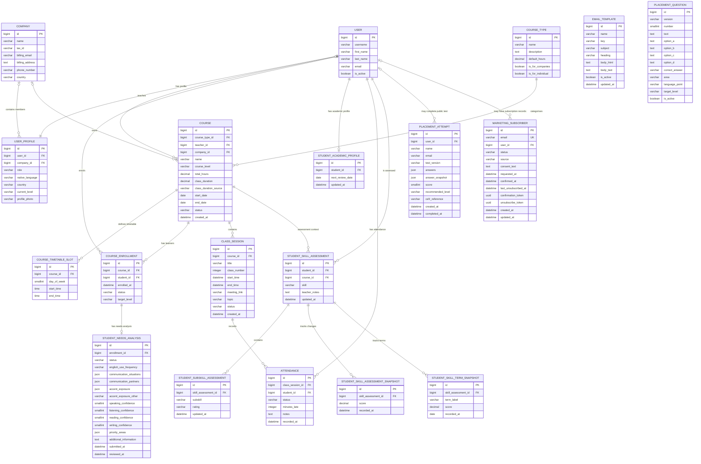

# English Grows

English Grows is a Django-based English language training platform designed for adult learners, teachers and corporate training environments.

The application combines course management, automated lesson scheduling, attendance tracking, learner needs analysis, academic profiling, learner assessment, a public versioned English placement test, progress monitoring, transactional result emails, opt-in marketing subscription records and role-specific interfaces within a single relational data architecture.

---

## 📑 Table of Contents

- [Data Protection & Privacy](#data-protection--privacy)
  - [Regulatory Framework](#regulatory-framework)
  - [Core Data Protection Principles](#core-data-protection-principles)
  - [Lawful Bases and Processing Purposes](#lawful-bases-and-processing-purposes)
  - [Controller and Processor Responsibilities](#controller-and-processor-responsibilities)
  - [Role-Based Access to Personal Data](#role-based-access-to-personal-data)
  - [Privacy by Design and by Default](#privacy-by-design-and-by-default)
  - [Consent and Employment Relationships](#consent-and-employment-relationships)
  - [Data Retention and Deletion](#data-retention-and-deletion)
  - [Data Subject Rights](#data-subject-rights)
  - [Third-Party Services and Data Processors](#third-party-services-and-data-processors)
  - [Security and Confidentiality](#security-and-confidentiality)
  - [Feature-Specific Compliance](#feature-specific-compliance)
  - [Compliance Documentation Status](#compliance-documentation-status)

- [Site Structure](#site-structure)
  - [User Roles](#user-roles)

  - **Django Applications**
    - [Home App](#home-app)

    - [Profiles App](#profiles-app)
      - [User Profile & Role Management](#user-profile--role-management)
      - [Academic Profile](#academic-profile)
      - [Learning Assessment & Progress](#learning-assessment--progress)
        - [Language Skills Assessed](#language-skills-assessed)
        - [Student Skill Assessment](#student-skill-assessment)
        - [Student Subskill Assessment](#student-subskill-assessment)
        - [Detailed Assessment Snapshots](#detailed-assessment-snapshots)
        - [Term Assessment Snapshots](#term-assessment-snapshots)
      - [Learning Needs / Student Needs Analysis](#learning-needs--student-needs-analysis)
        - [Data Protection and Employer Access to Learning Needs](#data-protection-and-employer-access-to-learning-needs)
      - [Learner / Employee Area](#learner--employee-area)
      - [Teacher Area](#teacher-area)
      - [Company Admin Area](#company-admin-area)
      - [Role-Based Access Control](#role-based-access-control)
  
    - [Courses App](#courses-app)
      - [Course Types](#course-types)
      - [Course Management](#course-management)
      - [Course Enrolment](#course-enrolment)
      - [Course Enrolment Lifecycle](#course-enrolment-lifecycle)
      - [Course Timetable](#course-timetable)
      - [Bank Holidays & Course Scheduling](#bank-holidays--course-scheduling)
      - [Class Session Generation](#class-session-generation)
      - [Safe Future Schedule Synchronisation](#safe-future-schedule-synchronisation)
      - [Class Session Lifecycle](#class-session-lifecycle)
      - [Automatic Class Session Status Synchronisation](#automatic-class-session-status-synchronisation)
      - [Rescheduling a Class Lesson](#rescheduling-a-class-lesson)
      - [Course Pause](#course-pause)
      - [Course Cancellation](#course-cancellation)
      - [Attendance](#attendance)
      - [Attendance Reporting](#attendance-reporting)

    - [Communications App](#communications-app)
      - [Email Template Management](#email-template-management)
      - [Email Rendering & Delivery](#email-rendering--delivery)
      - [Automatic Learning Needs Enrolment Email](#automatic-learning-needs-enrolment-email)
      - [Placement Result Notifications](#placement-result-notifications)
      - [Marketing Subscriptions — Single Opt-In](#marketing-subscriptions--single-opt-in)

    - [Placement App — Public English Level Test](#placement-app--public-english-level-test)
      - [Purpose and Scope](#placement-purpose-and-scope)
      - [Question Bank and Versioning](#placement-question-bank-and-versioning)
      - [Question Distribution and Scoring](#placement-question-distribution-and-scoring)
      - [Public Assessment Workflow](#placement-public-assessment-workflow)
      - [Attempt Records and Historical Snapshots](#placement-attempt-records-and-historical-snapshots)
      - [Placement Django Admin and Review](#placement-django-admin-and-review)
      - [Version Locks and Safe Cloning](#placement-version-locks-and-safe-cloning)
      - [Placement Communications — Implementation Status](#placement-communications--implementation-status)

  - [Shared Platform Features](#shared-platform-features)
    - [Calendar](#calendar)
    - [Account Settings](#account-settings)
      - [Shared Profile Form](#shared-profile-form)
      - [Teacher-Specific Information](#teacher-specific-information)
      - [Shared Behaviour and Role-Specific Presentation](#shared-behaviour-and-role-specific-presentation)

  - [Shared Interface Architecture](#shared-interface-architecture)
    - [Shared Page Shells & Navigation](#shared-page-shells--navigation)
      - [Student Detail Presentation](#student-detail-presentation)
      - [Course Detail Presentation](#course-detail-presentation)
      - [Template and CSS Responsibilities](#template-and-css-responsibilities)
    - [Course & Student Selectors](#course--student-selectors)
      - [Student Mode](#student-mode)
      - [Course Mode](#course-mode)
      - [Access Control](#access-control)
    - [Reusable Forms & UI Components](#reusable-forms--ui-components)
      - [Shared Presentation Components](#shared-presentation-components)
    - [Data Visualisation Components](#data-visualisation-components)
      - [Completion Rings](#completion-rings)
      - [Progress Graphs](#progress-graphs)
      - [Status and Accessibility](#status-and-accessibility)

  - [Administration](#administration)
    - [Django Admin](#django-admin)
      - [Course Admin Operational Reporting](#course-admin-operational-reporting)
      - [Global Admin Filter Presentation](#global-admin-filter-presentation)
      - [Placement Administration](#placement-administration)

- [Database Structure — Models](#database-structure--models)
  - [ERD — Entity Relationship Diagram](#erd--entity-relationship-diagram)
  - [Key Data-Integrity Rules](#key-data-integrity-rules)

- [Application Data Flow](#application-data-flow)

- [Architectural Design Choices](#architectural-design-choices)
  - [Separation of Responsibilities](#separation-of-responsibilities)
  - [Domain Transactions vs. External Communications](#domain-transactions-vs-external-communications)
  - [Transactional Placement Emails vs. Optional Marketing](#transactional-placement-emails-vs-optional-marketing)
  - [Authentication vs. Application Profile](#authentication-vs-application-profile)
  - [Course Configuration vs. Lesson Delivery](#course-configuration-vs-lesson-delivery)
  - [Enrolment vs. User Identity](#enrolment-vs-user-identity)
  - [Course-Scoped Learner Detail Navigation](#course-scoped-learner-detail-navigation)
  - [Needs Analysis vs. Teacher Assessment](#needs-analysis-vs-teacher-assessment)
  - [Current Assessment vs. Assessment History](#current-assessment-vs-assessment-history)
  - [Shared Data, Role-Specific Presentation](#shared-data-role-specific-presentation)
  - [Public Placement vs. Course-Specific Assessment](#public-placement-vs-course-specific-assessment)
  - [Live Question Bank vs. Historical Attempt](#live-question-bank-vs-historical-attempt)

- [Security](#security)
  - [Public Form Protection — Cloudflare Turnstile](#public-form-protection--cloudflare-turnstile)
    - [Protected Forms](#protected-forms)
    - [Security Architecture](#security-architecture)
    - [Environment Configuration](#environment-configuration)
    - [Account Signup Integration](#account-signup-integration)
    - [Public Placement Test Integration](#public-placement-test-integration)
    - [Marketing Consent Remains Independent](#marketing-consent-remains-independent)
  - [Verification and Testing](#verification-and-testing)
    - [Automated Django Tests](#automated-django-tests)
    - [Production Acceptance Checklist](#production-acceptance-checklist)
  - [Operational Notes](#operational-notes)
    - [Verification Failures](#verification-failures)
    - [Email Delivery](#email-delivery)
    - [Future Changes](#future-changes)

- [Design Choices](#design-choices)
  - [Placement Test Presentation](#placement-test-presentation)
  - [Colour System](#colour-system)
    - [Colour Architecture](#colour-architecture)
    - [Core Brand / Interface Palette](#core-brand--interface-palette)
    - [Supporting Neutrals](#supporting-neutrals)
    - [CEFR Level Colours](#cefr-level-colours)
    - [Language Skills Colours](#language-skills-colours)
    - [Semantic / Status Colours](#semantic--status-colours)
    - [Colour Usage Principles](#colour-usage-principles)
  - [Responsive Design](#responsive-design)
  - [Data Visualisation](#data-visualisation)

- [Dev Commands](#dev-commands)
  - [Daily Development and Diagnostics](#daily-development-and-diagnostics)
  - [Database and Migrations](#database-and-migrations)
  - [Placement Test and Version Commands](#placement-test-and-version-commands)
  - [Lesson Lifecycle and Static Assets](#lesson-lifecycle-and-static-assets)
  - [Email Testing Reminder](#email-testing-reminder)

---

# DATA PROTECTION & PRIVACY

English Grows processes personal data in the context of language training, learner assessment, Course administration, attendance, communications, corporate training and related platform functionality.

Data protection requirements are therefore treated as part of the application's architecture rather than as a separate concern applied only after functionality has been implemented.

This section establishes the shared privacy and data-protection principles that apply across the platform.

Feature-specific sections document how those principles are implemented in the corresponding workflow.

---
## Regulatory Framework

English Grows operates in Spain and its personal-data processing is primarily governed by:

- **Regulation (EU) 2016/679 — General Data Protection Regulation (GDPR)**.
- **Ley Orgánica 3/2018, de 5 de diciembre, de Protección de Datos Personales y garantía de los derechos digitales (LOPDGDD)**.
- Applicable guidance and criteria published by the **Agencia Española de Protección de Datos (AEPD)**.
- Relevant guidance adopted by the **European Data Protection Board (EDPB)**.

Official sources:

- [GDPR — Regulation (EU) 2016/679, EUR-Lex](https://eur-lex.europa.eu/eli/reg/2016/679/)
- [LOPDGDD — Ley Orgánica 3/2018, consolidated text, BOE](https://www.boe.es/eli/es/lo/2018/12/05/3/con)
- [Agencia Española de Protección de Datos — AEPD](https://www.aepd.es/)
- [European Data Protection Board — EDPB](https://www.edpb.europa.eu/)

The GDPR establishes the general EU framework for processing personal data, while the LOPDGDD supplements and develops that framework within Spanish law.

This README documents the application's technical and organisational approach to these requirements. It does not replace the public Privacy Policy, contractual data-protection documentation or any legal assessment required for a particular processing activity.

---
## Core Data Protection Principles

English Grows follows the principles established in GDPR Article 5 when designing and operating features that process personal data.

These include:

| Principle | Application within English Grows |
|---|---|
| Lawfulness, fairness and transparency | Personal data must be processed under an appropriate legal basis and users must receive clear information about how their data is used. |
| Purpose limitation | Data collected for one purpose must not automatically be reused for unrelated purposes. |
| Data minimisation | Features and roles should access only the information necessary for their legitimate function. |
| Accuracy | Personal and academic records should be capable of being maintained and corrected where necessary. |
| Storage limitation | Personal information should not be retained indefinitely without a defined purpose. |
| Integrity and confidentiality | Access must be protected against unauthorised or inappropriate disclosure. |
| Accountability | English Grows must be able to demonstrate that appropriate privacy and security measures have been considered and implemented. |

Official text:

[GDPR Article 5 — Principles relating to processing of personal data](https://eur-lex.europa.eu/eli/reg/2016/679/)

These principles are applied throughout the platform when deciding:

- which data a feature should collect;
- which model should own that data;
- which roles may access it;
- whether data should be editable or read-only;
- whether information should be exposed to a corporate client;
- how long information should be retained;
- and whether a new processing purpose requires additional review.

---
## Lawful Bases and Processing Purposes

Every processing activity involving personal data must have a defined purpose and an applicable lawful basis under GDPR Article 6.

Official text:

[GDPR Article 6 — Lawfulness of processing](https://eur-lex.europa.eu/eli/reg/2016/679/)

The appropriate lawful basis may differ according to the processing activity.

Examples within English Grows may include:

- delivery and administration of contracted training services;
- management of Course enrolments and attendance;
- learner assessment and academic support;
- transactional communications necessary to provide the service;
- compliance with applicable legal obligations;
- legitimate organisational interests where the corresponding legal requirements are satisfied;
- consent where consent is appropriate and legally valid.

A lawful basis must not be assumed merely because the information is useful.

The purpose, necessity and legal basis of each material processing activity should be documented before the corresponding feature is treated as fully compliant.

---
## Controller and Processor Responsibilities

The respective roles of English Grows, individual learners and corporate clients must be determined according to the actual processing activity and contractual relationship.

Depending on the context, English Grows may process personal data:

- for its own purposes as a data controller;
- on behalf of a corporate client where a processor relationship applies;
- or within a processing arrangement where the responsibilities of each party must be assessed separately.

These roles must not be inferred solely from who pays for the service.

The applicable controller / processor relationship should be reflected consistently in:

- the Privacy Policy;
- corporate contracts;
- data-processing agreements where required;
- third-party processor documentation;
- Records of Processing Activities where applicable;
- and technical access controls.

**Implementation status:** Controller and processor responsibilities for each English Grows processing context remain subject to final legal and contractual review.

---
## Role-Based Access to Personal Data

Access to personal data is based on the user's legitimate responsibilities within the platform, not merely on the existence of a user account or broad organisational relationship.

The principal application roles are:

- Learner / Employee.
- Teacher.
- Company Admin.
- Authorised English Grows administration.

Different roles require different information.

For example:

```text
LEARNER
→ Own personal, academic and Course information.

TEACHER
→ Academic information required to deliver and assess Courses
  assigned to that teacher.

COMPANY ADMIN
→ Information required to administer and monitor corporate training,
  subject to purpose limitation and data minimisation.

ENGLISH GROWS ADMINISTRATION
→ Information required for authorised operational, academic,
  contractual and support responsibilities.
```

---

# SITE STRUCTURE

---

EnglishGrows has been developed using **Django 6.0.5** with **Python 3.12**.

The application follows Django's Model-Template-View architecture and is currently organised into five principal custom Django apps:

- **Home**
- **Profiles**
- **Courses**
- **Communications**
- **Placement**

Each app contains the relevant combination of ***models***, ***views***, ***URLs***, ***templates***, ***forms***, static assets, and supporting logic required for its area of responsibility.

Moreover, the site is consistent with its business logic:

- The **model** should calculate
- The **helper** should package
- The **view** should orchestrate
- The **template** should display

---

## USER ROLES

User authentication is handled using Django's authentication system together with **django-allauth**. Application-specific user information and role-based behaviour are managed through the `UserProfile` model.

The platform supports four principal user roles:

- **Teacher**
- **Individual learner**
- **Employee learner**
- **Company administrator**

Access to platform functionality and data is controlled according to the authenticated user's role and, where applicable, their associated company.

---

## HOME App

The `home` app is responsible primarily for the public-facing area of EnglishGrows and serves as the entry point to the platform.

### Main responsibilities

- Provides the public **landing page**
- Presents EnglishGrows' training services and platform
- Provides navigation into the authenticated learning platform
- Contains public-facing informational and marketing content
- Directs users towards the relevant learning or company-training journey
- Integrates the public website with the authenticated Django platform
- Links to the independent public `placement` assessment without absorbing its question-bank or grading logic

The Home app is intentionally kept separate from the teaching-management functionality so that public marketing content and authenticated platform features remain logically independent.

---

## PROFILES App

The `profiles` app contains most of the user-facing platform experience.

It extends Django authentication with application-specific profile information and provides dedicated interfaces according to each user's role.

The app includes functionality for:

- **Learners**
- **Teachers**
- **Company administrators**
- **Student academic profiles**
- **Course-scoped Learning Needs / Student Needs Analysis**

The same underlying course, attendance, and assessment data is presented differently depending on the authenticated user's permissions and responsibilities.

---

### USER PROFILE & ROLE MANAGEMENT

The platform uses Django's authenticated `User` as the primary user identity and associates it with a dedicated `UserProfile`.

The profile stores additional application information such as:

- User role
- Associated company *(where applicable)*
- Native language
- Country
- Current CEFR level
- Profile photograph
- User-specific platform information

This avoids maintaining separate authentication models for teachers, employees, individual learners, and company administrators.

Instead, role-based access is determined through the user's profile.

---


### ACADEMIC PROFILE

`StudentAcademicProfile` provides the learner's central academic record, bringing together learning needs and skills assessments across their Courses.

The model is intentionally compact. It stores only learner-level information:

- `student` — a one-to-one relationship with the learner;
- `next_review_date` — the next overall academic review date;
- `updated_at` — the date of the latest Academic Profile update.

Course-specific information is retrieved from its canonical source rather than duplicated in `StudentAcademicProfile`.

The Academic Profile does not maintain a separate Learning Goals catalogue or individual learning objective field. The learner's actual priorities are captured through their Course-specific Needs Analysis.


#### Academic Profile structure

The Django Admin organises academic information into one accordion per Course. Each Course contains both the learner's Learning Needs and their Skills Assessment.

The interface uses a dedicated stylesheet, `profiles/css/admin/student_academic_profile.css`, and the project's existing brand, CEFR-level and Course-status colour variables.

```text
STUDENT ACADEMIC PROFILE

ACADEMIC PROFILE
├── Student
├── Next review date
└── Updated at

ACADEMIC RECORDS
│
├── ▾ High Intermediate [GR-001]  [B2]              [Active]
│   │
│   ├── Assessment progress
│   │   └── 4/4 skills complete · 14/14 subskills assessed
│   │
│   ├── LEARNING NEEDS                               [Reviewed]
│   │   ├── Priority Areas
│   │   │   ├── Meetings and video calls
│   │   │   └── Presentations
│   │   ├── Additional Information
│   │   ├── Submission/review dates
│   │   └── View full questionnaire ↗
│   │
│   └── SKILLS ASSESSMENT
│       ├── ▸ Speaking                               4/4 assessed
│       ├── ▸ Listening                              4/4 assessed
│       ├── ▸ Reading                                3/3 assessed
│       └── ▸ Writing                                3/3 assessed
│
└── ▸ Advanced [GR-002]          [C1]                [Completed]
    │
    ├── LEARNING NEEDS
    └── SKILLS ASSESSMENT
```

The figures and statuses above are illustrative; the Admin displays the actual values retrieved from the corresponding Course, Needs Analysis and assessment records.

##### Course accordions

Each Course accordion has a maximum width of **850px**, maintaining a compact and readable layout while adapting to smaller screens.

Its header includes:

- A chevron indicating whether the accordion is expanded or collapsed.
- The Course name.
- A CEFR-level badge positioned immediately after the Course name.
- A colour-coded Course-status badge aligned to the right.
- A secondary line summarising completed skills and assessed subskills.

CEFR badges use the existing `--color-a1` through `--color-c2` variables. The badge colour is determined by the Course's `course_level`, independently of the learner's current level.

Course-status badges use the corresponding `--color-course-status-*` variables for Active, Confirmed, Paused, Completed and Cancelled Courses.

The Course and skill accordions use native HTML `<details>` and `<summary>` elements, with CSS-driven rotating chevrons. No additional JavaScript is required.

##### Course content

Within each expanded Course accordion, two visually distinct sections are displayed:

**Learning Needs** presents the learner's submitted questionnaire information as read-only content, including its workflow status, selected Priority Areas, Additional Information and submission/review dates. A direct link provides access to the complete Needs Analysis record.

Priority Areas reuse the canonical `SITUATION_CHOICES` defined in `profiles/forms/student_needs_analysis.py`, ensuring that the Academic Profile displays the same translatable labels as the learner questionnaire.

**Skills Assessment** retains the editable Course → Skill → Subskill structure, with expandable sections for Speaking, Listening, Reading and Writing.

Each skill displays its assessment progress, and the existing rating controls remain available for entering, updating or clearing subskill assessments.

---

##### Data ownership and historical records

Each Course accordion consolidates the learner's stated needs and teacher-assessed abilities, avoiding separate Course lists for Learning Needs and Skills Assessment.

Learning Needs remain stored in `StudentNeedsAnalysis`, while skill and subskill ratings remain stored in their canonical assessment models.

The Academic Profile does not duplicate questionnaire responses or assessment data.

All enrollment statuses are included, preserving access to academic information from Active, Paused, Completed and Cancelled Courses. Historical assessment records also remain accessible when their original enrollment is unavailable.

The Admin presentation is handled by `academic_records_editor()`, while the existing `save_related()` implementation continues to validate and save subskill ratings.


---

#### Canonical data ownership

Academic information is assembled from the appropriate models:

```text
Learner's current CEFR level
→ UserProfile

Course programmes / training focus
→ Course

Individual target level, where applicable
→ CourseEnrollment

Learning Needs and selected Priority Areas
→ StudentNeedsAnalysis

Skills and subskill assessments
→ StudentSkillAssessment + StudentSubSkillAssessment

Next overall academic review
→ StudentAcademicProfile
```

`StudentAcademicProfile` acts as the **central academic overview and planning layer**, while the underlying models remain responsible for storing their own information.

Learning Needs and assessment records remain Course-specific and are not copied into `StudentAcademicProfile`.

---

#### Learning Needs integration

Each Course's Learning Needs section retrieves the `StudentNeedsAnalysis` associated with its `CourseEnrollment`.

The Academic Profile displays:

- **Status:** Pending, Submitted or Reviewed.
- **Priority Areas:** the communication situations selected by the learner.
- **Additional Information:** the learner's original free-text response.
- **Submission date:** when the questionnaire was submitted.
- **Review date:** when the teacher marked the questionnaire as reviewed.
- **View full questionnaire:** a link to the original Needs Analysis record in Django Admin.

Priority Areas reuse the canonical `SITUATION_CHOICES` defined in `profiles/forms/student_needs_analysis.py`.

The stored JSON values are resolved to their original, translatable questionnaire labels:

| Stored value | Display label |
|---|---|
| `meetings_calls` | Meetings and video calls |
| `phone_calls` | Phone calls |
| `presentations` | Presentations |
| `written_communication` | Emails, reports and documents |
| `customer_communication` | Customer communication |
| `networking` | Networking |
| `other` | Other |

This avoids maintaining a duplicate catalogue or displaying raw JSON values.

**Learning Needs are strictly read-only within the Academic Profile.** The learner's original responses remain stored in `StudentNeedsAnalysis` and cannot be modified through the Academic Profile editor.

Pending questionnaires display an appropriate awaiting-submission message rather than exposing unfinished responses or displaying an empty Priority Areas list.

If no Needs Analysis record exists, the Academic Profile also displays an awaiting-submission state.

---

#### Skills Assessment integration

Each Course's Skills Assessment section retains the existing expandable structure:

```text
COURSE
└── SKILLS ASSESSMENT
    ├── Speaking
    │   └── Subskill ratings
    ├── Listening
    │   └── Subskill ratings
    ├── Reading
    │   └── Subskill ratings
    └── Writing
        └── Subskill ratings
```

The Admin displays the complete canonical assessment framework, including subskills that have not yet been assessed.

Assessments can therefore be completed directly from the Academic Profile, even when no previous assessment records exist.

Each Course displays assessment progress:

- Number of fully assessed skills.
- Total number of available skills.
- Number of assessed subskills.
- Total number of available subskills.

An individual skill is considered complete when all its defined subskills have been assessed.

The existing `save_related()` implementation validates Course ownership, skill identifiers, subskill identifiers and permitted ratings before saving.

Blank ratings do not create unnecessary assessment records. Existing ratings can also be cleared without deleting the associated historical assessment structure.

All assessment values continue to be saved through `StudentSkillAssessment` and `StudentSubSkillAssessment`.
---

#### Historical records and empty states

Academic records are assembled primarily from the learner's Course enrollments, regardless of their current status.

Active, paused, completed and cancelled enrollments remain visible.

Existing assessment records are also considered independently, allowing historical assessment information to remain accessible when its original enrollment is no longer available.

The Academic Profile supports the following situations:

| Situation | Admin behaviour |
|---|---|
| Learner has no Courses | Displays an appropriate empty state. |
| Course has no Needs Analysis record | Displays awaiting-submission information. |
| Needs Analysis is pending | Displays its status without exposing unfinished responses. |
| Needs Analysis is submitted | Displays the learner's submitted responses and submission date. |
| Needs Analysis is reviewed | Displays the submitted responses and review information. |
| Course has no previous assessments | Displays the complete assessment framework, ready for the first assessment. |
| Course is completed or cancelled | Preserves its historical academic information. |
| Historical assessment has no enrollment record | Retains the assessment and indicates that the enrollment is unavailable. |

The implementation avoids creating Needs Analysis or assessment records simply because an Admin page is viewed.
---

#### Architectural principle

The Academic Profile consolidates information; it does not duplicate ownership of that information.

The separation of responsibilities follows the project's established architectural principle:

**The model calculates; the helper packages; the view or Admin orchestrates; the template displays.**

This keeps the Academic Profile maintainable while allowing the learning questionnaire and assessment workflows to evolve independently.

--- 

### LEARNER / EMPLOYEE AREA

Learners have access to a dedicated learning area containing information specific to their own current and historical Course enrolments.

Principal functionality includes:

- **Learner dashboard**
- **My Course**
- **Course-scoped inner navigation**
- **Learning Needs questionnaire**
- **Course-specific Attendance record**
- **My Calendar**
- **My Learning Progress**
- **Skill overview**
- **Detailed skill progress graphs**
- **Teacher assessment feedback**
- **My Course selector when more than one lifetime Course enrolment exists**
- **Upcoming/current-class information**
- **Attendance and absence history**
- **Course delivery / completion information**
- **Account settings**

The learner's detailed Course information is organised around the selected `CourseEnrollment`.

The shared learner-detail inner navigation follows the selected Course context:

```text
Overview
   ↓
Learning Needs
   ↓
Skills
   ↓
Attendance
```

Detailed Attendance therefore belongs to **My Course** rather than acting as a separate top-level learner destination.

This reflects the underlying business meaning:

```text
Attendance
→ participation in one selected Course

Learning Progress
→ development of the learner's skills and objectives
```

The selected Course context is preserved through:

```text
?course=<course_id>
```

and the selected enrolment is always resolved from the authenticated learner's own `CourseEnrollment` queryset.

A learner therefore cannot manipulate the query parameter to access a Course in which they have never been enrolled.

#### Lifetime Course access

The **My Course** area remains accessible across the learner's complete Course history rather than being limited to active training only.

Its Course selector is built from **all `CourseEnrollment` records belonging to the authenticated learner**, regardless of either:

- `CourseEnrollment.status`; or
- the parent `Course.status`.

The selector therefore supports current and historical enrolments, including Courses that are:

```text
Active
Confirmed
Paused
Completed
Cancelled
```

Course contexts are ordered by lifecycle priority:

```text
Active
   ↓
Confirmed
   ↓
Paused
   ↓
Completed
   ↓
Cancelled
```

For completed Courses, the newest `end_date` is shown first.

For the other lifecycle states, Courses are ordered alphabetically by Course name.

The selector is displayed only when the learner has **more than one lifetime enrolment**. If the learner has only one enrolment in total, the selector is omitted because there is no alternative Course context to select.

#### Current / upcoming class

Operational information remains context-sensitive.

Historical Courses can still be reviewed through My Course, while next/current-class information is exposed only when:

```text
CourseEnrollment.status == active

AND

Course.status in {active, confirmed}

AND

ClassSession.status in {scheduled, rescheduled}

AND

ClassSession.end_time > now
```

Using `end_time` rather than only `start_time` means a lesson that has already started but has not yet finished remains available as the learner's current class.

`pending_reschedule`, held, complete and cancelled lessons are not presented as future/current teaching slots.

#### Course overview delivery metrics

The Course overview keeps **lesson delivery** separate from **Attendance submission**.

An ended lesson can contribute to the learner's past/delivered Course picture even when Attendance is still awaiting teacher action.

For the Course overview, ended teaching is based on the lesson's actual stored time and excludes lessons that are not valid delivered appointments:

```text
end_time < now

EXCLUDING

cancelled
pending_reschedule
```

Delivered hours are calculated from the actual duration of the relevant stored `ClassSession` records:

```text
end_time - start_time
```

rather than by multiplying a standard class duration by a class count.

This preserves:

- shorter final lessons;
- legitimately rescheduled lesson durations;
- any other valid stored duration that differs from the Course default.

Attendance submission remains a separate concept and must not be used as a proxy for Course delivery.

#### Learner Attendance inside My Course

The learner Attendance record now sits inside the **My Course inner navigation** and is always scoped to the selected `CourseEnrollment`.

The learner can review:

- assigned classes;
- held classes;
- classes with finalized Attendance;
- attended classes;
- missed classes;
- excused absences;
- Attendance percentage;
- delivered / held hours;
- finalized Attendance hours;
- learner-attended hours;
- remaining assigned teaching;
- detailed finalized Attendance records.

Historical Course Attendance remains reviewable because the selected enrolment may itself be historical.

The Attendance page consumes the canonical model-owned `CourseEnrollment` metrics rather than rebuilding the same calculations independently in the view.

The learner calendar applies a related but slightly different rule: current `scheduled` / `rescheduled` teaching is limited to active enrolment + active Course context, while historical `held_attendance_pending` and `complete_attendance_submitted` lessons remain visible across the learner's own Course history.

---

### LEARNING NEEDS / STUDENT NEEDS ANALYSIS

The `StudentNeedsAnalysis` feature captures the learner's own Course-specific communication needs, confidence, priorities and learning preferences before or during training.

It belongs to the `profiles` app because it represents learner-specific academic/profile information, while its scope is defined by one `CourseEnrollment`.

The relationship is:

```text
CourseEnrollment
      │
      │ 1 : 0..1
      ▼
StudentNeedsAnalysis
```

The database relationship is implemented as a `OneToOneField` from `StudentNeedsAnalysis` to `CourseEnrollment` with:

```text
related_name="needs_analysis"
```

This allows the same learner to complete a different Needs Analysis for each Course enrolment without turning the questionnaire into a global permanent property of the user.

The role-specific views use `get_or_create()` for the selected enrolment, so a `pending` record may exist before the learner has answered anything.

For that reason, model response fields permit the empty pending state, while the Django form enforces the required answers at submission time.

The current implementation uses a dedicated `StudentNeedsAnalysisForm(forms.Form)` rather than a `ModelForm`.

The learner view therefore:

```text
model data
→ form initial values

valid POST
→ form.cleaned_data
→ StudentNeedsAnalysis fields
→ save
```

This keeps workflow control explicit in the view while the model remains the persistent source of truth.

#### Workflow

The canonical workflow statuses are:

```text
pending
   ↓
submitted
   ↓
reviewed
```

Their responsibilities are deliberately separated:

| Status | Learner / Employee | Teacher | Company Admin |
| :--- | :--- | :--- | :--- |
| `pending` | May complete and submit | Read-only pending state | Read-only pending state |
| `submitted` | Read-only | Read-only + may mark reviewed | Read-only |
| `reviewed` | Read-only | Read-only | Read-only |

Learners can edit only while:

```text
status == pending
```

The learner submits the questionnaire through one final POST.

On successful validation:

```text
status
→ submitted

submitted_at
→ current timestamp
```

Once submitted, the learner cannot edit or resubmit the record.

A teacher may subsequently mark a submitted Needs Analysis as reviewed:

```text
submitted
   ↓
reviewed

reviewed_at
→ current timestamp
```

Company administrators have read-only access within their own Company boundary.

The shared content template uses **capability/state flags** such as:

```text
can_edit
can_review
status
```

rather than hard-coding role names throughout the questionnaire presentation.

This keeps one shared questionnaire/report component usable by:

- learner / employee;
- teacher;
- company administrator.

Role-specific views remain responsible for access control and Course/enrolment scoping.

#### Automatic enrolment invitation

The Learning Needs workflow is connected to the Course enrolment lifecycle through the `communications` app.

When a **new `CourseEnrollment` is created already in the active state** for a learner / employee, the application schedules an automatic welcome email after the enrolment transaction commits successfully.

The email contains a Course-specific call-to-action:

```text
Complete my Learning Needs
```

The CTA opens the learner's own Needs Analysis in the correct Course context:

```text
?course=<course_id>
```

This means the recipient does not need to navigate manually to the questionnaire or guess which Course the request belongs to.

The link does not bypass access control. The destination view still resolves the selected Course from the authenticated learner's own enrolments before exposing or accepting questionnaire data.

The notification is deliberately tied to **creation of a new active enrolment**. Routine later saves of the same `CourseEnrollment` do not resend the welcome email.

Email delivery is an external communication side effect and is not embedded directly inside `CourseEnrollment.save()`. The enrolment remains the domain record; the communications layer reacts to the committed enrolment separately.

#### Questionnaire structure

The editable questionnaire is presented as a six-step horizontal wizard:

```text
1. Your English
   ↓
2. Your Communication
   ↓
3. Your Confidence
   ↓
4. Challenges & Priorities
   ↓
5. How You Learn
   ↓
6. Anything Else?
```

All six visual steps remain inside **one Django form**.

The browser moves horizontally between client-side panels, but Django receives:

```text
ONE complete POST
```

only when the learner submits the final step.

This avoids fragmenting one Needs Analysis across multiple database writes or separate URLs.

The wizard provides Back / Continue navigation while Django remains the final authority for form validation.

Client-side navigation supports the workflow without becoming the source of truth:

```text
current step
→ validate required browser controls
→ unlock next step
→ move track horizontally

previously reached step
→ may be revisited

future unreached step
→ remains disabled
```

If the final Django POST is rejected, the wizard can reopen the first panel containing a server-rendered field error rather than always returning the learner to Step 1.

The wizard height is synchronized to the currently visible panel so hidden steps do not create a long vertically stacked page.

#### Current questionnaire data

The current Needs Analysis stores:

**1. Your English**

- `english_use_frequency`
- `communication_situations`

**2. Your Communication**

- `communication_partners`
- `accent_exposure`
- `accent_exposure_other`

**3. Your Confidence**

- `speaking_confidence`
- `listening_confidence`
- `reading_confidence`
- `writing_confidence`

**4. Challenges & Priorities**

- `priority_areas`

**5. Anything Else?**

- `additional_information`

---

#### English-use frequency

Current frequency choices are intentionally concise:

```text
Every day
Several times a week
Occasionally
Rarely or never
```

#### Communication situations

Current communication situations are:

```text
Meetings and video calls
Phone calls
Presentations
Emails, reports and documents
Customer communication
Networking
Other
```

The options are deliberately consolidated so the form remains quick to complete and does not imply technical-language programmes that are not currently offered.

#### Communication partners

Current communication-partner categories are:

```text
Colleagues and internal teams
Managers
Customers
External partners
Other
```

`Managers` remains separate because upward communication can imply different levels of formality, diplomacy and register.

Overly granular distinctions such as supplier vs. partner are avoided where they do not materially improve the pedagogical picture.

#### Accent / English-variety exposure

Accent exposure is collected separately from communication-partner type because it informs listening practice more directly.

Current structured choices include:

```text
English accents from England
Scottish English
Irish English
American English
Indian English
International / non-native English accents
Other
```

The learner may select several values.

When `Other` is selected, `accent_exposure_other` provides the specific additional variety, for example:

```text
Australian
South African
Welsh
```

Form validation requires this free-text value when `Other` is selected.

The client-side wizard also hides the supplementary **Other accents** input until the `Other` checkbox is selected.

If `Other` is not selected, the supplementary value is cleared rather than being retained as stale hidden data.

The aim is **listening exposure and comprehension**, not requiring learners to imitate multiple accents.

#### Confidence

Confidence is self-reported separately for:

```text
Speaking
Listening
Reading
Writing
```

Each value is stored as an integer from `1` to `5`:

| Value | Display label |
| :---: | :--- |
| `1` | Not confident yet |
| `2` | Slightly confident |
| `3` | Fairly confident |
| `4` | Confident |
| `5` | Very confident |

Read-only reporting combines the numeric and descriptive value, for example:

```text
3 / 5 — Fairly confident
```

This self-reported confidence information remains separate from teacher-assessed skill performance.

#### Priority areas

Learners select up to three priority areas from the ***Communication situations*** previously selected:

```text
Meetings and video calls
Phone calls
Presentations
Emails, reports and documents
Customer communication
Networking
Other
```

Server-side form validation enforces:

```text
maximum selected priorities = 3
```

#### Anything else

The final step keeps only concise optional free-text opportunities:

```text
preferred_topics
→ topics, situations or types of English the learner would particularly like to work on

additional_information
→ anything else the learner would like the teacher to know
```

These fields are deliberately optional so the questionnaire remains quick to complete.

#### Stored values vs. displayed values

Multiple-choice answers are stored using stable internal values, for example:

```text
written_communication
customer_communication
internal
american
role_plays
```

These codes are appropriate for database and application logic but are not shown directly to users.

The form provides display helpers that convert stored values back to their human-readable labels for submitted/reviewed reports.

For example:

```text
['presentations', 'written_communication']
```

is displayed as:

```text
Presentations, Emails, reports and documents
```

`accent_exposure_other` is presented as part of the main accent answer:

```text
Scottish English, American English
Other accents: Australian
```

rather than appearing as a separate generic "Please specify" question.

The form's display helpers provide:

```text
choice_labels(...)
confidence_display(...)
```

for learner, teacher and company-admin read-only views.

The shared report displays the question label above each human-readable answer and keeps supplementary accent text visually grouped with the main accent question.

The submitted report therefore acts as a human-readable summary rather than exposing internal database codes.

---

#### Data Protection and Employer Access to Learning Needs

`StudentNeedsAnalysis` contains personal information provided directly by the learner to support the delivery and personalisation of their English training.

The questionnaire may include:

- Communication situations and learning priorities.
- Self-assessed confidence in speaking, listening, reading and writing.
- Communication partners and accent exposure.
- Additional free-text information provided by the learner.

Some responses may contain information that the learner is comfortable sharing with their teacher but would not reasonably expect to be disclosed to their employer.

English Grows therefore distinguishes between **academic information required to deliver training** and **administrative information required by a company to manage its employees' training**.

The applicable GDPR principles, lawful bases, consent considerations and official regulatory references are documented in the central [Data Protection & Privacy](#data-protection--privacy) section.

##### Employer Access and Data Minimisation

The fact that a company finances an employee's training does not, by itself, establish that access to every questionnaire response is necessary or legally justified.

Access must be assessed against the specific processing purpose, applicable legal basis and information genuinely required by the employer.

Company Admins may need to know whether an employee has completed the Learning Needs questionnaire as part of the training process. However, they do not automatically require access to the learner's confidence self-assessments, personal explanations or complete questionnaire.

English Grows therefore adopts the following default policy:

**Company Admin access is limited to the questionnaire's submission/completion status.**

The following information is excluded from the default Company Admin view:

- Individual questionnaire answers.
- Selected communication priorities.
- Self-assessed confidence ratings.
- Communication partners and accent exposure.
- Additional Information entered by the learner.
- The complete questionnaire record.

Where a corporate client has a specific, justified need for additional information, the proposed disclosure must be assessed separately against the applicable purpose, legal basis and data-minimisation requirements.

##### Role-Based Access Policy

| Role | Permitted access |
|---|---|
| Learner / Employee | Own Needs Analysis questionnaire and submitted responses. |
| Assigned teacher | Full questionnaire for learners enrolled in their assigned Courses, including the review workflow. |
| Authorised English Grows administration | Access appropriate to internal academic administration and support responsibilities. |
| Company Admin | Questionnaire submission/completion status only, without access to individual responses. |

Teacher access is Course-scoped. Assignment to one Course does not automatically authorise access to the learner's questionnaire records from unrelated Courses.

The Company Admin's relationship with the employee does not automatically grant access to the academic information available to the assigned teacher.

##### Technical Enforcement

Access restrictions must be enforced server-side through role-aware views and Course/enrollment ownership checks.

Hiding questionnaire content in a template, removing a navigation link or applying CSS restrictions is not sufficient to prevent unauthorised access.

The implementation must ensure that:

- Learners can access only their own questionnaire records.
- Teachers can access questionnaire records only for learners enrolled in Courses assigned to them.
- Company Admins can access only the permitted submission/completion status for employees belonging to their company.
- Direct access to a questionnaire URL cannot bypass the applicable role and ownership checks.
- Pending questionnaires do not expose unfinished responses through academic summaries.
- The original questionnaire responses remain read-only after submission, subject to the established review and reset workflows.

The Company Admin's existing Learning Needs route must be restricted at the view level rather than relying exclusively on template presentation.

##### Academic Profile Integration

`StudentNeedsAnalysis` remains the canonical owner of the learner's questionnaire responses.

The `StudentAcademicProfile` Django Admin consolidates Learning Needs and Skills Assessment information within a single accordion for each Course, without duplicating the underlying records.

Within this interface:

- Learning Needs are displayed as read-only information.
- Submitted and reviewed questionnaires display their selected Priority Areas, Additional Information and submission/review dates.
- The complete questionnaire remains accessible through its dedicated Admin record.
- Pending questionnaires do not display unfinished responses.
- Skill and subskill assessments retain their separate editing and saving logic.

The teacher-facing Academic Overview will reuse the existing records through Course-scoped queries rather than create additional copies of the learner's questionnaire responses.

The Company Admin interface must not reuse the unrestricted teacher-facing academic presentation.

##### Privacy Policy and Transparency

The English Grows Privacy Policy must accurately describe:

- The purposes for which Learning Needs responses are collected.
- The applicable legal basis for processing.
- The categories of recipients who may access the information.
- The distinction between teacher-facing academic information and employer-facing training information.
- The applicable retention arrangements and data subject rights.

The allocation of controller and processor responsibilities between English Grows and its corporate clients must be established according to the actual processing and contractual arrangements.

See [Data Protection & Privacy](#data-protection--privacy) for the shared legal framework and documentation requirements.

##### Implementation Status

| Requirement | Status |
|---|---|
| Course-specific `StudentNeedsAnalysis` model and questionnaire workflow | Implemented |
| Read-only Learning Needs summary within the Academic Profile Django Admin | Implemented |
| Suppression of unfinished questionnaire responses in the Admin summary | Implemented |
| Teacher access restricted to assigned Courses | Existing workflow — authorisation audit required |
| Company Admin access limited to submission/completion status | Pending implementation |
| Removal of unrestricted questionnaire access from the existing Company Admin route | Pending implementation |
| Teacher-facing consolidated Academic Overview | Planned |
| Privacy Policy alignment with the final access model | Pending review |

**Important:** The Company Admin restriction is an agreed access policy, not yet a verified technical safeguard. The existing view and its corresponding URL must be audited and updated before this requirement can be marked as implemented.

The overarching architectural principle is that **access to personal academic information follows the user's legitimate responsibilities within the training workflow, not merely their general role or organisational relationship**.

---

### TEACHER AREA

Teachers have a dedicated operational dashboard for managing the courses and learners assigned to them.

Principal functionality includes:

- **Teacher dashboard**
- **Assigned courses**
- **Course details**
- **Class/session management**
- **Attendance management**
- **Individual attendance submission**
- **Group attendance submission**
- **Attendance history**
- **Student details**
- **Student skill assessment**
- **Subskill assessment**
- **Assessment notes**
- **Learner progress graphs**
- **Student Learning Needs review**
- **Mark submitted Learning Needs as reviewed**
- **Class rescheduling**
- **Calendar**
- **Course and learner progress reporting**

Teacher access is restricted to courses assigned to the authenticated teacher.

Course-detail and course-learner views preserve access to the teacher's **historical course records regardless of course status**. Courses assigned to the teacher therefore remain accessible when they are:

```text
Active
Confirmed
Paused
Completed
Cancelled
```

Where a teacher-facing course selector is used, courses are ordered by lifecycle priority:

```text
Active
    ↓
Confirmed
    ↓
Paused
    ↓
Completed
    ↓
Cancelled
```

Within the same status, courses are ordered alphabetically by course name.

Historical `CourseEnrollment` records are likewise preserved on course learner-list/detail pages rather than being restricted to active enrolments only.

Teacher course learner lists support sorting by:

- **Name A-Z**
- **CEFR level**

For alphabetical sorting, the displayed learner identity is used. The learner's full name is preferred when available; when first/last name information is absent, the learner's **username is used as the sorting fallback**. This prevents users without completed name fields from being incorrectly grouped under an empty value.

The teacher dashboard provides operational summaries for current teaching activity, including active courses, students, upcoming/held sessions, and attendance information.

The teacher class list keeps **temporal lesson state** separate from **Attendance-submission state**.

A lesson whose `end_time` has passed belongs to the past/held operational view even when Attendance has not yet been finalized.

The interface therefore distinguishes:

```text
Past / held lesson
→ lesson time has ended

Attendance submitted
→ ClassSession lifecycle has reached complete_attendance_submitted
```

A past lesson may consequently remain actionable because Attendance is still pending.

Attendance-submitted rows expose the relevant detail action, while held lessons still awaiting Attendance use a pending indicator instead of pretending the workflow is complete.

---

### COMPANY ADMIN AREA

Company administrators have a dedicated B2B management area allowing them to monitor the training delivered to employees belonging to their organisation.

Principal functionality includes:

- **Company dashboard**
- **Employee list**
- **Employee profile and learning progress**
- **Company course list**
- **Course details**
- **Course learner list**
- **Company class/session list**
- **Company-wide attendance reporting**
- **Employee attendance records**
- **Employee skill development**
- **Employee assessment information**
- **Employee progress graphs**
- **Employee Learning Needs (read-only)**
- **Own participant record when the company administrator is actively enrolled in training**
- **Company class calendar**

Company administrators can only access information associated with their own `Company`.

Within that company boundary, course-detail and course-learner views preserve **historical course and enrolment records regardless of status**. Company administrators can therefore continue to review courses after they become paused, completed, or cancelled rather than losing access once a course is no longer active.

Where a company-admin course selector is used, company courses are ordered by lifecycle priority:

```text
Active
    ↓
Confirmed
    ↓
Paused
    ↓
Completed
    ↓
Cancelled
```

Within the same status, courses are ordered alphabetically by course name.

Historical `CourseEnrollment` records also remain available on the relevant course learner/detail pages so that completed, paused, or cancelled participation remains visible for reporting and review.

This prevents cross-company data exposure while allowing an authorised company representative to monitor employee participation, attendance, course progression, learning outcomes, and historical training records.

Company administrators can also review an employee's Course-specific submitted Learning Needs inside the same student-detail architecture.

They cannot edit the learner questionnaire or mark it reviewed.

Company class/session lists use the same separation between **past/held teaching** and **Attendance finalization** as the teacher interface, so a lesson can be historically past while still showing Attendance as pending.

#### Company administrators as training participants

Application role and Course participation are deliberately independent concepts.

`UserProfile.role` determines the user's workspace and permissions, while `CourseEnrollment` determines whether that same person participates in a particular Course.

A company administrator can therefore also be a genuine training participant without changing role:

```text
UserProfile.role = company_admin
        │
        ├── continues using Company Admin navigation / permissions
        │
        └── may also have CourseEnrollment records
                │
                └── participates in training as a learner
```

The Company Admin employee/performance list applies the following inclusion rule:

```text
Employee role
→ included for the Company even with zero Course enrolments

Company Admin role
→ included as a training participant only while they have
  an active CourseEnrollment for a Course belonging to that Company
```

This avoids creating a second account or a multi-role identity model merely because a company administrator also attends training.

When an actively enrolled company administrator qualifies for the participant list:

- their role remains `company_admin`;
- they continue to use the Company Admin workspace and sidebar;
- their own participant profile can be opened through the existing Company Admin student-detail architecture;
- the same Company boundary continues to apply;
- their CourseEnrollment history remains available through that participant record while the participant is in scope.

A company administrator with no active qualifying enrolment remains a company administrator but is not treated as a current training participant in the employee/performance list.

This separation preserves the distinction between:

```text
ROLE
→ what the user is allowed to manage in the application

ENROLMENT
→ whether the user participates in a particular Course
```

---

### ROLE-BASED ACCESS CONTROL

Role-based views validate the authenticated user's `UserProfile` before exposing protected information.

The application therefore applies restrictions such as:

```text
Teacher
    ↓
Only courses assigned to that teacher
(current + historical where the page supports history)

Company Administrator
    ↓
Only courses and participants belonging to that company
(current + historical where the page supports history)
    +
Own participant record when the administrator is actively enrolled,
without changing the administrator's application role

Learner / Employee
    ↓
Only that learner's own enrolments,
attendance and assessment data
```

Historical visibility does not weaken role boundaries: status determines whether a record is current or historical, while teacher assignment, company ownership, and learner ownership continue to determine whether the authenticated user is authorised to access it.

#### Zero-data workspace behaviour

A valid application role is allowed to enter its own role-appropriate workspace even when no Course or enrolment data currently exists.

The platform therefore prefers meaningful empty/default states over redirecting a legitimate user merely because their dataset is empty.

Examples include:

```text
Learner / Employee with zero enrolments
→ learner workspace remains valid
→ Course-specific content shows an empty/default state

Teacher with zero assigned Courses
→ teacher workspace remains valid

Company Administrator with zero Company Courses / participants
→ Company Admin workspace remains valid
```

Object-specific pages and actions can still require a concrete Course, enrolment, ClassSession or other identifier where the operation has no meaning without one.

The same boundary applies to Learning Needs:

```text
Learner / Employee
→ own CourseEnrollment Needs Analysis
→ edit only while pending

Teacher
→ Needs Analysis for learners on assigned Courses
→ read-only
→ may mark submitted analysis reviewed

Company Administrator
→ Needs Analysis for employees inside own Company
→ read-only
```

---

## COURSES App

---

The `courses` app contains the core **course-delivery, scheduling, enrolment, and attendance architecture** of the EnglishGrows platform.

It manages the relationships between:

- **Course types**
- **Courses**
- **Teachers**
- **Learners**
- **Companies**
- **Course enrolments**
- **Recurring timetables**
- **Individual class sessions**
- **Attendance records**
- **Bank holidays**

The app also contains the business logic responsible for automatically generating lessons and attendance records and for maintaining the lifecycle of courses, enrolments, and class sessions.

The principal models managed by this area of the application include:

- `CourseType`
- `Course`
- `CourseTimetableSlot`
- `CourseEnrollment`
- `ClassSession`
- `Attendance`
- `BankHoliday`

---

### Course Types

---

`CourseType` defines the reusable categories of training that can be offered through the platform.

Rather than storing the same general course information repeatedly for every individual course, a `CourseType` acts as a reusable definition from which specific `Course` instances can be created.

A course type can contain information such as:

- **Name**
- **Description**
- **Default training hours**
- **Availability for individual learners**
- **Availability for company training**

A single `CourseType` can therefore be associated with multiple `Course` instances.

```text
CourseType
    │
    │ 1 : N
    ▼
  Course
```

This separates the **type of training being offered** from the **actual delivery of that training**.

---

### Course Management

---

`Course` represents a concrete training programme delivered to one or more learners.

Each course can be associated with:

- A `CourseType`
- An assigned teacher
- A company, when the course is corporate
- One or more learners through `CourseEnrollment`
- One or more recurring `CourseTimetableSlot` records
- Multiple generated `ClassSession` records

A course stores delivery-specific information including:

- **Course name**
- **Course type**
- **CEFR level**
- **Teacher**
- **Company**, where applicable
- **Total training hours**
- **Class duration**
- **Class-duration source**
- **Number of classes**, calculated from total hours and class duration
- **Start date**
- **End date**
- **Course status**
- **Creation date**

Course statuses currently support:

```text
Confirmed
Active
Paused
Completed
Cancelled
```

The `Course` model owns the principal course-level lifecycle rules. The Django Admin, views and background tasks do not maintain separate interpretations of what pausing, cancelling or completing a course means.

Conceptually:

```text
Course.save()
    │
    ├── genuine transition → paused
    │       └── pause applicable future teaching slots
    │
    ├── genuine transition → cancelled
    │       └── cancel applicable unresolved lessons
    │
    ├── new Course
    │       └── safe initial ClassSession generation attempt
    │
    └── existing confirmed/active Course
            └── synchronize future scheduled lessons ONLY
                when a schedule-defining Course field actually changed
```

Schedule-defining Course fields currently include:

```text
start_date
total_hours
class_duration
```

An unchanged Course save must **not** reschedule existing lessons. This is important because generated `ClassSession` records become historical operational data as teaching progresses.

Course duration and class-generation logic are linked. The application uses the total number of training hours and lesson duration to determine the required number of lessons.

A course is not considered completed simply because its scheduled end date has passed.

Instead, course completion depends on the lifecycle state of its actual lessons:

```text
Course
   │
   ▼
ClassSessions
   │
   ▼
All sessions complete_attendance_submitted?
   │
   ├── No  → Course remains open
   │
   └── Yes → Course becomes completed
```

A `ClassSession` reaches `complete_attendance_submitted` only after the lesson has ended and its learner-specific attendance obligations have been finalized.

Attendance may be submitted before `end_time`, but early submission does not make the still-running lesson itself complete.

When every `ClassSession` belonging to a course has reached `complete_attendance_submitted`:

```text
Course.status
→ completed

active CourseEnrollment records
→ completed
```

This ensures that course status reflects **actual teaching delivery and finalized attendance rather than dates alone**.

Once `ClassSession` records exist, the actual final session is also the operational source of truth for `Course.end_date`. The course end date is synchronized from the final stored lesson rather than being treated as a permanently fixed theoretical date.

`Course` also exposes canonical delivery metrics derived from its actual stored ClassSessions.

These include:

```text
total_sessions
held_attendance_pending_sessions
complete_attendance_submitted_sessions
total_held_sessions
remaining_sessions
total_minutes
held_minutes
held_hours
delivery_percentage
```

For Course-level delivery, a held lesson is one whose lifecycle is:

```text
held_attendance_pending
OR
complete_attendance_submitted
```

`held_minutes` / `held_hours` sum the actual duration of those stored sessions:

```text
ClassSession.end_time - ClassSession.start_time
```

rather than multiplying a default class duration by a count.

This keeps Course delivery accurate when the final lesson is shorter or a valid rescheduled lesson has a different stored duration.

The canonical model property remains named:

```text
delivery_percentage
```

because it represents teaching delivery rather than lifecycle closure.

In Django Admin, however, this same concept is deliberately presented under the business-facing label **Completion**:

```text
Admin Completion
= held ClassSessions / total ClassSessions × 100
```

A Course can therefore correctly show:

```text
Completion = 100%
Course status = active
```

when every lesson has been held but one or more administrative closure actions — principally Attendance finalization — are still outstanding.

The Course lifecycle status remains stricter: automatic `completed` status still requires every ClassSession to reach `complete_attendance_submitted`.

---

### Course Enrolment

---

Learners are connected to courses through the `CourseEnrollment` model.

This is an association model between `User` and `Course`:

```text
User
  │
  │ 1 : N
  ▼
CourseEnrollment
  ▲
  │ N : 1
  │
Course
```

Using a dedicated enrolment model rather than a simple many-to-many relationship allows English Grows to store information that belongs specifically to the learner's participation in a particular course.

Each enrolment can contain:

- **Student**
- **Course**
- **Enrolment date**
- **Enrolment status**
- **Target CEFR level**
- **Learning objective**

Enrolment statuses include:

```text
Active
Paused
Completed
Cancelled
```

The database prevents the same learner from being enrolled more than once in the same course.

`CourseEnrollment` is also the authority for learner-specific assignment to course lessons.

When a learner becomes actively enrolled in a course that already contains generated lessons, the application automatically creates missing `Attendance` records only for lessons that can still legitimately belong to that learner's teaching future.

The eligibility rules are:

```text
scheduled / rescheduled
→ included only when start_time is still in the future

pending_reschedule
→ always eligible because the lesson has not yet taken place,
  even if its old stored time is already in the past

held_attendance_pending
→ excluded

complete_attendance_submitted
→ excluded

cancelled
→ excluded
```

Using `start_time` rather than `end_time` for new assignment prevents a learner who becomes active after a lesson has already started from being attached halfway through that lesson.

The learner's actually assigned sessions are subsequently determined from their `Attendance` records rather than reconstructed from dates. This means that once an Attendance relationship exists for a learner/session, that lesson remains part of that learner's enrolment history even if the `ClassSession.start_time` is later changed by rescheduling.

Conceptually:

```text
CourseEnrollment
        │
        └── learner membership in one Course
                │
                ▼
Attendance
        │
        └── learner-specific relationship with one ClassSession
```

This distinction is fundamental:

```text
CourseEnrollment = one learner's membership in one course
ClassSession     = one lesson lifecycle
Attendance       = one learner's state/outcome for that lesson
```

`CourseEnrollment` exposes the canonical learner-specific Course-delivery and Attendance metrics used by learner, teacher and company-admin views.

The current API includes class counts such as:

```text
total_assigned_classes
total_held_classes
held_attendance_pending_classes
complete_attendance_submitted_classes
remaining_classes
```

and duration metrics such as:

```text
total_assigned_minutes / total_assigned_hours
held_minutes / held_hours
remaining_minutes / remaining_hours
submitted_minutes / submitted_hours
attended_minutes / attended_hours
```

The terms are intentionally distinct:

```text
held
→ the assigned lesson was delivered / reached a held lifecycle state

submitted
→ Attendance for that assigned lesson has been fully finalized

attended
→ this learner has a finalized attended outcome
```

The architecture therefore avoids the ambiguous term:

```text
completed_hours
```

because "completed" can otherwise be confused with lesson delivery, Attendance submission, learner attendance, or Course completion.

All hour totals are derived from the **actual stored duration of the relevant ClassSession records** rather than a theoretical default duration.

This preserves shorter final lessons and valid rescheduled durations.

`CourseEnrollment.attendance_metrics` provides the canonical finalized learner Attendance summary, including:

```text
attended_classes
missed_classes
excused_classes
total_submitted_attendance_records
attendance_percentage
```

Views consume these model-owned calculations directly.

A helper layer is used only when it adds meaningful reusable packaging rather than merely renaming existing model properties.

Deleting an enrolment does **not** delete the course's `ClassSession` records because those lessons belong to the shared course schedule and may also belong to other learners.

Permanent enrolment deletion is reserved for correcting genuinely erroneous enrolments. Legitimate lifecycle changes should use the enrolment statuses instead.

Normal deletion is blocked when genuine attendance history already exists. A deliberate superuser correction can use the force-delete path to remove:

```text
erroneous CourseEnrollment
+
all Attendance records for that learner/course
```

while preserving:

```text
Course
+
Course ClassSessions
+
other learners' Attendance
```

This gives the database two distinct behaviours:

```text
Legitimate enrolment lifecycle
→ preserve history
→ active / paused / completed / cancelled

Enrolment created by mistake
→ superuser administrative correction
→ permanent enrolment + learner/course Attendance removal
```

---

### Course Enrolment Lifecycle

---

`CourseEnrollment.save()` detects genuine status transitions and synchronizes only the learner-specific Attendance records affected by that transition.

External learner communication is intentionally kept outside this model lifecycle method. A newly created active enrolment can trigger the Learning Needs welcome email through the `communications` signal/service layer after the database transaction commits, while `CourseEnrollment.save()` remains focused on enrolment, Attendance and scheduling domain rules.

#### Pausing an enrolment

When an active enrolment becomes `paused`:

```text
future scheduled/rescheduled Attendance(status=pending)
→ enrollment_paused

pending_reschedule Attendance(status=pending)
→ enrollment_paused
```

For `scheduled` and `rescheduled` lessons, only lessons that have **not yet started** are changed.

For `pending_reschedule`, the old stored lesson time may already be past, but the lesson has not actually taken place; therefore the learner's pending Attendance can still become `enrollment_paused`.

The following are preserved:

- lessons that have already started;
- `held_attendance_pending` lessons;
- `complete_attendance_submitted` lessons;
- cancelled lessons;
- genuine `attended`, `missed`, or `excused` outcomes.

Pausing a learner's enrolment does **not** pause the parent `Course` and does not change other learners.

#### Reactivating an enrolment

When a paused enrolment becomes `active` again:

```text
eligible enrollment_paused Attendance
→ pending
```

The application also creates any missing Attendance records for lessons that still represent future teaching.

Historical `enrollment_paused` records are not rewritten retroactively.

#### Cancelling an enrolment

When an enrolment becomes `cancelled`, remaining operational Attendance placeholders are removed:

```text
pending
enrollment_paused
```

for:

```text
future scheduled/rescheduled lessons
+
all pending_reschedule lessons
```

Genuine historical attendance outcomes remain untouched:

```text
attended
missed
excused
```

Cancelling one learner's `CourseEnrollment` does **not** cancel the shared `ClassSession` because the lesson belongs to the Course, not to an individual learner.

#### Paused learners and lesson delivery

`enrollment_paused` means that **this learner does not require an attendance outcome for that lesson**.

A mixed group remains a valid held lesson when, for example:

```text
Student A → attended
Student B → enrollment_paused
Student C → missed
```

However, if every assigned learner is `enrollment_paused` when a scheduled/rescheduled lesson reaches its `end_time`, the lesson must not be interpreted as physically held merely because time passed.

The model therefore distinguishes:

```text
attendance_requirements_resolved
→ Does every Attendance row require no further teacher action?

all_attendance_enrollment_paused
→ Is there nobody expected to attend this lesson?
```

When **all** assigned learners are paused:

```text
scheduled / rescheduled
+
end_time passed
+
all Attendance = enrollment_paused
→ pending_reschedule
```

This keeps the lesson in the teaching obligation rather than falsely recording an undelivered lesson as held.

---

### Course Timetable

---

Recurring weekly scheduling is managed through `CourseTimetableSlot`.

A timetable slot defines the normal weekly teaching pattern of a course.

For example:

| Day | Time |
| :--- | :--- |
| Monday | 09:00 – 10:30 |
| Wednesday | 09:00 – 10:30 |

Each timetable slot stores:

- **Course**
- **Day of the week**
- **Start time**
- **End time**

The timetable represents a **scheduling rule**, not an individual lesson.

```text
CourseTimetableSlot
        │
        │ defines recurring schedule
        ▼
   ClassSession
        │
        │ represents
        ▼
   Actual lesson
```

The database prevents duplicate timetable slots with the same:

```text
course
+ day_of_week
+ start_time
```

The end time is deliberately **not** part of the uniqueness identity because it is an editable property of the slot.

Validation also ensures:

- `end_time` occurs after `start_time`;
- when Course class duration is manually controlled, the slot duration must match that class duration.

A genuine timetable-slot change is allowed to synchronize applicable future scheduled lessons, but routine saves must not rewrite historical teaching data.

`CourseTimetableSlot.save()` therefore detects whether the slot was actually added or changed before delegating schedule synchronization.

`CourseTimetableSlot.delete()` can likewise synchronize the remaining future scheduled sequence when the Course is operational and other timetable slots remain.

For automatic-duration Courses, timetable changes also update the calculated `class_duration`.

Historical delivery is protected throughout this process:

```text
Held / complete lesson
→ never moved by recurring timetable synchronization

pending_reschedule
→ never moved automatically

rescheduled
→ never moved automatically

lesson already started
→ never moved automatically

future scheduled
→ may be rebuilt from the current timetable
```

This preserves the distinction between:

```text
Recurring timetable
→ current scheduling rule

ClassSession
→ actual operational/historical lesson record
```

---

### Bank Holidays & Course Scheduling

---

Course scheduling takes configured active `BankHoliday` records into account when calculating the expected delivery calendar.

Rather than treating the course end date as a simple arithmetic calculation from the start date, the scheduling logic builds valid teaching dates from the recurring timetable and skips applicable bank-holiday dates.

```text
Course start date
        +
Recurring timetable
        +
Required number of classes
        +
Active BankHoliday ranges
        │
        ▼
Generate teaching dates
        │
        ├── Normal teaching day → Include
        │
        └── Bank holiday        → Skip
        │
        ▼
Final valid teaching date
        │
        ▼
Course end date
```

Initial generation and later safe future-schedule synchronization both respect active bank-holiday ranges.

Once actual `ClassSession` records exist, however, the final stored ClassSession becomes the operational source of truth for the Course end date because individual lessons may later be rescheduled or otherwise diverge from the original theoretical schedule.

---

### Class Session Generation

---

`ClassSession` represents an **actual lesson instance** belonging to a course.

Once the required course configuration exists, English Grows automatically generates the lessons required to deliver the complete course.

Generation is permitted only when the Course:

- has already been saved;
- is `confirmed` or `active`;
- has no existing `ClassSession` records;
- has a `start_date`;
- has a calculable `number_of_classes`;
- has at least one timetable slot;
- has at least one active `CourseEnrollment`.

The generation process uses:

- **Course start date**
- **Number of classes**
- **Class duration**
- **Recurring timetable slots**
- **Configured active bank holidays**
- **Active learner enrolments**

Conceptually:

```text
Course configuration
        │
        ├── Start date
        ├── Number of classes
        ├── Class duration
        └── Timetable
                │
                ▼
        calculate_course_schedule()
                │
                ▼
        ClassSession 1
        ClassSession 2
        ClassSession 3
              ...
                │
                ▼
        Final ClassSession
```

Initial generation is guarded so that an existing course schedule is never regenerated merely because the helper is called again.

Each generated session receives a sequential `class_number`.

```text
Course
├── Lesson 1
├── Lesson 2
├── Lesson 3
├── Lesson 4
└── Lesson 5
```

The combination:

```text
course + class_number
```

is unique and acts as the stable lesson identity within the Course.

`start_time` is deliberately not part of this identity because a lesson may later be rescheduled while remaining the same lesson.

Existing ClassSession records are never overwritten by initial generation. Their dates, status and identity are preserved.

Attendance records are generated for learners who are actively enrolled when the initial ClassSession structure is created:

```text
ClassSession
    │
    ├── Attendance → Student A
    ├── Attendance → Student B
    └── Attendance → Student C
```

Each initial Attendance record starts as:

```text
pending
```

Later learners are handled by the `CourseEnrollment` lifecycle rather than by regenerating the Course.

Class sessions also contain the meeting link used by calendar and lesson interfaces. When a ClassSession meeting link is changed, the model propagates that non-empty link across the other ClassSessions belonging to the same Course so the course's lesson series remains operationally consistent.

After generation, the Course end date is synchronized from the actual final ClassSession.

---

### Safe Future Schedule Synchronisation

---

Initial course generation and synchronization of an **existing** course are deliberately separate operations.

Initial generation can safely construct the whole sequence from Lesson 1 because there is no teaching history yet.

Once teaching has started, recalculating the whole theoretical schedule from Lesson 1 and selectively applying those dates to only some existing ClassSessions is unsafe. It can mix historical dates from an old timetable with future dates from a new timetable and produce duplicate or chronologically corrupted lesson sequences.

English Grows therefore uses a protected future-only synchronization strategy.

#### When synchronization is triggered

For an existing `confirmed` or `active` Course, future schedule synchronization is triggered only when a genuine schedule-defining change occurs.

Course-level schedule-defining changes include:

```text
start_date
total_hours
class_duration
```

Timetable-level triggers include:

```text
CourseTimetableSlot added
CourseTimetableSlot day changed
CourseTimetableSlot start_time changed
CourseTimetableSlot end_time changed
CourseTimetableSlot deleted
```

An unchanged Course save — including simply opening a Course in Django Admin and pressing **Save** — must **not** synchronize the schedule.

#### Which ClassSessions can move

Only ClassSessions satisfying both conditions are mutable:

```text
status == scheduled
AND
start_time > now
```

The following are protected:

```text
held_attendance_pending
complete_attendance_submitted
pending_reschedule
rescheduled
cancelled
already-started / past lessons
```

Existing ClassSession IDs and class numbers remain unchanged, and Attendance rows stay attached to the same lesson records.

#### How the replacement future sequence is built

The model rebuilds only the remaining future `scheduled` teaching sequence from the Course's **current timetable**.

```text
Current Course timetable
        │
        ├── skip active BankHoliday dates
        ├── skip slots already occupied by protected future lessons
        ├── ignore past/currently-started slots
        ▼
Next safe future slot
        │
        ▼
Next mutable scheduled ClassSession
```

For a Course already in progress, scanning begins from the current local date rather than restarting the operational history from Lesson 1.

A protected future `rescheduled` lesson remains fixed and blocks an overlapping automatically generated slot.

`pending_reschedule` and `cancelled` records do not block a timetable slot because their stored times no longer represent a valid teaching appointment.

The final short lesson, where applicable, preserves its calculated reduced duration.

#### Corruption guard

The synchronization process also contains an explicit integrity guard.

Once a higher-numbered lesson has genuinely been held, an earlier-numbered lesson must not still exist as an ordinary future `scheduled` lesson.

For example:

```text
Lesson 16 → complete_attendance_submitted
Lesson 5  → scheduled in the future
```

is not a valid teaching sequence.

If such pre-existing inconsistency is detected, automatic synchronization raises a `ValidationError` rather than attempting another partial rewrite.

```text
Inconsistent historical/future class numbering
        │
        ▼
Automatic synchronization BLOCKED
        │
        ▼
Deliberate data repair required
```

The synchronization runs inside a database transaction. If a complete safe future sequence cannot be produced, the operation fails rather than leaving a partially rewritten schedule.

After a successful synchronization, the Course end date is synchronized again from the actual final ClassSession.

---

### Class Session Lifecycle

---

A `ClassSession` has its own lifecycle independently of the parent Course and independently of each learner's `Attendance`.

The canonical statuses are:

| Status | Meaning |
| :--- | :--- |
| `scheduled` | The lesson is scheduled normally and has not yet completed its current teaching slot |
| `pending_reschedule` | The lesson has not taken place and is waiting for a valid new date/time |
| `rescheduled` | The same existing lesson has been moved to a new valid date/time and is waiting for that occurrence |
| `held_attendance_pending` | The lesson has ended and was held, but one or more Attendance records still require teacher action |
| `complete_attendance_submitted` | The lesson has ended and every learner-specific Attendance obligation has been finalized |
| `cancelled` | The lesson will not take place |

The legacy `completed` ClassSession status is no longer part of the canonical lifecycle. Course completion remains a separate `Course.status="completed"` state.

Two concepts are intentionally kept separate:

```text
TEMPORAL STATE
→ determined from end_time

LIFECYCLE STATE
→ determined from ClassSession.status
```

The temporal helper is:

```text
is_past
→ end_time <= current time
```

while the lifecycle helper `is_held` is true only for:

```text
held_attendance_pending
complete_attendance_submitted
```

A lesson can therefore have an old/past stored time without necessarily being considered held, for example when it is `pending_reschedule`.

#### Normal lesson flow

```text
scheduled
    │
    │ end_time passes
    ▼
Are learner Attendance obligations finalized?
    │
    ├── No  → held_attendance_pending
    │              │
    │              │ teacher finalizes remaining Attendance
    │              ▼
    │       complete_attendance_submitted
    │
    └── Yes → complete_attendance_submitted
```

Attendance submission and lesson completion are deliberately separate concepts.

A teacher may submit learner Attendance **after `start_time` but before `end_time`**.

```text
ClassSession
19:00 – 20:00

19:15
Teacher submits attendance
        │
        ├── Attendance → attended / missed / excused
        └── ClassSession remains scheduled/rescheduled

20:00+
Lesson has ended
        │
        └── Attendance already finalized
                │
                ▼
        complete_attendance_submitted
```

If the lesson reaches `end_time` while one or more Attendance rows remain `pending`:

```text
scheduled / rescheduled
        │
        │ end_time passes
        ▼
held_attendance_pending
        │
        │ teacher later finalizes Attendance
        ▼
complete_attendance_submitted
```

#### All learners paused

`enrollment_paused` is not a learner attendance outcome. It records that no attendance outcome is required for that learner because their CourseEnrollment is paused for that lesson.

This creates an important edge case.

If every assigned learner is `enrollment_paused`, the session must not become a held lesson merely because `end_time` passed.

```text
scheduled / rescheduled
        +
end_time passed
        +
ALL Attendance rows = enrollment_paused
        │
        ▼
pending_reschedule
```

This keeps the lesson outstanding for future delivery.

The order of lifecycle checks is therefore important:

```text
1. all assigned learners enrollment_paused?
   → pending_reschedule

2. otherwise, all Attendance obligations finalized?
   → complete_attendance_submitted

3. otherwise
   → held_attendance_pending
```

A mixed group behaves differently:

```text
Student A → attended
Student B → enrollment_paused
Student C → missed
```

In that case the lesson was genuinely delivered, all learner-specific obligations are accounted for, and after `end_time` the ClassSession can become:

```text
complete_attendance_submitted
```

#### Rescheduling flow

```text
scheduled
    ↓
pending_reschedule
    ↓
rescheduled
    ↓
end_time passes
    ├── attendance finalized → complete_attendance_submitted
    └── attendance pending   → held_attendance_pending
```

A rescheduled lesson always remains the **same ClassSession database object**.

#### Cancellation flow

```text
scheduled / pending_reschedule / rescheduled
    ↓
cancelled
```

Cancellation means the lesson will not take place.

These lifecycle distinctions ensure that:

- attendance can be entered during a live lesson without prematurely marking it as held;
- delivery metrics count a lesson as held only when its lifecycle explicitly records that fact;
- attendance-reporting metrics use finalized learner outcomes only after the parent session reaches `complete_attendance_submitted`;
- all-paused lessons do not become false held lessons;
- a session with outstanding attendance remains visibly actionable through `held_attendance_pending`;
- `pending_reschedule` remains part of the teaching obligation;
- course completion cannot occur until every ClassSession has reached `complete_attendance_submitted`.

Operational class-list presentation follows the same separation.

The **Past / Held** grouping is temporal and is not synonymous with Attendance submission.

A lesson can therefore appear in the past/held list while still carrying:

```text
held_attendance_pending
```

The label **completed** is reserved for the finalized lifecycle meaning represented by:

```text
complete_attendance_submitted
```

rather than being used for every lesson whose time has passed.

This prevents the interface from hiding lessons that were delivered but still require teacher Attendance action.

---

### Automatic Class Session Status Synchronisation

---

Passing `end_time` does not itself execute Django code. English Grows therefore combines **model-owned lifecycle rules** with a scheduled production task so that finished lessons transition automatically.

The `ClassSession` model owns two complementary synchronization operations:

```text
synchronize_status_after_end()
        │
        └── synchronizes one specific ClassSession

transition_past_sessions()
        │
        └── finds all eligible past scheduled/rescheduled sessions
            and synchronizes each one
```

`transition_past_sessions()` considers only sessions where:

```text
end_time <= current time

AND

status is scheduled OR rescheduled
```

For each eligible lesson, `synchronize_status_after_end()` applies the following logic:

```text
Finished scheduled/rescheduled ClassSession
                │
                ▼
Are ALL assigned learners enrollment_paused?
                │
        ┌───────┴────────┐
        │                │
       Yes               No
        │                │
        ▼                ▼
pending_reschedule   Are all Attendance obligations finalized?
                          │
                    ┌─────┴─────┐
                    │           │
                   Yes          No
                    │           │
                    ▼           ▼
          complete_attendance_  held_attendance_pending
              submitted
```

A session already in `held_attendance_pending` can later move to `complete_attendance_submitted` when its remaining Attendance obligations are finalized.

The following states are deliberately untouched by this end-time synchronizer:

```text
pending_reschedule
complete_attendance_submitted
cancelled
```

The synchronization process changes the parent `ClassSession` lifecycle state only. It does **not** fabricate or rewrite learner Attendance outcomes.

`Attendance.save()` calls the same parent synchronization helper after storing a learner-specific change. This means that when a teacher finalizes the last outstanding Attendance record for an already-ended lesson, the parent ClassSession can transition immediately without waiting for the next background run.

In production, a dedicated **Render Cron Job** runs every **5 minutes** and invokes:

```bash
python manage.py transition_past_sessions
```

The management command calls:

```python
ClassSession.transition_past_sessions()
```

This provides automatic background synchronization even when no user is interacting with the application.

The combined behaviour is therefore:

```text
Lesson ends
    │
    ├── Teacher interacts with attendance
    │       │
    │       └── Attendance.save()
    │               ↓
    │          synchronize_status_after_end()
    │               → immediate targeted synchronization
    │
    └── No user action
            │
            └── Render Cron Job
                    → every 5 minutes
                    → transition_past_sessions()
                    → same model-owned lifecycle rules
```

The model remains the single authority for these transitions. Views, Django Admin, the management command and the Cron Job do not maintain separate status logic.

---

### Rescheduling a Class Lesson

When a lesson needs to be rescheduled, either the **learner/employee or the teacher** can mark the session as requiring rescheduling:

```text
                         ┌─────────────────────┐
                         │      scheduled      │
                         └──────────┬──────────┘
                                   │
                     Reschedule requested by
                         either party
                         ┌──────────┴──────────┐
                         │                     │
                         ▼                     ▼
                Learner / Employee          Teacher
                         │                     │
                         └──────────┬──────────┘
                                   ▼
                         pending_reschedule
                                   │
                          New date/time agreed
                                   │
                                   ▼
                       Teacher reschedules class
                                   │
                                   ▼
                              rescheduled
                                   │
                           Lesson reaches end_time
                                   │
                         ┌──────────┴──────────┐
                         │                     │
                         ▼                     ▼
              Attendance submitted     Attendance pending
                         │                     │
                         ▼                     ▼
          complete_attendance_submitted   held_attendance_pending
                                              │
                                              │ attendance submitted
                                              ▼
                                complete_attendance_submitted
```

The `pending_reschedule` status therefore represents a **rescheduling request or an unresolved scheduling change**, rather than a cancelled lesson.

Both parties involved in the training can initiate this workflow:

- **Learners / employees** can flag a scheduled class when they need it to be rescheduled.
- **Teachers** can also mark a scheduled class as requiring rescheduling.
- Once a new date and time have been agreed, the **teacher updates the existing session schedule** and the class moves to `rescheduled`.
- After the rescheduled lesson reaches its updated `end_time`, it moves to `complete_attendance_submitted` when attendance has already been submitted, or to `held_attendance_pending` when attendance is still outstanding.

A fundamental design decision is that a rescheduled lesson remains the **same `ClassSession` database record** throughout this process.

For example:

```text
Lesson 8
12 Oct · 10:00
scheduled
       │
       │ Reschedule requested
       ▼
Lesson 8
pending_reschedule
       │
       │ New date/time agreed
       ▼
Lesson 8
15 Oct · 16:00
rescheduled
       │
       │ Lesson reaches end_time
       ▼
held_attendance_pending
       │
       │ Attendance submitted
       ▼
complete_attendance_submitted
```

If attendance was already submitted during the rescheduled lesson, the post-`end_time` transition can instead move directly from `rescheduled` to `complete_attendance_submitted`.

The application does **not** delete the original lesson and create a replacement.

Instead, the existing `ClassSession` is updated with the newly agreed date and time while retaining its original identity.

This preserves:

- **Lesson identity**
- **Class number**
- **Course relationship**
- **Learner attendance relationships**
- **Course progression**
- **Historical consistency**
- **References from other areas of the application**

This architecture also ensures that rescheduling a lesson does not accidentally increase the number of classes belonging to the course.

The distinction between the statuses is therefore:

| Status | Meaning |
| :--- | :--- |
| `scheduled` | The lesson is scheduled normally |
| `pending_reschedule` | A learner/employee or teacher has indicated that the lesson needs to be rescheduled and a new date/time is still to be agreed |
| `rescheduled` | The teacher has updated the existing session with the newly agreed date/time |
| `held_attendance_pending` | The lesson has reached its `end_time` but attendance has not yet been fully submitted |
| `complete_attendance_submitted` | The lesson has reached its `end_time` and attendance has been fully submitted |
| `cancelled` | The lesson will not take place because the Course cancellation lifecycle cancelled that unresolved lesson |

This workflow allows rescheduling to be initiated by either side while keeping responsibility for modifying the official course schedule with the teacher.

---

### Course Pause

---

Pausing a Course is a **course-level teaching interruption** and is deliberately different from pausing an individual learner's `CourseEnrollment`.

When a `Course` genuinely transitions to:

```text
paused
```

the Course model invalidates future normal teaching slots:

```text
future scheduled   → pending_reschedule
future rescheduled → pending_reschedule
```

The following are not rewritten:

```text
existing pending_reschedule
lesson already started
held_attendance_pending
complete_attendance_submitted
cancelled
```

Course-level pause does **not** change learner Attendance outcomes and does **not** automatically change `CourseEnrollment.status`.

In particular:

```text
Course paused
≠
Attendance enrollment_paused
```

`Attendance.STATUS_ENROLLMENT_PAUSED` belongs only to an individual learner's enrolment lifecycle.

The use of `pending_reschedule` for future Course-level paused lessons means:

> the lesson remains part of the Course obligation, but its currently stored slot is no longer considered a valid teaching appointment.

Reactivating the Course does **not** automatically convert these `pending_reschedule` lessons back to `scheduled`. A valid date/time still needs to be established through the normal rescheduling workflow.

This prevents a Course pause from silently restoring old teaching appointments that may no longer be valid.

---

### Course Cancellation

---

Course cancellation is an **administrative course-level lifecycle transition** and is deliberately separate from lesson rescheduling and learner-enrolment cancellation.

The cancellation rule belongs to `Course.save()`.

Whenever a Course genuinely transitions to:

```text
cancelled
```

the model invokes its cancellation helper regardless of whether that transition originated from Django Admin or another legitimate model save path.

The applicable ClassSession rules are:

```text
scheduled / rescheduled
→ cancelled only when the lesson has not yet started

pending_reschedule
→ always cancelled because the lesson has not taken place,
  even if its old stored time is already in the past
```

Held, complete and already-started lesson history is preserved.

Conceptually:

```text
Course → cancelled
        │
        ▼
Unresolved ClassSessions that will no longer take place
        │
        ├── future scheduled
        ├── future rescheduled
        └── pending_reschedule
        │
        ▼
cancelled
```

The cancellation operation updates the existing ClassSession records rather than deleting them or creating replacements.

Their:

- database identity;
- class number;
- Course relationship;
- historical references

remain intact.

Attendance has no separate `cancelled` learner outcome because cancellation describes whether the **lesson** will take place, not how a learner attended it.

For ClassSessions being cancelled, operational Attendance placeholders are removed:

```text
pending
enrollment_paused
```

Genuine historical learner outcomes are preserved:

```text
attended
missed
excused
```

The Course cancellation helper therefore separates:

```text
lesson lifecycle
→ ClassSession.status = cancelled

learner historical outcome
→ preserve genuine Attendance

future learner obligation
→ remove pending / enrollment_paused placeholders
```

Course cancellation does **not** automatically rewrite individual `CourseEnrollment.status` values. Course lifecycle and learner membership lifecycle remain separate dimensions.

Django Admin is one interface through which a Course can be cancelled, but Admin does not own the business rule. The rule belongs to the Course model so all valid save paths use the same lifecycle semantics.

---

### Attendance

---

The `Attendance` model records the state or outcome of **one individual learner for one individual `ClassSession`**.

The relationship can be represented as:

```text
ClassSession
     │
     │ 1 : N
     ▼
 Attendance
     ▲
     │ N : 1
     │
    User
```

In a group lesson there is still only one `ClassSession`, but there may be many learner-specific Attendance rows.

Each Attendance record can store:

- **Class session**
- **Student**
- **Attendance status**
- **Minutes late**
- **Teacher notes**
- **Recorded timestamp**

The canonical Attendance statuses are:

```text
pending
attended
missed
excused
enrollment_paused
```

Their meanings are deliberately learner-specific:

| Status | Meaning |
| :--- | :--- |
| `pending` | Pre-created operational placeholder; the learner's outcome still requires teacher action |
| `attended` | The learner attended the lesson |
| `missed` | The learner missed the lesson |
| `excused` | The learner's absence was excused |
| `enrollment_paused` | No learner outcome is currently required for this lesson because that learner's CourseEnrollment is paused |

`enrollment_paused` is therefore **not** a positive, negative or excused attendance outcome. It is an operational non-obligation state.

The database enforces:

```text
class_session + student = unique
```

A learner cannot have two contradictory Attendance records for the same lesson.

```text
Lesson 4
├── Student A → attended
└── Student A → missed   ✗
```

Instead, the existing Attendance row changes status.

Attendance rows initially act as `pending` placeholders and are subsequently updated when the teacher records the genuine learner outcome.

Teachers are allowed to submit attendance **after `ClassSession.start_time` and before `ClassSession.end_time`**.

```text
DURING THE LESSON

ClassSession
→ scheduled / rescheduled

Attendance
→ may already be attended / missed / excused


AFTER end_time

all learner obligations finalized
→ ClassSession complete_attendance_submitted

one or more Attendance rows still pending
→ ClassSession held_attendance_pending

all assigned learners enrollment_paused
→ ClassSession pending_reschedule
```

`ClassSession.attendance_requirements_resolved` answers:

> Does every Attendance row now represent a state requiring no further teacher attendance action?

The accepted states are:

```text
attended
missed
excused
enrollment_paused
```

This property may therefore be `True` before the lesson ends.

It is deliberately different from:

```text
ClassSession.attendance_is_submitted
```

which is true only when the **parent lesson lifecycle** has reached:

```text
complete_attendance_submitted
```

A second ClassSession property:

```text
all_attendance_enrollment_paused
```

answers a different question:

> Is nobody currently expected to attend this lesson?

That distinction prevents an all-paused lesson from being falsely recorded as held.

Every `Attendance.save()` stores the learner-specific state first and then allows the parent ClassSession to run `synchronize_status_after_end()`.

This provides immediate lifecycle synchronization when the last outstanding Attendance is finalized after a lesson has ended.

Attendance also participates in CourseEnrollment lifecycle changes:

```text
CourseEnrollment → paused
future applicable pending Attendance
→ enrollment_paused

CourseEnrollment → active
eligible enrollment_paused Attendance
→ pending

CourseEnrollment → cancelled
remaining operational pending/enrollment_paused Attendance
→ deleted
```

Historical `attended`, `missed`, and `excused` outcomes are never overwritten by those ordinary enrolment status changes.

Course cancellation similarly removes operational `pending` / `enrollment_paused` placeholders for lessons being cancelled while preserving genuine learner outcomes.

Permanent superuser correction of an erroneous CourseEnrollment can deliberately remove **all** Attendance records for that learner/course, because the enrolment itself is known to be invalid data.

The underlying ClassSession records remain intact because lesson identity belongs to the Course rather than to any individual learner.

---

### Attendance Reporting

---

Attendance data provides a shared source of information for the three principal authenticated areas of the platform.

#### Learners

The detailed learner Attendance record is Course-specific and is accessed from the selected Course's **inner navigation** rather than from a separate standalone learner Attendance destination.

Learners can review their own:

- **Attendance history**
- **Attendance rate**
- **Attended classes**
- **Missed classes**
- **Excused absences**
- **Held / delivered classes**
- **Classes with finalized Attendance**
- **Remaining assigned classes**
- **Held, submitted, attended and remaining hours**
- **Individual finalized lesson records**

The selected `CourseEnrollment` remains the scope of every learner Attendance calculation, including historical Courses selected through `?course=<id>`.

#### Teachers

Teachers can:

- **Submit attendance**
- **Review previously submitted attendance**
- **Manage attendance for group courses**
- **Identify classes requiring attendance submission**
- **Review attendance by learner**
- **Review attendance by course**

#### Company Administrators

Company administrators can review:

- **Employee attendance**
- **Attendance by course**
- **Attendance rates**
- **Missed lessons**
- **Excused absences**
- **Attendance submission status**
- **Company-wide training participation**

Attendance reporting deliberately distinguishes **lesson delivery** from **attendance finalization**.

The reporting layer also distinguishes Course / enrolment delivery hours from learner Attendance hours:

```text
held_hours
→ actual duration of held assigned lessons

submitted_hours
→ actual duration of assigned lessons whose Attendance is finalized

attended_hours
→ actual duration of finalized lessons the learner attended

remaining_hours
→ actual duration still outstanding from the learner's assigned teaching
```

These values are derived from stored ClassSession durations and are not reconstructed from a standard theoretical class length.

A lesson counts as held for delivery purposes when its ClassSession status is:

```text
held_attendance_pending
complete_attendance_submitted
```

Attendance-rate calculations use only learner outcomes attached to parent sessions that have reached:

```text
complete_attendance_submitted
```

The learner outcomes included in the attendance-rate denominator are:

```text
attended
missed
excused
```

The current percentage is:

```text
attended
────────────── × 100
attended + missed + excused
```

The following are excluded:

```text
pending
enrollment_paused
```

because they do not represent finalized learner attendance outcomes.

An `excused` absence remains part of the current denominator policy even though it is distinguished from `missed` in reporting.

Learner-level low-attendance reporting is evaluated only when finalized learner outcomes exist. The current warning threshold is below **75%**.

The **Course Admin** warning uses a deliberately stricter maturity rule so that a very early result does not flag an entire Course prematurely.

A Course is eligible for the Admin low-attendance warning only when:

```text
submitted ClassSessions >= ceil(total ClassSessions × 25%)
AND
Course attendance rate < 75%
```

Course-level Attendance is calculated only from `attended`, `missed` and `excused` records belonging to ClassSessions already in `complete_attendance_submitted`.

The Course Admin percentage is therefore:

```text
all attended outcomes
──────────────────────────────────── × 100
attended + missed + excused outcomes
```

using only fully submitted ClassSessions.

Attendance records submitted during a still-running lesson are also excluded from finalized reporting until the parent ClassSession itself reaches `complete_attendance_submitted`.

This prevents future, paused, or still-running lesson obligations from distorting historical attendance statistics while still allowing teachers to submit attendance during the lesson.

`CourseEnrollment.assigned_sessions` uses existing Attendance relationships as the source of truth for which lessons were actually assigned to that learner. This avoids reconstructing learner participation from mutable lesson dates.

`CourseEnrollment.submitted_attendances` represents finalized learner Attendance records associated with parent sessions in:

```text
complete_attendance_submitted
```

and with genuine learner outcomes:

```text
attended
missed
excused
```

The architecture separates metric ownership by level:

```text
Course
→ Course-wide delivery counts / held time / delivery percentage

CourseEnrollment
→ learner assignment / held-submitted-attended time / Attendance metrics

View
→ request orchestration, filtering, sorting and presentation packaging
```

Before reading selected-Course Attendance data, a view may call the scoped model synchronizer:

```text
ClassSession.transition_past_sessions(course=course)
```

so any stale ended `scheduled` / `rescheduled` lessons are brought into the canonical lifecycle before metrics are presented.

This does not duplicate lifecycle logic in the view; it invokes the same model-owned rules used by the production management command and Cron Job.

---

## COMMUNICATIONS App

---

The `communications` app owns reusable outbound application email rather than coupling SMTP delivery directly to Course, profile or enrolment models.

Its responsibilities currently include:

- database-managed email templates;
- reusable HTML/plain-text email rendering;
- shared English Grows email presentation;
- call-to-action insertion;
- absolute application/static URLs;
- SMTP delivery;
- CourseEnrollment-triggered Learning Needs invitations;
- placement-result notifications for learners and relevant staff;
- consent-based marketing subscriber records and unsubscribe state.

This keeps communication concerns independent from the domain models that create the business event.

### Email Template Management

Reusable messages are stored in the `EmailTemplate` model and can be maintained through Django Admin.

The model currently stores:

```text
name
key
subject
heading
body_html
body_text
is_active
updated_at
```

`body_html` is edited with **CKEditor 5**, allowing email content to be maintained administratively without hard-coding the complete message body in Python.

The `key` is a stable unique programmatic identifier generated from the template name using a normalized slug-style value with underscores.

Application code therefore looks up an email by stable key rather than by editable display copy.

The first automated enrolment template is:

```text
Name
→ Welcome - Learning Needs Questionnaire

Key
→ welcome_learning_needs_questionnaire

Subject
→ Learning Needs Questionnaire | English Grows

Heading
→ Your Learning Needs
```

The body supports context variables such as:

```text
{{ first_name }}
{{ course_name }}
```

and a dedicated CTA insertion marker:

```text
[[CTA]]
```

The placement-result workflow also uses two active, independently editable templates:

| Template name | Exact database key | Recipient |
| :--- | :--- | :--- |
| Placement Test Result Learner | `placement_result_learner` | Learner |
| Placement Test Result Staff | `placement_test_result_staff` | English Grows and assigned teacher(s) |

The staff subject may contain `{{ learner_email }}`, which is rendered from the saved attempt. Placement templates can also render the learner name, score, total questions, recommended course level, CEFR reference and, for staff, test version/completion date. Their bodies are edited as formatted content in CKEditor 5; no result-specific `[[CTA]]` is required.

Separating template content from sending logic allows copy to evolve without rewriting the business trigger.

### Email Rendering & Delivery

The email service combines three layers:

```text
EmailTemplate
→ editable message content

Shared base email shell
→ brand structure / logo / reusable presentation

Email service
→ render variables / CTA / multipart delivery
```

The CTA marker is replaced by the appropriate HTML button/link for the message being sent.

For the Learning Needs invitation, the button label is:

```text
Complete my Learning Needs
```

The service uses the canonical `SITE_URL` configuration to build absolute application and static-asset URLs required by email clients.

The English Grows logo is therefore referenced through an absolute static URL rather than a relative browser path.

Delivery uses Django's multipart email support so the message can contain:

```text
HTML version
+
plain-text fallback
```

When no dedicated plain-text body is supplied, the rendered HTML can be reduced to a text fallback rather than requiring a completely separate hard-coded message.

SMTP configuration remains an infrastructure concern and is supplied through application settings/environment configuration rather than being embedded in the template record.

### Automatic Learning Needs Enrolment Email

The first automated communication is connected to creation of an active `CourseEnrollment`.

The implemented flow is:

```text
New CourseEnrollment saved
        │
        ├── created == True
        └── status == active
                │
                ▼
post_save signal
                │
                ▼
transaction.on_commit(...)
                │
                ▼
send Course-specific Learning Needs email
                │
                ▼
EmailTemplate:
welcome_learning_needs_questionnaire
```

Using `transaction.on_commit()` is important because the application should not attempt to send a welcome message for an enrolment whose database transaction later fails.

It also keeps the external side effect separate from the model's own persistence logic.

For learner / employee recipients, the CTA is built for the learner's Course-scoped Needs Analysis and includes:

```text
?course=<course_id>
```

The recipient therefore arrives directly in the questionnaire context belonging to the newly created enrolment.

The signal is intentionally **creation-sensitive**:

```text
new active enrolment
→ automatic invitation

ordinary later save of same enrolment
→ no automatic resend
```

This prevents routine administrative edits from repeatedly sending the welcome message.

The email workflow does not create a second source of truth for Learning Needs. The CTA simply directs the learner to the existing `StudentNeedsAnalysis` workflow, whose access control, pending/submitted/reviewed lifecycle and CourseEnrollment ownership remain unchanged.

The communications architecture can be represented as:

```text
CourseEnrollment
        │
        │ committed business event
        ▼
communications signal
        │
        ▼
email service
        │
        ├── EmailTemplate
        ├── shared email shell
        ├── SITE_URL / static assets
        └── CTA destination
                │
                ▼
Learner email
                │
                ▼
Course-scoped StudentNeedsAnalysis
```

This architecture follows the wider project principle that the model owns business state while supporting services handle external delivery concerns.

### Placement Result Notifications

A successful new placement-test POST calls `communications.services.send_placement_result_emails(attempt)` **after** the grading/database transaction commits and after the result is recorded in the browser session. Opening or refreshing the result page does not invoke the service again.

The service builds a rendering context from the saved `PlacementAttempt`, including the learner's name/email, score, total (50), recommended course level, CEFR reference, test version and completion timestamp. It sends through the existing DB-backed `EmailTemplate` renderer and shared branded HTML/plain-text email shell.

| Recipient | Template key | Routing rule |
| :--- | :--- | :--- |
| Learner | `placement_result_learner` | Saved attempt email address |
| General inbox | `placement_test_result_staff` | `info@englishgrows.com` |
| Assigned teacher(s) | `placement_test_result_staff` | Non-empty teacher emails from the learner's active enrolments on active/confirmed Courses |

Staff email addresses are trimmed, case-normalised for comparison and deduplicated. A teacher whose email is `info@englishgrows.com` does **not** cause a second staff message to that inbox. The learner's personal result message remains separate from the staff notification. Anonymous public test takers have no account-linked teacher lookup, but still receive their own result and trigger the general inbox copy.

Each sending attempt is wrapped in an individual exception handler that logs a delivery failure without rolling back an already committed assessment. SMTP transport does not print full emails to the development terminal; the console backend can be enabled deliberately for local inspection.

**Verification:** the placement-result email workflow has been tested successfully in production. This confirmation applies to transactional result emails, not to the separately added marketing subscription path.

### Marketing Subscriptions — Single Opt-In

`MarketingSubscriber` owns marketing permission independently from `PlacementAttempt`, `CourseEnrollment` and the user's login account. Its email field is unique and normalised with whitespace trimming and `casefold()`. It may optionally link to the matching authenticated `User`; public visitors do not need to register.

The learner sees a distinct, optional `marketing_opt_in` checkbox on the placement-test introduction. It is `required=False` and `initial=False`. Privacy acknowledgement is required for assessment processing, but **does not imply marketing consent**.

On a valid placement-test submission, within the same database transaction as `PlacementAttempt.grade()`, the view calls `MarketingSubscriber.subscribe()` **only when `form.cleaned_data["marketing_opt_in"]` is true**. The call uses the email chosen for the attempt, `Source.PLACEMENT_TEST`, and the exact rendered form-label wording as `consent_text`.

```text
Successful placement POST
    ├── grade and save PlacementAttempt
    ├── marketing_opt_in checked?
    │       ├── no  → no marketing action
    │       └── yes → create/reactivate MarketingSubscriber immediately as active
    └── commit transaction
            └── send transactional result emails (regardless of marketing choice)
```

**Single opt-in is intentional.** The subscription is activated immediately from an explicit affirmative selection. There is no pending confirmation stage, additional marketing-confirmation email or confirmation link in this placement workflow. An unchecked checkbox does not create or change a marketing record.

The model retains `requested_at` and `confirmed_at` for compatibility and consent evidence: both receive the opt-in timestamp, and `confirmed_at` means *affirmative form consent*, **not** verification through an email link. `consent_text` stores the checkbox wording and `source` identifies the placement test. A pre-existing active subscriber is left unchanged; a previously unsubscribed person can opt in again explicitly, at which point a fresh `unsubscribe_token` invalidates older unsubscribe links.

`can_receive_marketing` requires `status == active` and a non-null `confirmed_at`. `unsubscribe()` changes status to `unsubscribed` and records `last_unsubscribed_at` while preserving consent evidence. Existing legacy `pending` status and `confirmation_token` fields remain in the model for now; they are **not used to require email confirmation** in this single-opt-in path. Do not remove these fields without checking existing migrations, admin, URLs and other references.

The subscriber record and its consent state are separate from permission to send the required placement-result email. Creating a subscriber does **not** itself send marketing campaigns. A public unsubscribe URL/email integration is not established by the supplied model alone and should be checked before sending marketing campaigns.

**Verification:** the code is wired and `python manage.py check` reported zero errors; the new marketing database flow is undergoing end-to-end submission testing and should not yet be described as production-verified.

---

## PLACEMENT App — Public English Level Test

---

The English Grows Placement Test has been carefully curated with reference to the ***Council of Europe’s Common European Framework of Reference*** for Languages (CEFR) and ***Cambridge English*** assessment principles. Its 50 questions are deliberately structured across A1–C2, assessing grammar, vocabulary and language use through progressively targeted language points. The test is designed to provide an ***informed initial course-placement recommendation***; **it is not an official Cambridge examination, a CEFR certification or a substitute for a comprehensive assessment of all language skills**.

The `placement` app owns the public **English Grows English Level Test**. It is separate from the Course-specific teacher-assessment architecture and can be used before a person has an account or Course enrolment.

It is a versioned, 50-question multiple-choice assessment designed to produce a **provisional course-placement recommendation**, not an official CEFR certificate. Public test presentation, question-bank administration, answer validation, grading and historical attempts remain within this app. The `communications` app owns outbound email delivery and independent marketing subscriber records.

### Placement Purpose and Scope

The public test is also an acquisition entry point for the English Grows website. It provides an accessible way for prospective learners to obtain an initial placement indication without creating a `CourseEnrollment`, `StudentSkillAssessment` or `StudentNeedsAnalysis` record.

The assessment currently covers **grammar, vocabulary and language use** through multiple-choice questions. It does not directly assess speaking, listening, writing production, pronunciation, interaction or the complete range of CEFR descriptors. A teacher can use its result as initial information alongside a fuller professional assessment.

The public English and Spanish routes are:

```text
/placement-test/
/placement-test/result/
/es/placement-test/
/es/placement-test/result/
```

The main test page carries public SEO metadata and language alternatives; a personal result page is not intended for indexing. Public routes and the administrative preview are separate workflows.

### Placement Question Bank and Versioning

The principal question-bank model is `PlacementQuestion`. A question stores:

```text
version
number
text
option_a / option_b / option_c / option_d
correct_answer
area
language_point
target_level
is_active
```

`correct_answer` identifies A, B, C or D; `area` identifies grammar, vocabulary or language use; `target_level` is an intended A1–C2 question classification. The database prevents duplicate `version + number` combinations. A version is identified by a string on each question, **not by a separate TestVersion database model**.

The current configured constants in `placement/models.py` are:

```python
TEST_VERSION = "1.1"
TOTAL_QUESTIONS = 50
```

`TEST_VERSION` selects the version served to new public test takers. A test is available only when the selected version has **all 50 active questions numbered 1–50, with four populated answer options per question**; an incomplete active bank is not silently served as a shorter test. The model retains other versions as separate records.

Changing the question-bank contents and changing the active public version are separate operations. Copying V1.1 to V1.2 does **not** automatically publish V1.2; that requires a deliberate update to `TEST_VERSION` after the new version has been reviewed.

### Placement Question Distribution and Scoring

The verified V1.1 question distribution is:

| Intended target level | Number of questions | Cumulative questions |
| :---: | ---: | ---: |
| A1 | 8 | 8 |
| A2 | 7 | 15 |
| B1 | 10 | 25 |
| B2 | 13 | 38 |
| C1 | 11 | 49 |
| C2 | 1 | 50 |
| **Total** | **50** | **50** |

`PlacementAttempt.grade()` compares the submitted A/B/C/D answers with the correct answer for each of the 50 questions. Each correct answer earns **one point**; the total is an integer from 0 to 50. The current recommendation mapping is held by `PlacementAttempt.placement_for_score()`:

| Total score | Recommended course level | CEFR reference |
| :---: | :--- | :---: |
| 0–7 | Elementary | A1 |
| 8–14 | Pre-Intermediate | A2 |
| 15–24 | Intermediate | B1 |
| 25–37 | Upper-Intermediate | B2 |
| 38–48 | Advanced | C1 |
| 49–50 | Proficiency | C2 |

These **are placement bands, not proof that the learner answered all questions belonging to any one target level correctly**. The score aggregates answers across the mixed-level bank. In the agreed placement convention, reaching a cumulative boundary recommends the next course level (for example, 8/50 recommends A2). The `Foundation / Teacher review` enum value remains defined but is not assigned by these current bands. This is a provisional pedagogical placement rule, not a psychometrically calibrated CEFR examination.

The scoring function belongs to the model; JavaScript manages the interface and does **not** decide the score or recommended level.

### Placement Public Assessment Workflow

The current public workflow has a preparation stage followed by five sets of ten questions:

```text
Public test page
    ↓
Name / email (pre-filled for authenticated users where available)
Privacy acknowledgement required
Optional separate marketing preference
    ↓
Start assessment
    ↓
Question sets 1–5 (10 questions each)
    ↓
One final POST / server-side validation
    ↓
Within one database transaction:
  PlacementAttempt.grade()
  + optional active MarketingSubscriber (only if checked)
    ↓
Commit and save result in browser session
    ↓
Send learner + deduplicated staff result emails
    ↓
Private result page
```

The frontend uses namespaced assets under `placement/static/placement/`, including `css/placement.css` and `js/placement.js`. The public template extends the shared website layout via `placement/base.html`; it does not use the Django Admin preview stylesheet.

The view validates that the selected question bank is complete, creates and verifies a session token, and builds the server-side answer form. Logged-in users may see their stored name/email as initial form values, but **authentication is not a prerequisite**. The result view obtains the completed attempt from the browser session and checks ownership where an attempt is linked to a user. The result response is private/no-store; public result pages are not intended to be indexed.

The optional marketing preference is separate from the required assessment/privacy acknowledgement. Selecting the unchecked-by-default box now calls the `MarketingSubscriber` single-opt-in method during a successful submission; it is not needed for assessment grading or transactional result delivery. No additional subscription-confirmation email is sent. End-to-end persistence is still being tested.

### Placement Attempt Records and Historical Snapshots

`PlacementAttempt` stores the result of one submitted assessment. It includes:

```text
user                  optional link to authenticated User
name / email          submitted learner contact information
test_version          version served for this attempt
answers               question number → selected A/B/C/D option
answer_snapshot       historical question/answer review data
score                 number of correct responses
recommended_level     course-placement recommendation
cefr_reference        associated CEFR reference
created_at / completed_at
```

The `answers` JSON holds the submitted choices; it is not a complete question-bank archive. `answer_snapshot` stores the **question text, all four answer choices, selected option, correct option, correctness, intended level and language point at the time of grading**. The snapshot makes an old attempt interpretable if a question is edited later or a newer version is introduced.

`answers` and `answer_snapshot` are `editable=False` model fields. Score, recommendation and completion fields are likewise presented as historical output rather than normal administrative editing controls. `editable=False` removes fields from standard model forms; it is **not** a database-level immutability guarantee against deliberate programmatic writes.

Existing attempts retain their stored score and recommendation when the scoring policy is later changed. A change to `placement_for_score()` is not an automatic regrade or backfill. The current live question bank and a learner's saved attempt snapshot must not be conflated.

### Placement Django Admin and Review

Both `PlacementQuestion` and `PlacementAttempt` are registered in Django Admin.

**Question bank:** the changelist provides version, area, target-level and active-status filters, question-text/language-point search, and an admin-only **Preview V…** launcher. From an attempt, **View V… question bank** opens the question changelist filtered to the attempt's stored version.

**Attempt detail:** sections present Learner, Assessment and Placement result before the question-by-question Answer review. The previous wall of raw JSON is not shown as the primary review interface. The review renders the saved snapshot with:

- a correct/incorrect/unanswered summary;
- direct links to mistakes;
- numbered questions and intended levels;
- learner's chosen option **and its actual text**;
- correct option **and its actual text**;
- the language point being tested.

Incorrect and unanswered questions are expanded by default; correct responses can be expanded individually. Styles are scoped to `placement/static/placement/css/placement_admin.css`. The raw `answers` and `answer_snapshot` data remains in the database even though it is not displayed as unformatted JSON in the normal Admin fieldsets.

**Admin-only preview:** each version can be previewed as five sets of ten with its current active questions and four options. The dedicated URL is wrapped by Django Admin's `admin_view()` and checks view permission. It uses:

```text
placement/templates/admin/placement/placementquestion/change_list.html
placement/templates/admin/placement/placementquestion/preview.html
placement/static/placement/css/placement_preview.css
```

The preview is GET-only, shows no answer key, disables radio controls, has no grading or Submit workflow, and **does not create a PlacementAttempt**. It previews the **current question bank**, whereas an attempt's `answer_snapshot` preserves what that learner actually received.

### Placement Version Locks and Safe Cloning

Question-bank protection is intentionally **conditional**, not permanent:

```python
def version_is_locked(version):
    return PlacementAttempt.objects.filter(
        test_version=version,
        completed_at__isnull=False,
    ).exists()
```

When a version has at least one completed attempt, Django Admin makes its questions view-only and prevents adding questions into that version, changing their text/options/correct answers/level/active state, or deleting them. The `delete_selected` bulk action is also removed from Question Admin. The lock covers the entire version, not just the questions contained in one attempt.

**If all completed attempts for that version are deleted, the Admin lock automatically ceases to apply.** This is deliberate: V1.1 is still under pre-launch refinement, and test-only attempts may be removed to allow further edits. Do **not** add a permanent `FROZEN_TEST_VERSIONS` list. Deleting attempts also deletes their saved assessment history, so this is appropriate only for deliberately disposable records, not a casual way to rewrite a released test.

The lock is an **Admin-level protection**, not a guarantee against direct shell scripts, custom management commands or database changes. It does not automatically switch the live version.

For a future independent question-bank version, use the prepared management command located at:

```text
placement/management/commands/clone_placement_version.py
```

The command clones, rather than moves, all 50 active, consecutively numbered source questions into an empty target version. It refuses identical source/target names or a target containing questions and performs the operation transactionally. The existing source records, attempt snapshots and live `TEST_VERSION` remain unchanged.

```bash
python manage.py clone_placement_version 1.1 1.2
```

**This is a future-use command, not an instruction to create V1.2 now.** Continue refining V1.1 until you deliberately decide to introduce a new version. Confirm the command file is in the project before running it, and preview/count the cloned V1.2 bank before publishing it.

### Placement Communications — Implementation Status

The successful public test submission saves the graded `PlacementAttempt` and, following commit, sends transactional result emails through `send_placement_result_emails(attempt)`. The result view itself never sends email, so refreshing it does not resend notifications.

| Related capability | Current state |
| :--- | :--- |
| Logged-in learner email prefill | Implemented |
| Grade/save and display result | Implemented |
| Learner result email | **Implemented; verified in production** |
| General inbox staff copy to `info@englishgrows.com` | **Implemented; verified in production** |
| Assigned-teacher staff copies with deduplicated addresses | **Implemented; verified in production** |
| Placement-specific editable email templates | **Configured and used** |
| Optional marketing subscription, single opt-in | **Implemented in code; end-to-end database verification in progress** |
| Marketing double opt-in / confirmation email | **Intentionally not part of this workflow** |
| Public unsubscribe endpoint and campaign delivery | **Not established by the supplied model/view code; verify separately** |
| Privacy-policy destination and public wording | **Verify against the deployed site before launch** |

The exact active EmailTemplate keys are:

```text
placement_result_learner
placement_test_result_staff
```

The saved attempt supplies the learner name/email, score out of 50, recommended course level, CEFR reference, version and completion timestamp. The general inbox always receives the staff notification; matching teacher emails are obtained from active enrolments on active/confirmed Courses, then deduplicated to avoid duplicate staff delivery. Each outgoing message is attempted independently, and logged delivery failures do not erase the stored result.

`marketing_opt_in` is an independent optional Boolean on `PlacementTestForm`, initially unchecked. If explicitly selected on a valid POST, `MarketingSubscriber.subscribe()` creates or reactivates a record as **active immediately** and records the source, exact consent wording and timestamp. If unchecked, no marketing operation occurs. There is no pending confirmation, marketing confirmation email or confirmation link. A previously unsubscribed person may explicitly subscribe again; the model regenerates the unsubscribe token. Existing active records are preserved without unnecessary changes.

The marketing subscriber write shares the assessment's `transaction.atomic()` block; outbound result emails occur only after commit. Existing model fields named `confirmed_at` and `confirmation_token` are retained for compatibility. Here `confirmed_at` records affirmative form consent, not a clicked verification link. Subscription persistence is still awaiting the user's end-to-end test despite `python manage.py check` reporting zero configuration errors. The working Learning Needs welcome email remains a separate workflow.
---

## Learning Assessment & Progress

---

The assessment architecture tracks both a learner's **current language-skill performance** and the **historical development of those skills over time**.

Assessment is course-specific.

The assessment system is deliberately separate from the learner's `StudentNeedsAnalysis`.

The Needs Analysis records self-reported context, confidence and priorities; the assessment models record teacher-evaluated performance.

A learner can therefore have different skill assessments in different courses rather than having one global assessment attached permanently to their user account.

The assessment architecture consists of four principal models:

```text
StudentSkillAssessment
        │
        ├── StudentSubSkillAssessment
        │
        ├── StudentSkillAssessmentSnapshot
        │
        └── StudentSkillTermSnapshot
```

---

### Language Skills Assessed

---

Each skill is represented by a distinctive colour to make it easier to visually track across progress bars, assessment cards and historical graphs.

| Skill | Colour | Hex |
| :--- | :---: | :---: |
| 🎧 **Listening** | 🟪 Indigo Velvet | `#4E2496` |
| 🎙️ **Speaking** | 🟨 Sunflower Gold | `#F5BE58` |
| 📖 **Reading** | 🟧 Chocolate | `#E1752D` |
| ✍️ **Writing** | 🟦 Pacific Blue | `#0EA5B7` |

---

### Student Skill Assessment

---

`StudentSkillAssessment` represents the learner's **current assessment state for one main language skill within one course**.

Each assessment belongs to:

```text
Student
   +
Course
   +
Skill
```

For example:

```text
Student: Jane Doe
Course: Business English B2
Skill: Speaking
```

The database maintains only one current assessment for each:

```text
student + course + skill
```

combination.

The model also stores teacher notes associated with the skill.

Rather than storing a manually entered overall percentage, the current skill score is calculated dynamically from the learner's assessed subskills.

Conceptually:

```text
StudentSkillAssessment
        │
        ├── Subskill rating
        ├── Subskill rating
        ├── Subskill rating
        └── Subskill rating
                │
                ▼
          Average score
             0 – 10
```

Only subskills that have actually been rated participate in this calculation.

***Unrated subskills are excluded rather than being interpreted as zero performance.***

---

### Student Subskill Assessment

---

`StudentSubSkillAssessment` provides the detailed assessment information from which the overall skill assessment is calculated.

Each principal language skill is divided into several pedagogically relevant subskills, ***aligned with CEFR descriptors and informed by Cambridge English assessment criteria***.

The current subskill structure is:

```text
Speaking
├── Fluency
├── Grammar & vocabulary (Accuracy & range)
├── Pronunciation
└── Interaction

Reading
├── Scanning (Specific information)
├── Skimming (General Idea)
└── In detail (Deep Understanding)

Listening
├── For Gist (General Idea)
├── For Specific Information
└── In detail (Deep Understanding)

Writing
├── Structure & Organization
├── Cohesion & Coherence
├── Grammar & vocabulary (Accuracy & range)
└── Register (Style accuracy)
```

Each `StudentSubSkillAssessment` belongs to one `StudentSkillAssessment`.

The relationship can be represented as:

```text
StudentSkillAssessment
        │
        │ 1 : N
        ▼
StudentSubSkillAssessment
```

The combination:

```text
skill_assessment + subskill
```

is unique.

This prevents the same subskill from being duplicated within a learner's assessment for a particular skill.

Subskills use descriptive performance categories rather than user-facing percentages.

The current assessment categories are:

| Assessment Category | Internal Score |
| :--- | ---: |
| **Priority areas** | `4.0 / 10` |
| **Developing areas** | `5.0 / 10` |
| **Required standard achieved** | `6.0 / 10` |
| **Confident areas** | `7.5 / 10` |
| **Key strengths** | `10.0 / 10` |

The internal numerical representation is used to:

- Calculate the learner's current overall skill score
- Build skill-progress graphs
- Compare skill development over time
- Generate historical assessment snapshots
- Support term-based progress reporting

Only subskills that have actually been assessed are included when calculating the parent skill's average score.

For example:

```text
Speaking

Fluency                                  7.5
Grammar & vocabulary (Accuracy & range)  6.0
Pronunciation                             —
Interaction                              5.0
                                         ───
Average score                            6.2 / 10
```

The unrated `Pronunciation` subskill is excluded from the calculation rather than being treated as a zero score.

This allows the assessment score to represent only the areas that have genuinely been assessed.

---

#### Detailed Assessment Snapshots

`StudentSkillAssessmentSnapshot` records the **fine-grained historical evolution** of a learner's skill assessment.

A snapshot is created when a genuine subskill rating is added or changed.

The process can be represented as:

```text
Teacher assesses subskill
          │
          ▼
Subskill rating changes
          │
          ▼
Overall skill score recalculated
          │
          ▼
StudentSkillAssessmentSnapshot
          │
          ▼
Score + exact timestamp stored
```

This produces a chronological history of meaningful assessment changes.

For example:

```text
Speaking

10 Sep  → 5.8
24 Sep  → 6.1
08 Oct  → 6.5
22 Oct  → 6.8
12 Nov  → 7.2
```

Snapshots are not created merely because an assessment object is saved.

A new historical entry requires a genuine rating change.

Likewise, unrated placeholder subskills do not generate artificial historical data.

This prevents unnecessary duplicate records and produces a cleaner representation of actual learner development.

---

#### Term Assessment Snapshots

`StudentSkillTermSnapshot` provides a second and deliberately separate form of assessment history.

While `StudentSkillAssessmentSnapshot` captures detailed changes, a term snapshot represents a **formal progress checkpoint**.

Examples may include:

```text
Term 1
Term 2
Mid-course Review
End-of-course Review
```

Each term snapshot stores:

- **Skill assessment**
- **Term label**
- **Skill score**
- **Recorded date**

The combination:

```text
skill_assessment + term_label
```

is unique.

The two historical models therefore serve different purposes:

| Model | Purpose | Frequency |
| :--- | :--- | :--- |
| `StudentSkillAssessmentSnapshot` | Detailed progression history | Whenever a genuine assessment change occurs |
| `StudentSkillTermSnapshot` | Formal progress checkpoint | At defined assessment periods |

Conceptually:

```text
                  StudentSkillAssessment
                         │
              ┌──────────┴──────────┐
              │                     │
              ▼                     ▼
 Assessment Snapshot          Term Snapshot
              │                     │
              ▼                     ▼
 Detailed progression       Formal checkpoints
```

This separation allows EnglishGrows to provide both **fine-grained progress graphs** and **structured term-to-term reporting** without conflating the two types of historical data.

---

## Shared Platform Features

---

English Grows provides shared functionality that serves multiple application roles without requiring separate implementations of the same underlying feature.

These features may belong technically to an existing Django app while remaining accessible through different role-specific interfaces.

The architecture separates:

- shared functionality and reusable business behaviour;
- role-specific access permissions;
- role-specific navigation and presentation.

This approach maintains a consistent user experience while avoiding unnecessary duplication between the learner, teacher and company-administrator workspaces.

The principal shared platform features currently include:

- Calendar;
- Account Settings.

Individual features remain connected to their canonical models and owning Django applications.

---

### Calendar

---

EnglishGrows includes a role-aware calendar built directly from the platform's existing `ClassSession` records.

A separate calendar-event model is not required.

```text
Course
   │
   ▼
ClassSession
   │
   ▼
Calendar event endpoint
   │
   ▼
FullCalendar presentation
```

This ensures that the calendar reflects the same lesson lifecycle and dates used throughout the rest of the application.

If a lesson is rescheduled, the same ClassSession appears at its updated date/time rather than requiring a second calendar record.

The calendar is available in the relevant interfaces for:

- **Teachers**
- **Learners / employees**
- **Company administrators**

Depending on device size, the interface supports views such as:

- **Day**
- **Week**
- **Month**
- **Month List**
- **Multi-month / year**

Calendar presentation deliberately separates:

```text
ClassSession.status
→ lifecycle truth

ClassSession.end_time
→ temporal past/current truth

calendar.js
→ presentation/action decision
```

A lesson is considered temporally past only when:

```text
end_time <= current time
```

This means a lesson that has started but has not yet ended remains a current joinable lesson when its lifecycle and meeting-link conditions allow it.

#### Learner / employee calendar scope

The learner calendar page can identify the learner's current active enrolment for current-state interface context, but the event endpoint distinguishes **current teaching** from **historical teaching**.

Current teaching events are exposed only when:

```text
CourseEnrollment.status == active
AND
Course.status == active
AND
ClassSession.status in {scheduled, rescheduled}
```

Historical lessons remain visible for Courses in which the learner has been enrolled, even if that Course or CourseEnrollment later becomes historical:

```text
held_attendance_pending
complete_attendance_submitted
```

This prevents completed historical lessons from disappearing merely because a Course or enrolment later becomes paused, completed or cancelled.

The learner calendar deliberately excludes:

```text
pending_reschedule
→ no valid teaching slot currently exists

cancelled
→ the lesson will not take place
```

A `pending_reschedule` lesson therefore reappears only after the teacher gives the existing ClassSession a valid new date/time and changes it to `rescheduled`.

#### Event lifecycle data

Calendar event JSON exposes lifecycle and temporal information separately through `extendedProps`, including:

```text
status
is_past
meeting_link
group_details_url
```

The JavaScript prefers the server-provided `is_past` value and retains an `event.end` fallback for compatibility with endpoints that do not yet expose it.

Joinability for teacher/learner-style actions requires:

```text
NOT past
AND
status is scheduled OR rescheduled
AND
meeting_link exists
```

`held_attendance_pending` and `complete_attendance_submitted` remain visible historically but do not expose a Join action once the lesson has ended.

Role-specific actions remain deliberately different:

```text
Teacher
    ↓
Join class for a valid current/upcoming teaching slot
or Group details when available

Learner / Employee
    ↓
Join class for a valid current/upcoming teaching slot
or Group details when available

Company Administrator
    ↓
Group details
```

For company administrators, Group Details remains the monitoring action even for historical events where that destination is available.

The frontend keeps one central `getEventAction()` decision for both list-view buttons and modal actions so action rules are not duplicated across presentation modes.

The calendar therefore acts as a visual projection of the underlying lesson-delivery architecture rather than as an independent scheduling system.

---

### Account Settings

---

Account Settings provides a shared authenticated interface through which users can manage their personal and professional profile information.

The feature belongs to the `profiles` app and is available across the relevant application roles.

Rather than maintaining completely independent profile-editing implementations for learners, employees, teachers and company administrators, English Grows uses shared form logic with additional fields where a particular role requires them.

#### Shared Profile Form

The principal reusable form is:

```python
UserProfileForm
```

It manages common user and profile information, including:

- First name;
- Last name;
- Email address;
- Native language;
- Country;
- Profile photograph.

The form coordinates information belonging to Django's authenticated `User` and the associated `UserProfile`.

The email address is presented as read-only within the shared profile form. Email-address changes belong to the dedicated authentication/account-management workflow rather than being performed through an ordinary profile save.

This preserves the distinction between editable personal information and authentication-related identity management.

#### Teacher-Specific Information

Teachers use the shared profile form together with:

```python
TeacherProfileForm
```

The teacher-specific form manages additional professional information, including:

- Biography;
- Specialties.

This provides a clear separation between information shared by all platform users and information that belongs specifically to a teacher's professional profile.

Conceptually:

```text
Authenticated User
        │
        ▼
Account Settings
        │
        ├── UserProfileForm
        │       ├── Name
        │       ├── Email (read-only)
        │       ├── Native language
        │       ├── Country
        │       └── Profile photograph
        │
        └── TeacherProfileForm
                ├── Biography
                └── Specialties
```

The teacher-specific form is included only where the authenticated user's role and profile context require it.

#### Shared Behaviour and Role-Specific Presentation

Account Settings follows the same architectural principle as the wider platform:

```text
Shared form logic
        │
        ▼
Role-specific view
        │
        ▼
Role-appropriate template / navigation
```

The authenticated user's role determines the workspace and available profile fields without requiring separate copies of common profile-management logic.

Account Settings is independent of Course enrolment. A valid user can therefore manage their profile even when they have no active Courses or enrolments.

The feature remains responsible for profile editing rather than taking ownership of Course, Attendance, Learning Needs or assessment data.

---

## Shared Interface Architecture

---

English Grows uses a reusable interface architecture to maintain consistency across role-specific pages while preserving the permissions and business responsibilities of each Django application.

Shared templates and components provide common presentation structures. Role-specific views remain responsible for selecting authorised data and supplying the context required by those components.

The principal reusable interface patterns include:

- shared detail-page shells and navigation;
- adaptable Course and learner selectors;
- shared form presentation;
- reusable visual components;
- common data-visualisation patterns.

This architecture reduces duplicated HTML, CSS and JavaScript while allowing individual pages to retain their own functionality and visual requirements.

### Shared Page Shells & Navigation

The platform uses shared Django template components for Course and learner detail pages.

The principal structural component is:

```text
details_page_shell.html
```

It provides the common detail-page structure:

```text
Detail Page
    │
    ├── Header
    │
    ├── Inner Navigation
    │
    └── Page Content
```

Individual pages extend the shell and supply their own header, navigation and content through Django template blocks.

The architecture separates the structural page layout from the identity and business context displayed within it.

Reusable components include:

```text
details_page_shell.html

student_details_header.html
student_details_nav.html

course_details_header.html
course_details_nav.html

course_selector.html
```

These components are maintained within the existing shared `profiles/components/` template structure.

#### Student Detail Presentation

The shared student-detail header presents learner identity and contextual information.

Its presentation can be adapted through view-provided configuration, including whether to display:

- Email;
- User role;
- Company information;
- Current enrolment status.

The current-enrolment indicator represents participation in an active Course rather than relying on the unrelated Django `User.is_active` authentication flag.

Student detail navigation connects the selected Course context to the relevant learner information:

```text
Overview
    ↓
Learning Needs
    ↓
Skills
    ↓
Attendance
```

The same underlying student-detail architecture is reused across the appropriate learner, teacher and company-administrator interfaces.

#### Course Detail Presentation

Course detail pages use the corresponding shared Course header and navigation components.

The header presents Course identity and operational context, while the associated views determine which Courses are accessible to the authenticated user.

A teacher receives Course data within their teaching assignment.

A company administrator receives Course data within their Company boundary.

Shared presentation therefore does not imply unrestricted access to shared records.

#### Template and CSS Responsibilities

The shell owns common page structure.

Individual components own their reusable presentation.

Page-specific styles remain responsible for variations that are genuinely unique to a particular page.

CSS required by an extending page is loaded through that page's template structure rather than relying on included components to override parent template blocks.

This keeps template inheritance predictable and avoids unnecessarily duplicating complete page layouts.

---

### Course & Student Selectors

The reusable `course_selector.html` component supports different navigation contexts without requiring separate selector implementations.

Its behaviour is controlled through the context supplied by the parent view.

Two selector modes are supported:

| Selector mode | Data source | Navigation behaviour |
| :--- | :--- | :--- |
| Student | The selected learner's accessible CourseEnrollments | Preserves the current learner page and changes Course context |
| Course | Courses accessible to the authenticated role | Navigates to the selected Course's detail page |

#### Student Mode

Student mode is used when the primary page entity is the learner and the Course is the selected context.

The selector operates on the learner's accessible enrolment history.

For the learner's own My Course area, it includes all lifetime CourseEnrollments regardless of current enrolment or Course status.

The selected Course is preserved through:

```text
?course=<course_id>
```

The selector is displayed only when the learner has more than one lifetime enrolment.

This avoids displaying a redundant selection control when there is no alternative Course to select.

#### Course Mode

Course mode is used when the primary page entity is the Course itself.

The available options come from the Courses authorised for the current role.

Teacher and company-administrator Course selectors preserve relevant historical Courses rather than restricting the selector to active training only.

The normal Course-status priority is:

```text
Active
    ↓
Confirmed
    ↓
Paused
    ↓
Completed
    ↓
Cancelled
```

The view supplies the appropriate destination URL so the shared selector does not accidentally navigate from one role's workspace into another role's routes.

#### Access Control

The selector is a navigation component, not an authorisation mechanism.

The destination view must still validate the requested Course or enrolment against the authenticated user's permitted queryset.

A manually modified URL parameter must never allow a learner, teacher or company administrator to access records outside their authorised scope.

---

### Reusable Forms & UI Components

English Grows separates feature-specific form logic from reusable interface presentation.

A form may belong to one specific business feature while sharing styling, layout conventions and interaction patterns with forms elsewhere in the application.

Examples include:

| Form | Owning functionality |
| :--- | :--- |
| `UserProfileForm` | Shared Account Settings |
| `TeacherProfileForm` | Teacher-specific profile information |
| `StudentNeedsAnalysisForm` | Course-specific Learning Needs |
| Placement assessment form | Public Placement Test |

These forms do not constitute a single generic business workflow.

Each retains its own validation rules, permissions and data ownership.

The reusable layer concerns their common presentation and interaction conventions rather than combining unrelated form-processing responsibilities.

The project uses Django Forms and Crispy Forms where appropriate for consistent form rendering and layout.

Feature-specific JavaScript provides additional interaction behaviour when needed, but Django remains responsible for authoritative server-side validation.

#### Shared Presentation Components

The interface also uses reusable components for recurring visual elements, including:

- Profile photographs and avatar presentation;
- Course and enrolment status indicators;
- Shared detail-page headers;
- Inner navigation;
- Course selection;
- Completion rings;
- Progress and reporting indicators.

Reusable components are intended to have one canonical implementation, with controlled variations rather than copied page-specific implementations.

For example, changes to the general appearance or sizing options of a completion ring belong in the reusable component's CSS.

Rules concerned exclusively with positioning that component within a particular page belong in the relevant page stylesheet.

This preserves consistency without making shared components unnecessarily rigid.

---

### Data Visualisation Components

English Grows uses common visualisation patterns to communicate Course delivery, Attendance and learner development.

The underlying business calculations remain owned by the relevant models.

Views prepare the appropriate data for each role, while reusable presentation components display the resulting metrics.

The system deliberately distinguishes between different types of numerical information:

```text
Course delivery
→ percentage of teaching delivered

Attendance
→ percentage of finalized learner outcomes

Skill assessment
→ pedagogical score out of 10

CEFR
→ categorical proficiency classification

Operational status
→ lifecycle or participation state
```

These concepts are not interchangeable and should not be presented using misleadingly identical terminology.

#### Completion Rings

Completion rings are reusable visual components with centralised styling and controlled variations.

Their implementation is maintained through the shared completion-ring CSS rather than being recreated independently for each dashboard, table or detail page.

Component-level variations can control properties such as:

- Ring size;
- Ring colour;
- Ring thickness;
- Centre presentation.

Individual pages may adjust surrounding layout and spacing without changing the reusable ring's drawing logic.

A 100% value must remain visually recognisable as complete, and colour gradients must not compromise the interpretation of the underlying percentage.

#### Progress Graphs

Learner progress graphs use the canonical current assessments and historical assessment snapshots.

Current skill values and historical progression represent different information and are kept separate in the data supplied to the visualisation.

The same assessment information can be presented in the learner, teacher and company-administrator interfaces without duplicating the underlying scoring rules.

Charts and progress indicators are presentation layers rather than alternative sources of business calculations.

#### Status and Accessibility

Colour reinforces meaning but must not be the sole indicator of a value or status.

Where appropriate, components also provide:

- Visible status labels;
- Numeric values;
- Contextual descriptions;
- Accessible labels.

Shared visualisation components follow the established English Grows colour system so that the same metric or semantic state retains a consistent visual meaning across the platform.

The broader colour architecture, CEFR colours, language-skill colours and semantic-status palette remain documented under Design Choices → Colour System.

---

## Administration

---

English Grows provides a central administrative interface through Django Admin for authorised management of application data and operational workflows.

The administrative interface spans the platform's custom Django applications rather than representing an additional custom application.

It provides controlled access to the underlying models, configuration records and historical information, while respecting the business rules owned by those models.

Administrative responsibilities include:

- User and organisation management;
- Course configuration and scheduling;
- Enrolment and Attendance management;
- Academic profiles and assessment records;
- Learning Needs administration;
- Email templates and marketing subscribers;
- Placement question banks and historical attempts;
- Operational reporting and data-integrity safeguards.

Django Admin complements the role-specific platform interfaces rather than replacing them.

---

### Django Admin

---

The built-in Django Admin provides authorised administrative access to the application's core database records.

It is used as an operational and development-management interface rather than as the primary user-facing interface.

Administrators can manage data including:

- **Users and profiles**
- **Companies**
- **Course types**
- **Courses**
- **Course enrolments**
- **Timetable slots**
- **Class sessions**
- **Attendance**
- **Bank holidays**
- **Learning goals**
- **Student academic profiles**
- **Student Learning Needs / Needs Analysis**
- **Skill assessments**
- **Subskill assessments**
- **Assessment snapshots**
- **Email templates**
- **Marketing subscribers and recorded opt-in consent**
- **Placement questions and versioned question banks**
- **Placement attempts and historical answer reviews**

Where appropriate, related objects are presented through Django Admin inlines.

For example:

```text
Course
├── CourseTimetableSlot inline
└── CourseEnrollment inline
```

Initial ClassSession generation is **not** exposed as a manual Admin action.

Instead:

```text
Course / timetable / enrolment prerequisites become complete
        │
        ▼
model lifecycle
        │
        ▼
try_generate_class_sessions()
        │
        ▼
safe one-time initial generation
```

#### Course Admin Operational Reporting

The Course changelist is used as an at-a-glance operational overview rather than merely exposing raw model fields.

Its current reporting columns include:

```text
Name
Company
Type
Level
Status
Completion
Hours
Active enrollments
Attendance
Teacher
Start date
End date
```

**Completion** is the Admin-facing teaching-delivery metric:

```text
held ClassSessions
────────────────── × 100
total ClassSessions
```

A held session is one whose lifecycle is:

```text
held_attendance_pending
OR
complete_attendance_submitted
```

Attendance submission is deliberately irrelevant to this Completion percentage.

This means **Completion can be 100% while Course status is still Active**. That combination communicates that all teaching has been delivered but the stricter Course-closing workflow has not yet finished.

The Course-level **Attendance** column is deliberately different. It uses only learner outcomes from ClassSessions in:

```text
complete_attendance_submitted
```

and calculates:

```text
attended
──────────────────────────── × 100
attended + missed + excused
```

The Course low-attendance warning appears only when both conditions are met:

```text
submitted ClassSessions >= ceil(total ClassSessions × 25%)
AND
attendance < 75%
```

This prevents a very small number of early submitted lessons from generating a premature whole-Course warning.

The Course list also exposes a custom **Low attendance** Yes/No filter based on the same rule.

When viewing low-attendance Courses, the operational status ordering is:

```text
Active
↓
Paused
↓
Completed
↓
Cancelled
```

so currently actionable training appears before historical/closed records.

The Course Admin also restricts the Teacher filter to users whose `UserProfile` role is Teacher and who actually teach at least one Course, rather than listing every application user merely because `Course.teacher` is a foreign key to Django `User`.

Teacher presentation prefers:

```text
first_name
→ username as fallback
```

and Course start/end dates are presented in the compact Admin format:

```text
dd/mm/yy
```

The Course detail Admin also exposes operationally useful calculated values such as active enrolments, Completion and Attendance as read-only information rather than editable database fields.

#### Course Admin schedule safety

`CourseAdmin.save_related()` deliberately does **not** call `synchronize_future_scheduled_sessions()` merely because an existing operational Course was saved.

The responsibilities are separated as follows:

```text
Course.save()
→ detects genuine changes to start_date / total_hours / class_duration
→ owns Course pause/cancellation lifecycle

CourseTimetableSlot.save()/delete()
→ detects genuine timetable changes
→ delegates safe future schedule synchronization

CourseAdmin.save_related()
→ saves related inline objects
→ finalizes automatic class-duration state
→ performs safe initial generation only when no ClassSessions exist
→ synchronizes end_date from actual ClassSessions
→ does NOT independently rebuild an existing schedule
```

This protects established Courses from accidental schedule rewrites caused by an ordinary Admin save.

Paused, cancelled and completed Courses do not generate new teaching schedules through `CourseAdmin.save_related()`.

#### CourseEnrollment correction path

Normal enrolment lifecycle changes should use:

```text
active
paused
completed
cancelled
```

However, a genuinely erroneous enrolment should not remain permanently in the database simply because it was created by mistake.

Permanent deletion is therefore restricted to **superusers**.

The Course inline uses a custom `BaseInlineFormSet` deletion path so a superuser can explicitly invoke:

```text
CourseEnrollment.delete(force=True)
```

The dedicated `CourseEnrollmentAdmin` also provides the superuser-only force-delete path for an individual erroneous record.

Force deletion removes:

```text
the erroneous CourseEnrollment
+
all Attendance rows for that learner/course
```

while preserving:

```text
Course
ClassSessions
other learners
other learners' Attendance
```

Bulk deletion is deliberately disabled in the dedicated CourseEnrollment Admin so this exceptional correction remains an individual deliberate action.

#### Student Academic Profile & assessment management

`StudentAcademicProfile` is managed as the learner-level academic overview rather than duplicating Course-specific assessment state.

The Admin presentation can organise assessment information by:

```text
Student
   ↓
Course
   ↓
Skill
   ↓
Subskill
```

Subskill ratings still save through the canonical `StudentSubSkillAssessment` model so genuine rating changes continue to create the appropriate historical assessment snapshots.

The standalone current assessment models therefore remain the source of truth even when their controls are surfaced inside the Academic Profile administration experience.

The standalone `StudentSkillAssessment` Admin screen is not used as a separate primary editing destination; assessment editing is surfaced through the learner Academic Profile while saving the canonical assessment/subskill records.

#### Student Needs Analysis Admin

`StudentNeedsAnalysisAdmin` mirrors the learner questionnaire's logical structure so submitted data remains easy to inspect administratively.

The Admin list focuses on:

```text
Student
Course
Status
Submitted at
Reviewed at
```

and supports filtering by workflow status and Course plus searching by learner identity and Course name.

The edit layout is grouped into:

```text
Enrollment / Workflow
1. Your English
2. Your Communication
3. Your Confidence
4. Challenges & Priorities
5. How You Learn
6. Anything Else
```

`submitted_at` and `reviewed_at` are read-only workflow timestamps.

The Admin does not replace the role-based user workflow; it provides controlled inspection/administration over the same `StudentNeedsAnalysis` record.

#### Global Admin Filter Presentation

Django Admin changelist filters are configured to start **collapsed by default** across the project.

This is a project-wide interface behaviour rather than a per-model setting.

The customization is applied through the global Admin template/static layer:

```text
templates/admin/base_site.html
        │
        └── loads project Admin JavaScript

static/js/admin/collapse_filters.js
        │
        └── removes the open state from #changelist-filter <details>
```

A project-level `templates/admin/filter.html` override is also available for the standard filter markup.

The JavaScript acts as the global safety net so filters that use different Admin filter templates still begin folded.

Users can expand any individual filter normally when needed.

This reduces vertical noise on data-heavy Admin changelists without requiring repeated configuration in every `ModelAdmin`.

#### Placement Administration

The Placement Admin is separate from Course-specific teacher assessment and exposes a public test's current question bank alongside saved historical attempts.

- **Placement Questions:** search by text/language point; filter by version, area, intended CEFR level and active status; preview a version through an Admin-protected GET-only page.
- **Placement Attempts:** show learner/contact details, completed date, score, recommended level and CEFR reference, together with a direct filtered question-bank link and complete-test preview link.
- **Answer review:** readable, collapsible question-by-question records rendered from `answer_snapshot`; incorrect/unanswered responses are expanded and linked from a mistakes summary; raw JSON is not used as the main interface.
- **Conditional version protection:** an existing completed attempt locks its whole question version against Admin edits/additions/deletion. If all completed attempts for that version are removed, the version becomes editable again; there is no permanent hard-coded freeze.
- **Cloning:** `clone_placement_version` creates a new independent version without rewriting the source bank or its historical attempts. Cloning does not make that version public automatically.

The live preview reflects current question records; a completed learner's stored snapshot reflects their actual submitted assessment. This distinction is central to preserving assessment history.

`MarketingSubscriber` is also exposed in the Communications area of Django Admin, independently of placement attempts. A checked marketing opt-in should produce an active subscriber with source `placement_test`, stored consent wording and recorded timestamps. This new persistence path is currently being tested.

#### ClassSession and Attendance protection

Generated `ClassSession` records are not manually added or deleted through the standard Admin configuration. They represent the Course's generated lesson identity and history.

Attendance rows are likewise generated through Course / CourseEnrollment lifecycle logic. Admin users can edit learner outcomes where appropriate, but the standard Attendance Admin and ClassSession Attendance inline do not manually add or delete Attendance rows.

These restrictions complement the model-owned lifecycle rather than replacing it.

The Django Admin therefore acts as a controlled administrative interface over the same domain rules used by the rest of English Grows.

---

## DATABASE STRUCTURE — MODELS

---

EnglishGrows uses a **relational database architecture** managed through Django's ORM.

**PostgreSQL** is used as the relational database in both development and production environments.

The database architecture is divided into six principal domains:

```text
IDENTITY & ORGANISATION
├── Django User
├── UserProfile
└── Company

COURSE MANAGEMENT
├── CourseType
├── Course
├── CourseTimetableSlot
├── CourseEnrollment
└── BankHoliday

LESSON DELIVERY & ATTENDANCE
├── ClassSession
└── Attendance

LEARNING & ASSESSMENT
├── StudentAcademicProfile
├── StudentNeedsAnalysis
├── StudentSkillAssessment
├── StudentSubSkillAssessment
├── StudentSkillAssessmentSnapshot
└── StudentSkillTermSnapshot

COMMUNICATIONS
├── EmailTemplate
└── MarketingSubscriber

PUBLIC PLACEMENT
├── PlacementQuestion
└── PlacementAttempt
```

This separation prevents unrelated responsibilities from being concentrated in a single model and allows the different areas of the application to evolve independently.

The architecture distinguishes between:

- **Authentication data**
- **Organisation data**
- **Course configuration**
- **Learner enrolment**
- **Recurring scheduling rules**
- **Actual lesson instances**
- **Attendance outcomes**
- **Learner academic planning**
- **Course-specific learner needs analysis**
- **Current learner assessment**
- **Detailed assessment history**
- **Formal term-based assessment history**
- **Reusable outbound communication templates**
- **Optional marketing subscriptions and consent evidence**
- **Versioned public placement questions and saved assessment attempts**

---

### ERD — Entity Relationship Diagram

The following Entity Relationship Diagram represents the principal database relationships within English Grows:



#### Key Architectural Relationships

The ERD highlights several important architectural decisions.

**CourseEnrollment — Course-specific learner relationship**

`CourseEnrollment` acts as an association entity between users and Courses rather than using a simple direct many-to-many relationship.

Each enrollment identifies a particular learner's participation in a particular Course and stores enrollment-specific information, including status and optional target level.

The enrollment relationship is also the ownership context for the learner's Course-specific Needs Analysis.

**Attendance — Learner and lesson relationship**

`Attendance` acts as the relationship between a learner and a specific `ClassSession`.

The attendance record stores the learner's attendance outcome and related information independently of the overall Course or enrollment status.

**StudentAcademicProfile — Learner-level academic record**

`StudentAcademicProfile` has a one-to-one relationship with `User`.

It stores learner-level academic planning information, including the next review date, without duplicating Course-specific questionnaire responses or assessment records.

The model no longer contains a `learning_goals` many-to-many relationship. The former standalone `LearningGoal` entity has also been removed from the academic architecture.

The Academic Profile Django Admin provides a consolidated presentation of related academic information rather than storing additional copies of it.

The Admin retrieves:

- Courses through the learner's `CourseEnrollment` records.
- Learning Needs through each enrollment's `StudentNeedsAnalysis`.
- Skills Assessment through the learner's Course-specific `StudentSkillAssessment` records.
- Subskill ratings through the corresponding `StudentSubSkillAssessment` records.

These relationships are resolved through the existing models and foreign keys.

**No additional foreign-key relationship between `StudentAcademicProfile` and the Course-specific academic models is required.**

The Academic Profile's unified Course accordions are a presentation and administration feature, not separate database entities.

**StudentNeedsAnalysis — Course-specific learner questionnaire**

`StudentNeedsAnalysis` is attached one-to-one to `CourseEnrollment`.

This makes the learner's self-reported needs Course-specific and historically separable across different enrollments.

The current model stores:

- English-use frequency.
- Communication situations and partners.
- Accent exposure.
- Confidence self-assessments.
- Priority Areas.
- Additional Information.
- Submission and review workflow information.

The former `course_goal`, `learning_preferences` and `preferred_topics` fields are no longer part of the current model structure.

Learning Needs remain the canonical record of the learner's questionnaire responses. The Academic Profile displays these responses without duplicating them.

Access to the questionnaire is subject to the role-specific requirements documented in [Data Protection and Employer Access to Learning Needs](#data-protection-and-employer-access-to-learning-needs).

**StudentSkillAssessment — Current Course-specific assessment**

`StudentSkillAssessment` connects a learner, a Course and an assessed language skill.

Its related `StudentSubSkillAssessment` records store the individual subskill ratings.

This separation allows assessments to be updated independently for each skill and Course while retaining the existing learner and Course relationships.

The Academic Profile Django Admin groups these assessments under the corresponding Course accordion.

Historical assessment Courses remain accessible through their existing assessment records even where the original enrollment is no longer available.

**Assessment snapshots — Historical assessment records**

Assessment history is deliberately separated from the current assessment state through two snapshot models:

- `StudentSkillAssessmentSnapshot` — detailed change-by-change history.
- `StudentSkillTermSnapshot` — formal periodic assessment history.

The snapshots remain associated with their originating `StudentSkillAssessment` records.

Current ratings and historical assessment records must not be conflated.

**EmailTemplate — Communications domain**

`EmailTemplate` belongs to the separate Communications domain and therefore does not require a direct foreign-key relationship to Course, learner or placement records.

Runtime communication context is supplied when the email service renders a particular business event.

This separation allows the same template infrastructure to support different transactional communication workflows without duplicating Course or learner information inside the template model.

**MarketingSubscriber — Independent marketing subscription**

`MarketingSubscriber` belongs to the Communications domain.

Its unique, normalised email identifies the subscription independently of a `PlacementAttempt`, `CourseEnrollment` or other originating business record.

The optional `user` foreign key links a corresponding authenticated account when one is available.

A public visitor can therefore subscribe to marketing communications without being converted into a registered user.

The current agreed workflow uses **single opt-in**:

- The marketing checkbox is optional and unchecked by default.
- Only affirmative selection creates or updates the marketing subscription.
- The subscription is activated immediately upon successful submission.
- Consent evidence and the subscription source are retained.
- No pending confirmation step, confirmation link or additional subscription-confirmation email is required.
- Unsubscribe functionality remains available.

The `confirmation_token` shown in the supplied model structure is not part of the agreed single-opt-in workflow. If the field remains in the Django model, its presence in the ERD documents the existing schema rather than an active double-opt-in requirement.

Marketing consent remains independent of placement-test completion and transactional result delivery.

**PlacementQuestion and PlacementAttempt — Public placement domain**

`PlacementQuestion` and `PlacementAttempt` form the public placement-test domain.

An attempt may link to an authenticated `User`, but anonymous participation remains possible without creating a user account.

The question bank is identified through version information rather than a direct foreign-key relationship from attempts to mutable question rows.

Each attempt stores:

- The version used for the assessment.
- The learner's submitted answers.
- A historical snapshot of the questions and answers.
- The calculated score.
- The recommended Course level.
- The associated CEFR reference.
- Submission and completion timestamps.

The `answer_snapshot` preserves the assessment content used when the learner completed the test, allowing historical attempts to remain interpretable when the live question bank changes.

The Course-level recommendation and CEFR reference are placement outcomes, not formal certification of CEFR attainment.

**Presentation and authorisation are not database relationships**

The ERD represents model relationships, not the full role-based presentation or permissions architecture.

For example, the teacher-facing Academic Overview and the Company Admin's limited training-information view do not require separate copies of the academic records.

Their permitted information is retrieved from the existing models through role-aware, Course-scoped queries.

The corresponding access restrictions must be enforced server-side, as documented in [Data Protection & Privacy](#data-protection--privacy).

---

### Key Data-Integrity Rules

EnglishGrows implements database constraints and model-owned business rules to protect the consistency of teaching and learner data.

#### User & Organisation

- Each authenticated user has one `UserProfile`.
- A profile may optionally be associated with a `Company`.
- A company may contain multiple employees and company administrators.
- A user's `UserProfile.role` and Course participation are independent: a company administrator may also have `CourseEnrollment` records without changing application role.
- Ordinary employees remain valid Company participants even when they currently have zero enrolments.
- A company administrator appears in the Company Admin employee/performance participant list only when they have an active qualifying CourseEnrollment for that Company.
- Corporate courses can be associated with a company.
- Individual courses do not require a company relationship.

#### Course & Enrolment

- A teacher may teach multiple courses.
- A learner may participate in multiple courses.
- The learner-course relationship is represented through `CourseEnrollment`.
- A learner cannot have duplicate enrolments for the same course.
- Enrolment status is maintained independently from Course status.
- Completing a Course automatically completes its active enrolments.
- Historical `CourseEnrollment` records remain accessible on the relevant Teacher and Company Admin course-detail/learner pages regardless of Course or enrolment status.
- An active learner joining an existing Course receives missing Attendance only for eligible future teaching: future `scheduled`/`rescheduled` sessions and all `pending_reschedule` sessions.
- A learner is never assigned retroactively to an already-started `scheduled`/`rescheduled` lesson.
- Pausing an enrolment converts applicable future `pending` Attendance rows to `enrollment_paused`.
- Reactivating an enrolment restores eligible `enrollment_paused` rows to `pending` and creates missing eligible Attendance rows.
- Cancelling an enrolment deletes remaining operational `pending` / `enrollment_paused` rows while preserving genuine historical outcomes.
- Legitimate enrolments should normally be retained through `active`, `paused`, `completed` or `cancelled` lifecycle states.
- Normal permanent enrolment deletion is blocked once genuine `attended`, `missed` or `excused` history exists.
- A deliberate superuser force-delete path exists for genuinely erroneous enrolments and removes that learner's Attendance for the Course while preserving the shared ClassSessions.
- Attendance rows are the source of truth for which ClassSessions were actually assigned to a particular learner.

#### Timetable & Sessions

- A Course may contain multiple timetable slots.
- Duplicate timetable slots for the same Course, day and start time are prevented.
- Timetable end time must occur after start time.
- `CourseTimetableSlot` represents a recurring scheduling rule.
- `ClassSession` represents an actual lesson.
- Each class number is unique within its Course.
- Initial ClassSession generation is guarded against accidental regeneration.
- Existing ClassSession IDs and class numbers are preserved when future schedule synchronization occurs.
- Routine Course/Admin saves do not resynchronize an established schedule.
- Existing Course synchronization is triggered only by genuine schedule-defining Course changes or genuine timetable changes.
- Only future `scheduled` ClassSessions are mutable during recurring timetable synchronization.
- Held, complete, pending-reschedule, rescheduled, cancelled, past and already-started lessons are protected from automatic timetable rewriting.
- Protected future lessons block overlapping automatically generated timetable slots where appropriate.
- Active BankHoliday ranges are skipped during schedule calculation.
- A sequence-integrity guard blocks automatic synchronization when an earlier-numbered lesson remains future-scheduled after a higher-numbered lesson has already been held.
- Future schedule synchronization is transactional: an unsafe or incomplete rebuild is rejected rather than partially applied.
- A rescheduled lesson remains the same `ClassSession`.
- `ClassSession.is_past` is based on `end_time`; temporal past state is not itself proof that the lesson was held.
- `ClassSession.is_held` is based only on `held_attendance_pending` / `complete_attendance_submitted`.
- Teachers may submit Attendance after `start_time` and before `end_time` without changing the still-running ClassSession to a held state.
- Once `end_time` passes, a `scheduled`/`rescheduled` lesson with outstanding Attendance becomes `held_attendance_pending`.
- Once `end_time` passes, a `scheduled`/`rescheduled` lesson whose learner obligations are finalized becomes `complete_attendance_submitted`.
- If **all** assigned Attendance rows are `enrollment_paused`, an ended `scheduled`/`rescheduled` lesson becomes `pending_reschedule` rather than being falsely marked held.
- A Course only becomes completed when all of its ClassSessions have reached `complete_attendance_submitted`.
- Finished sessions are synchronized automatically in production by a Render Cron Job running `python manage.py transition_past_sessions` every 5 minutes.

#### Course Pause & Cancellation

- A genuine Course transition to `paused` invalidates applicable future `scheduled` / `rescheduled` teaching slots by moving them to `pending_reschedule`.
- Course pause does not automatically pause CourseEnrollments.
- Course pause does not create `enrollment_paused` Attendance; that state belongs only to an individual enrolment.
- Reactivating a Course does not automatically restore `pending_reschedule` lessons to their old slots.
- A genuine Course transition to `cancelled` cancels applicable future `scheduled` / `rescheduled` lessons.
- `pending_reschedule` lessons are cancelled regardless of whether their old stored date is already past because they have not taken place.
- Course cancellation removes operational `pending` / `enrollment_paused` Attendance placeholders for cancelled lessons.
- Genuine `attended`, `missed` and `excused` Attendance outcomes are preserved by Course cancellation.
- Course cancellation does not automatically rewrite individual CourseEnrollment statuses.

#### Attendance

- Each Attendance row belongs to one learner and one ClassSession.
- A learner can have only one Attendance row per ClassSession.
- Canonical Attendance statuses are `pending`, `attended`, `missed`, `excused`, and `enrollment_paused`.
- `pending` means teacher attendance action is still required.
- `enrollment_paused` is an operational non-obligation state, not an attendance outcome.
- `attendance_requirements_resolved` treats `attended`, `missed`, `excused`, and `enrollment_paused` as states that require no further teacher attendance action.
- `all_attendance_enrollment_paused` separately identifies the no-learner-expected edge case.
- `attendance_requirements_resolved` can be true before the lesson ends; `attendance_is_submitted` becomes true only when the parent ClassSession reaches `complete_attendance_submitted`.
- `Attendance.save()` allows the parent ClassSession to synchronize its lifecycle after the learner row is saved.
- Attendance-rate calculations use finalized `attended`, `missed`, and `excused` outcomes from parent sessions in `complete_attendance_submitted`.
- `pending` and `enrollment_paused` are excluded from attendance percentage calculations.
- The current attendance denominator includes `excused` together with `attended` and `missed`.
- Low-attendance warnings are suppressed until at least one finalized learner outcome exists.
- Course-level delivery metrics are owned by `Course`; learner-specific delivery/Attendance metrics are owned by `CourseEnrollment`.
- Held, submitted, attended and remaining hour totals use actual stored ClassSession durations rather than theoretical default duration multiplication.
- `completed_hours` is deliberately avoided as an ambiguous metric name; the system distinguishes `held_hours`, `submitted_hours`, and `attended_hours`.
- Learner detailed Attendance remains scoped to the selected CourseEnrollment and is exposed inside the My Course inner navigation.

#### Academic Profile

- Each learner can have at most one `StudentAcademicProfile`.
- `StudentAcademicProfile` stores learner-level planning data rather than duplicating Course-specific assessment records.
- Current CEFR level remains owned by `UserProfile`.
- Course target/objective information remains owned by `CourseEnrollment` / Course context.
- Strengths and development areas are derived from the canonical skill/subskill assessment models.


#### Learning Needs / Student Needs Analysis

- Each `CourseEnrollment` can have at most one `StudentNeedsAnalysis`.
- The Needs Analysis is Course-enrolment-specific rather than a global user property.
- Canonical workflow statuses are `pending`, `submitted`, and `reviewed`.
- Learners / employees can edit only while the record is `pending`.
- A valid learner submission changes the record to `submitted` and stores `submitted_at`.
- Once submitted, the learner's answers become read-only.
- Teachers have read-only access to learners on their assigned Courses and may mark a submitted analysis `reviewed`.
- Review stores `reviewed_at`.
- Company administrators have read-only access only for employees / enrolments inside their own Company.
- Communication situations, communication partners, accent exposure, priority areas and learning preferences are stored as structured multi-value data.
- Confidence values are constrained to the integer range `1–5`.
- Priority areas are limited to a maximum of three selections by server-side form validation.
- Selecting `Other` for accent exposure requires `accent_exposure_other`.
- `accent_exposure_other` is supplementary data for the accent question rather than an independent questionnaire question.
- Internal choice codes are converted to human-readable labels before read-only display.
- Needs Analysis self-reporting remains separate from teacher assessment and is not used as a writing diagnostic.

#### Communications

- Email content is stored in reusable `EmailTemplate` records rather than hard-coded entirely inside sending functions.
- `EmailTemplate.key` is the stable unique identifier used by application code.
- Inactive email templates are not intended for automated delivery.
- Automatic Learning Needs invitation is triggered only for a **newly created active** CourseEnrollment in the implemented learner / employee path.
- Routine later saves of that enrolment do not automatically resend the welcome message.
- The enrollment-email side effect is scheduled with `transaction.on_commit()` so communication begins only after the database transaction succeeds.
- SMTP/email delivery is kept outside `CourseEnrollment.save()`; the model remains responsible for domain state rather than external transport.
- The Learning Needs CTA preserves Course context using `?course=<course_id>`.
- The CTA does not bypass role/ownership checks in the destination view.
- The placement-result email service is invoked only after a successful grading transaction, not by opening the result page.
- The learner result template is `placement_result_learner`; the staff template is `placement_test_result_staff`.
- `info@englishgrows.com` receives the staff notification; assigned teachers are included through qualifying active enrolments, with case-insensitive staff-recipient deduplication.
- Individual SMTP failures are logged and do not roll back a committed assessment.
- The optional marketing checkbox does not govern transactional assessment-result delivery.
- A marketing subscriber is created/reactivated as active only after explicit opt-in; an unchecked box triggers no marketing action.
- Marketing consent wording, source and timestamp are recorded independently of placement answers; re-opt-in after unsubscribe rotates the old unsubscribe token.
- The model's obsolete pending/confirmation-token fields remain for compatibility but are not used for a double-opt-in placement flow.

#### Public Placement

- Exactly one question number may exist per question-bank version (`version + number` uniqueness).
- The published version must have 50 active, consecutive questions with all four choices populated.
- Grading happens on the server and stores a 0–50 result, recommended course level, CEFR reference and a historical answer snapshot.
- Attempt answer JSON and snapshot are excluded from normal model-form editing.
- A completed attempt locks its whole question version against mutation through Django Admin; the lock is released if the version has no remaining completed attempts.
- No permanent version-freeze list is used during V1.1 development.
- Admin preview never creates an attempt and never exposes the answer key in the rendered preview page.
- A new cloned version has its own question rows and does not overwrite the source version or change `TEST_VERSION` automatically.
- An older attempt's stored score and recommendation are not automatically recalculated by a later scoring-code change.
- Placement-result emails are wired and verified in production; result-page refresh does not resend them.
- Optional single-opt-in marketing persistence is wired into successful grading, but the new database flow is awaiting end-to-end verification.

#### Assessment

- Skill assessments are Course-specific.
- One current `StudentSkillAssessment` exists for each student/Course/skill combination.
- Each subskill appears only once within its parent skill assessment.
- Unrated subskills are excluded from the calculated skill average.
- Assessment uses descriptive pedagogical categories with internal **0–10 scores**, rather than user-facing percentages.
- Genuine subskill rating changes create `StudentSkillAssessmentSnapshot` records.
- Saving an unchanged rating does not create an artificial snapshot.
- `StudentSkillAssessmentSnapshot` stores detailed chronological assessment history.
- `StudentSkillTermSnapshot` stores formal periodic assessment checkpoints.
- A term label can occur only once for each skill assessment.

Together, these constraints help ensure that the database remains a consistent **single source of truth** for Course delivery, learner assignment, Attendance, lifecycle state, academic planning, Learning Needs, assessment and historical progress.

---

## Application Data Flow

---

The application follows a **role-aware data flow** in which authenticated users interact with the same underlying business data through interfaces adapted to their permissions and responsibilities.

At a high level:

```text
User Authentication
        │
        ▼
UserProfile
        │
        ├── Teacher
        ├── Individual Student
        ├── Employee
        └── Company Administrator
        │
        ▼
Role-specific Dashboard / Navigation
        │
        ├── StudentAcademicProfile
        │       └── learner-level academic planning
        │
        ▼
Courses
        │
        ├── Course Configuration
        │       ├── Course Type
        │       ├── Level
        │       ├── Timetable
        │       ├── Teacher
        │       ├── Company
        │       └── Class Duration
        │
        ├── Enrolments
        │       ├── Students / Employees
        │       ├── StudentNeedsAnalysis
        │       └── committed active-enrolment event
        │               └── Communications → Learning Needs invitation
        │
        ├── Class Sessions
        │       ├── Attendance
        │       ├── Rescheduling
        │       └── Lesson Information
        │
        └── Course-specific Learning Progress
                ├── Skill Assessment
                ├── Subskill Assessment
                ├── Teacher Notes
                └── Assessment Snapshots
```

The Django views act as the intermediary between the database and the user interface. Each view retrieves only the information relevant to the authenticated user's role and, where appropriate, further restricts access by teacher, company, Course or student.

For example:

- A **teacher** may access only Courses assigned to them and the students enrolled in those Courses.
- A **company administrator** may access employees and Courses belonging to their own company.
- A **student or employee** may access only their own enrolments, Attendance records, Needs Analysis, assessments and Course information.

The application maintains a **single source of truth at model/database level** while role-specific views orchestrate which subset of that truth should be presented.

Course activity drives several dependent data flows automatically.

### Initial Course setup

```text
Course saved
    +
valid timetable
    +
active enrolment
    +
required scheduling data
        │
        ▼
try_generate_class_sessions()
        │
        ▼
ClassSession sequence generated
        │
        ▼
Attendance(status=pending)
created for active learners
```

### Learner enrolment lifecycle

```text
CourseEnrollment → active
        │
        ├── restore eligible enrollment_paused → pending
        ├── create missing Attendance for eligible future teaching
        └── possibly complete initial generation prerequisites

CourseEnrollment → paused
        │
        └── applicable future pending Attendance
                → enrollment_paused

CourseEnrollment → cancelled
        │
        └── remaining operational pending/enrollment_paused
                → deleted
```

### Automatic active-enrolment communication

```text
New active CourseEnrollment
        │
        ▼
database transaction commits
        │
        ▼
CourseEnrollment post_save signal
        │
        ▼
communications service
        │
        ├── load welcome_learning_needs_questionnaire
        ├── render first_name / course_name
        ├── build Course-scoped CTA
        └── send multipart email
                │
                ▼
Learner opens Learning Needs
?course=<course_id>
```

The communication is intentionally downstream of the committed enrolment. It does not replace or duplicate `CourseEnrollment` business logic.

### Learning Needs workflow

```text
CourseEnrollment selected
        │
        ▼
StudentNeedsAnalysis
        │
        ├── status = pending
        │       │
        │       └── learner / employee completes
        │           six-step client-side wizard
        │
        ▼
ONE final POST
        │
        ▼
StudentNeedsAnalysisForm
        │
        ├── validates required fields
        ├── validates max three priorities
        ├── validates Other accent detail
        └── returns cleaned structured values
        │
        ▼
StudentNeedsAnalysis
        │
        ├── answers saved
        ├── status → submitted
        └── submitted_at set
        │
        ├── learner / company admin → read-only
        │
        └── teacher may mark reviewed
                │
                ▼
          status → reviewed
          reviewed_at set
```

The same submitted data is rendered for different roles through one shared content component, while each role-specific view controls access and capabilities.

Human-readable report values are produced from the form's canonical choice definitions rather than exposing the stored internal codes.

### Public placement test flow

```text
Public English Grows placement page
        │
        ▼
Validate 50 active questions for TEST_VERSION
        │
        ▼
Prefilled/entered identity + required acknowledgement
        │
        ▼
Five browser-side question sets / one final POST
        │
        ▼
PlacementTestForm + session-token validation
        │
        ▼
PlacementAttempt.grade() / historical answer_snapshot
        │
        ▼
Optional explicit marketing_opt_in?
        ├── yes → MarketingSubscriber active + consent recorded
        └── no  → no marketing action
        ▼
Commit saved result
        ▼
send_placement_result_emails(attempt)
        ├── learner result
        ├── info@englishgrows.com staff result
        └── unique assigned teacher email(s), where applicable
        ▼
Private result page (no resend on refresh)
```

The question bank is independent of Course enrolment and teacher skill assessment. Changing the active question bank does not rewrite existing snapshots. Following the successful database commit, the existing email service sends the learner result and deduplicated staff notifications. An explicitly checked optional marketing preference creates or reactivates an active `MarketingSubscriber` within the grading transaction; an unchecked preference does nothing. Result-page refresh does not resend emails.

### ClassSession end-time lifecycle

```text
ClassSession end_time passes
        │
        ├── all assigned learners enrollment_paused
        │       → pending_reschedule
        │
        ├── all learner obligations finalized
        │       → complete_attendance_submitted
        │
        └── Attendance still pending
                → held_attendance_pending
```

The same rule is used whether synchronization is triggered by:

```text
Attendance.save()
teacher interaction
Render Cron Job
management command
```

### Course pause / cancellation

```text
Course → paused
        │
        └── future scheduled/rescheduled
                → pending_reschedule

Course → cancelled
        │
        ├── future scheduled/rescheduled → cancelled
        ├── pending_reschedule           → cancelled
        └── operational Attendance
            pending/enrollment_paused    → deleted
```

Historical genuine Attendance remains intact.

### Safe schedule changes

```text
Genuine Course/timetable scheduling change
        │
        ▼
synchronize_future_scheduled_sessions()
        │
        ├── preserve history
        ├── preserve rescheduled/pending-reschedule lessons
        ├── move only future scheduled lessons
        ├── skip BankHolidays
        ├── avoid protected future collisions
        └── block inconsistent class-number sequences
```

A routine Admin save does not trigger this process.

### Erroneous enrolment correction

```text
Legitimate CourseEnrollment
→ preserve with lifecycle status

Erroneous CourseEnrollment
→ superuser force-delete
        │
        ├── CourseEnrollment removed
        ├── that learner's Course Attendance removed
        └── shared Course ClassSessions preserved
```

Role-specific views then determine how current and historical data is exposed:

- **Learner / Employee — My Course:** all lifetime enrolments belonging to the authenticated learner can provide Course context; the selector appears only when more than one lifetime enrolment exists.
- **Learner / Employee — Course inner navigation:** Overview, Learning Needs, Skills and Attendance remain tied to the same selected Course / enrolment context.
- **Learner / Employee — Attendance:** detailed Attendance is Course-scoped inside My Course and consumes canonical `CourseEnrollment` delivery / Attendance metrics.
- **Learner / Employee — Learning Needs:** the learner may edit only their own pending Needs Analysis and sees a read-only report after submission.
- **Learner / Employee — Calendar:** current `scheduled`/`rescheduled` teaching comes from active enrolment + active Course context, while historical held/complete lessons remain visible across the learner's own Course history.
- **Teacher:** assigned Courses and their relevant historical enrolments remain accessible regardless of status on Course-detail/learner pages; submitted learner Needs Analyses can be reviewed and marked reviewed.
- **Company Administrator:** company Courses and their relevant historical enrolments remain accessible regardless of status within the administrator's own company boundary; employee Needs Analyses are read-only. A company administrator who is also actively enrolled remains a `company_admin` but can appear as a training participant and open their own participant detail through the Company Admin architecture.

Attendance, ClassSession lifecycle state, Learning Needs, Academic Profile data and assessment data then contribute to the Course-specific and learner-development information displayed throughout the platform.

---

## Architectural Design Choices

---

The architecture of **English Grows** has been designed around the separation of identity, learning configuration, lesson delivery and assessment history.

Several areas that could initially appear suitable for a single model have deliberately been separated in order to reduce duplication, improve maintainability and preserve historical data.

---

### Separation of Responsibilities

---

The application follows a clear separation of responsibilities across its Django architecture:

> **The model should calculate
> the helper should package
> the view should orchestrate
> the template should display.**

This principle helps prevent business logic from becoming duplicated across views and templates and keeps each layer focused on a clearly defined responsibility.

```text
MODEL
  │
  └── Owns domain rules and calculations
          │
          ▼
HELPER
  │
  └── Packages and transforms reusable data
          │
          ▼
VIEW
  │
  └── Orchestrates the request and selects the required data
          │
          ▼
TEMPLATE
  │
  └── Presents the prepared data to the user
```

---

### Domain Transactions vs. External Communications

---

The platform deliberately separates **database business state** from **external communication side effects**.

For example, creating an active CourseEnrollment has two related but distinct consequences:

```text
DOMAIN
CourseEnrollment
→ learner becomes a Course participant
→ model lifecycle handles Attendance / generation rules

COMMUNICATION
committed new active enrolment
→ signal/service layer sends Learning Needs invitation
```

The CourseEnrollment model does not send SMTP email directly.

Instead, the communications layer listens for the relevant saved business event and schedules delivery through:

```text
transaction.on_commit(...)
```

This means the database transaction remains authoritative.

An enrolment should never exist only because an email succeeded, and a failed/rolled-back database transaction should not produce a valid-looking welcome message for data that was never committed.

The same separation also improves maintainability:

```text
MODEL
→ owns business state

SIGNAL
→ detects the committed event

EMAIL SERVICE
→ prepares and sends the communication

EmailTemplate
→ owns editable message content
```

This is consistent with the wider project rule:

> **The model should calculate  
> the helper/service should package  
> the view should orchestrate  
> the template should display.**

External delivery therefore remains a supporting service around the domain model rather than becoming hidden persistence logic inside `save()`.

### Transactional Placement Emails vs. Optional Marketing

The placement test separates **the email necessary to return a requested assessment result** from **consent to receive future promotional content**. Both are associated with an email address, but they are different operations and have different eligibility rules.

```text
PlacementAttempt saved
    └── transactional result email → learner + relevant staff
        (does not require marketing consent)

Optional marketing_opt_in explicitly checked
    └── MarketingSubscriber.subscribe() → active immediately
        (no confirmation email; unchecked means no action)
```

The subscription and grading records are committed together in the same database transaction. Result email delivery follows the commit and is handled by `communications.services` independently. The marketing model stores consent wording, source and timestamps, and provides an unsubscribe state/token. These records must not be conflated with the pedagogical assessment or with an active CourseEnrollment.

Existing `pending` and `confirmation_token` database fields do not mean double opt-in is in use for this placement workflow. The subscriber model has been retained without a field-removal migration while other references are checked. An unsubscribe token/method alone does not establish a public unsubscribe route; that separate integration should be verified before marketing campaigns are sent.

---

### Authentication vs. Application Profile

---

Django's built-in `User` model is responsible for authentication-related information such as:

- username;
- email;
- password;
- login state;
- authentication permissions.

Application-specific information is stored separately in `UserProfile`.

The profile contains information such as:

- application role;
- company;
- current English level;
- native language;
- country;
- profile photograph;
- active status.

This avoids modifying Django's authentication model unnecessarily and keeps authentication concerns separate from business-specific user information.

The relationship is therefore:

```text
User
 │
 └── UserProfile
        ├── Role
        ├── Company
        ├── Current level
        ├── Native language
        ├── Country
        └── Profile information
```

This structure also allows the same authentication system to support several user roles while providing each role with different application functionality.

---

### Course Configuration vs. Lesson Delivery

---

A `Course` represents the overall teaching programme rather than an individual lesson.

It stores long-term configuration such as:

- Course name;
- Course type;
- level;
- teacher;
- company;
- total contracted hours;
- class duration;
- number of classes;
- start and end dates;
- Course status.

Recurring timetable information is stored independently through `CourseTimetableSlot`.

```text
Course
 │
 ├── CourseTimetableSlot
 │      ├── Day of week
 │      ├── Start time
 │      └── End time
 │
 └── ClassSession
        ├── Date and time
        ├── Class number
        ├── Topic
        ├── Status
        └── Meeting link
```

`ClassSession`, by contrast, represents one concrete occurrence of a lesson.

This separation is important because individual lessons may later:

- be held with Attendance still pending;
- become complete once Attendance is finalized and the lesson has ended;
- become `pending_reschedule`;
- be rescheduled;
- be cancelled;
- receive a different date or time;
- contain specific lesson information;
- remain linked to learner-specific Attendance.

The recurring timetable remains a **rule**, while ClassSessions become actual operational/historical records.

For a newly generated Course, the whole ClassSession sequence can be created from the Course start date and recurring timetable.

For an established Course, future synchronization is deliberately narrower:

```text
historical / protected ClassSessions
→ preserve

future scheduled ClassSessions
→ may be rebuilt from the current timetable
```

An ordinary Course save is not itself a reason to rebuild lesson dates.

Only genuine schedule-defining Course changes or genuine timetable changes trigger the protected future synchronization process.

This keeps long-term Course configuration separate from lesson-delivery history while still allowing legitimate future schedule changes to propagate safely.

---

### Enrolment vs. User Identity

---

A student's identity and their participation in a Course are intentionally stored separately.

`User` and `UserProfile` describe **who the person is**, while `CourseEnrollment` describes **their relationship with one particular Course**.

An enrolment can therefore contain Course-specific information such as:

- enrolment status;
- enrolment date;
- target level;
- assigned lesson relationships;
- Attendance statistics;
- Course participation.

```text
Student
   │
   ├── CourseEnrollment ─── Course A
   │
   ├── CourseEnrollment ─── Course B
   │
   └── CourseEnrollment ─── Course C
```

This is particularly important because the same student may participate in more than one Course over time.

Completed, paused or cancelled enrolments can remain in the database without altering the student's account or creating duplicate users.

The separation also allows the learner/employee **My Course** page to use the authenticated learner's complete enrolment history as Course context when more than one lifetime enrolment exists.

`CourseEnrollment` also owns learner-specific lesson assignment behaviour through Attendance:

```text
active
→ learner is eligible for future teaching assignment

paused
→ applicable pending Attendance becomes enrollment_paused

active again
→ eligible enrollment_paused returns to pending

cancelled
→ remaining operational Attendance is removed
```

The underlying ClassSession remains a Course-owned lesson throughout these learner-specific lifecycle changes.

Permanent deletion is conceptually different from cancellation.

```text
Cancelled enrolment
→ legitimate historical relationship
→ retain CourseEnrollment + genuine Attendance history

Erroneous enrolment
→ bad data
→ superuser may permanently remove it
```

The deliberate force-delete correction removes the erroneous learner/Course relationship and that learner's Attendance rows for the Course, but leaves shared ClassSessions untouched.

This architecture supports both historical integrity and administrative correction without conflating user identity, Course membership and lesson delivery.

---

### Course-Scoped Learner Detail Navigation

Learner detail information is organised around a **selected Course / CourseEnrollment context** rather than being split into unrelated standalone pages.

The shared student-detail shell provides a consistent identity/header area and inner navigation while role-specific views determine what the current user may access.

For learners / employees, the selected Course context connects:

```text
Overview
   ↓
Learning Needs
   ↓
Skills
   ↓
Attendance
```

The Course selector and `?course=<id>` query parameter preserve that context across these pages.

This architecture is particularly important for Attendance.

Attendance is not treated as a global learner property because every Attendance row belongs to a learner's participation in a specific ClassSession, and those ClassSessions belong to a specific Course.

The detailed learner Attendance record therefore sits inside **My Course**.

```text
Learner
   │
   ├── CourseEnrollment A
   │       ├── Overview
   │       ├── Learning Needs
   │       ├── Skills
   │       └── Attendance
   │
   └── CourseEnrollment B
           ├── Overview
           ├── Learning Needs
           ├── Skills
           └── Attendance
```

This prevents Attendance from being confused with general learning progress.

The distinction is:

```text
COURSE PARTICIPATION
→ Course overview
→ Attendance
→ Course-specific Learning Needs

LEARNER DEVELOPMENT
→ Skill assessment
→ Progress graphs
→ Objectives / pedagogical development
```

Historical Course contexts remain selectable because Course-specific records retain meaning after active teaching ends.

The same shared student-detail structure is reused for teacher and company-admin views, while access remains restricted by teacher assignment or Company ownership.

---

### Needs Analysis vs. Teacher Assessment

The platform deliberately separates **learner self-reporting** from **teacher assessment**.

`StudentNeedsAnalysis` answers questions such as:

```text
How often does the learner use English?
In which situations?
With whom?
Which accents / varieties do they hear?
How confident do they feel?
What would they most like to improve?
Which learning activities help them?
```

`StudentSkillAssessment` and `StudentSubSkillAssessment`, by contrast, represent professional teacher evaluation of actual language performance.

```text
StudentNeedsAnalysis
→ learner perspective
→ needs, context, confidence, priorities

StudentSkillAssessment
→ teacher perspective
→ observed / assessed performance
```

The two systems may inform teaching together, but they do not overwrite or calculate one another.

Self-reported confidence is therefore not interpreted as a CEFR level or skill score.

Likewise, free-text Needs Analysis answers are not treated as an implicit writing assessment.

This separation avoids turning learner preferences or self-perception into pseudo-assessment data and keeps teacher evaluation within the dedicated assessment architecture.

---

### Current Assessment vs. Assessment History

---

The assessment system deliberately separates a student's **current assessment state** from their **historical progress data**.

`StudentSkillAssessment` represents the current teacher assessment for one principal skill:

- Speaking;
- Listening;
- Reading;
- Writing.

Each skill contains several pedagogically relevant subskills stored through `StudentSubSkillAssessment`.

```text
StudentSkillAssessment
        │
        ├── Skill
        ├── Current aggregated score
        ├── Teacher notes
        │
        └── StudentSubSkillAssessment
                ├── Subskill
                └── Rating
```

Subskills are evaluated using the current qualitative assessment categories:

- **Priority areas**
- **Developing areas**
- **Required standard achieved**
- **Confident areas**
- **Key strengths**

The overall skill score is derived from the student's rated subskills and presented on a `/10` scale.

Historical progress is stored independently through assessment snapshots.

```text
Current Assessment
        │
        ├── Detailed Assessment Snapshots
        │
        └── Term Assessment Snapshots
```

`StudentSkillAssessmentSnapshot` records meaningful changes to the assessment over time, while `StudentSkillTermSnapshot` records formal assessment checkpoints.

This distinction is essential because updating the student's current assessment should not destroy the data required to visualise their development over time.

The resulting historical records are used by progress interfaces shown to teachers, students and company administrators.

---

### Shared Data, Role-Specific Presentation

---

The platform does not create separate course, attendance or assessment data for each type of user.

Instead, the same underlying records are reused across role-specific views.

For example:

```text
                    Attendance
                        │
          ┌─────────────┼─────────────┐
          │             │             │
          ▼             ▼             ▼
       Teacher       Student      Company Admin
        View           View            View
```

The difference lies in:

- what information each user is authorised to access;
- what actions they may perform;
- how the information is presented.

A teacher may record or modify an assessment, while a student can only view their own assessment.

Similarly, a company administrator can review employee progress but does not receive the same teaching controls as the teacher.

This architecture reduces duplicated business logic and ensures that different areas of the platform remain synchronised because they are reading from the same underlying records.

`StudentNeedsAnalysis` follows the same principle.

```text
                    StudentNeedsAnalysis
                             │
                ┌────────────┼────────────┐
                │            │            │
                ▼            ▼            ▼
             Learner      Teacher     Company Admin
              edit         review        read-only
           while pending   submitted
```

The content component is shared, while view-provided capability flags such as `can_edit` and `can_review` determine which actions are exposed.

---

### Public Placement vs. Course-Specific Assessment

The public `placement` assessment provides an **initial, provisional course recommendation** based on a separate multiple-choice question bank. It is available before a learner is enrolled in a Course. It is not a CEFR certificate and does not assess all four productive/receptive skills.

`StudentSkillAssessment` / `StudentSubSkillAssessment` remain Course-specific professional teacher assessments, with separate current state and progress snapshots. `StudentNeedsAnalysis` remains learner self-reporting for a particular CourseEnrollment. The placement result does not automatically create or overwrite these other records.

```text
PUBLIC PLACEMENT     → preliminary, versioned 50-question score
LEARNING NEEDS       → learner-reported needs within an enrolment
TEACHER ASSESSMENT   → Course-specific skill/subskill evaluation
```

---

### Live Question Bank vs. Historical Attempt

A versioned `PlacementQuestion` bank is the source for the current public test and the Admin-only preview. A `PlacementAttempt.answer_snapshot` is a historical capture of the learner's actual questions, choices, selected/correct answers and result.

Because these purposes are different, the attempt is not reconstructed later from the current bank. Admin editing is conditionally restricted while completed attempts for that version exist. Once deliberately disposable test attempts have all been removed, the bank may be edited again during development. Creating a later version uses a copy of the question records, not a rename/move of the original version.

---

# Security

English Grows applies layered security controls across public forms, authentication, application access and data processing.

Security is enforced on the server rather than relying exclusively on browser-side validation. Public form protection combines Django's existing security mechanisms with Cloudflare Turnstile to reduce automated submissions while preserving a straightforward experience for legitimate users.

---

## Public Form Protection — Cloudflare Turnstile

**Implementation status: Complete — deployed and verified in production.**

English Grows uses **Cloudflare Turnstile (Managed mode)** to protect two publicly accessible workflows:

1. Account registration through `django-allauth`.
2. The public 50-question English Placement Test.

Both integrations use the same Cloudflare widget configuration and a shared Django verification helper, while maintaining independent form actions and business workflows.

Turnstile is an additional protection layer. It does not replace Django form validation, CSRF protection, application permissions or the placement test's existing session validation.

### Protected forms

| Public form | Turnstile action | Verification point | Protected operation | Status |
| :--- | :--- | :--- | :--- | :--- |
| Account signup | `signup` | Before accepting registration | User account creation and the subsequent email-verification workflow | Production verified |
| English Placement Test | `placement` | Final submission, after the assessment | Grading, attempt persistence, optional marketing subscription and result-email delivery | Production verified |

The two workflows intentionally remain independent: completing the public placement test does not require account registration, and Turnstile verification does not modify the assessment's scoring or marketing-consent rules.

---

### Security architecture

The integration follows a shared server-side verification architecture:

```text
PUBLIC FORM
    │
    ▼
Cloudflare Turnstile widget
    │
    ▼
Browser obtains verification token
    │
    ▼
Django receives form POST
    │
    ├── Existing form / session validation
    │
    ▼
config/turnstile.py
    │
    ▼
Cloudflare Siteverify API
    │
    ├── Verification rejected
    │       │
    │       └── Reject submission without executing
    │           the protected business operation
    │
    └── Verification accepted
            │
            ▼
        Continue normal Django workflow
```

The browser-side success indicator is not sufficient authorisation to accept a submission.

Django independently validates the token through Cloudflare's **Siteverify API** before allowing the protected operation to proceed.

The shared helper is located at:

```text
config/turnstile.py
```

Its principal entry point is:

```python
verify_turnstile(...)
```

The helper validates the submitted token and evaluates Cloudflare's response. Where applicable, it also checks the expected hostname and action.

Verification fails when the token is missing, invalid or rejected by Cloudflare, or when the returned hostname/action does not match the expected configuration.

A verification request failure is treated as a failed verification rather than silently bypassing the security control.

Cloudflare Turnstile tokens are short-lived and single-use. The integration therefore does not treat a previously obtained token as permanent permission to submit a form.

Official documentation:

- [Cloudflare Turnstile — Server-side validation](https://developers.cloudflare.com/turnstile/get-started/server-side-validation/)
- [Cloudflare Turnstile — Testing](https://developers.cloudflare.com/turnstile/troubleshooting/testing/)

---

### Environment configuration

Turnstile credentials are supplied through environment variables rather than hard-coded into application source files.

The Django settings use:

```python
TURNSTILE_SITEKEY = os.environ["TURNSTILE_SITEKEY"]
TURNSTILE_SECRET_KEY = os.environ["TURNSTILE_SECRET_KEY"]
```

| Environment | Configuration |
| :--- | :--- |
| Local development | Cloudflare's official testing credentials |
| Render production | Real Cloudflare widget site key and secret key |
| Public widget | Site key only |
| Server-side Siteverify request | Secret key, never exposed to the browser |

The production `SITE_URL` remains:

```text
https://englishgrows.com
```

The production integration accepts the two legitimate website hostnames:

```text
englishgrows.com
www.englishgrows.com
```

Cloudflare hostname configuration uses hostnames, not full page URLs. Individual paths such as `/accounts/signup/` do not need to be registered as separate hostnames.

The integration also validates the relevant Turnstile action so that a successful token intended for one protected workflow is not accepted indiscriminately by another.

**Credential management requirements:**

- Real secret keys must remain in protected environment configuration.
- Real credentials must not be committed to Git or documented in the README.
- Local development should use matching Cloudflare testing credentials.
- A real production site key must not be paired with a dummy testing secret, or vice versa.
- Changes to environment variables require the relevant application process to load the updated configuration.

The existing production account-signup integration was verified using the real Cloudflare credentials configured in Render.

---

### Account signup integration

The signup integration extends Django-allauth through its supported custom-signup-form mechanism.

Relevant implementation files include:

```text
config/signup_forms.py
config/turnstile.py
config/settings.py
templates/account/signup.html
```

The custom signup form preserves the existing allauth registration and validation workflow while requiring a valid Turnstile response.

The existing account-registration requirements remain unchanged:

- Email-based registration.
- Password validation.
- Django-allauth account handling.
- Mandatory email verification in production.
- Existing account/profile creation workflow.

Turnstile verification is performed before registration is accepted.

The integration does not replace allauth's email-verification mechanism: **bot verification and email ownership verification serve different purposes**.

A successful Turnstile challenge establishes that the submitted request passed the configured anti-abuse verification. Email confirmation remains responsible for verifying access to the registered email address.

#### Production verification

Account registration was tested using accessible email accounts.

The tests confirmed that:

- The production Turnstile challenge completed successfully.
- Django accepted the corresponding verification.
- The account-registration workflow continued normally.
- Verification emails were delivered.
- Both test accounts were successfully verified through their email-verification links.

One verification email initially appeared missing because the receiving Outlook account had not synchronised its inbox. It subsequently appeared. A separate test email account received its verification message promptly.

This established that the Turnstile integration was not preventing the existing allauth email-verification workflow.

Following deployment, no new automated signup records were observed during the initial monitoring period. This is an observed operational result, not a guarantee that automated registration attempts can never occur.

---

### Public Placement Test integration

The placement test uses Turnstile at the **final submission stage**, rather than requiring verification before the learner starts the assessment.

This is important because the assessment contains 50 questions across five browser-side pages and may take longer than a Turnstile token's validity period.

The widget is therefore executed when the learner requests their result, avoiding reliance on a token obtained at the beginning of the assessment.

Relevant implementation files include:

```text
placement/views.py
placement/templates/placement/test.html
placement/static/placement/js/placement.js
config/turnstile.py
```

The protected workflow is:

```text
Learner opens public Placement Test
    │
    ▼
Email and required Privacy Policy acknowledgement
    │
    ▼
Optional marketing subscription preference
    │
    ▼
Five assessment pages / 50 questions
    │
    ▼
Learner selects "See my placement result"
    │
    ▼
Cloudflare Turnstile verification
    │
    ├── Rejected
    │       ├── Do not grade or save a PlacementAttempt
    │       ├── Do not initiate marketing subscription
    │       ├── Do not send result emails
    │       └── Preserve the submitted answers for retry
    │
    └── Accepted
            │
            ▼
        Existing Django validation
            │
            ▼
        PlacementAttempt.grade()
            │
            ├── Save attempt and historical answer snapshot
            │
            └── Optional marketing subscription
                    │
                    ▼
                Commit transaction
                    │
                    ▼
                Send transactional result emails
                    │
                    ▼
                Display private result page
```

The placement test retains its existing complementary protections:

- Django CSRF protection.
- Server-side form and answer validation.
- Session-token validation.
- Non-intrusive spam-trap validation.
- Server-owned grading and recommendation logic.
- Transactional persistence of the attempt and optional marketing subscription.
- Private result-page access through the browser session.

The Turnstile layer does not modify the 50-question bank, placement bands, historical answer snapshots or result-email templates.

If verification is rejected, the learner's previously entered answers remain available for a subsequent attempt rather than requiring the entire assessment to be completed again.

---

### Marketing consent remains independent

Turnstile verification and marketing consent are separate operations.

Passing the security challenge does **not** constitute permission to receive promotional communications.

The existing placement form provides an optional `marketing_opt_in` checkbox that is initially unchecked.

The subscription workflow uses **explicit single opt-in**:

| Learner action | Result |
| :--- | :--- |
| Does not select marketing opt-in | No marketing subscription operation |
| Selects marketing opt-in and successfully submits the assessment | `MarketingSubscriber.subscribe()` creates or reactivates an active subscription |
| Submits an invalid form or fails security verification | The protected placement submission does not proceed |
| Opens or refreshes the result page | No new subscription or result-email delivery |

Subscription consent is recorded separately from placement answers, including the subscription source, consent wording and relevant timestamps.

The subscription is activated immediately after explicit opt-in; this workflow does not send a separate marketing-confirmation email.

The existing unsubscribe state and token remain part of the `MarketingSubscriber` model.

**Implementation and verification status:** The marketing subscriber workflow has been tested successfully. An explicitly checked placement-test subscription produced the expected active database record.

Marketing subscription remains independent of transactional result delivery: learners receive their requested placement result regardless of whether they agree to receive future marketing communications.

A successful subscription does not itself initiate a marketing campaign.

---

## Verification and Testing

The Turnstile implementation was checked through Django system checks, JavaScript syntax validation, automated Django tests and controlled production browser tests.

Automated verification was performed locally against Django's isolated test database using Cloudflare's documented testing credentials and controlled Siteverify responses.

The external Cloudflare response, grading method, subscription service and outbound email service were mocked where appropriate, allowing the security integration to be tested without creating production records or sending real emails.

### Automated Django tests

Test module:

```text
placement/test_turnstile.py
```

Execution command:

```bash
python manage.py test placement.test_turnstile --verbosity 2
```

#### Test results

| Test | Expected behaviour | Result |
| :--- | :--- | :---: |
| Valid Turnstile token | Accept the submission, persist the attempt and invoke result delivery | [x] PASS |
| Valid token without marketing consent | Accept the assessment without invoking subscription | [x] PASS |
| Missing token | Reject submission without calling Cloudflare | [x] PASS |
| Invalid token | Reject submission without protected business operations | [x] PASS |
| Expired or previously used token | Reject Cloudflare's `timeout-or-duplicate` response | [x] PASS |
| Invalid placement-session token | Reject before attempting Cloudflare verification | [x] PASS |
| Both authorised production hostnames | Accept successful verification for either legitimate hostname | [x] PASS |
| Unauthorised hostname | Reject verification despite a successful challenge response | [x] PASS |
| Incorrect Turnstile action | Reject verification for an action belonging to another workflow | [x] PASS |
| Failed verification and retry | Preserve submitted answers and allow a subsequent valid submission | [x] PASS |

**Automated result: 10 tests executed — 10 passed, 0 failures, 0 errors.**

Django reported no system-check issues and destroyed the temporary test database after execution.

The test database was separate from the normal development and production databases.

These automated tests verified Django's response to controlled Siteverify results. They did not themselves exercise Cloudflare's live challenge, actual SMTP transport or the complete browser JavaScript environment; those integration boundaries were subsequently checked through production testing.

### Production acceptance checklist

| Verification | Result |
| :--- | :---: |
| Account signup displays and completes the real Cloudflare Turnstile challenge | [x] |
| Valid signup verification is accepted by Django | [x] |
| Account registration proceeds to allauth email verification | [x] |
| Verification emails are delivered and test accounts can be verified | [x] |
| Placement assessment navigation works through the five question pages | [x] |
| Turnstile executes at final placement submission | [x] |
| Successful placement verification allows the assessment to be processed | [x] |
| Placement result is generated and displayed | [x] |
| Transactional placement-result emails are delivered | [x] |
| Marketing subscriber single-opt-in workflow produces the expected active record | [x] |
| Django system checks report no issues | [x] |
| Placement JavaScript syntax check passes | [x] |
| Automated Turnstile test suite passes all 10 tests | [x] |

**Final status: Cloudflare Turnstile protection for account signup and the public Placement Test is implemented, deployed and successfully verified in production.**

The existing account-verification, assessment-grading, result-email and optional marketing-subscription workflows remain separate and operational.

---

## Operational Notes

### Verification failures

If the Turnstile widget reports success but Django rejects the submission, inspect the server-side verification outcome rather than assuming the browser widget alone establishes validity.

Relevant checks include:

- Whether the matching site and secret keys are configured in the correct environment.
- Whether the requested hostname is one of the authorised production hostnames.
- Whether the returned action matches the form being submitted.
- Whether the token is present, valid and still usable.
- Whether the Cloudflare Siteverify request succeeded.

The integration should reject a failed verification rather than permit an unverified submission.

### Email delivery

A successful signup verification and a delivered account-verification email are separate stages.

Similarly, a successful placement verification and downstream result-email delivery are separate operations.

If an email appears delayed, inspect the receiving mailbox, spam folder and mail-client synchronisation alongside the application's email logs before concluding that Turnstile caused the delivery issue.

### Future changes

When introducing another public form, reuse the shared server-side verification helper rather than implementing an independent and potentially inconsistent Siteverify routine.

Each additional protected workflow should define its own action and verification point, retain its existing Django validation, and receive appropriate automated tests.

Turnstile reduces automated abuse but does not establish comprehensive protection against every form of malicious traffic. Rate limiting, operational monitoring and other controls may be evaluated separately as requirements evolve; they should not be documented as implemented until they have actually been introduced and verified.

---

# Design Choices

---

The user interface has been designed for a **boutique corporate training environment**, rather than as a generic educational platform.

The visual system therefore prioritises:

- clarity;
- restrained use of colour;
- professional hierarchy;
- easily scannable business information;
- consistent interaction patterns;
- responsive behaviour across devices.

Role-specific dashboards and navigation expose the information most relevant to each user while secondary information remains available through dedicated pages.

---

## Placement Test Presentation

---

The public placement test uses the shared English Grows visual identity while remaining independent of the authenticated role dashboards and Django Admin. The test introduction precedes the five question panels; the UI uses ten questions per panel, progress/navigation controls and a separate result view.

The Admin question-bank preview has its own namespaced `placement_preview.css`, and the readable attempt review has `placement_admin.css`; neither stylesheet replaces or should interfere with the public `placement.css`. Question/answer status always has explicit text, not colour alone. Personal result pages are private rather than intended as search-engine landing pages.

---

## Colour System

---

The **English Grows** interface uses a deliberately restrained aqua–teal–navy brand palette, supported by a dedicated cool-neutral system.

The colour system has been refined to reinforce the platform's **boutique corporate identity** while maintaining clear visual hierarchy, consistency and readability across dashboards, navigation, cards, lists, tables, forms, assessment interfaces and data visualisations.

The current palette intentionally reduces highly saturated accent colours in favour of a calmer progression from very light contextual surfaces through aqua and teal to deep navy.

Colour is used deliberately to communicate:

- brand identity;
- visual hierarchy;
- interaction and emphasis;
- interface depth and surface differentiation;
- application and operational status;
- assessment categories;
- CEFR proficiency classification;
- data visualisation.

Colour is therefore treated as a **functional component of the design system**, rather than as decoration alone.

---

### Colour Architecture

---

The overall colour architecture is organised into **four functional layers**:

1. **Brand / Interface Colours** — establish product identity, interface hierarchy, interaction and supporting surfaces.
2. **Assessment / Data Colours** — provide persistent visual identification of the four principal language skills.
3. **CEFR Level Colours** — provide persistent visual identification of language proficiency classifications from A1 to C2.
4. **Semantic / Status Colours** — communicate operational states and outcomes across learners, enrolments, courses and attendance.

These layers are **functionally distinct rather than mutually exclusive palettes**. Selected brand colours are intentionally reused for semantic states where their visual character supports the intended meaning. This avoids unnecessary expansion of the overall palette while maintaining consistent semantic associations.

The Brand / Interface layer itself contains both the principal chromatic palette and a supporting neutral system:

```text
COLOUR SYSTEM
│
├── BRAND / INTERFACE COLOURS
│   │
│   ├── CORE BRAND
│   │   ├── #EDF9F7  Azure Mist
│   │   ├── #E4FFF4  Frozen Water
│   │   ├── #B5F9DE  Aquamarine
│   │   ├── #88E7DC  Pearl Aqua
│   │   ├── #16AFB5  Tropical Teal
│   │   ├── #006B7D  Stormy Teal
│   │   └── #002D5A  Oxford Navy
│   │
│   └── SUPPORTING NEUTRALS
│       ├── #F5F5F5  White Smoke
│       ├── #CFDCDC  Grey Mist
│       ├── #7A949B  Cool Steel
│       └── #4F6870  Blue Slate
│
├── ASSESSMENT / DATA COLOURS
│   │
│   ├── #4E2496  Listening — Indigo Velvet
│   ├── #F5BE58  Speaking — Sunflower Gold
│   ├── #E1752D  Reading — Chocolate
│   └── #0EA5B7  Writing — Pacific Blue
│
├── CEFR LEVEL COLOURS
│   │
│   ├── #6EFF7F  A1 — Mint Glow
│   ├── #FF954F  A2 — Tangerine Dream
│   ├── #436EFD  B1 — Electric Sapphire
│   ├── #5C008A  B2 — Indigo
│   ├── #DBDF2B  C1 — Lemon Lime
│   └── #902331  C2 — Burgundy
│
└── SEMANTIC / STATUS COLOURS
    │
    ├── ENROLMENT STATUS
    │   ├── #4DFFB5  Active
    │   ├── #FFB000  Paused
    │   ├── #EF4444  Cancelled
    │   ├── #7A949B  Completed
    │   └── #7A949B  Inactive
    │
    ├── COURSE STATUS
    │   ├── #5FF0DF  Active
    │   ├── #006B7D  Confirmed
    │   ├── #FFB000  Paused
    │   ├── #EF4444  Cancelled
    │   └── #7A949B  Completed
    │
    ├── ATTENDANCE STATUS
    │   ├── #4DFFB5  Attended
    │   ├── #FF5A5A  Missed
    │   ├── #666666  Excused
    │   ├── #FFB000  Pending
    │   └── operational  Enrollment paused
    │
    └── ATTENDANCE SUBMISSION STATUS
        ├── #C47D00  Awaiting
        └── #008F78  Complete
```

The four layers are **conceptually independent but intentionally interconnected**:

- the **Brand / Interface palette** establishes the identity, hierarchy, surfaces and structural language of English Grows;
- the **Assessment / Data palette** provides persistent visual identification of pedagogical skill information;
- the **CEFR Level palette** provides persistent visual identification of language proficiency classifications;
- the **Semantic / Status palette** communicates operational state, reusing selected brand colours where appropriate and introducing dedicated semantic colours where necessary.

A colour can therefore remain valid as a semantic token without belonging to the current core brand palette.

Colour is always accompanied by text, labels, icons or other interface context rather than being used as the sole means of communicating meaning.

---

### Core Brand / Interface Palette

---

The current **English Grows** core brand/interface palette consists of seven chromatic colours:


| Colour | Preview | Hex | Primary UI Role |
| :--- | :---: | :---: | :--- |
| **Azure Mist** |  | `#EDF9F7` | Very light aqua-tinted background and low-intensity surface differentiation |
| **Frozen Water** |  | `#E4FFF4` | Soft contextual identity surface, established particularly for course-header backgrounds |
| **Aquamarine** |  | `#B5F9DE` | Reserved supporting brand colour that introduces a subtle mint variation without requiring a permanent high-frequency UI role |
| **Pearl Aqua** |  | `#88E7DC` | Borders, separators, outlines and restrained structural definition |
| **Tropical Teal** |  | `#16AFB5` | Completion rings, progress/data emphasis and controlled mid-tone brand accent |
| **Stormy Teal** |  | `#006B7D` | Strong structural UI, meta cards, prominent controls, confirmed states and secondary brand anchor |
| **Oxford Navy** |  | `#002D5A` | Primary corporate anchor, navigation, major typography and highest-emphasis interface elements |

The palette follows a deliberately controlled progression:

```text
Azure Mist
#EDF9F7
    │
    ▼
Frozen Water
#E4FFF4
    │
    ▼
Aquamarine
#B5F9DE
    │
    ▼
Pearl Aqua
#88E7DC
    │
    ▼
Tropical Teal
#16AFB5
    │
    ▼
Stormy Teal
#006B7D
    │
    ▼
Oxford Navy
#002D5A
```

This progression is intentionally **not a mathematically uniform monochromatic scale**.

**Aquamarine `#B5F9DE`** introduces a subtle mint shift into the lighter half of the palette. This gives the brand additional personality and prevents the system from becoming a purely linear aqua-to-navy progression. It remains a reserved supporting brand colour rather than being forced into a frequently repeated interface role.

The other colours have increasingly specific functional responsibilities:

- **Azure Mist `#EDF9F7`** provides very light brand-tinted backgrounds and subtle surface differentiation.
- **Frozen Water `#E4FFF4`** provides a contextual identity surface and is established particularly for **course-header backgrounds**, where it distinguishes the current course without making the header visually dominant.
- **Pearl Aqua `#88E7DC`** is used predominantly for **borders, separators and structural outlines**. Its softer chromatic weight provides definition without making cards, lists or tables feel heavily boxed.
- **Tropical Teal `#16AFB5`** provides the principal controlled data/progress accent and works particularly well for **completion rings and quantitative emphasis**.
- **Stormy Teal `#006B7D`** provides stronger structural emphasis, including meta-card surfaces and prominent interface elements.
- **Oxford Navy `#002D5A`** provides the strongest corporate anchor for navigation, typography and high-authority interface areas.

The revised palette deliberately avoids unnecessary bright cyan/aqua accents and keeps the core Brand / Interface palette focused on colours with clearly defined structural, contextual or brand roles.

The result is a calmer and more disciplined brand system while retaining enough tonal and hue variation to avoid a flat or overly mechanical progression.

---

### Supporting Neutrals

---

The core brand palette is supported by a restrained four-colour neutral system used primarily for **content surfaces, data presentation, secondary text and structural hierarchy**.

These neutrals are deliberately cool so that they remain visually compatible with the wider aqua–teal–navy brand system.


| Colour | Preview | Hex | Primary UI Role |
| :--- | :---: | :---: | :--- |
| **White Smoke** |  | `#F5F5F5` | Principal neutral surface for main cards, lists, tables and data-heavy content areas |
| **Grey Mist** |  | `#CFDCDC` | Very light structural neutral for subtle separators, borders and low-intensity surface differentiation |
| **Cool Steel** |  | `#7A949B` | Secondary and data text, low-emphasis information, inactive and completed states |
| **Blue Slate** |  | `#4F6870` | Darker secondary/data text, subdued headings and information requiring greater emphasis than Cool Steel |

The neutral hierarchy can be represented as:

```text
WHITE SMOKE
#F5F5F5
    │
    └── Main cards / lists / tables / data surfaces

GREY MIST
#CFDCDC
    │
    └── Subtle structural separation / borders

COOL STEEL
#7A949B
    │
    └── Secondary / low-emphasis data text

BLUE SLATE
#4F6870
    │
    └── Darker secondary text / stronger subdued information
```

**White Smoke `#F5F5F5`** is intentionally used extensively across main cards, lists, tables and information panels. It provides a calm neutral base that allows stronger brand, CEFR, assessment and semantic colours to retain meaning rather than competing across the entire interface.

**Grey Mist `#CFDCDC`** provides very subtle structure where a chromatic Pearl Aqua border would be unnecessarily prominent.

**Cool Steel `#7A949B`** and **Blue Slate `#4F6870`** establish a controlled hierarchy for secondary and data typography. Cool Steel handles lower-emphasis information, while Blue Slate provides a darker level for supporting information that requires greater legibility or prominence.

This neutral system is therefore an essential part of the restrained boutique-corporate visual language rather than an incidental secondary palette.

---

### CEFR Level Colours

---

The application uses a dedicated colour system to provide immediate visual identification of a learner's **CEFR proficiency level**.

The official **Common European Framework of Reference for Languages (CEFR)** defines six principal proficiency levels from **A1 to C2** through language-proficiency descriptors. It does **not prescribe a mandatory or universal colour scheme** for those levels.

English Grows therefore uses its own consistent CEFR colour mapping as part of the application's design system.


| CEFR Level | Preview | Colour | Hex |
| :---: | :---: | :--- | :---: |
| **A1** |  | Mint Glow | `#6EFF7F` |
| **A2** |  | Tangerine Dream | `#FF954F` |
| **B1** |  | Electric Sapphire | `#436EFD` |
| **B2** |  | Indigo | `#5C008A` |
| **C1** |  | Lemon Lime | `#DBDF2B` |
| **C2** |  | Burgundy | `#902331` |

#### CEFR Colour Rationale

The CEFR palette is intentionally **more varied than the core English Grows brand palette**.

Unlike brand colours, which establish interface identity and hierarchy, CEFR colours need to make adjacent proficiency levels immediately distinguishable when they appear in course lists, learner profiles, filters, badges and other data-dense interfaces.

The six colours therefore function primarily as **categorical identifiers**:

```text
CEFR LEVEL COLOURS
│
├── BASIC USER
│   ├── A1  #6EFF7F  Mint Glow
│   └── A2  #FF954F  Tangerine Dream
│
├── INDEPENDENT USER
│   ├── B1  #436EFD  Electric Sapphire
│   └── B2  #5C008A  Indigo
│
└── PROFICIENT USER
    ├── C1  #DBDF2B  Lemon Lime
    └── C2  #902331  Burgundy
```

This grouping reflects the three broad CEFR proficiency bands:

- **A1–A2 — Basic User**
- **B1–B2 — Independent User**
- **C1–C2 — Proficient User**

The individual colours are deliberately distinct in hue so that the level can be recognised quickly without requiring progressively darker or lighter versions of a single colour.

The CEFR colours are therefore used as **persistent level identifiers**, rather than as indicators of success, warning or status.

As with the rest of the English Grows colour system, colour reinforces rather than replaces textual information. CEFR colours are always accompanied by their corresponding **A1, A2, B1, B2, C1 or C2 label**, ensuring that proficiency level remains explicit regardless of colour perception.

---

### Language Skills Colours

---

The language assessment system uses a dedicated colour set for the four principal language skills.

These colours are intentionally separate from the core brand palette because they carry a **persistent pedagogical meaning**, rather than a general interface function.


| Skill | Preview | Colour | Hex |
| :--- | :---: | :--- | :---: |
| 🎧 **Listening** |  | Indigo Velvet | `#4E2496` |
| 🎙️ **Speaking** |  | Sunflower Gold | `#F5BE58` |
| 📖 **Reading** |  | Chocolate | `#E1752D` |
| ✍️ **Writing** |  | Pacific Blue | `#0EA5B7` |

These colours remain consistent across:

- skill assessment cards;
- subskill assessment interfaces;
- skill progress graphs;
- chart datasets;
- legends;
- skill-specific visual indicators.

Maintaining a permanent colour assignment for each skill improves visual recognition across different areas of the application and prevents assessment data from becoming visually dependent on the surrounding interface.

These colours function as **categorical identifiers**. They identify the pedagogical skill represented by the data rather than indicating whether the learner's performance is positive or negative.

---

### Semantic / Status Colours

---

Semantic colours communicate the **state or operational meaning of application data**, rather than the identity of an interface component.

The semantic system follows a consistent rationale:

| Colour Family | Semantic Meaning |
| :--- | :--- |
| **Green** | Positive, valid or successfully fulfilled state |
| **Teal / Turquoise** | Operational, confirmed or active state without warning or negative meaning |
| **Amber** | Pending, interrupted or attention-requiring state |
| **Red** | Negative outcome or termination |
| **Grey / Blue-grey** | Excused, inactive, completed, historical or de-emphasised state |

Some semantic colours intentionally reuse colours from the core brand palette. This reduces unnecessary palette expansion while allowing colours to perform clearly defined roles within specific application contexts.

#### Enrolment Status

Enrolment-status colours communicate the learner's current relationship with a Course.

The canonical `CourseEnrollment` model statuses are **Active**, **Paused**, **Completed**, and **Cancelled**. `Inactive` is a derived/de-emphasised UI state used where a learner is not currently participating rather than a stored CourseEnrollment status.

| Status | Preview | Hex | Rationale |
| :--- | :---: | :---: | :--- |
| **Active** |  | `#4DFFB5` | Bright green communicates current active participation |
| **Paused** |  | `#FFB000` | Amber communicates temporary interruption |
| **Cancelled** |  | `#EF4444` | Red communicates termination |
| **Completed** |  | `#7A949B` | Cool Steel communicates a closed, historical enrolment state |
| **Inactive** |  | `#7A949B` | Cool Steel communicates a de-emphasised derived inactive / unenrolled display state |

The enrolment palette therefore follows:

```text
ACTIVE
#4DFFB5

PAUSED
#FFB000

CANCELLED
#EF4444

COMPLETED
#7A949B

INACTIVE / UNENROLLED DISPLAY
#7A949B
```

#### Course Status

Course-status colours communicate both the normal lifecycle of a course and exceptional states requiring attention.

| Status | Preview | Hex | Rationale |
| :--- | :---: | :---: | :--- |
| **Confirmed** |  | `#006B7D` | Stormy Teal represents an established course that has been confirmed but is not yet active |
| **Active** |  | `#5FF0DF` | Turquoise gives currently running courses greater visual immediacy |
| **Paused** |  | `#FFB000` | Amber communicates temporary interruption and a state requiring attention |
| **Cancelled** |  | `#EF4444` | Red communicates termination and a negative operational state |
| **Completed** |  | `#7A949B` | Cool Steel communicates a closed, historical state without implying an error |

The normal course lifecycle follows a deliberate visual progression:

```text
CONFIRMED              ACTIVE                 COMPLETED
#006B7D                #5FF0DF               #7A949B
Stormy Teal        →   Turquoise         →   Cool Steel
Established            Current                Historical
```

**Paused** and **Cancelled** sit outside this normal progression because they represent exceptional course states:

```text
PAUSED                 CANCELLED
#FFB000                #EF4444
Amber                  Red
Attention              Negative / Terminated
```

#### Attendance Status

Attendance colours distinguish between recorded learner outcomes, outstanding teacher action, and the special non-obligation state created when an enrolment is paused.

| Status | Preview | Hex | Rationale |
| :--- | :---: | :---: | :--- |
| **Attended** |  | `#4DFFB5` | Bright green communicates a positive attendance outcome |
| **Missed** |  | `#FF5A5A` | Red communicates a negative attendance outcome |
| **Excused** |  | `#666666` | Neutral grey communicates an acknowledged absence without presenting it as either a positive outcome or warning state |
| **Pending** |  | `#FFB000` | Amber communicates that an attendance outcome still requires teacher action |
| **Enrollment paused** | — | — | Operational non-obligation state; it is deliberately not treated as a positive/negative attendance outcome and does not require a dedicated outcome colour |

The attendance palette therefore distinguishes between outcome and workflow state:

```text
ATTENDED              EXCUSED               MISSED
#4DFFB5               #666666               #FF5A5A
Positive              Neutral               Negative

                         PENDING
                         #FFB000
                         Attention required

                   ENROLLMENT PAUSED
                   operational / no outcome required
```

`enrollment_paused` belongs to the enrolment lifecycle rather than the learner-outcome colour semantics. If surfaced in the interface, it should remain visually de-emphasised and explicitly labelled rather than borrowing the meaning of Attended, Missed or Excused.

#### Attendance Submission Status

Attendance submission has a separate semantic distinction from the attendance outcome of an individual learner.

| Status | Preview | Hex | Rationale |
| :--- | :---: | :---: | :--- |
| **Awaiting** |  | `#C47D00` | Dark amber indicates that attendance submission remains outstanding |
| **Complete** |  | `#008F78` | Deep green-teal indicates that the attendance-submission workflow has been completed |

This distinction prevents **lesson-level attendance submission state** from being conflated with the **attendance outcome of an individual learner**.

---

### Colour Usage Principles

---

Across the application, colour follows several consistent principles:

- **Colour reinforces meaning rather than replacing it.** Statuses and assessment information are always accompanied by text, labels, icons or other contextual information.
- **The brand palette remains deliberately restrained.** Oxford Navy, Stormy Teal and Tropical Teal provide the principal structural progression, while the lighter aqua/mint colours are used selectively for surfaces and definition.
- **Oxford Navy anchors the corporate identity.** `#002D5A` provides the strongest visual authority for navigation, major typography and high-emphasis elements.
- **Stormy Teal provides strong structural emphasis.** `#006B7D` supports meta cards, prominent controls, structural bars and other high-visibility secondary brand elements.
- **Tropical Teal carries progress and quantitative emphasis.** `#16AFB5` is particularly suited to completion rings, progress indicators and controlled data emphasis.
- **Pearl Aqua provides soft structure.** `#88E7DC` is used predominantly for borders, separators and outlines, maintaining visible structure without producing a heavy or overly boxed interface.
- **Frozen Water provides contextual identity surfaces.** `#E4FFF4` is established particularly for course-header backgrounds, where it differentiates context while remaining quiet enough for the content to stay dominant.
- **Aquamarine remains intentionally selective.** `#B5F9DE` remains part of the brand palette because its subtle mint shift adds personality and avoids a mechanically linear aqua-to-navy scale, but it does not need to be forced into a permanent high-frequency UI role.
- **Azure Mist provides very light brand-tinted separation.** `#EDF9F7` can support extremely subtle backgrounds and low-intensity surface differentiation.
- **White Smoke is the principal neutral content surface.** `#F5F5F5` supports main cards, lists, tables and data-heavy information areas, helping the application remain restrained rather than overly chromatic.
- **Grey Mist provides neutral structural separation.** `#CFDCDC` is appropriate for very subtle borders and dividers where Pearl Aqua would introduce more colour than required.
- **Cool Steel and Blue Slate control secondary/data typography.** `#7A949B` provides lower-emphasis data and supporting text, while `#4F6870` provides a darker secondary-text level.
- **Hover states remain deliberately subtle.** Dense course, class, learner and employee lists use very low-intensity hover treatments so that interaction feedback does not compete with CEFR badges, statuses, data or primary actions.
- **Assessment colours remain persistent.** Each language skill retains the same colour wherever it appears.
- **CEFR colours remain categorical.** They identify proficiency levels rather than success, warning or status.
- **Semantic colours reflect operational meaning.** Green communicates positive outcomes, teal/turquoise communicates established or operational states, amber communicates pending/attention states, red communicates negative outcomes, and neutral greys communicate excused, completed or de-emphasised information.
- **Colour frequency is intentionally unequal.** Structural colours and neutral surfaces naturally appear more often than reserved supporting colours; not every palette colour needs to appear with equal frequency.
- **Palette expansion is avoided where possible.** New colours require a defined functional or brand role rather than purely decorative justification.

Together, these principles create a colour system that is **consistent, scalable and semantically meaningful**, while preserving the restrained boutique/corporate visual identity of English Grows.

---

## Responsive Design

---

The platform follows a responsive interface strategy intended to support **desktop, tablet and mobile use**.

Desktop layouts make greater use of:

- multi-column grids;
- persistent side navigation;
- wider data tables;
- horizontally distributed dashboard metrics.

At smaller viewport sizes, layouts progressively collapse into simpler structures.

Key responsive behaviours include:

- grid layouts reducing to a single column;
- navigation converting to a mobile sidebar controlled through a burger button;
- a backdrop appearing behind the open mobile navigation;
- horizontally scrollable wrappers for information-heavy tables;
- adaptive page padding;
- flexible typography;
- cards expanding to the available width;
- charts constrained to their parent container.

The main content area uses flexible sizing together with `min-width: 0` where necessary so that charts, tables and long content cannot force the page outside its intended layout.

The Learning Needs questionnaire also uses a responsive wizard pattern.

On wider screens, each wizard step occupies one full horizontal panel and JavaScript moves the track between panels using horizontal translation.

Only one step is visible at a time:

```text
Step 1 | Step 2 | Step 3 | Step 4 | Step 5 | Step 6
  ▲
visible viewport
```

The six panels still belong to one Django form and one final submission.

At narrower widths, multi-column question layouts collapse while the wizard preserves the same logical step order.

Reduced-motion preferences are respected by allowing the transition animation to be disabled without changing the underlying workflow.

Responsive behaviour is therefore considered part of the component architecture rather than being added as a separate mobile-only interface.

---

## Data Visualisation

---

Data visualisation is used selectively throughout **English Grows** where graphical representation improves the interpretation of progress, performance or application data more effectively than isolated numerical values.

The principal visualisations currently include:

- course teaching-delivery progress indicators;
- attendance rates and attendance summaries;
- skill assessment scores;
- historical skill progress graphs;
- CEFR proficiency level indicators;
- status and lifecycle indicators.

Visualisations follow the wider English Grows design system and maintain a clear distinction between **interface identity, pedagogical data, proficiency classification and operational status**.

### Visualisation Colour Architecture

Colour used within data visualisation follows the same four functional layers established by the wider colour system:

```text
DATA VISUALISATION
│
├── BRAND / INTERFACE COLOURS
│   └── Structure, hierarchy and supporting visual elements
│
├── ASSESSMENT / DATA COLOURS
│   └── Persistent identification of language skills
│
├── CEFR LEVEL COLOURS
│   └── Persistent identification of proficiency levels
│
└── SEMANTIC / STATUS COLOURS
    └── Operational states, outcomes and exceptions
```

This separation ensures that colour has a **predictable purpose** rather than being applied decoratively or assigned independently to individual components.

---

### Brand Colours in Visualisation

The surrounding interface and supporting elements of data visualisations follow the current **English Grows brand palette and neutral system**:

```text
CORE BRAND
Azure Mist       → #EDF9F7
Frozen Water     → #E4FFF4
Aquamarine       → #B5F9DE
Pearl Aqua       → #88E7DC
Tropical Teal    → #16AFB5
Stormy Teal      → #006B7D
Oxford Navy      → #002D5A

SUPPORTING NEUTRALS
White Smoke      → #F5F5F5
Grey Mist        → #CFDCDC
Cool Steel       → #7A949B
Blue Slate       → #4F6870
```

These colours provide visual structure through elements such as:

- chart containers and neutral card surfaces;
- headings and labels;
- completion indicators;
- supporting lines and borders;
- contextual surfaces;
- secondary and de-emphasised information;
- data and supporting typography.

Their use follows the same functional hierarchy established elsewhere in the interface:

- **Tropical Teal** provides controlled completion/progress emphasis.
- **Pearl Aqua** provides borders and restrained structural definition.
- **White Smoke** provides the principal neutral surface for data-heavy containers.
- **Cool Steel** and **Blue Slate** provide secondary/data-text hierarchy.
- **Frozen Water** remains a contextual surface rather than a chart-series colour.
- **Aquamarine** remains a selective/reserved supporting brand colour rather than a general-purpose data series.

Brighter colours are used selectively so that they retain visual prominence, while neutral surfaces and typography colours provide sufficient space for the data itself to remain the primary focus.

---

### Skill Assessment Visualisation

Skill-specific data visualisation uses the dedicated **Assessment / Data palette**:

```text
Listening        → #4E2496  Indigo Velvet
Speaking         → #F5BE58  Sunflower Gold
Reading          → #E1752D  Chocolate
Writing          → #0EA5B7  Pacific Blue
```

Each language skill retains the same colour throughout the application.

This creates a persistent visual relationship between:

- skill assessment cards;
- subskill information;
- chart datasets;
- chart legends;
- historical progress graphs;
- other skill-specific indicators.

The user can therefore associate a colour with a particular skill regardless of the page or visualisation in which that skill appears.

These colours function as **categorical identifiers**. They do not indicate whether performance is positive or negative; they identify the pedagogical category represented by the data.

---

### Historical Skill Progress

Historical skill progress graphs use `StudentSkillTermSnapshot` records to represent formal assessment results at different stages of a learner's course.

Each snapshot stores a skill score at a particular assessment point, allowing progression to be visualised over time without replacing previous results.

Conceptually:

```text
ASSESSMENT HISTORY

Assessment 1        Assessment 2        Assessment 3
     │                   │                   │
     ●───────────────────●───────────────────●
     │                   │                   │
   Score               Score               Score
```

Each skill retains its dedicated assessment colour throughout the graph, allowing several skill datasets to be displayed together while remaining visually distinguishable.

Historical visualisation is deliberately separated from the learner's current assessment state: the current assessment describes **where the learner is now**, while snapshots provide the historical data required to show **how that assessment has developed over time**.

Detailed `StudentSkillAssessmentSnapshot` records additionally preserve the finer-grained history created by genuine assessment changes, while `StudentSkillTermSnapshot` records provide the formal checkpoints used for structured term-based progress reporting.

---

### CEFR Level Visualisation

CEFR colours provide persistent visual identification of language proficiency levels:

```text
A1  → #6EFF7F  Mint Glow
A2  → #FF954F  Tangerine Dream
B1  → #436EFD  Electric Sapphire
B2  → #5C008A  Indigo
C1  → #DBDF2B  Lemon Lime
C2  → #902331  Burgundy
```

These colours function as **categorical identifiers**, rather than as indicators of performance, success or application status.

For example, the green used for **A1** does not imply a successful state, and Burgundy used for **C2** does not represent an error or warning. Each colour simply provides a persistent visual identity for its corresponding proficiency level.

CEFR colours are always accompanied by their textual level labels to ensure that proficiency information never depends on colour alone.

---

### Semantic / Status Visualisation

Semantic colours are used when the visualisation represents an **application state, outcome or exception**, rather than a pedagogical category.

Examples include:

```text
ENROLMENT
Active           → #4DFFB5
Paused           → #FFB000
Cancelled        → #EF4444
Completed        → #7A949B
Inactive         → #7A949B  (derived display state)

COURSE
Confirmed        → #006B7D
Active           → #5FF0DF
Paused           → #FFB000
Cancelled        → #EF4444
Completed        → #7A949B

ATTENDANCE
Attended          → #4DFFB5
Missed            → #FF5A5A
Excused           → #666666
Pending           → #FFB000
Enrollment paused → operational / non-outcome state

ATTENDANCE SUBMISSION
Awaiting         → #C47D00
Complete         → #008F78
```

The semantic system follows a consistent visual rationale:

- **green** communicates positive or successfully fulfilled states;
- **teal and turquoise** communicate confirmed, active or operational states;
- **amber** communicates interruption, pending work or attention;
- **red** communicates negative outcomes or termination;
- **grey and blue-grey neutrals** communicate excused, inactive, completed, historical or de-emphasised states.

This prevents semantic colours from being confused with categorical colours used for skills or CEFR proficiency levels.

---

### Proportional Indicators

Percentage-based visualisations are used only where the underlying value represents a genuine proportion.

Examples include:

- attendance rates;
- course teaching progress;
- held versus remaining classes.

Course delivery progress can therefore be represented through progress bars or completion rings because the value describes held teaching delivered towards a finite total. In Django Admin this same held/total proportion is presented as **Completion**, while the underlying model property remains `delivery_percentage`.

Attendance percentages similarly represent a proportion derived from recorded attendance outcomes.

Assessment ability, however, is displayed using a **`/10` score rather than a percentage** because the value represents a pedagogical evaluation rather than completion of a quantity.

This distinction prevents visually similar metrics from implying the same meaning.

```text
COURSE DELIVERY       → Percentage / proportion
ATTENDANCE RATE       → Percentage / proportion
SKILL ASSESSMENT      → Score /10
CEFR LEVEL            → Categorical classification
STATUS                → Semantic state
```

---

### Visualisation Principles

The overall data visualisation strategy follows several consistent principles:

1. **Brand colours provide interface structure and identity.**
2. **Assessment colours identify language skills consistently.**
3. **CEFR colours identify proficiency categories consistently.**
4. **Semantic colours communicate application state and operational meaning.**
5. **Percentages are reserved for genuinely proportional data.**
6. **Assessment scores use a `/10` scale to distinguish evaluation from completion.**
7. **Historical data is preserved and visualised separately from current assessment state.**
8. **Colour reinforces information but never acts as its sole means of communication.**

This approach allows data visualisation to remain consistent with the wider **English Grows design system** while ensuring that each visual element communicates a clear and predictable meaning.

---

# Dev Commands

---

Run the following commands from the **project root containing `manage.py`**, with the project's virtual environment active. The examples are reminders of the command and its purpose, not a replacement for checking the target environment before database-changing operations. Run database-mutating commands against the intended development or production configuration only.

## Daily Development and Diagnostics

| Command | Purpose |
| :--- | :--- |
| `python manage.py runserver` | Start the local Django development server. |
| `python manage.py check` | Run Django's project/system checks after changing Python, Admin or URL configuration. |
| `python manage.py shell` | Inspect model data or run controlled development queries. |
| `python manage.py help` | List available management commands, including custom installed commands. |
| `python manage.py help clone_placement_version` | Check the source/target arguments for the version-cloning command. |

## Database and Migrations

| Command | Purpose |
| :--- | :--- |
| `python manage.py makemigrations` | Generate migrations after genuine model/schema changes. |
| `python manage.py migrate` | Apply pending migrations to the selected database. |
| `python manage.py showmigrations placement` | See the placement app's migration status. |
| `python manage.py showmigrations` | Review migration status across apps. |

Changes confined to `placement/admin.py`, Admin templates/CSS, view presentation or management-command code **do not by themselves require migrations**. A model-field change such as adding `editable=False` should still be checked with Django's migration detector; apply any migration it generates as appropriate to the actual project state.

## Placement Test and Version Commands

**Inspect the active question count:**

```bash
python manage.py shell
```

```python
from placement.models import PlacementQuestion, TEST_VERSION, TOTAL_QUESTIONS
PlacementQuestion.objects.filter(version=TEST_VERSION, is_active=True).count()
# Expected for a complete live bank: 50
```

**Clone the complete V1.1 bank into an independent editable V1.2 bank (when deliberately needed):**

```bash
python manage.py clone_placement_version 1.1 1.2
```

The command file belongs at `placement/management/commands/clone_placement_version.py`. It copies all 50 active, consecutively numbered questions transactionally and refuses to overwrite an occupied target. It does **not** modify V1.1, erase attempts, or automatically switch the public test to V1.2. Do not run this now just to refine V1.1; first decide that a new version is actually required.

**Before publishing a newly cloned version:**

1. Open Django Admin → Placement Questions; filter to the new version and confirm all 50 questions and correct answers.
2. Use **Preview V…** to check the complete question-only public-style layout.
3. Make required changes only in the new version and check the 50 active questions remain consecutive.
4. Deliberately change `TEST_VERSION` in `placement/models.py` only when the new version is ready to serve; test both language routes and the result page.
5. Keep existing attempts and their stored version/snapshot intact.

**Edit V1.1 during pre-launch refinement:** it unlocks automatically only when there are no completed V1.1 attempts. If all existing attempts are disposable test records, remove them deliberately through Admin and check the version before editing. There is intentionally **no permanent `FROZEN_TEST_VERSIONS` setting**. Never delete genuine learners' records casually to bypass historical integrity.

**Useful public routes:**

```text
/placement-test/
/placement-test/result/
/es/placement-test/
/es/placement-test/result/
```

## Lesson Lifecycle and Static Assets

| Command | Purpose |
| :--- | :--- |
| `python manage.py transition_past_sessions` | Apply model-owned post-end-time ClassSession transitions. The production Render Cron Job invokes it every five minutes. |
| `python manage.py findstatic placement/css/placement.css` | Verify that Django resolves the public placement stylesheet. |
| `python manage.py findstatic placement/css/placement_admin.css` | Verify the Admin answer-review stylesheet. |
| `python manage.py findstatic placement/css/placement_preview.css` | Verify the Admin preview stylesheet. |
| `python manage.py findstatic placement/js/placement.js` | Verify the public placement JavaScript asset. |
| `python manage.py collectstatic --noinput` | Collect static assets for a deployment configured to serve collected static files. |

The namespaced asset directory is `placement/static/placement/`. Avoid returning to the earlier un-namespaced `placement/static/css/placement.css` path while templates expect `placement/css/placement.css`.

## Email Testing Reminder

The **Learning Needs enrolment email** and **placement-result emails** are both wired through the communications service. Production testing has confirmed the learner, general-inbox and assigned-teacher placement notifications. The two placement template keys are `placement_result_learner` and `placement_test_result_staff`.

The optional marketing checkbox now calls the single-opt-in subscriber method during a successful placement submission; a checked box should create/reactivate an active subscription immediately, while an unchecked box does nothing. **No marketing confirmation email is sent.** The marketing persistence path still requires its own end-to-end database test; `python manage.py check` returning zero errors is not proof of that flow.

With a normal SMTP backend, messages are delivered through the configured transport and are not automatically printed in the development terminal. Django's console backend prints outgoing messages for local inspection when deliberately configured:

```python
EMAIL_BACKEND = "django.core.mail.backends.console.EmailBackend"
```

Use the console backend as a local development setting only, not as the production transport. For production SMTP, check real recipient inboxes and server error logs. Do not confuse successful transactional email delivery with marketing opt-in verification; inspect the Marketing subscribers Admin record after a new checked/unchecked submission.
