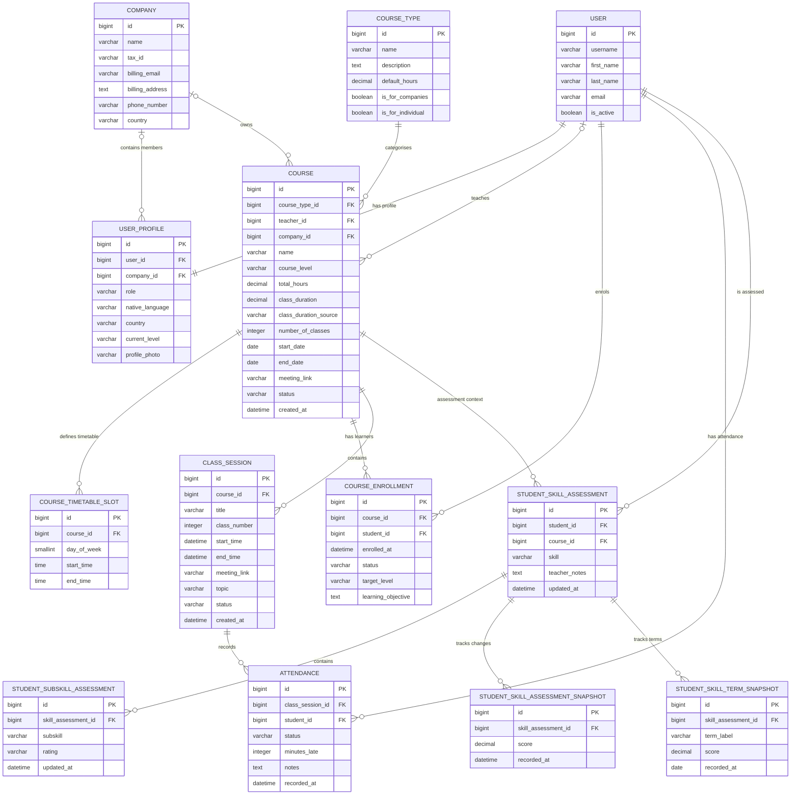

# English Grows

English Grows is a Django-based English language training platform designed for adult learners, teachers and corporate training environments.

The application combines course management, automated lesson scheduling, attendance tracking, learner assessment, progress monitoring and role-specific interfaces within a single relational data architecture.

---
## 📑 Table of Contents

- [Site Structure](#site-structure)
  - [User Roles](#user-roles)
  - [Home App](#home-app)
  - [Profiles App](#profiles-app)
    - [User Profile & Role Management](#user-profile--role-management)
    - [Learner / Employee Area](#learner--employee-area)
    - [Teacher Area](#teacher-area)
    - [Company Admin Area](#company-admin-area)
    - [Role-Based Access Control](#role-based-access-control)
  - [Courses App](#courses-app)
    - [Course Types](#course-types)
    - [Course Management](#course-management)
    - [Course Enrolment](#course-enrolment)
    - [Course Timetable](#course-timetable)
    - [Bank Holidays & Course Scheduling](#bank-holidays--course-scheduling)
    - [Class Session Generation](#class-session-generation)
    - [Class Session Lifecycle](#class-session-lifecycle)
    - [Rescheduling a Class Lesson](#rescheduling-a-class-lesson)
    - [Course Cancellation](#course-cancellation)
    - [Attendance](#attendance)
    - [Attendance Reporting](#attendance-reporting)
  - [Learning Assessment & Progress](#learning-assessment--progress)
    - [Language Skills Assessed](#language-skills-assessed)
    - [Student Skill Assessment](#student-skill-assessment)
    - [Student Subskill Assessment](#student-subskill-assessment)
    - [Detailed Assessment Snapshots](#detailed-assessment-snapshots)
    - [Term Assessment Snapshots](#term-assessment-snapshots)
  - [Calendar](#calendar)
  - [Django Admin](#django-admin)

- [Database Structure — Models](#database-structure--models)
  - [ERD — Entity Relationship Diagram](#erd--entity-relationship-diagram)
  - [Key Data-Integrity Rules](#key-data-integrity-rules)

- [Application Data Flow](#application-data-flow)

- [Architectural Design Choices](#architectural-design-choices)
  - [Authentication vs. Application Profile](#authentication-vs-application-profile)
  - [Course Configuration vs. Lesson Delivery](#course-configuration-vs-lesson-delivery)
  - [Enrolment vs. User Identity](#enrolment-vs-user-identity)
  - [Current Assessment vs. Assessment History](#current-assessment-vs-assessment-history)
  - [Shared Data, Role-Specific Presentation](#shared-data-role-specific-presentation)

- [Design Choices](#design-choices)
  - [Colour System](#colour-system)
    - [Colour Architecture](#colour-architecture)
    - [Core Brand / Interface Palette](#core-brand--interface-palette)
    - [Supporting Neutrals](#supporting-neutrals)
    - [CEFR Level Colours](#cefr-level-colours)
    - [Language Skills Colours](#language-skills-colours)
    - [Semantic / Status Colours](#semantic--status-colours)
    - [Colour Usage Principles](#colour-usage-principles)
  - [Responsive Design](#responsive-design)
  - [Data Visualisation](#data-visualisation)

---

# SITE STRUCTURE

---

EnglishGrows has been developed using **Django 6.0.5** with **Python 3.12**.

The application follows Django's Model-Template-View architecture and is currently organised into three principal custom Django apps:

- **Home**
- **Profiles**
- **Courses**

Each app contains the relevant combination of ***models***, ***views***, ***URLs***, ***templates***, ***forms***, static assets, and supporting logic required for its area of responsibility.

## USER ROLES

User authentication is handled using Django's authentication system together with **django-allauth**. Application-specific user information and role-based behaviour are managed through the `UserProfile` model.

The platform supports four principal user roles:

- **Teacher**
- **Individual learner**
- **Employee learner**
- **Company administrator**

Access to platform functionality and data is controlled according to the authenticated user's role and, where applicable, their associated company.

---

## HOME App

---

The `home` app is responsible primarily for the public-facing area of EnglishGrows and serves as the entry point to the platform.

### Main responsibilities

- Provides the public **landing page**
- Presents EnglishGrows' training services and platform
- Provides navigation into the authenticated learning platform
- Contains public-facing informational and marketing content
- Directs users towards the relevant learning or company-training journey
- Integrates the public website with the authenticated Django platform

The Home app is intentionally kept separate from the teaching-management functionality so that public marketing content and authenticated platform features remain logically independent.

---

## PROFILES App

---

The `profiles` app contains most of the user-facing platform experience.

It extends Django authentication with application-specific profile information and provides dedicated interfaces according to each user's role.

The app includes functionality for:

- **Learners**
- **Teachers**
- **Company administrators**

The same underlying course, attendance, and assessment data is presented differently depending on the authenticated user's permissions and responsibilities.

---

### USER PROFILE & ROLE MANAGEMENT

The platform uses Django's authenticated `User` as the primary user identity and associates it with a dedicated `UserProfile`.

The profile stores additional application information such as:

- User role
- Associated company *(where applicable)*
- Native language
- Country
- Current CEFR level
- Profile photograph
- User-specific platform information

This avoids maintaining separate authentication models for teachers, employees, individual learners, and company administrators.

Instead, role-based access is determined through the user's profile.

---

### LEARNER / EMPLOYEE AREA

---

Learners have access to a dedicated learning area containing information specific to their own active course enrolments.

Principal functionality includes:

- **Learner dashboard**
- **My Course**
- **My Attendance**
- **My Calendar**
- **My Learning Progress**
- **Skill overview**
- **Detailed skill progress graphs**
- **Teacher assessment feedback**
- **Course selector when enrolled in multiple active courses**
- **Upcoming-class information**
- **Attendance and absence history**
- **Course completion information**
- **Account settings**

Only enrolments that are currently active and belong to active courses are exposed through the learner-facing course selectors.

Learners therefore interact only with relevant current training data rather than historical, cancelled, or inactive courses.

---

### TEACHER AREA

---

Teachers have a dedicated operational dashboard for managing the courses and learners assigned to them.

Principal functionality includes:

- **Teacher dashboard**
- **Assigned courses**
- **Course details**
- **Class/session management**
- **Attendance management**
- **Individual attendance submission**
- **Group attendance submission**
- **Attendance history**
- **Student details**
- **Student skill assessment**
- **Subskill assessment**
- **Assessment notes**
- **Learner progress graphs**
- **Class rescheduling**
- **Calendar**
- **Course and learner progress reporting**

Teacher access is restricted to courses assigned to the authenticated teacher.

The teacher dashboard provides operational summaries for current teaching activity, including active courses, students, upcoming/completed sessions, and attendance information.

---

### COMPANY ADMIN AREA

---

Company administrators have a dedicated B2B management area allowing them to monitor the training delivered to employees belonging to their organisation.

Principal functionality includes:

- **Company dashboard**
- **Employee list**
- **Employee profile and learning progress**
- **Company course list**
- **Course details**
- **Course learner list**
- **Company class/session list**
- **Company-wide attendance reporting**
- **Employee attendance records**
- **Employee skill development**
- **Employee assessment information**
- **Employee progress graphs**
- **Company class calendar**

Company administrators can only access information associated with their own `Company`.

This prevents cross-company data exposure while allowing an authorised company representative to monitor employee participation, attendance, course progression, and learning outcomes.

---

### ROLE-BASED ACCESS CONTROL

---

Role-based views validate the authenticated user's `UserProfile` before exposing protected information.

The application therefore applies restrictions such as:

```text
Teacher
    ↓
Only courses assigned to that teacher

Company Administrator
    ↓
Only courses and employees belonging to that company

Learner / Employee
    ↓
Only that learner's own enrolments,
attendance and assessment data
```

---

## COURSES App

---

The `courses` app contains the core **course-delivery, scheduling, enrolment, and attendance architecture** of the EnglishGrows platform.

It manages the relationships between:

- **Course types**
- **Courses**
- **Teachers**
- **Learners**
- **Companies**
- **Course enrolments**
- **Recurring timetables**
- **Individual class sessions**
- **Attendance records**
- **Bank holidays**

The app also contains the business logic responsible for automatically generating lessons and attendance records and for maintaining the lifecycle of courses, enrolments, and class sessions.

The principal models managed by this area of the application include:

- `CourseType`
- `Course`
- `CourseTimetableSlot`
- `CourseEnrollment`
- `ClassSession`
- `Attendance`
- `BankHoliday`

---

### Course Types

---

`CourseType` defines the reusable categories of training that can be offered through the platform.

Rather than storing the same general course information repeatedly for every individual course, a `CourseType` acts as a reusable definition from which specific `Course` instances can be created.

A course type can contain information such as:

- **Name**
- **Description**
- **Default training hours**
- **Availability for individual learners**
- **Availability for company training**

A single `CourseType` can therefore be associated with multiple `Course` instances.

```text
CourseType
    │
    │ 1 : N
    ▼
  Course
```

This separates the **type of training being offered** from the **actual delivery of that training**.

---

### Course Management

---

The `Course` model represents a concrete training programme delivered to one or more learners.

Each course can be associated with:

- A `CourseType`
- An assigned teacher
- A company, when the course is corporate
- One or more learners through `CourseEnrollment`
- One or more recurring timetable slots
- Multiple generated class sessions

A course stores delivery-specific information including:

- **Course name**
- **Course type**
- **CEFR level**
- **Teacher**
- **Company**, where applicable
- **Total training hours**
- **Class duration**
- **Class-duration source**
- **Number of classes**
- **Start date**
- **End date**
- **Meeting link**
- **Course status**
- **Creation date**

Course statuses currently support:

```text
Confirmed
Active
Paused
Completed
Cancelled
```

When a course is manually changed to `Cancelled` through the Django Admin, the application also cancels its applicable future `ClassSession` records and the corresponding future `Attendance` records. This keeps the operational lesson schedule consistent with the manually cancelled parent course while preserving past lesson and attendance history.

Course duration and class-generation logic are linked. The application uses the total number of training hours and lesson duration to determine the number of lessons required.

A course is not considered completed simply because its scheduled end date has passed.

Instead, course completion depends on its actual lessons:

```text
Course
   │
   ▼
ClassSessions
   │
   ▼
All sessions completed?
   │
   ├── No  → Course remains open
   │
   └── Yes → Course becomes completed
```

When all `ClassSession` records belonging to a course have reached `completed` status, the course is automatically moved to `completed`.

Active learner enrolments belonging to that course are then also moved to `completed`.

This ensures that course status reflects **actual teaching delivery rather than dates alone**.

---

### Course Enrolment

Learners are connected to courses through the `CourseEnrollment` model.

This is an association model between `User` and `Course`:

```text
User
  │
  │ 1 : N
  ▼
CourseEnrollment
  ▲
  │ N : 1
  │
Course
```

Using a dedicated enrolment model rather than a simple many-to-many relationship allows EnglishGrows to store information that belongs specifically to the learner's participation in a particular course.

Each enrolment can contain:

- **Student**
- **Course**
- **Enrolment date**
- **Enrolment status**
- **Target CEFR level**
- **Learning objective**

Enrolment statuses include:

```text
Active
Paused
Completed
Cancelled
```

The database prevents the same learner from being enrolled more than once in the same course.

When a learner becomes actively enrolled in a course that already contains generated lessons, the application automatically creates any missing `Attendance` records for applicable unfinished sessions.

Completed lessons are deliberately excluded.

This prevents a learner who joins a course after it has started from receiving artificial attendance records for lessons that took place before their enrolment.

---

### Course Timetable

---

Recurring weekly scheduling is managed through `CourseTimetableSlot`.

A timetable slot defines the normal weekly teaching pattern of a course.

For example:

| Day | Time |
| :--- | :--- |
| Monday | 09:00 – 10:30 |
| Wednesday | 09:00 – 10:30 |

Each timetable slot stores:

- **Course**
- **Day of the week**
- **Start time**
- **End time**

The timetable represents a **scheduling rule**, not an individual lesson.

This distinction is important:

```text
CourseTimetableSlot
        │
        │ defines recurring schedule
        ▼
   ClassSession
        │
        │ represents
        ▼
   Actual lesson
```

The database prevents duplicate timetable slots with the same:

```text
course
+ day_of_week
+ start_time
```

Validation also ensures that the end time occurs after the start time.

The timetable architecture allows the system to generate individual class sessions automatically while keeping those generated lessons independent enough to be completed or rescheduled later.

Changes to a recurring timetable can be propagated to applicable **future scheduled sessions**. Historical lesson records are protected: completed sessions and lessons that have already been individually rescheduled are not rewritten simply because the recurring timetable changes.

```text
Recurring timetable rule
        │
        └── may update applicable future scheduled lessons

Completed / individually rescheduled lesson
        │
        └── remains unchanged
```

This preserves historical accuracy while allowing future scheduled lessons to remain synchronised with legitimate timetable changes.

---

### Bank Holidays & Course Scheduling

---

Course scheduling takes configured bank holidays into account when calculating the expected delivery calendar.

Rather than treating the course end date as a simple arithmetic calculation from the start date, the scheduling logic builds the expected teaching dates from the recurring timetable and excludes dates represented by applicable `BankHoliday` records.

Conceptually:

```text
Course start date
        +
Recurring timetable
        +
Required number of classes
        │
        ▼
Generate teaching dates
        │
        ├── Normal teaching day → Include
        │
        └── Bank holiday        → Skip
        │
        ▼
Final valid teaching date
        │
        ▼
Course end date
```

This ensures that the calculated course end date reflects the **actual expected teaching calendar** rather than assuming that every recurring timetable date will contain a lesson.

---

### Class Session Generation

---

`ClassSession` represents an **actual lesson instance** belonging to a course.

Once the required course configuration exists, EnglishGrows can automatically generate the lessons required to deliver the complete course.

The generation process uses:

- **Course start date**
- **Number of classes**
- **Class duration**
- **Recurring timetable slots**
- **Configured bank holidays**
- **Active learner enrolments**

Conceptually:

```text
Course configuration
        │
        ├── Start date
        ├── Number of classes
        ├── Class duration
        └── Timetable
                │
                ▼
        Generate sessions
                │
                ▼
        ClassSession 1
        ClassSession 2
        ClassSession 3
              ...
                │
                ▼
        Final ClassSession
```

The generation process is designed to be **idempotent** and guarded against accidental duplication.

Re-running the generation logic does not duplicate existing lessons. Where appropriate, it can create missing sessions or attendance records while preserving sessions and attendance records that already exist.

Each generated session receives a sequential `class_number`.

For example:

```text
Course
├── Lesson 1
├── Lesson 2
├── Lesson 3
├── Lesson 4
└── Lesson 5
```

The combination of:

```text
course + class_number
```

is unique.

Attendance records are also automatically generated for active learners when the class-session structure is created.

Class sessions can expose a session-specific meeting link, with the course meeting link used as a fallback where appropriate. This allows the calendar and role-specific lesson interfaces to use the same underlying course/session data when presenting **Join class** actions.

---

### Class Session Lifecycle

A `ClassSession` has its own lifecycle independently of the parent course.

The normal lesson flow is:

```text
scheduled
    │
    ▼
completed
```

A session can also reach `cancelled` when its parent `Course` is manually cancelled through the Django Admin and the session is still a future unresolved lesson.

Course-level cancellation is distinct from lesson rescheduling: a cancelled lesson is no longer expected to take place, whereas a `pending_reschedule` or `rescheduled` lesson remains part of the course delivery plan.

---

### Rescheduling a Class Lesson

When a lesson needs to be rescheduled, either the **learner/employee or the teacher** can mark the session as requiring rescheduling:

```text
                         ┌─────────────────────┐
                         │      scheduled      │
                         └──────────┬──────────┘
                                    │
                     Reschedule requested by
                         either party
                         ┌──────────┴──────────┐
                         │                     │
                         ▼                     ▼
                Learner / Employee          Teacher
                         │                     │
                         └──────────┬──────────┘
                                    ▼
                         pending_reschedule
                                    │
                          New date/time agreed
                                    │
                                    ▼
                       Teacher reschedules class
                                    │
                                    ▼
                              rescheduled
                                    │
                           Lesson takes place
                                    │
                                    ▼
                               completed
```

The `pending_reschedule` status therefore represents a **rescheduling request or an unresolved scheduling change**, rather than a cancelled lesson.

Both parties involved in the training can initiate this workflow:

- **Learners / employees** can flag a scheduled class when they need it to be rescheduled.
- **Teachers** can also mark a scheduled class as requiring rescheduling.
- Once a new date and time have been agreed, the **teacher updates the session schedule** and the class moves to `rescheduled`.
- After the rescheduled lesson has taken place and attendance has been recorded, the session can be moved to `completed`.

A fundamental design decision is that a rescheduled lesson remains the **same `ClassSession` database record** throughout this process.

For example:

```text
Lesson 8
12 Oct · 10:00
scheduled
       │
       │ Reschedule requested
       ▼
Lesson 8
pending_reschedule
       │
       │ New date/time agreed
       ▼
Lesson 8
15 Oct · 16:00
rescheduled
       │
       │ Lesson delivered
       ▼
Lesson 8
completed
```

The application does **not** delete the original lesson and create a replacement.

Instead, the existing `ClassSession` is updated with the newly agreed date and time while retaining its original identity.

This preserves:

- **Lesson identity**
- **Class number**
- **Course relationship**
- **Learner attendance relationships**
- **Course progression**
- **Historical consistency**
- **References from other areas of the application**

This architecture also ensures that rescheduling a lesson does not accidentally increase the number of classes belonging to the course.

The distinction between the statuses is therefore:

| Status | Meaning |
| :--- | :--- |
| `scheduled` | The lesson is scheduled normally |
| `pending_reschedule` | A learner/employee or teacher has indicated that the lesson needs to be rescheduled and a new date/time is still to be agreed |
| `rescheduled` | The teacher has updated the existing session with the newly agreed date/time |
| `completed` | The lesson has taken place and has been completed |
| `cancelled` | The lesson has been cancelled because its parent course was manually cancelled before that future session took place |

This workflow allows rescheduling to be initiated by either side while keeping responsibility for modifying the official course schedule with the teacher.

---

### Course Cancellation

Course cancellation is an **administrative course-level action** and is deliberately separate from the normal lesson-rescheduling workflow.

The current rule is:

> When a `Course` is manually changed to `Cancelled` in the Django Admin, applicable future class sessions are automatically moved to `cancelled`.

The Django Admin detects a genuine status change through `CourseAdmin.save_model()`:

```text
Course edited in Django Admin
        │
        ▼
Status field changed to Cancelled
        │
        ▼
Course saved
        │
        ▼
Course.cancel_future_sessions()
```

Only future sessions whose `start_time` has not yet passed are considered. Within that future set, the following session states are cancelled:

```text
scheduled
pending_reschedule
rescheduled
        │
        ▼
cancelled
```

Completed and historical lesson records are preserved.

Conceptually:

```text
Course manually set to Cancelled
            │
            ▼
Future unresolved ClassSessions
            │
            ├── scheduled
            ├── pending_reschedule
            └── rescheduled
            │
            ▼
        cancelled
            │
            ▼
Corresponding Attendance records
            │
            ▼
        cancelled
```

The cancellation operation updates the existing `ClassSession` records rather than deleting them or generating replacements. Their database identity, class number, course relationship, and historical references are therefore preserved.

The corresponding `Attendance` records attached to those future cancelled sessions are also moved to `cancelled`, preventing those lessons from remaining as future scheduled attendance obligations after the course itself has been terminated.

Past lesson and attendance history remains untouched. This preserves the training record that existed before cancellation while ensuring that no future lesson from the cancelled course continues to appear operationally scheduled.

This automatic propagation is currently tied specifically to a **manual course-status change in the Django Admin**. It is not a generic side effect of every possible `Course.save()` operation elsewhere in the application.

---

### Attendance

The `Attendance` model records the attendance status of an individual learner for an individual `ClassSession`.

The relationship can be represented as:

```text
ClassSession
     │
     │ 1 : N
     ▼
 Attendance
     ▲
     │ N : 1
     │
    User
```

Each attendance record can store:

- **Class session**
- **Student**
- **Attendance status**
- **Minutes late**
- **Teacher notes**
- **Recorded timestamp**

**Attendance statuses include:**

```text
Scheduled
Attended
Missed
Excused
Cancelled
Pending reschedule
```

**The database enforces a unique learner/session relationship:**

```text
class_session + student = unique
```

A learner therefore cannot accidentally have two contradictory attendance records for the same lesson.

For example, this is prevented:

```text
Lesson 4
├── Student A → Attended
└── Student A → Missed   ✗
```

Instead, the existing attendance record changes status.

Attendance records initially act as scheduled placeholders and are subsequently updated when the teacher records the actual attendance outcome.

When a course is manually cancelled through the Django Admin, attendance records belonging to the applicable future sessions cancelled by that course-level action are also moved to `cancelled`. Historical attendance records are preserved.

---

### Attendance Reporting

---

Attendance data provides a shared source of information for the three principal authenticated areas of the platform.

#### Learners

Learners can review their own:

- **Attendance history**
- **Attendance rate**
- **Attended classes**
- **Missed classes**
- **Excused absences**
- **Individual lesson records**

#### Teachers

Teachers can:

- **Submit attendance**
- **Review previously submitted attendance**
- **Manage attendance for group courses**
- **Identify classes requiring attendance submission**
- **Review attendance by learner**
- **Review attendance by course**

#### Company Administrators

Company administrators can review:

- **Employee attendance**
- **Attendance by course**
- **Attendance rates**
- **Missed lessons**
- **Excused absences**
- **Attendance submission status**
- **Company-wide training participation**

**Attendance percentages** are calculated from ***recorded attendance outcomes***.

Future `scheduled` records are not treated as attended or missed lessons and are therefore excluded from the denominator used to calculate the learner's actual attendance rate.

**This prevents future lessons from artificially reducing attendance statistics.**

---

## Learning Assessment & Progress

---

The assessment architecture tracks both a learner's **current language-skill performance** and the **historical development of those skills over time**.

Assessment is course-specific.

A learner can therefore have different skill assessments in different courses rather than having one global assessment attached permanently to their user account.

The assessment architecture consists of four principal models:

```text
StudentSkillAssessment
        │
        ├── StudentSubSkillAssessment
        │
        ├── StudentSkillAssessmentSnapshot
        │
        └── StudentSkillTermSnapshot
```

---

### Language Skills Assessed

---

Each skill is represented by a distinctive colour to make it easier to visually track across progress bars, assessment cards and historical graphs.

| Skill | Colour | Hex |
| :--- | :---: | :---: |
| 🎧 **Listening** | 🟪 Indigo Velvet | `#4E2496` |
| 🎙️ **Speaking** | 🟨 Sunflower Gold | `#F5BE58` |
| 📖 **Reading** | 🟧 Chocolate | `#E1752D` |
| ✍️ **Writing** | 🟦 Pacific Blue | `#0EA5B7` |

---

### Student Skill Assessment

---

`StudentSkillAssessment` represents the learner's **current assessment state for one main language skill within one course**.

Each assessment belongs to:

```text
Student
   +
Course
   +
Skill
```

For example:

```text
Student: Jane Doe
Course: Business English B2
Skill: Speaking
```

The database maintains only one current assessment for each:

```text
student + course + skill
```

combination.

The model also stores teacher notes associated with the skill.

Rather than storing a manually entered overall percentage, the current skill score is calculated dynamically from the learner's assessed subskills.

Conceptually:

```text
StudentSkillAssessment
        │
        ├── Subskill rating
        ├── Subskill rating
        ├── Subskill rating
        └── Subskill rating
                │
                ▼
          Average score
             0 – 10
```

Only subskills that have actually been rated participate in this calculation.

***Unrated subskills are excluded rather than being interpreted as zero performance.***

---

### Student Subskill Assessment

---

`StudentSubSkillAssessment` provides the detailed assessment information from which the overall skill assessment is calculated.

Each principal language skill is divided into several pedagogically relevant subskills, ***aligned with CEFR descriptors and informed by Cambridge English assessment criteria***.

The current subskill structure is:

```text
Speaking
├── Fluency
├── Grammar & vocabulary (Accuracy & range)
├── Pronunciation
└── Interaction

Reading
├── Scanning (Specific information)
├── Skimming (General Idea)
└── In detail (Deep Understanding)

Listening
├── For Gist (General Idea)
├── For Specific Information
└── In detail (Deep Understanding)

Writing
├── Structure & Organization
├── Cohesion & Coherence
├── Grammar & vocabulary (Accuracy & range)
└── Register (Style accuracy)
```

Each `StudentSubSkillAssessment` belongs to one `StudentSkillAssessment`.

The relationship can be represented as:

```text
StudentSkillAssessment
        │
        │ 1 : N
        ▼
StudentSubSkillAssessment
```

The combination:

```text
skill_assessment + subskill
```

is unique.

This prevents the same subskill from being duplicated within a learner's assessment for a particular skill.

Subskills use descriptive performance categories rather than user-facing percentages.

The current assessment categories are:

| Assessment Category | Internal Score |
| :--- | ---: |
| **Priority areas** | `4.0 / 10` |
| **Developing areas** | `5.0 / 10` |
| **Required standard achieved** | `6.0 / 10` |
| **Confident areas** | `7.5 / 10` |
| **Key strengths** | `10.0 / 10` |

The internal numerical representation is used to:

- Calculate the learner's current overall skill score
- Build skill-progress graphs
- Compare skill development over time
- Generate historical assessment snapshots
- Support term-based progress reporting

Only subskills that have actually been assessed are included when calculating the parent skill's average score.

For example:

```text
Speaking

Fluency                                  7.5
Grammar & vocabulary (Accuracy & range)  6.0
Pronunciation                             —
Interaction                              5.0
                                         ───
Average score                            6.2 / 10
```

The unrated `Pronunciation` subskill is excluded from the calculation rather than being treated as a zero score.

This allows the assessment score to represent only the areas that have genuinely been assessed.

---

#### Detailed Assessment Snapshots

`StudentSkillAssessmentSnapshot` records the **fine-grained historical evolution** of a learner's skill assessment.

A snapshot is created when a genuine subskill rating is added or changed.

The process can be represented as:

```text
Teacher assesses subskill
          │
          ▼
Subskill rating changes
          │
          ▼
Overall skill score recalculated
          │
          ▼
StudentSkillAssessmentSnapshot
          │
          ▼
Score + exact timestamp stored
```

This produces a chronological history of meaningful assessment changes.

For example:

```text
Speaking

10 Sep  → 5.8
24 Sep  → 6.1
08 Oct  → 6.5
22 Oct  → 6.8
12 Nov  → 7.2
```

Snapshots are not created merely because an assessment object is saved.

A new historical entry requires a genuine rating change.

Likewise, unrated placeholder subskills do not generate artificial historical data.

This prevents unnecessary duplicate records and produces a cleaner representation of actual learner development.

---

#### Term Assessment Snapshots

`StudentSkillTermSnapshot` provides a second and deliberately separate form of assessment history.

While `StudentSkillAssessmentSnapshot` captures detailed changes, a term snapshot represents a **formal progress checkpoint**.

Examples may include:

```text
Term 1
Term 2
Mid-course Review
End-of-course Review
```

Each term snapshot stores:

- **Skill assessment**
- **Term label**
- **Skill score**
- **Recorded date**

The combination:

```text
skill_assessment + term_label
```

is unique.

The two historical models therefore serve different purposes:

| Model | Purpose | Frequency |
| :--- | :--- | :--- |
| `StudentSkillAssessmentSnapshot` | Detailed progression history | Whenever a genuine assessment change occurs |
| `StudentSkillTermSnapshot` | Formal progress checkpoint | At defined assessment periods |

Conceptually:

```text
                  StudentSkillAssessment
                         │
              ┌──────────┴──────────┐
              │                     │
              ▼                     ▼
 Assessment Snapshot          Term Snapshot
              │                     │
              ▼                     ▼
 Detailed progression       Formal checkpoints
```

This separation allows EnglishGrows to provide both **fine-grained progress graphs** and **structured term-to-term reporting** without conflating the two types of historical data.

---

### Calendar

---

EnglishGrows includes a role-aware calendar built from the platform's existing `ClassSession` records.

A separate calendar-event model is not required.

Instead:

```text
Course
   │
   ▼
ClassSession
   │
   ▼
Calendar presentation
```

This ensures that the calendar reflects the same lesson information used throughout the rest of the application.

If a class is rescheduled, the corresponding calendar entry therefore reflects the updated `ClassSession` rather than requiring a second calendar record to be manually synchronised.

The calendar is available in the relevant interfaces for:

- **Teachers**
- **Learners / employees**
- **Company administrators**

Depending on device size, the interface supports views such as:

- **Day**
- **Week**
- **Month**
- **List**
- **Multi-month / year**

Calendar events provide contextual information and links appropriate to the authenticated user's role.

For example:

```text
Teacher
    ↓
Join class when a meeting link is available
or open Group details

Learner / Employee
    ↓
Join class when a meeting link is available
or open Group details

Company Administrator
    ↓
Open Group details
```

Role-specific actions are deliberately different even though every calendar view is generated from the same underlying `ClassSession` data.

Company administrators are given monitoring and course-detail access rather than teaching controls, while teachers and learners can access the class meeting when an appropriate meeting link is available.

Past lessons do not expose the **Join class** action, preventing obsolete meeting links from being presented as active lesson actions.

The calendar therefore acts as a visual representation of the underlying lesson-delivery architecture rather than as an independent scheduling system.

---

### Django Admin

---

The built-in Django Admin interface provides authorised administrative access to the application's core database records.

It is used as an operational and development-management interface rather than as the primary user-facing interface.

Administrators can manage data including:

- **Users and profiles**
- **Companies**
- **Course types**
- **Courses**
- **Course enrolments**
- **Timetable slots**
- **Class sessions**
- **Attendance**
- **Bank holidays**
- **Skill assessments**
- **Subskill assessments**
- **Assessment snapshots**

Where appropriate, related objects are presented through Django Admin inlines.

For example, course administration can expose related:

```text
Course
├── Enrolments
├── Timetable Slots
└── Class Sessions
```

Generated class sessions are primarily intended to be **managed and updated rather than manually recreated**, helping protect the integrity of the automatically generated course structure.

The Django Admin also owns the current manual course-cancellation workflow. When an administrator changes a `Course` status to `Cancelled` in the Admin interface, `CourseAdmin` detects that explicit status change and invokes the course cancellation helper. Applicable future `scheduled`, `pending_reschedule`, and `rescheduled` sessions are changed to `cancelled`, together with their corresponding attendance records, while completed and historical lesson data remains untouched.

The Django Admin therefore complements the role-specific application interfaces while providing authorised access to lower-level database administration.

---

## DATABASE STRUCTURE — MODELS

---

EnglishGrows uses a **relational database architecture** managed through Django's ORM.

**PostgreSQL** is used as the relational database in both development and production environments.

The database architecture is divided into four principal domains:

```text
IDENTITY & ORGANISATION
├── Django User
├── UserProfile
└── Company

COURSE MANAGEMENT
├── CourseType
├── Course
├── CourseTimetableSlot
├── CourseEnrollment
└── BankHoliday

LESSON DELIVERY & ATTENDANCE
├── ClassSession
└── Attendance

LEARNING & ASSESSMENT
├── StudentSkillAssessment
├── StudentSubSkillAssessment
├── StudentSkillAssessmentSnapshot
└── StudentSkillTermSnapshot
```

This separation prevents unrelated responsibilities from being concentrated in a single model and allows the different areas of the application to evolve independently.

The architecture distinguishes between:

- **Authentication data**
- **Organisation data**
- **Course configuration**
- **Learner enrolment**
- **Recurring scheduling rules**
- **Actual lesson instances**
- **Attendance outcomes**
- **Current learner assessment**
- **Detailed assessment history**
- **Formal term-based assessment history**

---

### ERD — Entity Relationship Diagram

The following Entity Relationship Diagram represents the principal database relationships within EnglishGrows:



The ERD highlights several important architectural decisions.

`CourseEnrollment` acts as an association entity between users and courses rather than using a simple direct many-to-many relationship.

Likewise, `Attendance` acts as the relationship between a learner and a specific lesson.

Assessment history is deliberately separated from current assessment state through the two snapshot models:

- `StudentSkillAssessmentSnapshot` — detailed change-by-change history
- `StudentSkillTermSnapshot` — formal periodic assessment history

---

### Key Data-Integrity Rules

EnglishGrows implements database constraints and application-level business rules to protect the consistency of teaching and learner data.

#### User & Organisation

- Each authenticated user has one `UserProfile`.
- A profile may optionally be associated with a `Company`.
- A company may contain multiple employees and company administrators.
- Corporate courses can be associated with a company.
- Individual courses do not require a company relationship.

#### Course & Enrolment

- A teacher may teach multiple courses.
- A learner may participate in multiple courses.
- The learner-course relationship is represented through `CourseEnrollment`.
- A learner cannot have duplicate enrolments for the same course.
- Enrolment status is maintained independently from course status.
- Completing a course automatically completes its active enrolments.

#### Timetable & Sessions

- A course may contain multiple timetable slots.
- Duplicate timetable slots for the same course, day, and start time are prevented.
- Timetable end time must occur after start time.
- `CourseTimetableSlot` represents a recurring scheduling rule.
- `ClassSession` represents an actual lesson.
- Each class number is unique within its course.
- Class-session generation is protected against accidental duplication.
- Applicable future scheduled sessions can be synchronised when the recurring timetable changes.
- Completed and individually rescheduled sessions are protected from routine timetable synchronisation.
- Configured bank holidays are excluded from generated teaching dates.
- A rescheduled lesson remains the same `ClassSession`.
- A manually cancelled course causes applicable future `scheduled`, `pending_reschedule`, and `rescheduled` sessions to move to `cancelled`.
- Past and completed lesson history is preserved when a course is cancelled.
- A course only becomes completed when all of its sessions are completed.

#### Attendance

- Each attendance record belongs to one learner and one class session.
- A learner can have only one attendance record per class session.
- Attendance records are automatically created for active learners when applicable.
- Learners joining an existing course receive attendance records only for unfinished sessions.
- Attendance records belonging to future sessions cancelled through the course-cancellation workflow are also moved to `cancelled`.
- Future `scheduled` attendance does not affect recorded attendance-rate calculations.

#### Assessment

- Skill assessments are course-specific.
- One current `StudentSkillAssessment` exists for each student/course/skill combination.
- Each subskill appears only once within its parent skill assessment.
- Unrated subskills are excluded from the calculated skill average.
- Assessment uses descriptive pedagogical categories with internal **0–10 scores**, rather than user-facing percentages.
- Genuine subskill rating changes create `StudentSkillAssessmentSnapshot` records.
- Saving an unchanged rating does not create an artificial snapshot.
- `StudentSkillAssessmentSnapshot` stores detailed chronological assessment history.
- `StudentSkillTermSnapshot` stores formal periodic assessment checkpoints.
- A term label can occur only once for each skill assessment.

Together, these constraints help ensure that the database remains a consistent **single source of truth** for course delivery, attendance, learner assessment, and historical progress.

---

## Application Data Flow

---

The application follows a **role-aware data flow** in which authenticated users interact with the same underlying business data through interfaces adapted to their permissions and responsibilities.

At a high level, application data moves through the following structure:

```text
User Authentication
        │
        ▼
UserProfile
        │
        ├── Teacher
        ├── Individual Student
        ├── Employee
        └── Company Administrator
        │
        ▼
Role-specific Dashboard / Navigation
        │
        ▼
Courses
        │
        ├── Course Configuration
        │       ├── Course Type
        │       ├── Level
        │       ├── Timetable
        │       ├── Teacher
        │       ├── Company
        │       └── Class Duration
        │
        ├── Enrolments
        │       └── Students / Employees
        │
        └── Class Sessions
                │
                ├── Attendance
                ├── Rescheduling
                ├── Lesson Information
                └── Course Progress
                        │
                        ├── Skill Assessment
                        ├── Subskill Assessment
                        ├── Teacher Notes
                        └── Assessment Snapshots
```

The Django views act as the intermediary between the database and the user interface. Each view retrieves only the information relevant to the authenticated user's role and, where appropriate, further restricts access by teacher, company, course or student.

For example:

- A **teacher** may access only courses assigned to them and the students enrolled in those courses.
- A **company administrator** may access employees and courses belonging to their own company.
- A **student or employee** may access only their own enrolments, attendance records, assessments and course information.

This approach allows the platform to maintain a **single source of truth at database level** while presenting different views of that information depending on the user's role.

Course activity also drives several dependent data flows automatically. When class sessions are generated, attendance records are created for enrolled students. When new students join a course already in progress, attendance records are generated only for the relevant unfinished sessions.

Attendance, session completion and assessment data then contribute to the progress information displayed throughout the platform.

---

## Architectural Design Choices

---

The architecture of **English Grows** has been designed around the separation of identity, learning configuration, lesson delivery and assessment history.

Several areas that could initially appear suitable for a single model have deliberately been separated in order to reduce duplication, improve maintainability and preserve historical data.

### Authentication vs. Application Profile

Django's built-in `User` model is responsible for authentication-related information such as:

- username;
- email;
- password;
- login state;
- authentication permissions.

Application-specific information is stored separately in `UserProfile`.

The profile contains information such as:

- application role;
- company;
- current English level;
- native language;
- country;
- profile photograph;
- active status.

This avoids modifying Django's authentication model unnecessarily and keeps authentication concerns separate from business-specific user information.

The relationship is therefore:

```text
User
 │
 └── UserProfile
        ├── Role
        ├── Company
        ├── Current level
        ├── Native language
        ├── Country
        └── Profile information
```

This structure also allows the same authentication system to support several user roles while providing each role with different application functionality.

---

### Course Configuration vs. Lesson Delivery

---

A `Course` represents the overall teaching programme rather than an individual lesson.

It stores long-term configuration such as:

- course name;
- course type;
- level;
- teacher;
- company;
- total contracted hours;
- class duration;
- number of classes;
- start and end dates;
- meeting link;
- course status.

Recurring timetable information is stored independently through `CourseTimetableSlot`.

```text
Course
 │
 ├── CourseTimetableSlot
 │      ├── Day of week
 │      ├── Start time
 │      └── End time
 │
 └── ClassSession
        ├── Date and time
        ├── Class number
        ├── Topic
        ├── Status
        └── Meeting link
```

`ClassSession`, by contrast, represents one concrete occurrence of a lesson.

This separation is important because individual classes may later:

- be completed;
- be rescheduled;
- become pending reschedule;
- be cancelled when the parent course is manually cancelled;
- receive a different date or time;
- contain specific lesson information;
- generate attendance records.

Changing one class therefore does not require changing the general course configuration.

---

### Enrolment vs. User Identity

A student's identity and their participation in a course are intentionally stored separately.

`User` and `UserProfile` describe **who the person is**, while `CourseEnrollment` describes **their relationship with a particular course**.

An enrolment can therefore contain course-specific information such as:

- enrolment status;
- enrolment date;
- target level;
- learning objective;
- attendance statistics;
- course participation.

The relationship can be represented as:

```text
Student
   │
   ├── CourseEnrollment ─── Course A
   │
   ├── CourseEnrollment ─── Course B
   │
   └── CourseEnrollment ─── Course C
```

This is particularly important because the same student may participate in more than one course over time.

Completed or previous enrolments can remain in the database without altering the student's account or creating duplicate user records.

The same architecture also supports employees who may undertake multiple company-sponsored courses during their time with an organisation.

---

### Current Assessment vs. Assessment History

---

The assessment system deliberately separates a student's **current assessment state** from their **historical progress data**.

`StudentSkillAssessment` represents the current teacher assessment for one principal skill:

- Speaking;
- Listening;
- Reading;
- Writing.

Each skill contains several pedagogically relevant subskills stored through `StudentSubSkillAssessment`.

```text
StudentSkillAssessment
        │
        ├── Skill
        ├── Current aggregated score
        ├── Teacher notes
        │
        └── StudentSubSkillAssessment
                ├── Subskill
                └── Rating
```

Subskills are evaluated using the current qualitative assessment categories:

- **Priority areas**
- **Developing areas**
- **Required standard achieved**
- **Confident areas**
- **Key strengths**

The overall skill score is derived from the student's rated subskills and presented on a `/10` scale.

Historical progress is stored independently through assessment snapshots.

```text
Current Assessment
        │
        ├── Detailed Assessment Snapshots
        │
        └── Term Assessment Snapshots
```

`StudentSkillAssessmentSnapshot` records meaningful changes to the assessment over time, while `StudentSkillTermSnapshot` records formal assessment checkpoints.

This distinction is essential because updating the student's current assessment should not destroy the data required to visualise their development over time.

The resulting historical records are used by progress interfaces shown to teachers, students and company administrators.

---

### Shared Data, Role-Specific Presentation

---

The platform does not create separate course, attendance or assessment data for each type of user.

Instead, the same underlying records are reused across role-specific views.

For example:

```text
                    Attendance
                        │
          ┌─────────────┼─────────────┐
          │             │             │
          ▼             ▼             ▼
       Teacher       Student      Company Admin
        View           View            View
```

The difference lies in:

- what information each user is authorised to access;
- what actions they may perform;
- how the information is presented.

A teacher may record or modify an assessment, while a student can only view their own assessment.

Similarly, a company administrator can review employee progress but does not receive the same teaching controls as the teacher.

This architecture reduces duplicated business logic and ensures that different areas of the platform remain synchronised because they are reading from the same underlying records.

---

# Design Choices

---

The user interface has been designed for a **boutique corporate training environment**, rather than as a generic educational platform.

The visual system therefore prioritises:

- clarity;
- restrained use of colour;
- professional hierarchy;
- easily scannable business information;
- consistent interaction patterns;
- responsive behaviour across devices.

Role-specific dashboards and navigation expose the information most relevant to each user while secondary information remains available through dedicated pages.

---

## Colour System

---

The **English Grows** interface uses a deliberately restrained aqua–teal–navy brand palette, supported by a dedicated cool-neutral system.

The colour system has been refined to reinforce the platform's **boutique corporate identity** while maintaining clear visual hierarchy, consistency and readability across dashboards, navigation, cards, lists, tables, forms, assessment interfaces and data visualisations.

The current palette intentionally reduces highly saturated accent colours in favour of a calmer progression from very light contextual surfaces through aqua and teal to deep navy.

Colour is used deliberately to communicate:

- brand identity;
- visual hierarchy;
- interaction and emphasis;
- interface depth and surface differentiation;
- application and operational status;
- assessment categories;
- CEFR proficiency classification;
- data visualisation.

Colour is therefore treated as a **functional component of the design system**, rather than as decoration alone.

---

### Colour Architecture

---

The overall colour architecture is organised into **four functional layers**:

1. **Brand / Interface Colours** — establish product identity, interface hierarchy, interaction and supporting surfaces.
2. **Assessment / Data Colours** — provide persistent visual identification of the four principal language skills.
3. **CEFR Level Colours** — provide persistent visual identification of language proficiency classifications from A1 to C2.
4. **Semantic / Status Colours** — communicate operational states and outcomes across learners, enrolments, courses and attendance.

These layers are **functionally distinct rather than mutually exclusive palettes**. Selected brand colours are intentionally reused for semantic states where their visual character supports the intended meaning. This avoids unnecessary expansion of the overall palette while maintaining consistent semantic associations.

The Brand / Interface layer itself contains both the principal chromatic palette and a supporting neutral system:

```text
COLOUR SYSTEM
│
├── BRAND / INTERFACE COLOURS
│   │
│   ├── CORE BRAND
│   │   ├── #EDF9F7  Azure Mist
│   │   ├── #E4FFF4  Frozen Water
│   │   ├── #B5F9DE  Aquamarine
│   │   ├── #88E7DC  Pearl Aqua
│   │   ├── #16AFB5  Tropical Teal
│   │   ├── #006B7D  Stormy Teal
│   │   └── #002D5A  Oxford Navy
│   │
│   └── SUPPORTING NEUTRALS
│       ├── #F5F5F5  White Smoke
│       ├── #CFDCDC  Grey Mist
│       ├── #7A949B  Cool Steel
│       └── #4F6870  Blue Slate
│
├── ASSESSMENT / DATA COLOURS
│   │
│   ├── #4E2496  Listening — Indigo Velvet
│   ├── #F5BE58  Speaking — Sunflower Gold
│   ├── #E1752D  Reading — Chocolate
│   └── #0EA5B7  Writing — Pacific Blue
│
├── CEFR LEVEL COLOURS
│   │
│   ├── #6EFF7F  A1 — Mint Glow
│   ├── #FF954F  A2 — Tangerine Dream
│   ├── #436EFD  B1 — Electric Sapphire
│   ├── #5C008A  B2 — Indigo
│   ├── #DBDF2B  C1 — Lemon Lime
│   └── #902331  C2 — Burgundy
│
└── SEMANTIC / STATUS COLOURS
    │
    ├── ENROLMENT STATUS
    │   ├── #4DFFB5  Active
    │   ├── #006B7D  Confirmed
    │   ├── #FFB000  Paused
    │   ├── #EF4444  Cancelled
    │   ├── #7A949B  Completed
    │   └── #7A949B  Inactive
    │
    ├── COURSE STATUS
    │   ├── #5FF0DF  Active
    │   ├── #006B7D  Confirmed
    │   ├── #FFB000  Paused
    │   ├── #EF4444  Cancelled
    │   └── #7A949B  Completed
    │
    ├── ATTENDANCE STATUS
    │   ├── #4DFFB5  Attended
    │   ├── #FF5A5A  Missed
    │   ├── #666666  Excused
    │   └── #FFB000  Pending
    │
    └── ATTENDANCE SUBMISSION STATUS
        ├── #C47D00  Awaiting
        └── #008F78  Complete
```

The four layers are **conceptually independent but intentionally interconnected**:

- the **Brand / Interface palette** establishes the identity, hierarchy, surfaces and structural language of English Grows;
- the **Assessment / Data palette** provides persistent visual identification of pedagogical skill information;
- the **CEFR Level palette** provides persistent visual identification of language proficiency classifications;
- the **Semantic / Status palette** communicates operational state, reusing selected brand colours where appropriate and introducing dedicated semantic colours where necessary.

A colour can therefore remain valid as a semantic token without belonging to the current core brand palette.

Colour is always accompanied by text, labels, icons or other interface context rather than being used as the sole means of communicating meaning.

---

### Core Brand / Interface Palette

---

The current **English Grows** core brand/interface palette consists of seven chromatic colours:


| Colour | Preview | Hex | Primary UI Role |
| :--- | :---: | :---: | :--- |
| **Azure Mist** |  | `#EDF9F7` | Very light aqua-tinted background and low-intensity surface differentiation |
| **Frozen Water** |  | `#E4FFF4` | Soft contextual identity surface, established particularly for course-header backgrounds |
| **Aquamarine** |  | `#B5F9DE` | Reserved supporting brand colour that introduces a subtle mint variation without requiring a permanent high-frequency UI role |
| **Pearl Aqua** |  | `#88E7DC` | Borders, separators, outlines and restrained structural definition |
| **Tropical Teal** |  | `#16AFB5` | Completion rings, progress/data emphasis and controlled mid-tone brand accent |
| **Stormy Teal** |  | `#006B7D` | Strong structural UI, meta cards, prominent controls, confirmed states and secondary brand anchor |
| **Oxford Navy** |  | `#002D5A` | Primary corporate anchor, navigation, major typography and highest-emphasis interface elements |

The palette follows a deliberately controlled progression:

```text
Azure Mist
#EDF9F7
    │
    ▼
Frozen Water
#E4FFF4
    │
    ▼
Aquamarine
#B5F9DE
    │
    ▼
Pearl Aqua
#88E7DC
    │
    ▼
Tropical Teal
#16AFB5
    │
    ▼
Stormy Teal
#006B7D
    │
    ▼
Oxford Navy
#002D5A
```

This progression is intentionally **not a mathematically uniform monochromatic scale**.

**Aquamarine `#B5F9DE`** introduces a subtle mint shift into the lighter half of the palette. This gives the brand additional personality and prevents the system from becoming a purely linear aqua-to-navy progression. It remains a reserved supporting brand colour rather than being forced into a frequently repeated interface role.

The other colours have increasingly specific functional responsibilities:

- **Azure Mist `#EDF9F7`** provides very light brand-tinted backgrounds and subtle surface differentiation.
- **Frozen Water `#E4FFF4`** provides a contextual identity surface and is established particularly for **course-header backgrounds**, where it distinguishes the current course without making the header visually dominant.
- **Pearl Aqua `#88E7DC`** is used predominantly for **borders, separators and structural outlines**. Its softer chromatic weight provides definition without making cards, lists or tables feel heavily boxed.
- **Tropical Teal `#16AFB5`** provides the principal controlled data/progress accent and works particularly well for **completion rings and quantitative emphasis**.
- **Stormy Teal `#006B7D`** provides stronger structural emphasis, including meta-card surfaces and prominent interface elements.
- **Oxford Navy `#002D5A`** provides the strongest corporate anchor for navigation, typography and high-authority interface areas.

The revised palette deliberately avoids unnecessary bright cyan/aqua accents and keeps the core Brand / Interface palette focused on colours with clearly defined structural, contextual or brand roles.

The result is a calmer and more disciplined brand system while retaining enough tonal and hue variation to avoid a flat or overly mechanical progression.

---

### Supporting Neutrals

---

The core brand palette is supported by a restrained four-colour neutral system used primarily for **content surfaces, data presentation, secondary text and structural hierarchy**.

These neutrals are deliberately cool so that they remain visually compatible with the wider aqua–teal–navy brand system.


| Colour | Preview | Hex | Primary UI Role |
| :--- | :---: | :---: | :--- |
| **White Smoke** |  | `#F5F5F5` | Principal neutral surface for main cards, lists, tables and data-heavy content areas |
| **Grey Mist** |  | `#CFDCDC` | Very light structural neutral for subtle separators, borders and low-intensity surface differentiation |
| **Cool Steel** |  | `#7A949B` | Secondary and data text, low-emphasis information, inactive and completed states |
| **Blue Slate** |  | `#4F6870` | Darker secondary/data text, subdued headings and information requiring greater emphasis than Cool Steel |

The neutral hierarchy can be represented as:

```text
WHITE SMOKE
#F5F5F5
    │
    └── Main cards / lists / tables / data surfaces

GREY MIST
#CFDCDC
    │
    └── Subtle structural separation / borders

COOL STEEL
#7A949B
    │
    └── Secondary / low-emphasis data text

BLUE SLATE
#4F6870
    │
    └── Darker secondary text / stronger subdued information
```

**White Smoke `#F5F5F5`** is intentionally used extensively across main cards, lists, tables and information panels. It provides a calm neutral base that allows stronger brand, CEFR, assessment and semantic colours to retain meaning rather than competing across the entire interface.

**Grey Mist `#CFDCDC`** provides very subtle structure where a chromatic Pearl Aqua border would be unnecessarily prominent.

**Cool Steel `#7A949B`** and **Blue Slate `#4F6870`** establish a controlled hierarchy for secondary and data typography. Cool Steel handles lower-emphasis information, while Blue Slate provides a darker level for supporting information that requires greater legibility or prominence.

This neutral system is therefore an essential part of the restrained boutique-corporate visual language rather than an incidental secondary palette.

---

### CEFR Level Colours

---

The application uses a dedicated colour system to provide immediate visual identification of a learner's **CEFR proficiency level**.

The official **Common European Framework of Reference for Languages (CEFR)** defines six principal proficiency levels from **A1 to C2** through language-proficiency descriptors. It does **not prescribe a mandatory or universal colour scheme** for those levels.

English Grows therefore uses its own consistent CEFR colour mapping as part of the application's design system.


| CEFR Level | Preview | Colour | Hex |
| :---: | :---: | :--- | :---: |
| **A1** |  | Mint Glow | `#6EFF7F` |
| **A2** |  | Tangerine Dream | `#FF954F` |
| **B1** |  | Electric Sapphire | `#436EFD` |
| **B2** |  | Indigo | `#5C008A` |
| **C1** |  | Lemon Lime | `#DBDF2B` |
| **C2** |  | Burgundy | `#902331` |

#### CEFR Colour Rationale

The CEFR palette is intentionally **more varied than the core English Grows brand palette**.

Unlike brand colours, which establish interface identity and hierarchy, CEFR colours need to make adjacent proficiency levels immediately distinguishable when they appear in course lists, learner profiles, filters, badges and other data-dense interfaces.

The six colours therefore function primarily as **categorical identifiers**:

```text
CEFR LEVEL COLOURS
│
├── BASIC USER
│   ├── A1  #6EFF7F  Mint Glow
│   └── A2  #FF954F  Tangerine Dream
│
├── INDEPENDENT USER
│   ├── B1  #436EFD  Electric Sapphire
│   └── B2  #5C008A  Indigo
│
└── PROFICIENT USER
    ├── C1  #DBDF2B  Lemon Lime
    └── C2  #902331  Burgundy
```

This grouping reflects the three broad CEFR proficiency bands:

- **A1–A2 — Basic User**
- **B1–B2 — Independent User**
- **C1–C2 — Proficient User**

The individual colours are deliberately distinct in hue so that the level can be recognised quickly without requiring progressively darker or lighter versions of a single colour.

The CEFR colours are therefore used as **persistent level identifiers**, rather than as indicators of success, warning or status.

As with the rest of the English Grows colour system, colour reinforces rather than replaces textual information. CEFR colours are always accompanied by their corresponding **A1, A2, B1, B2, C1 or C2 label**, ensuring that proficiency level remains explicit regardless of colour perception.

---

### Language Skills Colours

---

The language assessment system uses a dedicated colour set for the four principal language skills.

These colours are intentionally separate from the core brand palette because they carry a **persistent pedagogical meaning**, rather than a general interface function.


| Skill | Preview | Colour | Hex |
| :--- | :---: | :--- | :---: |
| 🎧 **Listening** |  | Indigo Velvet | `#4E2496` |
| 🎙️ **Speaking** |  | Sunflower Gold | `#F5BE58` |
| 📖 **Reading** |  | Chocolate | `#E1752D` |
| ✍️ **Writing** |  | Pacific Blue | `#0EA5B7` |

These colours remain consistent across:

- skill assessment cards;
- subskill assessment interfaces;
- skill progress graphs;
- chart datasets;
- legends;
- skill-specific visual indicators.

Maintaining a permanent colour assignment for each skill improves visual recognition across different areas of the application and prevents assessment data from becoming visually dependent on the surrounding interface.

These colours function as **categorical identifiers**. They identify the pedagogical skill represented by the data rather than indicating whether the learner's performance is positive or negative.

---

### Semantic / Status Colours

---

Semantic colours communicate the **state or operational meaning of application data**, rather than the identity of an interface component.

The semantic system follows a consistent rationale:

| Colour Family | Semantic Meaning |
| :--- | :--- |
| **Green** | Positive, valid or successfully fulfilled state |
| **Teal / Turquoise** | Operational, confirmed or active state without warning or negative meaning |
| **Amber** | Pending, interrupted or attention-requiring state |
| **Red** | Negative outcome or termination |
| **Grey / Blue-grey** | Excused, inactive, completed, historical or de-emphasised state |

Some semantic colours intentionally reuse colours from the core brand palette. This reduces unnecessary palette expansion while allowing colours to perform clearly defined roles within specific application contexts.

#### Enrolment Status

Enrolment-status colours communicate the learner's current relationship with a course.

| Status | Preview | Hex | Rationale |
| :--- | :---: | :---: | :--- |
| **Active** |  | `#4DFFB5` | Bright green communicates current active participation |
| **Confirmed** |  | `#006B7D` | Stormy Teal communicates an established / confirmed enrolment state |
| **Paused** |  | `#FFB000` | Amber communicates temporary interruption |
| **Cancelled** |  | `#EF4444` | Red communicates termination |
| **Completed** |  | `#7A949B` | Cool Steel communicates a closed, historical enrolment state |
| **Inactive** |  | `#7A949B` | Cool Steel communicates a de-emphasised inactive or unenrolled state |

The enrolment palette therefore follows the current status-dot variables:

```text
ACTIVE
#4DFFB5

CONFIRMED
#006B7D

PAUSED
#FFB000

CANCELLED
#EF4444

COMPLETED
#7A949B

INACTIVE
#7A949B
```

#### Course Status

Course-status colours communicate both the normal lifecycle of a course and exceptional states requiring attention.

| Status | Preview | Hex | Rationale |
| :--- | :---: | :---: | :--- |
| **Confirmed** |  | `#006B7D` | Stormy Teal represents an established course that has been confirmed but is not yet active |
| **Active** |  | `#5FF0DF` | Turquoise gives currently running courses greater visual immediacy |
| **Paused** |  | `#FFB000` | Amber communicates temporary interruption and a state requiring attention |
| **Cancelled** |  | `#EF4444` | Red communicates termination and a negative operational state |
| **Completed** |  | `#7A949B` | Cool Steel communicates a closed, historical state without implying an error |

The normal course lifecycle follows a deliberate visual progression:

```text
CONFIRMED              ACTIVE                 COMPLETED
#006B7D                #5FF0DF               #7A949B
Stormy Teal        →   Turquoise         →   Cool Steel
Established            Current                Historical
```

**Paused** and **Cancelled** sit outside this normal progression because they represent exceptional course states:

```text
PAUSED                 CANCELLED
#FFB000                #EF4444
Amber                  Red
Attention              Negative / Terminated
```

#### Attendance Status

Attendance colours distinguish between recorded attendance outcomes and classes that still require an attendance outcome.

| Status | Preview | Hex | Rationale |
| :--- | :---: | :---: | :--- |
| **Attended** |  | `#4DFFB5` | Bright green communicates a positive attendance outcome |
| **Missed** |  | `#FF5A5A` | Red communicates a negative attendance outcome |
| **Excused** |  | `#666666` | Neutral grey communicates an acknowledged absence without presenting it as either a positive outcome or warning state |
| **Pending** |  | `#FFB000` | Amber communicates that an attendance outcome still requires attention |

The attendance palette therefore distinguishes between outcome and workflow state:

```text
ATTENDED              EXCUSED               MISSED
#4DFFB5               #666666               #FF5A5A
Positive              Neutral               Negative

                         PENDING
                         #FFB000
                         Attention required
```

#### Attendance Submission Status

Attendance submission has a separate semantic distinction from the attendance outcome of an individual learner.

| Status | Preview | Hex | Rationale |
| :--- | :---: | :---: | :--- |
| **Awaiting** |  | `#C47D00` | Dark amber indicates that attendance submission remains outstanding |
| **Complete** |  | `#008F78` | Deep green-teal indicates that the attendance-submission workflow has been completed |

This distinction prevents **lesson-level attendance submission state** from being conflated with the **attendance outcome of an individual learner**.

---

### Colour Usage Principles

---

Across the application, colour follows several consistent principles:

- **Colour reinforces meaning rather than replacing it.** Statuses and assessment information are always accompanied by text, labels, icons or other contextual information.
- **The brand palette remains deliberately restrained.** Oxford Navy, Stormy Teal and Tropical Teal provide the principal structural progression, while the lighter aqua/mint colours are used selectively for surfaces and definition.
- **Oxford Navy anchors the corporate identity.** `#002D5A` provides the strongest visual authority for navigation, major typography and high-emphasis elements.
- **Stormy Teal provides strong structural emphasis.** `#006B7D` supports meta cards, prominent controls, structural bars and other high-visibility secondary brand elements.
- **Tropical Teal carries progress and quantitative emphasis.** `#16AFB5` is particularly suited to completion rings, progress indicators and controlled data emphasis.
- **Pearl Aqua provides soft structure.** `#88E7DC` is used predominantly for borders, separators and outlines, maintaining visible structure without producing a heavy or overly boxed interface.
- **Frozen Water provides contextual identity surfaces.** `#E4FFF4` is established particularly for course-header backgrounds, where it differentiates context while remaining quiet enough for the content to stay dominant.
- **Aquamarine remains intentionally selective.** `#B5F9DE` remains part of the brand palette because its subtle mint shift adds personality and avoids a mechanically linear aqua-to-navy scale, but it does not need to be forced into a permanent high-frequency UI role.
- **Azure Mist provides very light brand-tinted separation.** `#EDF9F7` can support extremely subtle backgrounds and low-intensity surface differentiation.
- **White Smoke is the principal neutral content surface.** `#F5F5F5` supports main cards, lists, tables and data-heavy information areas, helping the application remain restrained rather than overly chromatic.
- **Grey Mist provides neutral structural separation.** `#CFDCDC` is appropriate for very subtle borders and dividers where Pearl Aqua would introduce more colour than required.
- **Cool Steel and Blue Slate control secondary/data typography.** `#7A949B` provides lower-emphasis data and supporting text, while `#4F6870` provides a darker secondary-text level.
- **Hover states remain deliberately subtle.** Dense course, class, learner and employee lists use very low-intensity hover treatments so that interaction feedback does not compete with CEFR badges, statuses, data or primary actions.
- **Assessment colours remain persistent.** Each language skill retains the same colour wherever it appears.
- **CEFR colours remain categorical.** They identify proficiency levels rather than success, warning or status.
- **Semantic colours reflect operational meaning.** Green communicates positive outcomes, teal/turquoise communicates established or operational states, amber communicates pending/attention states, red communicates negative outcomes, and neutral greys communicate excused, completed or de-emphasised information.
- **Colour frequency is intentionally unequal.** Structural colours and neutral surfaces naturally appear more often than reserved supporting colours; not every palette colour needs to appear with equal frequency.
- **Palette expansion is avoided where possible.** New colours require a defined functional or brand role rather than purely decorative justification.

Together, these principles create a colour system that is **consistent, scalable and semantically meaningful**, while preserving the restrained boutique/corporate visual identity of English Grows.

---

## Responsive Design

---

The platform follows a responsive interface strategy intended to support **desktop, tablet and mobile use**.

Desktop layouts make greater use of:

- multi-column grids;
- persistent side navigation;
- wider data tables;
- horizontally distributed dashboard metrics.

At smaller viewport sizes, layouts progressively collapse into simpler structures.

Key responsive behaviours include:

- grid layouts reducing to a single column;
- navigation converting to a mobile sidebar controlled through a burger button;
- a backdrop appearing behind the open mobile navigation;
- horizontally scrollable wrappers for information-heavy tables;
- adaptive page padding;
- flexible typography;
- cards expanding to the available width;
- charts constrained to their parent container.

The main content area uses flexible sizing together with `min-width: 0` where necessary so that charts, tables and long content cannot force the page outside its intended layout.

Responsive behaviour is therefore considered part of the component architecture rather than being added as a separate mobile-only interface.

---

## Data Visualisation

---

Data visualisation is used selectively throughout **English Grows** where graphical representation improves the interpretation of progress, performance or application data more effectively than isolated numerical values.

The principal visualisations currently include:

- course completion indicators;
- attendance rates and attendance summaries;
- skill assessment scores;
- historical skill progress graphs;
- CEFR proficiency level indicators;
- status and lifecycle indicators.

Visualisations follow the wider English Grows design system and maintain a clear distinction between **interface identity, pedagogical data, proficiency classification and operational status**.

### Visualisation Colour Architecture

Colour used within data visualisation follows the same four functional layers established by the wider colour system:

```text
DATA VISUALISATION
│
├── BRAND / INTERFACE COLOURS
│   └── Structure, hierarchy and supporting visual elements
│
├── ASSESSMENT / DATA COLOURS
│   └── Persistent identification of language skills
│
├── CEFR LEVEL COLOURS
│   └── Persistent identification of proficiency levels
│
└── SEMANTIC / STATUS COLOURS
    └── Operational states, outcomes and exceptions
```

This separation ensures that colour has a **predictable purpose** rather than being applied decoratively or assigned independently to individual components.

---

### Brand Colours in Visualisation

The surrounding interface and supporting elements of data visualisations follow the current **English Grows brand palette and neutral system**:

```text
CORE BRAND
Azure Mist       → #EDF9F7
Frozen Water     → #E4FFF4
Aquamarine       → #B5F9DE
Pearl Aqua       → #88E7DC
Tropical Teal    → #16AFB5
Stormy Teal      → #006B7D
Oxford Navy      → #002D5A

SUPPORTING NEUTRALS
White Smoke      → #F5F5F5
Grey Mist        → #CFDCDC
Cool Steel       → #7A949B
Blue Slate       → #4F6870
```

These colours provide visual structure through elements such as:

- chart containers and neutral card surfaces;
- headings and labels;
- completion indicators;
- supporting lines and borders;
- contextual surfaces;
- secondary and de-emphasised information;
- data and supporting typography.

Their use follows the same functional hierarchy established elsewhere in the interface:

- **Tropical Teal** provides controlled completion/progress emphasis.
- **Pearl Aqua** provides borders and restrained structural definition.
- **White Smoke** provides the principal neutral surface for data-heavy containers.
- **Cool Steel** and **Blue Slate** provide secondary/data-text hierarchy.
- **Frozen Water** remains a contextual surface rather than a chart-series colour.
- **Aquamarine** remains a selective/reserved supporting brand colour rather than a general-purpose data series.

Brighter colours are used selectively so that they retain visual prominence, while neutral surfaces and typography colours provide sufficient space for the data itself to remain the primary focus.

---

### Skill Assessment Visualisation

Skill-specific data visualisation uses the dedicated **Assessment / Data palette**:

```text
Listening        → #4E2496  Indigo Velvet
Speaking         → #F5BE58  Sunflower Gold
Reading          → #E1752D  Chocolate
Writing          → #0EA5B7  Pacific Blue
```

Each language skill retains the same colour throughout the application.

This creates a persistent visual relationship between:

- skill assessment cards;
- subskill information;
- chart datasets;
- chart legends;
- historical progress graphs;
- other skill-specific indicators.

The user can therefore associate a colour with a particular skill regardless of the page or visualisation in which that skill appears.

These colours function as **categorical identifiers**. They do not indicate whether performance is positive or negative; they identify the pedagogical category represented by the data.

---

### Historical Skill Progress

Historical skill progress graphs use `StudentSkillTermSnapshot` records to represent formal assessment results at different stages of a learner's course.

Each snapshot stores a skill score at a particular assessment point, allowing progression to be visualised over time without replacing previous results.

Conceptually:

```text
ASSESSMENT HISTORY

Assessment 1        Assessment 2        Assessment 3
     │                   │                   │
     ●───────────────────●───────────────────●
     │                   │                   │
   Score               Score               Score
```

Each skill retains its dedicated assessment colour throughout the graph, allowing several skill datasets to be displayed together while remaining visually distinguishable.

Historical visualisation is deliberately separated from the learner's current assessment state: the current assessment describes **where the learner is now**, while snapshots provide the historical data required to show **how that assessment has developed over time**.

Detailed `StudentSkillAssessmentSnapshot` records additionally preserve the finer-grained history created by genuine assessment changes, while `StudentSkillTermSnapshot` records provide the formal checkpoints used for structured term-based progress reporting.

---

### CEFR Level Visualisation

CEFR colours provide persistent visual identification of language proficiency levels:

```text
A1  → #6EFF7F  Mint Glow
A2  → #FF954F  Tangerine Dream
B1  → #436EFD  Electric Sapphire
B2  → #5C008A  Indigo
C1  → #DBDF2B  Lemon Lime
C2  → #902331  Burgundy
```

These colours function as **categorical identifiers**, rather than as indicators of performance, success or application status.

For example, the green used for **A1** does not imply a successful state, and Burgundy used for **C2** does not represent an error or warning. Each colour simply provides a persistent visual identity for its corresponding proficiency level.

CEFR colours are always accompanied by their textual level labels to ensure that proficiency information never depends on colour alone.

---

### Semantic / Status Visualisation

Semantic colours are used when the visualisation represents an **application state, outcome or exception**, rather than a pedagogical category.

Examples include:

```text
ENROLMENT
Active           → #4DFFB5
Confirmed        → #006B7D
Paused           → #FFB000
Cancelled        → #EF4444
Completed        → #7A949B
Inactive         → #7A949B

COURSE
Confirmed        → #006B7D
Active           → #5FF0DF
Paused           → #FFB000
Cancelled        → #EF4444
Completed        → #7A949B

ATTENDANCE
Attended         → #4DFFB5
Missed           → #FF5A5A
Excused          → #666666
Pending          → #FFB000

ATTENDANCE SUBMISSION
Awaiting         → #C47D00
Complete         → #008F78
```

The semantic system follows a consistent visual rationale:

- **green** communicates positive or successfully fulfilled states;
- **teal and turquoise** communicate confirmed, active or operational states;
- **amber** communicates interruption, pending work or attention;
- **red** communicates negative outcomes or termination;
- **grey and blue-grey neutrals** communicate excused, inactive, completed, historical or de-emphasised states.

This prevents semantic colours from being confused with categorical colours used for skills or CEFR proficiency levels.

---

### Proportional Indicators

Percentage-based visualisations are used only where the underlying value represents a genuine proportion.

Examples include:

- attendance rates;
- course completion;
- completed versus remaining classes.

Course completion can therefore be represented through progress bars or completion rings because the value describes progress towards a finite total.

Attendance percentages similarly represent a proportion derived from recorded attendance outcomes.

Assessment ability, however, is displayed using a **`/10` score rather than a percentage** because the value represents a pedagogical evaluation rather than completion of a quantity.

This distinction prevents visually similar metrics from implying the same meaning.

```text
COURSE COMPLETION     → Percentage / proportion
ATTENDANCE RATE       → Percentage / proportion
SKILL ASSESSMENT      → Score /10
CEFR LEVEL            → Categorical classification
STATUS                → Semantic state
```

---

### Visualisation Principles

The overall data visualisation strategy follows several consistent principles:

1. **Brand colours provide interface structure and identity.**
2. **Assessment colours identify language skills consistently.**
3. **CEFR colours identify proficiency categories consistently.**
4. **Semantic colours communicate application state and operational meaning.**
5. **Percentages are reserved for genuinely proportional data.**
6. **Assessment scores use a `/10` scale to distinguish evaluation from completion.**
7. **Historical data is preserved and visualised separately from current assessment state.**
8. **Colour reinforces information but never acts as its sole means of communication.**

This approach allows data visualisation to remain consistent with the wider **English Grows design system** while ensuring that each visual element communicates a clear and predictable meaning.